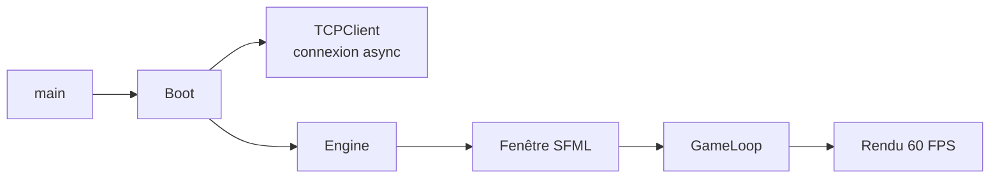

# Guide de Démarrage - Client R-Type

## Introduction

Bienvenue dans le guide de démarrage du client R-Type ! Ce guide vous accompagne pas à pas pour compiler, lancer et comprendre le client du jeu.

## Prérequis

### Logiciels Nécessaires

| Logiciel | Version Minimale | Usage |
|----------|------------------|-------|
| **CMake** | 3.20+ | Système de build |
| **C++ Compiler** | C++20 | Compilation (GCC 11+, Clang 13+, MSVC 2019+) |
| **vcpkg** | Latest | Gestionnaire de dépendances |
| **Git** | 2.0+ | Contrôle de version |

### Bibliothèques

| Bibliothèque | Version | Installation |
|--------------|---------|--------------|
| **SFML** | >= 3.0.1 | via vcpkg |
| **Boost** | 1.89.0+ | via vcpkg (composant: asio) |

---

## Installation

### 1. Cloner le Dépôt

```bash
git clone https://github.com/votre-team/rtype.git
cd rtype
```

### 2. Installer vcpkg (si nécessaire)

```bash
# Cloner vcpkg
git clone https://github.com/Microsoft/vcpkg.git third_party/vcpkg

# Bootstrap vcpkg
./third_party/vcpkg/bootstrap-vcpkg.sh  # Linux/macOS
# .\third_party\vcpkg\bootstrap-vcpkg.bat  # Windows
```

### 3. Installer les Dépendances

```bash
# Installer SFML et Boost
./third_party/vcpkg/vcpkg install sfml boost-asio
```

---

## Compilation

### Configuration avec CMake

```bash
# Créer le dossier de build
cmake -B build -S . -DCMAKE_TOOLCHAIN_FILE=third_party/vcpkg/scripts/buildsystems/vcpkg.cmake

# Compiler le client
cmake --build build --target rtype_client -j$(nproc)
```

**Options CMake** :

- `-DCMAKE_BUILD_TYPE=Debug` : Build debug avec symboles
- `-DCMAKE_BUILD_TYPE=Release` : Build optimisé
- `-j$(nproc)` : Compilation parallèle (remplacer par nombre de cores)

### Vérifier la Compilation

```bash
# Le binaire doit exister
ls -lh build/src/client/rtype_client

# Tester l'exécution
./build/src/client/rtype_client --help  # (si implémenté)
```

---

## Lancement

### Démarrer le Serveur (Requis)

**⚠️ Important** : Le client tente de se connecter à `127.0.0.1:4123` au démarrage.

```bash
# Dans un terminal séparé, lancer le serveur
./build/src/server/rtype_server
```

### Lancer le Client

```bash
# Depuis la racine du projet
./build/src/client/rtype_client
```

**Résultat attendu** :
- Une fenêtre SFML 1200x1200 s'ouvre
- L'image `assets/spaceship/bedroom.jpg` est affichée
- Message console : "Connecté au serveur R-Type!"

---

## Premiers Pas

### Structure de l'Application

```
rtype_client
├── main.cpp           # Point d'entrée
├── Boot               # Orchestrateur
│   ├── io_context     # Contexte Boost.Asio
│   ├── TCPClient      # Client réseau
│   └── Engine         # Moteur graphique
│       ├── SFMLWindow      # Fenêtre 1200x1200
│       ├── SFMLRenderer    # Renderer
│       └── GameLoop        # Boucle clear→update→display
```

### Cycle de Démarrage



---

## Résolution de Problèmes

### Problème : Erreur de Connexion

**Message** : `Erreur de connexion: Connection refused`

**Solution** :
1. Vérifier que le serveur est lancé
2. Vérifier le port 4123 est disponible :
   ```bash
   netstat -tuln | grep 4123
   ```
3. Vérifier le firewall

---

### Problème : Texture Non Trouvée

**Message** : `La texture n'a pas pu etre chargé correctement!`

**Solution** :
1. Vérifier que le fichier existe :
   ```bash
   ls -la assets/spaceship/bedroom.jpg
   ```
2. Lancer le client depuis la racine du projet :
   ```bash
   cd /path/to/rtype
   ./build/src/client/rtype_client
   ```

---

### Problème : Fenêtre Noire

**Causes possibles** :
- Assets non chargés
- Clear sans display
- Sprites hors écran

**Debug** :
```bash
# Lancer avec logs détaillés
SFML_DEBUG=1 ./build/src/client/rtype_client
```

---

## Prochaines Étapes

1. **Lire l'architecture** : [Architecture Overview](../architecture/overview.md)
2. **Comprendre le code** : [Developer Guide](./developer-guide.md)
3. **Ajouter des features** : [Adding Features](./adding-features.md)

---

## Ressources Utiles

- [Documentation SFML](https://www.sfml-dev.org/documentation/3.0.0/)
- [Documentation Boost.Asio](https://www.boost.org/doc/libs/1_89_0/doc/html/boost_asio.html)
- [CMake Tutorial](https://cmake.org/cmake/help/latest/guide/tutorial/index.html)

---

## Support

- **Issues GitHub** : [Rapporter un bug](https://github.com/votre-team/rtype/issues)
- **Documentation** : [Index complet](../index.md)
- **FAQ** : [Questions fréquentes](../reference/faq.md)

!!! success "Prêt à coder !"
    Vous avez maintenant un environnement de développement fonctionnel. Consultez le [Developer Guide](./developer-guide.md) pour commencer à contribuer !
