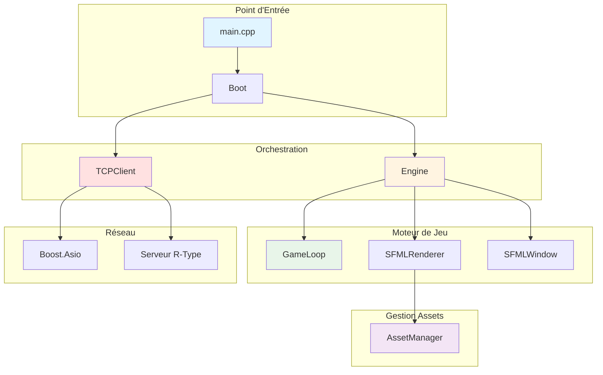
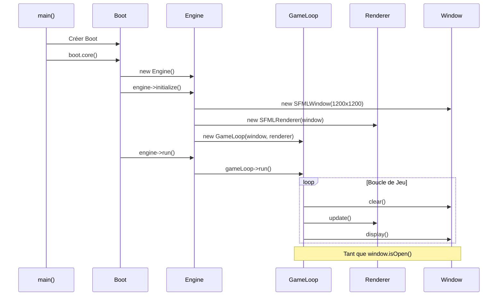

# Client R-Type - Documentation

Bienvenue dans la documentation complète du client R-Type ! Ce guide vous accompagne dans la compréhension et le développement du client du jeu.

## 🎯 Vue d'Ensemble

Le client R-Type est une application C++ moderne utilisant SFML 3 pour le rendu graphique et Boost.Asio pour les communications réseau. Il suit une architecture modulaire basée sur des interfaces, permettant flexibilité et testabilité.

### Caractéristiques Principales

- **Architecture Modulaire** : Séparation claire entre interfaces et implémentations
- **Moteur de Jeu** : Engine avec GameLoop pour le cycle de rendu
- **Système Graphique** : Abstraction complète avec implémentation SFML
- **Gestionnaire d'Assets** : Cache intelligent de ressources graphiques
- **Client Réseau** : Communication TCP asynchrone avec le serveur
- **Multi-threading** : Support du rendu multi-thread

### Technologies Utilisées

| Technologie | Version | Usage |
|------------|---------|-------|
| **C++** | 20/23 | Langage principal |
| **SFML** | >= 3.0.1 | Rendu graphique, fenêtrage |
| **Boost.Asio** | Latest | Communications réseau asynchrones |
| **spdlog** | Latest | Système de logging |
| **CMake** | >= 3.20 | Système de build |
| **vcpkg** | Latest | Gestionnaire de dépendances |

## 📖 Structure de la Documentation

### Architecture

<div class="grid cards" markdown>

-   **[Architecture Globale](architecture/overview.md)**

    Découvrez l'architecture complète du client, ses composants et leurs interactions.

-   **[Interfaces API](api/interfaces.md)**

    Référence des interfaces (IEngine, IGameLoop, IRenderer, IWindow, etc.).

</div>

### Core

<div class="grid cards" markdown>

-   **[Core Overview](core/index.md)**

    Vue d'ensemble des composants principaux (Boot, Engine, GameLoop).

-   **[Moteur de Jeu](core/engine.md)**

    Engine, GameLoop et orchestration des composants.

-   **[Système de Scènes](core/scenes.md)**

    SceneManager, LoginScene et GameScene.

-   **[Système de Rendu](core/renderer.md)**

    SFMLRenderer et AssetManager pour la gestion des ressources.

</div>

### Graphics & Network

<div class="grid cards" markdown>

-   **[Système Graphique](graphics/index.md)**

    Interfaces graphiques (IWindow, ITexture, IDrawable) et implémentations SFML.

-   **[AssetManager](graphics/asset-manager.md)**

    Gestion du cache de textures et sprites.

-   **[Système Réseau](network/index.md)**

    TCPClient et communications asynchrones avec Boost.Asio.

-   **[TCPClient](network/tcp-client.md)**

    Client TCP asynchrone thread-safe.

</div>

### Guides

<div class="grid cards" markdown>

-   **[Guide de Démarrage](guides/getting-started.md)**

    Compilez et lancez le client pour la première fois.

-   **[Contribution](../development/contributing.md)**

    Bonnes pratiques et workflow de développement.

</div>

## 🚀 Démarrage Rapide

### Compilation

```bash
# Depuis la racine du projet
cmake -B build -S . -DCMAKE_TOOLCHAIN_FILE=third_party/vcpkg/scripts/buildsystems/vcpkg.cmake
cmake --build build --target rtype_client -j$(nproc)
```

### Lancement

```bash
# Lancer le client
./build/src/client/rtype_client
```

!!! note "Serveur Requis"
    Le client tente de se connecter au serveur sur `127.0.0.1:4123`. Assurez-vous que le serveur R-Type est démarré avant de lancer le client.

## 🏗️ Architecture en un Coup d'Œil



## 📂 Structure du Code Source

```
src/client/
├── boot/                    # Point d'entrée et orchestration
│   └── Boot.cpp/.hpp
│
├── core/                    # Cœur du moteur
│   ├── Engine.cpp          # Moteur principal
│   ├── GameLoop.cpp        # Boucle de jeu
│   └── Logger.cpp          # Système de logging
│
├── graphics/                # Utilitaires graphiques
│   └── Graphics.cpp        # GraphicTexture
│
├── scenes/                  # Système de scènes
│   ├── SceneManager.cpp    # Gestionnaire de scènes
│   ├── LoginScene.cpp      # Scène de connexion
│   └── GameScene.cpp       # Scène de jeu
│
├── implementations/         # Implémentations concrètes SFML
│   └── sfml/
│       ├── SFMLWindow.cpp
│       ├── SFMLRenderer.cpp
│       ├── SFMLTexture.cpp
│       └── AssetManager.cpp
│
├── network/                 # Communications réseau
│   └── TCPClient.cpp
│
├── include/                 # Headers publics
│   ├── boot/Boot.hpp
│   ├── core/               # Interfaces et headers
│   │   ├── IEngine.hpp, Engine.hpp
│   │   ├── IGameLoop.hpp, GameLoop.hpp
│   │   ├── IRenderer.hpp
│   │   └── Logger.hpp
│   ├── graphics/           # Interfaces graphiques
│   │   ├── IWindow.hpp, IDrawable.hpp, ITexture.hpp
│   │   ├── Asset.hpp       # std::variant pour assets
│   │   └── Graphics.hpp    # GraphicTexture
│   ├── scenes/             # Interfaces scènes
│   │   ├── IScene.hpp
│   │   ├── SceneManager.hpp
│   │   ├── LoginScene.hpp
│   │   └── GameScene.hpp
│   ├── implementations/sfml/
│   │   ├── SFMLWindow.hpp, SFMLRenderer.hpp
│   │   └── utils/AssetManager.hpp, TextField.hpp
│   ├── network/TCPClient.hpp
│   ├── ui/                 # UI components (stubs)
│   │   ├── IUIElement.hpp, Button.hpp, TextInput.hpp
│   └── utils/Vecs.hpp      # Vec2i, Vec2u, Vec2f, Vec3i, Vec3f
│
└── main.cpp                 # Point d'entrée
```

## 🎨 Concepts Clés

### Inversion de Dépendances (DIP)

Le client utilise massivement le principe d'inversion de dépendances :

```cpp
// ❌ Mauvais : Dépendance directe
class Engine {
    sf::RenderWindow window;  // Couplage fort avec SFML
};

// ✅ Bon : Dépendance sur abstraction
class Engine {
    std::unique_ptr<IWindow> window;  // Flexible, testable
};
```

### Ownership et RAII

Gestion stricte de la mémoire avec smart pointers :

```cpp
class Engine {
    std::unique_ptr<IWindow> _window;      // Engine owns window
    std::unique_ptr<IRenderer> _renderer;  // Engine owns renderer
    std::unique_ptr<GameLoop> _gameLoop;   // Engine owns game loop
};
```

### Séparation Interface / Implémentation

Toutes les dépendances externes sont encapsulées derrière des interfaces :

```
Interface (graphics/IWindow.hpp)
    ↓ implements
Implementation (implementations/sfml/SFMLWindow.cpp)
    ↓ uses
External Library (SFML)
```

## 🔄 Cycle de Vie du Client



## 📚 Ressources Complémentaires

- [Guide d'Installation](../getting-started/installation.md)
- [Architecture Serveur](../guides/network-architecture.md)
- [Architecture Hexagonale](../guides/hexagonal-architecture.md)
- [Système de Logging](../development/logging.md)
- [Politiques de Commit](../development/contributing.md)

## 🆘 Besoin d'Aide ?

- **FAQ** : [Foire Aux Questions](../reference/faq.md)
- **Issues GitHub** : [Rapporter un Bug](https://github.com/Pluenet-Killian/rtype/issues)

---

!!! tip "Pro Tip"
    Commencez par lire la [Vue d'Ensemble de l'Architecture](architecture/overview.md) pour comprendre comment tous les composants s'articulent ensemble !
