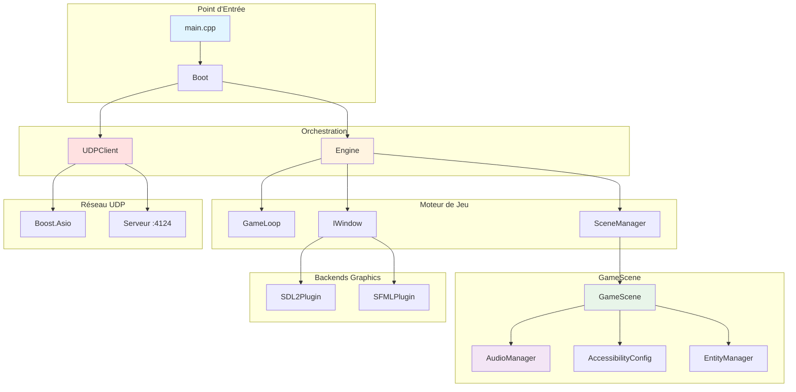
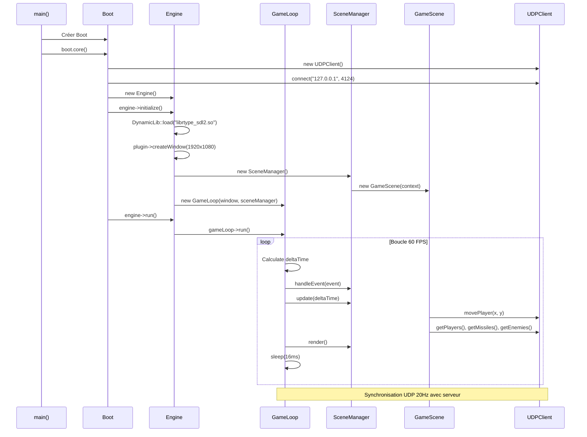

# Client R-Type - Documentation

Bienvenue dans la documentation complète du client R-Type ! Ce guide vous accompagne dans la compréhension et le développement du client du jeu.

## 🎯 Vue d'Ensemble

Le client R-Type est une application C++23 moderne avec architecture multi-backend graphique (SDL2/SFML via plugins dynamiques) et communication UDP temps réel avec Boost.ASIO. Il inclut un système audio complet et des fonctionnalités d'accessibilité.

### Caractéristiques Principales

- **Multi-Backend Graphics** : SDL2 (défaut) et SFML via plugins dynamiques (`DynamicLib`)
- **UDPClient Temps Réel** : Synchronisation 20Hz, thread-safe (Boost.ASIO)
- **AudioManager** : Musique et effets sonores (SDL2_mixer)
- **AccessibilityConfig** : Remapping clavier, modes daltonien, vitesse de jeu
- **GameScene Complet** : HUD, missiles, ennemis, parallax stars, death screen
- **Event System** : std::variant (KeyPressed, KeyReleased, WindowClosed)
- **EntityManager** : Gestion entités avec template `spawn<T>()`

### Technologies Utilisées

| Technologie | Version | Usage |
|------------|---------|-------|
| **C++** | 23 | Langage principal |
| **SDL2** | Latest | Backend graphique par défaut |
| **SDL2_image** | Latest | Chargement textures |
| **SDL2_mixer** | Latest | Audio (musique + SFX) |
| **SDL2_ttf** | Latest | Rendu de texte |
| **SFML** | >= 3.0.1 | Backend graphique alternatif |
| **Boost.Asio** | Latest | UDPClient asynchrone |
| **spdlog** | Latest | Système de logging (6 loggers) |
| **CMake** | >= 3.30 | Système de build |
| **vcpkg** | Latest | Gestionnaire de dépendances |

## 📖 Structure de la Documentation

### Architecture

<div class="grid cards" markdown>

-   **[Architecture Globale](architecture/overview.md)**

    Découvrez l'architecture complète du client, ses composants et leurs interactions.

-   **[Interfaces API](api/interfaces.md)**

    Référence des interfaces (IEngine, IGameLoop, IRenderer, IWindow, etc.).

</div>

### Core

<div class="grid cards" markdown>

-   **[Core Overview](core/index.md)**

    Vue d'ensemble des composants principaux (Boot, Engine, GameLoop).

-   **[Moteur de Jeu](core/engine.md)**

    Engine, GameLoop et orchestration des composants.

-   **[Système de Scènes](core/scenes.md)**

    SceneManager, LoginScene et GameScene.

-   **[Système de Rendu](core/renderer.md)**

    SFMLRenderer et AssetManager pour la gestion des ressources.

</div>

### Graphics & Network

<div class="grid cards" markdown>

-   **[Système Graphique](graphics/index.md)**

    Interfaces graphiques (IWindow, ITexture, IDrawable) avec backends SDL2 et SFML.

-   **[AssetManager](graphics/asset-manager.md)**

    Gestion du cache de textures et sprites.

-   **[Système Réseau](network/index.md)**

    UDPClient temps réel et communications asynchrones avec Boost.Asio.

-   **[UDPClient](network/tcp-client.md)**

    Client UDP asynchrone thread-safe pour le gameplay temps réel.

</div>

### Guides

<div class="grid cards" markdown>

-   **[Guide de Démarrage](guides/getting-started.md)**

    Compilez et lancez le client pour la première fois.

-   **[Contribution](../development/contributing.md)**

    Bonnes pratiques et workflow de développement.

</div>

## 🚀 Démarrage Rapide

### Compilation

```bash
# Depuis la racine du projet
cmake -B build -S . -DCMAKE_TOOLCHAIN_FILE=third_party/vcpkg/scripts/buildsystems/vcpkg.cmake
cmake --build build --target rtype_client -j$(nproc)
```

### Lancement

```bash
# Lancer le client
./build/src/client/rtype_client
```

!!! note "Serveur Requis"
    Le client se connecte au serveur UDP sur `127.0.0.1:4124` pour le gameplay temps réel. Assurez-vous que le serveur R-Type est démarré avant de lancer le client.

## 🏗️ Architecture en un Coup d'Œil



## 📂 Structure du Code Source

```
src/client/                          # 62 fichiers total
├── include/
│   ├── boot/Boot.hpp               # Bootstrapper
│   ├── core/
│   │   ├── IEngine.hpp, Engine.hpp # Moteur principal
│   │   ├── IGameLoop.hpp, GameLoop.hpp  # Boucle 60 FPS
│   │   ├── IRenderer.hpp           # Interface rendu
│   │   ├── Logger.hpp              # 6 loggers (spdlog)
│   │   └── DynamicLib.hpp          # Chargement plugins (.so)
│   ├── graphics/
│   │   ├── IWindow.hpp             # Interface fenêtre
│   │   ├── IGraphicPlugin.hpp      # Interface plugin graphique
│   │   ├── IDrawable.hpp, ITexture.hpp
│   │   ├── Graphics.hpp            # GraphicElement, Layer enum
│   │   └── Asset.hpp               # std::variant pour assets
│   ├── scenes/
│   │   ├── IScene.hpp              # Interface + GameContext
│   │   ├── SceneManager.hpp
│   │   └── GameScene.hpp           # Gameplay complet
│   ├── network/
│   │   └── UDPClient.hpp           # Client UDP thread-safe
│   ├── gameplay/
│   │   ├── EntityManager.hpp       # Template spawn<T>()
│   │   ├── GameObject.hpp          # Entité de base
│   │   └── Missile.hpp             # Projectile
│   ├── audio/
│   │   └── AudioManager.hpp        # SDL2_mixer (musique + SFX)
│   ├── accessibility/
│   │   └── AccessibilityConfig.hpp # Remapping, daltonisme
│   ├── events/
│   │   ├── Event.hpp               # std::variant events
│   │   └── Signal.hpp              # Event emitter
│   └── utils/Vecs.hpp              # Vec2u, Vec2f, rgba
│
├── src/                             # Implémentations
│   ├── boot/Boot.cpp
│   ├── core/Engine.cpp, GameLoop.cpp, Logger.cpp
│   ├── scenes/SceneManager.cpp, GameScene.cpp
│   ├── network/UDPClient.cpp
│   ├── gameplay/EntityManager.cpp, GameObject.cpp, Missile.cpp
│   └── accessibility/AccessibilityConfig.cpp
│
├── lib/                             # Backends graphiques
│   ├── sfml/                        # Plugin SFML
│   │   ├── include/SFMLWindow.hpp, SFMLRenderer.hpp, SFMLPlugin.hpp
│   │   └── src/*.cpp
│   └── sdl2/                        # Plugin SDL2 (défaut)
│       ├── include/SDL2Window.hpp, SDL2Renderer.hpp, SDL2Plugin.hpp
│       └── src/*.cpp
│
└── main.cpp                         # Point d'entrée
```

## 🎨 Concepts Clés

### Inversion de Dépendances (DIP)

Le client utilise massivement le principe d'inversion de dépendances :

```cpp
// ❌ Mauvais : Dépendance directe
class Engine {
    sf::RenderWindow window;  // Couplage fort avec SFML
};

// ✅ Bon : Dépendance sur abstraction
class Engine {
    std::unique_ptr<IWindow> window;  // Flexible, testable
};
```

### Ownership et RAII

Gestion stricte de la mémoire avec smart pointers :

```cpp
class Engine {
    std::unique_ptr<IWindow> _window;      // Engine owns window
    std::unique_ptr<IRenderer> _renderer;  // Engine owns renderer
    std::unique_ptr<GameLoop> _gameLoop;   // Engine owns game loop
};
```

### Séparation Interface / Implémentation

Toutes les dépendances externes sont encapsulées derrière des interfaces :

```
Interface (graphics/IWindow.hpp)
    ↓ implements
Implementation (implementations/sfml/SFMLWindow.cpp)
    ↓ uses
External Library (SFML)
```

## 🔄 Cycle de Vie du Client



## 📚 Ressources Complémentaires

- [Guide d'Installation](../getting-started/installation.md)
- [Architecture Serveur](../guides/network-architecture.md)
- [Architecture Hexagonale](../guides/hexagonal-architecture.md)
- [Système de Logging](../development/logging.md)
- [Politiques de Commit](../development/contributing.md)

## 🆘 Besoin d'Aide ?

- **FAQ** : [Foire Aux Questions](../reference/faq.md)
- **Issues GitHub** : [Rapporter un Bug](https://github.com/Pluenet-Killian/rtype/issues)

---

!!! tip "Pro Tip"
    Commencez par lire la [Vue d'Ensemble de l'Architecture](architecture/overview.md) pour comprendre comment tous les composants s'articulent ensemble !
