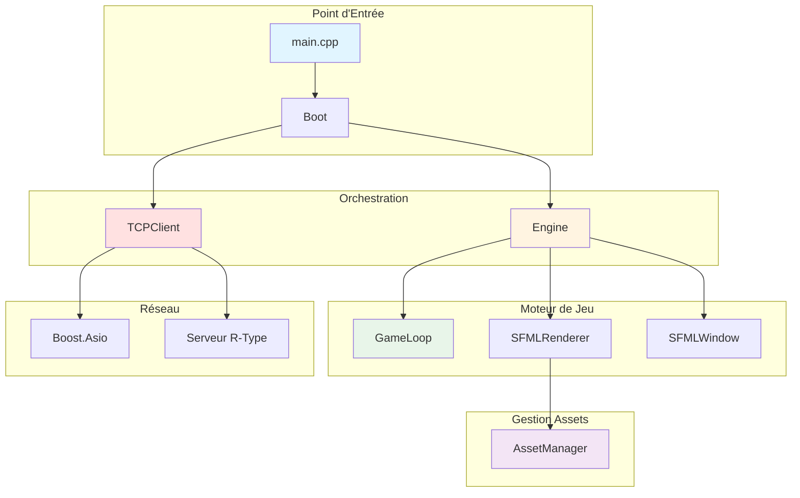
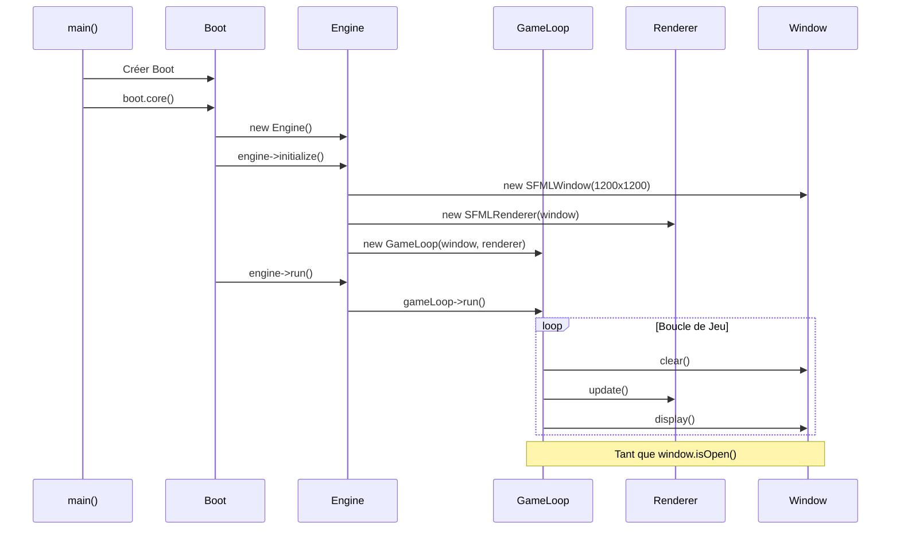

# Client R-Type - Documentation

Bienvenue dans la documentation complète du client R-Type ! Ce guide vous accompagne dans la compréhension et le développement du client du jeu.

## 🎯 Vue d'Ensemble

Le client R-Type est une application C++ moderne utilisant SFML 3 pour le rendu graphique et Boost.Asio pour les communications réseau. Il suit une architecture modulaire basée sur des interfaces, permettant flexibilité et testabilité.

### Caractéristiques Principales

- **Architecture Modulaire** : Séparation claire entre interfaces et implémentations
- **Moteur de Jeu** : Engine avec GameLoop pour le cycle de rendu
- **Système Graphique** : Abstraction complète avec implémentation SFML
- **Gestionnaire d'Assets** : Cache intelligent de ressources graphiques
- **Client Réseau** : Communication TCP asynchrone avec le serveur
- **Multi-threading** : Support du rendu multi-thread

### Technologies Utilisées

| Technologie | Version | Usage |
|------------|---------|-------|
| **C++** | 20 | Langage principal |
| **SFML** | >= 3.0.1 | Rendu graphique, fenêtrage |
| **Boost.Asio** | 1.89.0 | Communications réseau asynchrones |
| **CMake** | >= 3.20 | Système de build |
| **vcpkg** | Latest | Gestionnaire de dépendances |

## 📖 Structure de la Documentation

### Architecture

<div class="grid cards" markdown>

-   **[Architecture Globale](architecture/overview.md)**

    Découvrez l'architecture complète du client, ses composants et leurs interactions.

-   **[Patterns de Conception](architecture/design-patterns.md)**

    Apprenez les patterns utilisés (Adapter, Dependency Injection, etc.).

</div>

### Systèmes

<div class="grid cards" markdown>

-   **[Système Graphique](graphics/overview.md)**

    Interfaces graphiques (IWindow, ITexture, IDrawable) et implémentations SFML.

-   **[Moteur de Jeu](core/engine.md)**

    Engine, GameLoop et orchestration des composants.

-   **[Système de Rendu](core/renderer.md)**

    SFMLRenderer et AssetManager pour la gestion des ressources.

-   **[Système Réseau](network/tcp-client.md)**

    TCPClient et communications asynchrones avec Boost.Asio.

</div>

### Guides

<div class="grid cards" markdown>

-   **[Guide de Démarrage](guides/getting-started.md)**

    Compilez et lancez le client pour la première fois.

-   **[Guide du Développeur](guides/developer-guide.md)**

    Bonnes pratiques et workflow de développement.

-   **[Ajouter une Feature](guides/adding-features.md)**

    Tutoriel pas-à-pas pour étendre le client.

-   **[Référence API](api/index.md)**

    Documentation détaillée de toutes les classes et interfaces.

</div>

## 🚀 Démarrage Rapide

### Compilation

```bash
# Depuis la racine du projet
cmake -B build -S . -DCMAKE_TOOLCHAIN_FILE=third_party/vcpkg/scripts/buildsystems/vcpkg.cmake
cmake --build build --target rtype_client -j$(nproc)
```

### Lancement

```bash
# Lancer le client
./build/src/client/rtype_client
```

!!! note "Serveur Requis"
    Le client tente de se connecter au serveur sur `127.0.0.1:4123`. Assurez-vous que le serveur R-Type est démarré avant de lancer le client.

## 🏗️ Architecture en un Coup d'Œil



## 📂 Structure du Code Source

```
src/client/
├── boot/                    # Point d'entrée et orchestration
│   ├── Boot.cpp
│   └── Boot.hpp
│
├── core/                    # Cœur du moteur
│   ├── Engine.cpp          # Moteur principal
│   ├── GameLoop.cpp        # Boucle de jeu
│   ├── IEngine.hpp         # Interface moteur
│   ├── IGameLoop.hpp       # Interface game loop
│   └── IRenderer.hpp       # Interface renderer
│
├── graphic/                 # Classe démo SFML
│   └── Graphic.cpp
│
├── implementations/         # Implémentations concrètes
│   └── sfml/
│       ├── SFMLWindow.cpp
│       ├── SFMLRenderer.cpp
│       ├── SFMLTexture.cpp
│       └── utils/
│           └── AssetManager.hpp
│
├── network/                 # Communications réseau
│   └── TCPClient.cpp
│
└── include/                 # Headers publics
    ├── boot/
    ├── core/
    ├── graphic/
    ├── graphics/           # Interfaces graphiques
    │   ├── IWindow.hpp
    │   ├── IDrawable.hpp
    │   └── ITexture.hpp
    ├── implementations/
    ├── network/
    └── utils/
        └── Vecs.hpp        # Structures vecteurs
```

## 🎨 Concepts Clés

### Inversion de Dépendances (DIP)

Le client utilise massivement le principe d'inversion de dépendances :

```cpp
// ❌ Mauvais : Dépendance directe
class Engine {
    sf::RenderWindow window;  // Couplage fort avec SFML
};

// ✅ Bon : Dépendance sur abstraction
class Engine {
    std::unique_ptr<IWindow> window;  // Flexible, testable
};
```

### Ownership et RAII

Gestion stricte de la mémoire avec smart pointers :

```cpp
class Engine {
    std::unique_ptr<IWindow> _window;      // Engine owns window
    std::unique_ptr<IRenderer> _renderer;  // Engine owns renderer
    std::unique_ptr<GameLoop> _gameLoop;   // Engine owns game loop
};
```

### Séparation Interface / Implémentation

Toutes les dépendances externes sont encapsulées derrière des interfaces :

```
Interface (graphics/IWindow.hpp)
    ↓ implements
Implementation (implementations/sfml/SFMLWindow.cpp)
    ↓ uses
External Library (SFML)
```

## 🔄 Cycle de Vie du Client



## 📚 Ressources Complémentaires

- [Guide d'Installation](../getting-started/installation.md)
- [Architecture Serveur](../guides/network-architecture.md)
- [Bonnes Pratiques C++](../guides/best-practices.md)
- [Politiques de Commit](../development/COMMIT_POLICES.md)

## 🆘 Besoin d'Aide ?

- **FAQ** : [Foire Aux Questions](../reference/faq.md)
- **Glossaire** : [Termes Techniques](../reference/glossary.md)
- **Issues GitHub** : [Rapporter un Bug](https://github.com/Pluenet-Killian/rtype/issues)

---

!!! tip "Pro Tip"
    Commencez par lire la [Vue d'Ensemble de l'Architecture](architecture/overview.md) pour comprendre comment tous les composants s'articulent ensemble !
