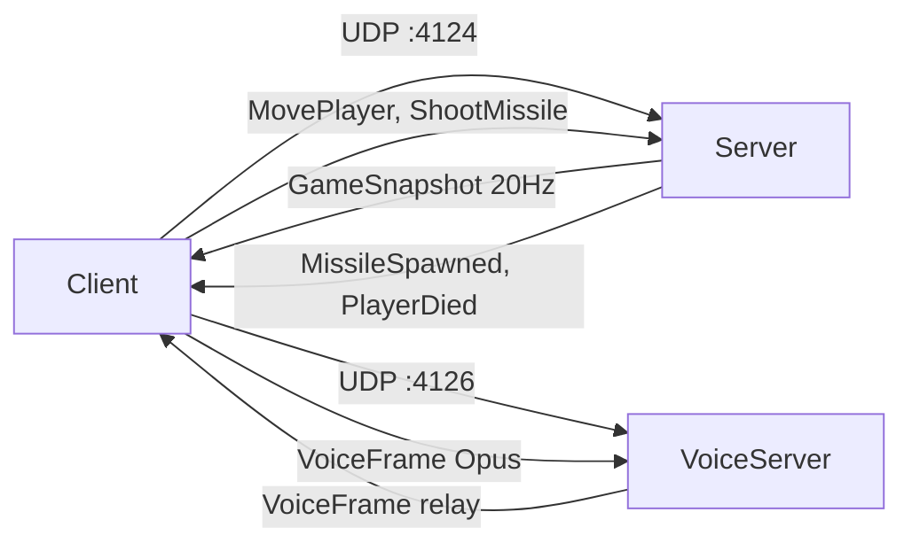
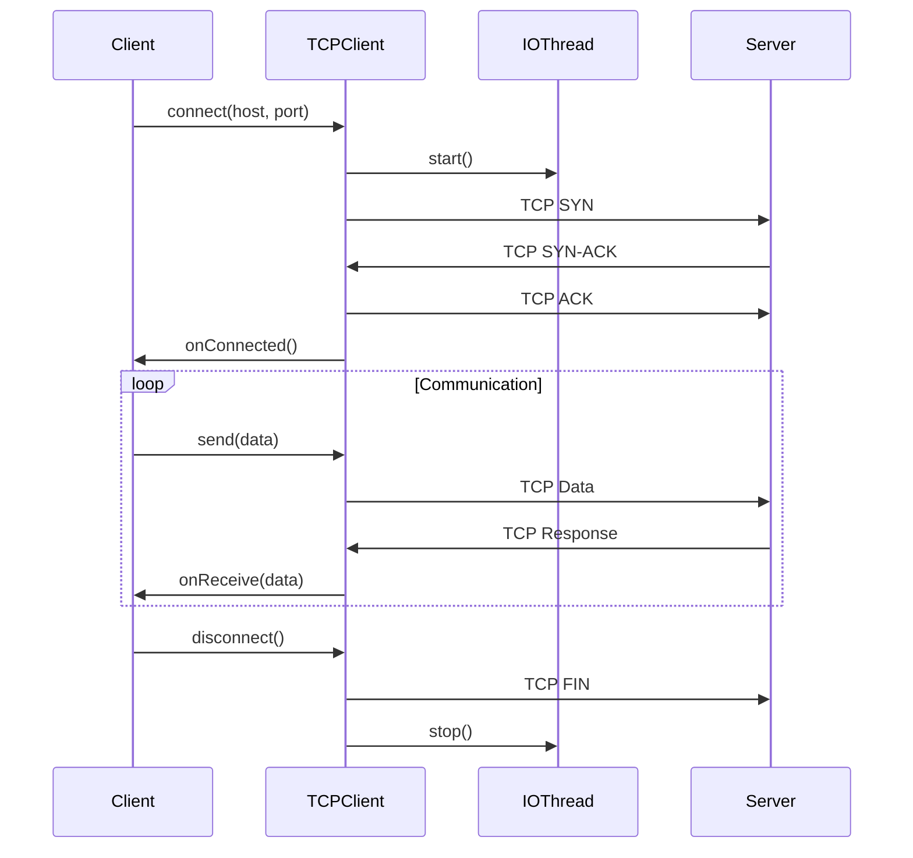
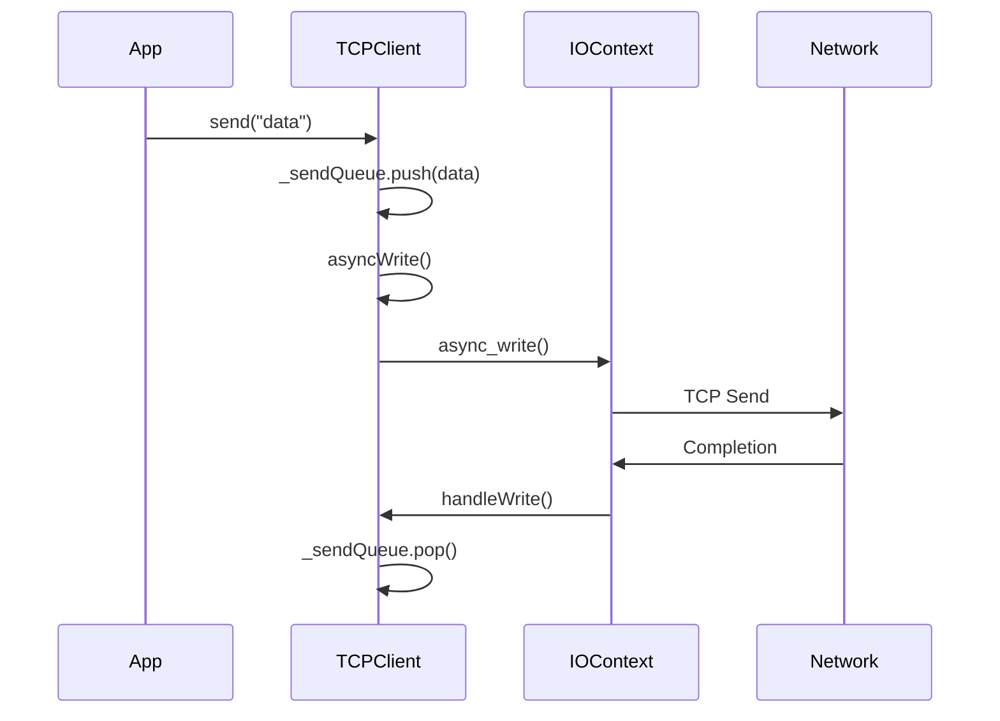

# Network - Communication Réseau Client

Le module **Network** gère toute la communication réseau du client R-Type avec le serveur via **UDP temps réel** pour le gameplay avec synchronisation à 20Hz.

## Vue d'Ensemble



## Composants

### [UDPClient](tcp-client.md) - Client UDP Temps Réel
**Communication gameplay avec le serveur**

**Fonctionnalités:**
- Connexion asynchrone via Boost.ASIO
- Thread-safe (mutex + jthread)
- Synchronisation état de jeu à 20Hz
- Protocol binaire (14 types de messages)
- Callbacks pour événements réseau

**Utilisation:**
```cpp
auto udpClient = std::make_shared<UDPClient>();

// Callbacks
udpClient->setOnConnected([]() {
    logger->info("Connected!");
});

udpClient->setOnSnapshot([](const GameSnapshot& snap) {
    // État de jeu reçu du serveur
});

// Connexion
udpClient->connect("127.0.0.1", 4124);

// Gameplay
udpClient->movePlayer(x, y);
udpClient->shootMissile();

// Récupérer l'état (thread-safe)
auto players = udpClient->getPlayers();
auto missiles = udpClient->getMissiles();
auto enemies = udpClient->getEnemies();
```

**Fichiers:**
- `src/client/src/network/UDPClient.cpp`
- `src/client/include/network/UDPClient.hpp`

---

## Architecture Réseau

### Protocoles

| Protocole | Port | Utilisation | État |
|-----------|------|-------------|------|
| **UDP** | 4124 | Gameplay temps réel | ✅ Implémenté |
| **UDP** | 4126 | Chat vocal (Opus) | ✅ Implémenté |
| **TCP** | 4123 | Authentification | ✅ Implémenté |

### UDP pour Gameplay

**Pourquoi UDP ?**
- ✅ Faible latence (<1ms local)
- ✅ Moins d'overhead
- ✅ Parfait pour données temps réel
- **Usage:** Positions, missiles, ennemis, état de jeu

## Système de Logging

Le module Network utilise **NetworkLogger** (niveau DEBUG):

```cpp
#include "core/Logger.hpp"

auto logger = client::logging::Logger::getNetworkLogger();
logger->debug("TCPClient created");
logger->info("Connecting to {}:{}...", host, port);
logger->warn("Slow response time: {}ms", latency);
logger->error("Connection failed: {}", error.message());
```

[Documentation complète du logging](../../development/logging.md)

## Thread Safety (EPI-37)

### Corrections Appliquées

#### 1. Race Condition disconnect() ✅
```cpp
// Avant (BUGUÉ)
void TCPClient::disconnect() {
    if (!_connected) return;  // ❌ Sans mutex
    _connected = false;
}

// Après (CORRIGÉ)
void TCPClient::disconnect() {
    std::scoped_lock lock(_mutex);  // ✅ Protégé
    if (!_connected) return;
    _connected = false;
}
```

#### 2. Migration std::jthread ✅
```cpp
// Avant
_ioThread = std::thread([this]() {
    _ioContext.run();
});
// Besoin de join() manuel

// Après
_ioThread = std::jthread([this, logger]() {
    logger->debug("IO thread started");
    _ioContext.run();
    logger->debug("IO thread terminated");
});
// Auto-join RAII
```

#### 3. Callbacks const-correct ✅
```cpp
// Avant
void setOnConnected(OnConnectedCallback callback);

// Après
void setOnConnected(const OnConnectedCallback& callback);
// Évite copie inutile
```

### Problèmes Restants ⚠️

**Dangling Reference asyncWrite() (ligne 167):**
```cpp
const std::string &message = _sendQueue.front();  // ⚠️ DANGLING
boost::asio::async_write(
    _socket,
    boost::asio::buffer(message),  // ⚠️ Référence après unlock
    [this](const auto& error, std::size_t) {
        handleWrite(error);
    }
);
```

**Solution planifiée:**
```cpp
std::string message = _sendQueue.front();  // Copie
```

## Diagramme de Séquence

### Connexion



### Envoi de Message



## Performance

### Optimisations

- **Asynchrone non-bloquant**: Pas de blocage du thread principal
- **File d'envoi**: Envois séquentiels garantis
- **IOContext dédié**: Thread séparé pour I/O
- **Logging conditionnel**: DEBUG seulement si activé

### Métriques Typiques

| Opération | Latence | Notes |
|-----------|---------|-------|
| connect() | ~50ms | Locale (127.0.0.1) |
| send() | <1ms | Mise en queue |
| receive | Variable | Dépend serveur |
| disconnect() | ~10ms | Fermeture propre |

## État d'Implémentation

| Composant | État | Complétude | Notes |
|-----------|------|------------|-------|
| UDPClient | ✅ Implémenté | 100% | Thread-safe, async |
| Protocol binaire | ✅ Implémenté | 100% | 19 types de messages |
| Thread Safety | ✅ Implémenté | 100% | mutex + jthread |
| Logging | ✅ Intégré | 100% | NetworkLogger |
| GameSnapshot | ✅ Implémenté | 100% | Players, missiles, enemies |
| Callbacks | ✅ Implémenté | 100% | onSnapshot, onPlayerDied, etc. |
| VoiceChatManager | ✅ Implémenté | 100% | Opus + PortAudio, PTT/VAD |
| Audio Device Selection | ✅ Implémenté | 100% | Cross-platform, persistance MongoDB |

## Gestion d'Erreurs

### Erreurs de Connexion

```cpp
tcpClient->setOnError([](const std::string& error) {
    auto logger = client::logging::Logger::getNetworkLogger();
    logger->error("Network error: {}", error);

    // Tentative de reconnexion?
    std::this_thread::sleep_for(std::chrono::seconds(5));
    tcpClient->connect("127.0.0.1", 4123);
});
```

### Timeout

```cpp
// Boost.ASIO deadline timer (à implémenter)
boost::asio::steady_timer timer(ioContext, std::chrono::seconds(30));
timer.async_wait([this](const boost::system::error_code& ec) {
    if (!ec && !_connected) {
        logger->error("Connection timeout");
        disconnect();
    }
});
```

## Debugging

### Logs Réseau

```cpp
// Activer DEBUG pour voir tous les paquets
auto logger = client::logging::Logger::getNetworkLogger();
logger->set_level(spdlog::level::debug);

// Output:
// [2025-11-20 22:45:12.345] [debug] [Network] TCPClient created
// [2025-11-20 22:45:12.456] [info] [Network] Connecting to 127.0.0.1:4123...
// [2025-11-20 22:45:12.567] [debug] [Network] IO thread started
// [2025-11-20 22:45:12.678] [info] [Network] Connected successfully
// [2025-11-20 22:45:12.789] [debug] [Network] Sending 15 bytes
```

### Wireshark

```bash
# Capturer trafic TCP port 4123
sudo wireshark -i lo -f "tcp port 4123"
```

## Protocole Application (Planifié)

### Format Messages

```
[4 bytes: Length][N bytes: Payload]
```

### Commandes (Exemple)

```
// Authentification
LOGIN username password

// Rejoindre partie
JOIN_GAME game_id

// Action gameplay
ACTION move 100 200

// Déconnexion
LOGOUT
```

### Réponses Serveur

```
// Succès
OK data

// Erreur
ERROR message

// State update
STATE player_positions enemy_positions
```

## Prochaines Étapes

### Court Terme
1. **Corriger asyncWrite dangling ref** (EPI-37)
2. **Protéger _readBuffer** avec mutex
3. **Tests unitaires** pour thread safety

### Moyen Terme
4. ~~**UDP Client** pour gameplay~~ ✅ Implémenté
5. ~~**Voice Chat** - Opus/PortAudio~~ ✅ Implémenté
6. ~~**Audio Device Selection** cross-platform~~ ✅ Implémenté
7. **Heartbeat/Keepalive** automatique

### Long Terme
7. **Reconnexion automatique** avec backoff
8. **Compression** (zlib/lz4)
9. **Encryption** (TLS/DTLS)

## Références

- [Boost.ASIO Documentation](https://www.boost.org/doc/libs/release/doc/html/boost_asio.html)
- [Architecture Réseau Serveur](../../guides/network-architecture.md)
- [Système de Logging](../../development/logging.md)
- [Ticket EPI-36: Migration TCPClient Logging](https://linear.app/epitech-study/issue/EPI-36)
- [Ticket EPI-37: Thread Safety TCPClient](https://linear.app/epitech-study/issue/EPI-37)

## Voir Aussi

- [Voice Chat](voice-chat.md)
- [Core Client](../core/index.md)
- [Architecture Client](../architecture/overview.md)
- [Guide Réseau Serveur](../../guides/network-architecture.md)
