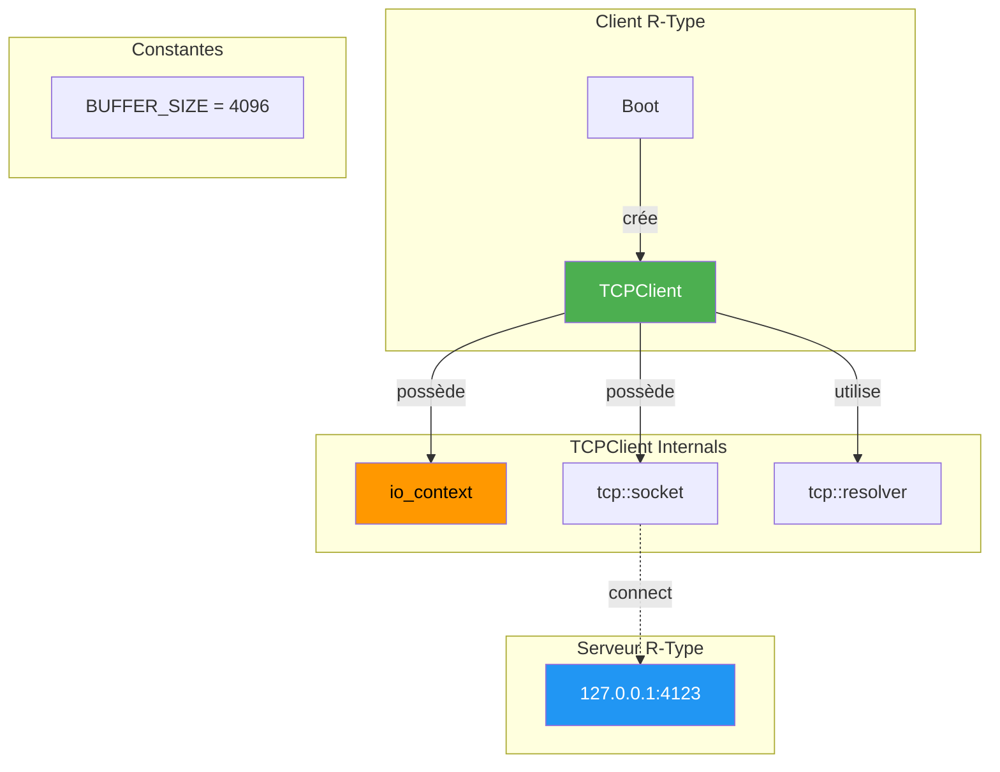
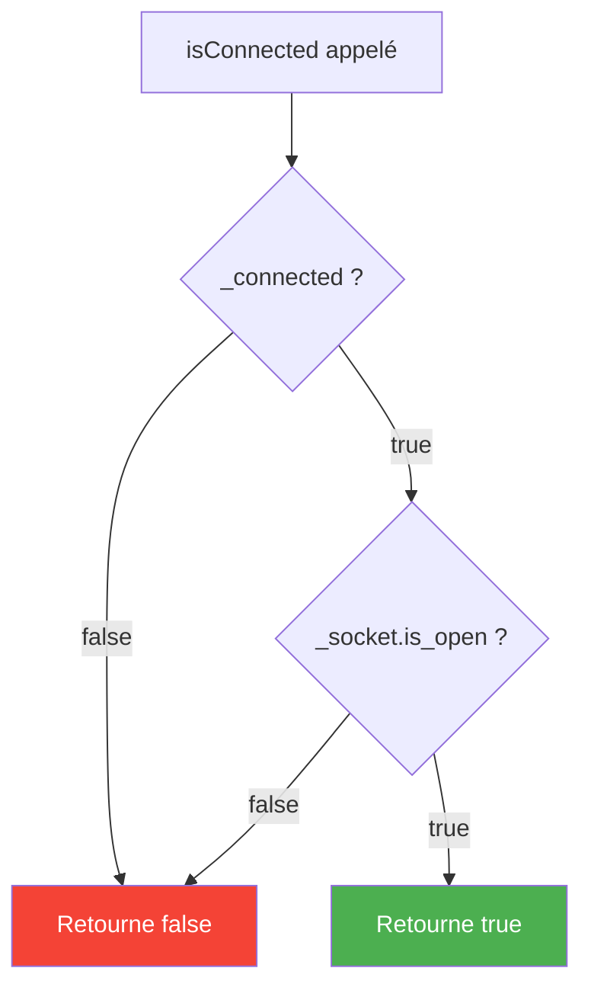
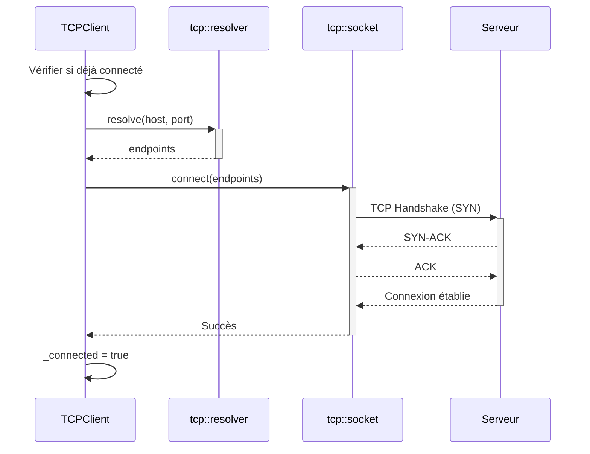
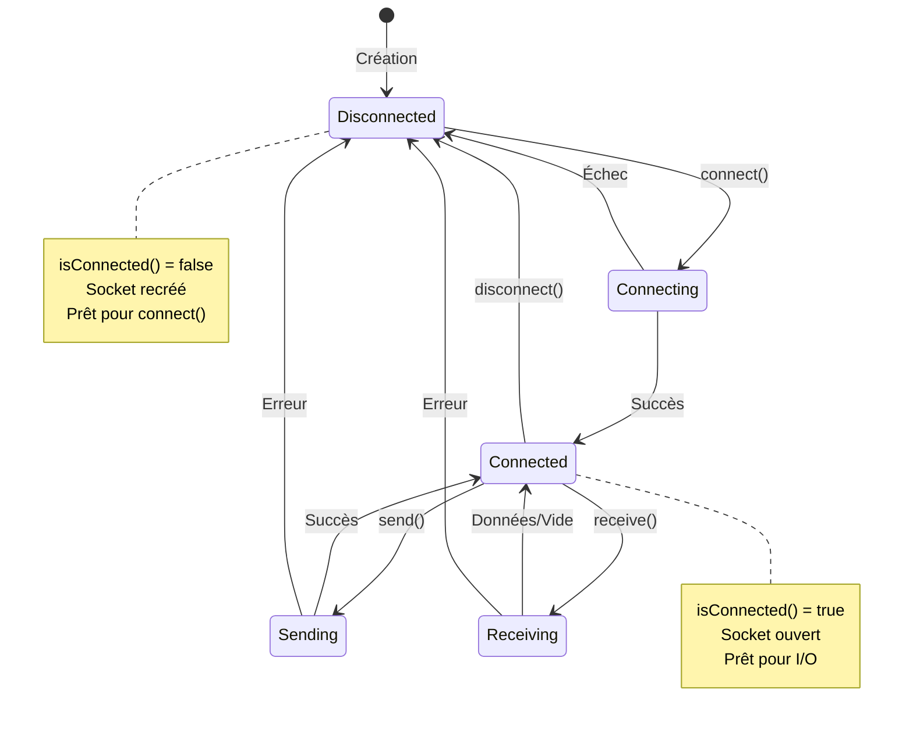

# TCPClient - Client Réseau Synchrone

## Vue d'Ensemble

Le **TCPClient** est le composant réseau du client R-Type, responsable de la communication avec le serveur de jeu via TCP. Il utilise **Boost.Asio** pour gérer les connexions, lectures et écritures.

!!! info "Localisation"
    - **Header**: `src/client/include/network/TCPClient.hpp`
    - **Implementation**: `src/client/network/TCPClient.cpp`
    - **Namespace**: `client::network`
    - **Dépendances**: Boost.Asio 1.89.0+

!!! success "État Actuel"
    **FONCTIONNEL** : Connexion, envoi, réception et déconnexion implémentés.

---

## Architecture



---

## Code Source

### Header (TCPClient.hpp)

```cpp
/*
** EPITECH PROJECT, 2025
** rtype [WSL: Ubuntu-24.04]
** File description:
** TCPClient
*/

#ifndef TCPCLIENT_HPP_
#define TCPCLIENT_HPP_

#include <boost/asio.hpp>
#include <string>
#include <cstdint>

namespace client::network {

using boost::asio::ip::tcp;

// Taille du buffer de réception - constexpr évite les VLA
static constexpr std::size_t BUFFER_SIZE = 4096;

class TCPClient {
public:
    TCPClient();
    ~TCPClient();

    // Connexion au serveur
    bool connect(const std::string &host, std::uint16_t port);

    // Déconnexion propre
    void disconnect();

    // Vérifier l'état de connexion
    bool isConnected() const;

    // Envoyer un message
    bool send(const std::string &message);

    // Recevoir un message (non-bloquant)
    bool receive(std::string &message);

private:
    boost::asio::io_context _ioContext;  // Contexte ASIO propre
    tcp::socket _socket;                  // Socket TCP
    bool _connected = false;              // État de connexion
};

} // namespace client::network

#endif /* !TCPCLIENT_HPP_ */
```

### Points Clés du Design

#### 1. Constante BUFFER_SIZE

```cpp
static constexpr std::size_t BUFFER_SIZE = 4096;
```

**Pourquoi `constexpr` ?**

- Évite les VLA (Variable Length Arrays) qui causent des warnings
- Valeur connue à la compilation
- Optimisation possible par le compilateur

```cpp
// ❌ MAUVAIS : VLA avec const
const std::size_t size = 4096;
char buffer[size];  // Warning: VLA

// ✅ BON : Taille fixe avec constexpr
static constexpr std::size_t BUFFER_SIZE = 4096;
char buffer[BUFFER_SIZE];  // OK: taille connue à la compilation
```

#### 2. Contexte ASIO Propre

```cpp
boost::asio::io_context _ioContext;  // Possède son propre contexte
tcp::socket _socket;
```

**Avantages :**

- TCPClient est autonome, pas de dépendance externe
- Pas besoin de passer de référence au constructeur
- Simplification de l'API

#### 3. Double Vérification de Connexion

```cpp
bool TCPClient::isConnected() const
{
    return _connected && _socket.is_open();
}
```

**Pourquoi deux conditions ?**

- `_connected` : État logique géré par le code
- `_socket.is_open()` : État réel du socket système



---

## Implémentation Détaillée

### Constructeur et Destructeur

```cpp
TCPClient::TCPClient()
    : _socket(_ioContext)
{
    // Socket initialisé avec le contexte
}

TCPClient::~TCPClient()
{
    disconnect();  // Fermeture propre
}
```

### Méthode `connect()`

```cpp
bool TCPClient::connect(const std::string &host, std::uint16_t port)
{
    if (_connected)
        return true;  // Déjà connecté

    try {
        tcp::resolver resolver(_ioContext);
        auto endpoints = resolver.resolve(host, std::to_string(port));

        boost::asio::connect(_socket, endpoints);
        _connected = true;

        std::cout << "[TCPClient] Connected to " << host << ":" << port << std::endl;
        return true;
    } catch (const std::exception &e) {
        std::cerr << "[TCPClient] Connection failed: " << e.what() << std::endl;
        return false;
    }
}
```

**Flux de connexion :**



### Méthode `disconnect()`

```cpp
void TCPClient::disconnect()
{
    if (!_connected)
        return;

    boost::system::error_code ec;
    _socket.shutdown(tcp::socket::shutdown_both, ec);
    _socket.close(ec);

    // Recréer le socket pour permettre une reconnexion
    _socket = tcp::socket(_ioContext);
    _connected = false;

    std::cout << "[TCPClient] Disconnected" << std::endl;
}
```

**Point important : Recréation du socket**

```cpp
_socket = tcp::socket(_ioContext);
```

Après `close()`, le socket ne peut plus être réutilisé. On le recrée pour permettre un futur `connect()`.

### Méthode `send()`

```cpp
bool TCPClient::send(const std::string &message)
{
    if (!isConnected())
        return false;

    try {
        boost::asio::write(_socket, boost::asio::buffer(message));
        return true;
    } catch (const std::exception &e) {
        std::cerr << "[TCPClient] Send failed: " << e.what() << std::endl;
        disconnect();
        return false;
    }
}
```

### Méthode `receive()`

```cpp
bool TCPClient::receive(std::string &message)
{
    if (!isConnected())
        return false;

    try {
        // Vérifier si des données sont disponibles (non-bloquant)
        if (_socket.available() == 0)
            return false;

        char buffer[BUFFER_SIZE];
        std::size_t len = _socket.read_some(boost::asio::buffer(buffer, BUFFER_SIZE));

        message.assign(buffer, len);  // Optimisé: pas de concaténation
        return true;
    } catch (const std::exception &e) {
        std::cerr << "[TCPClient] Receive failed: " << e.what() << std::endl;
        disconnect();
        return false;
    }
}
```

**Optimisation avec `assign()` :**

```cpp
// ❌ Moins efficace
message = std::string(buffer, len);  // Allocation + copie

// ✅ Plus efficace
message.assign(buffer, len);  // Réutilise le buffer existant si possible
```

---

## Utilisation

### Exemple Basique

```cpp
#include "network/TCPClient.hpp"

int main() {
    client::network::TCPClient client;

    // Connexion
    if (!client.connect("127.0.0.1", 4123)) {
        std::cerr << "Impossible de se connecter" << std::endl;
        return 1;
    }

    // Envoi d'un message
    client.send("LOGIN|username|password");

    // Réception (dans une boucle de jeu)
    std::string response;
    if (client.receive(response)) {
        std::cout << "Réponse: " << response << std::endl;
    }

    // Déconnexion automatique à la destruction
    return 0;
}
```

### Intégration avec Boot

```cpp
// Dans Boot.hpp
#include "network/TCPClient.hpp"

class Boot {
private:
    std::unique_ptr<client::network::TCPClient> _tcpClient;
};

// Dans Boot.cpp
Boot::Boot()
{
    _tcpClient = std::make_unique<client::network::TCPClient>();
}

void Boot::core()
{
    // Connexion au serveur
    if (_tcpClient->connect("127.0.0.1", 4123)) {
        // Prêt à communiquer
    }

    // Lancer le moteur de jeu
    _engine->run();
}
```

---

## Protocole de Communication

### Format des Messages (Texte)

Le serveur R-Type utilise un protocole pipe-delimited :

```
COMMAND|param1|param2|...
```

### Exemples de Commandes

**Inscription :**
```
REGISTER|username|email|password
```

**Connexion :**
```
LOGIN|username|password
```

**Mouvement joueur :**
```
MOVE|x|y|direction
```

**Tir :**
```
SHOOT|x|y|angle
```

---

## Diagramme d'États



---

## Améliorations Apportées

### Commit `77f0247`

| Avant | Après | Avantage |
|-------|-------|----------|
| `const size_t BUFFER_SIZE` | `static constexpr size_t BUFFER_SIZE` | Évite VLA warnings |
| `return _connected` | `return _connected && _socket.is_open()` | Détection connexion perdue |
| `message = string(buffer, len)` | `message.assign(buffer, len)` | Performance |
| Socket non réutilisable | `_socket = tcp::socket(_ioContext)` | Permet reconnexion |

---

## Bonnes Pratiques

### ✅ BON : Vérifier avant d'utiliser

```cpp
if (client.isConnected()) {
    client.send("HELLO");
}
```

### ✅ BON : Gérer les échecs

```cpp
if (!client.send("DATA")) {
    // Reconnexion ou erreur utilisateur
    client.connect("127.0.0.1", 4123);
}
```

### ❌ MAUVAIS : Ignorer les retours

```cpp
client.send("DATA");  // Ignorer si ça a marché
client.receive(msg);  // Ignorer si données reçues
```

---

## FAQ

**Q: Pourquoi synchrone et pas asynchrone ?**

R: Simplicité. Pour un jeu, l'API synchrone est plus facile à intégrer dans la game loop. L'async sera ajouté si le besoin se présente.

**Q: Comment gérer la reconnexion automatique ?**

R: Appeler `connect()` après un échec de `send()` ou `receive()`.

**Q: Quelle est la taille max d'un message ?**

R: `BUFFER_SIZE` = 4096 bytes. Pour des messages plus grands, implémenter un protocole avec header de taille.

---

## Voir Aussi

- [Boot Documentation](../core/boot.md) - Orchestration du client
- [Network Architecture](../../guides/network-architecture.md) - Architecture réseau globale
- [Authentication](../../guides/authentication.md) - Système d'authentification
