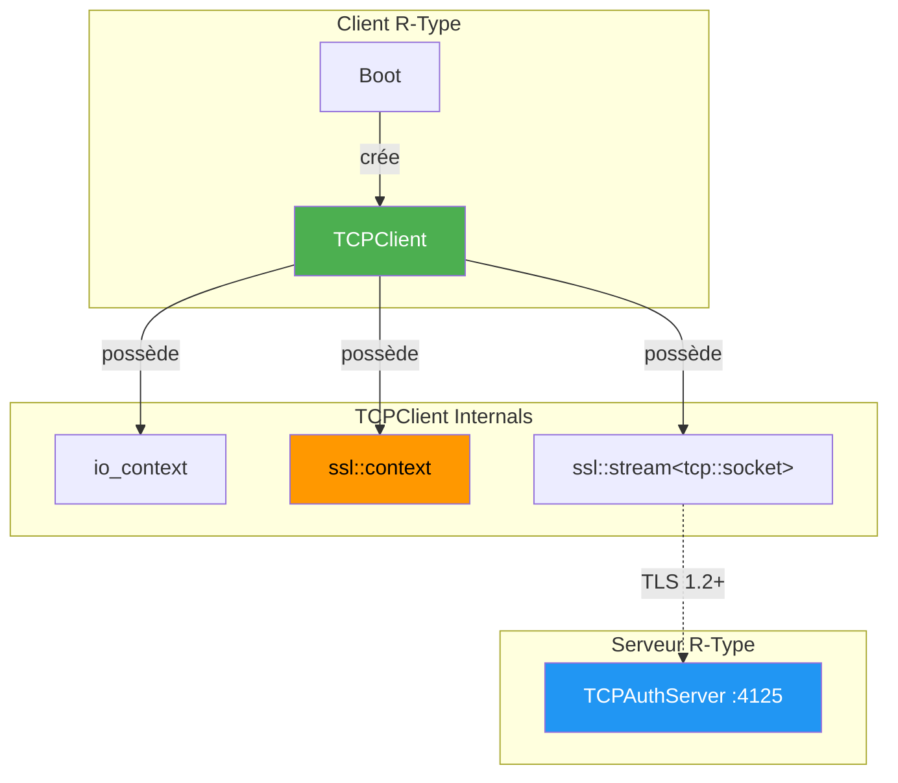
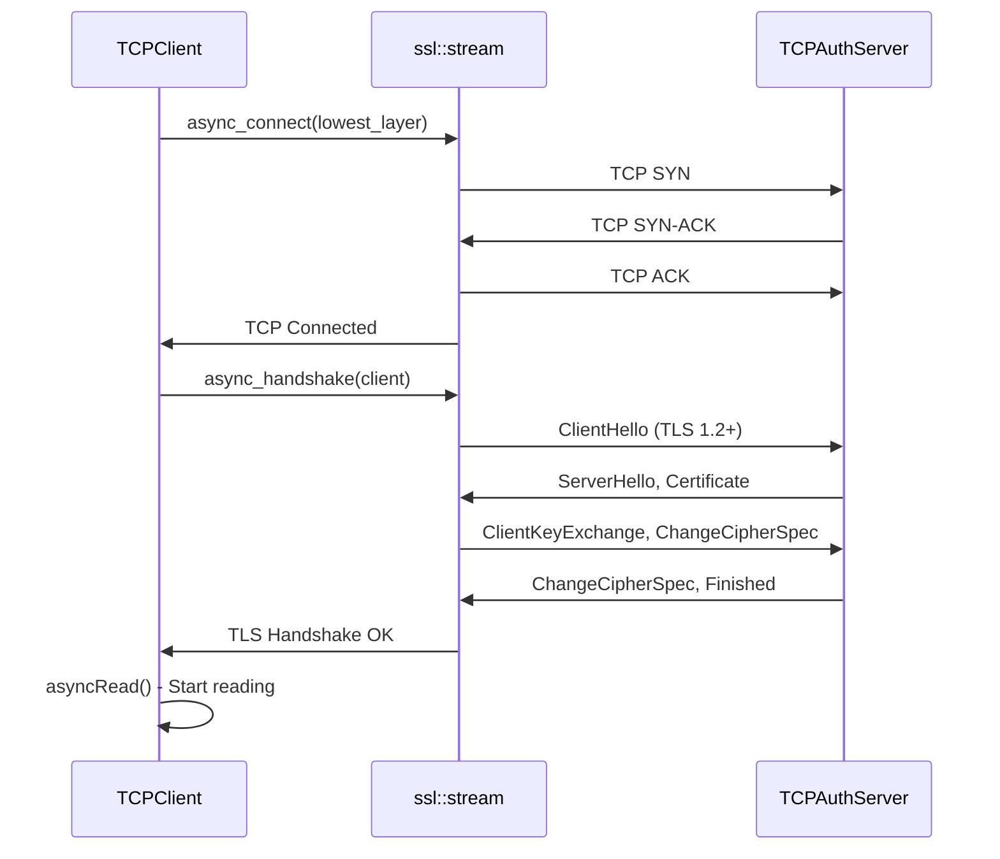
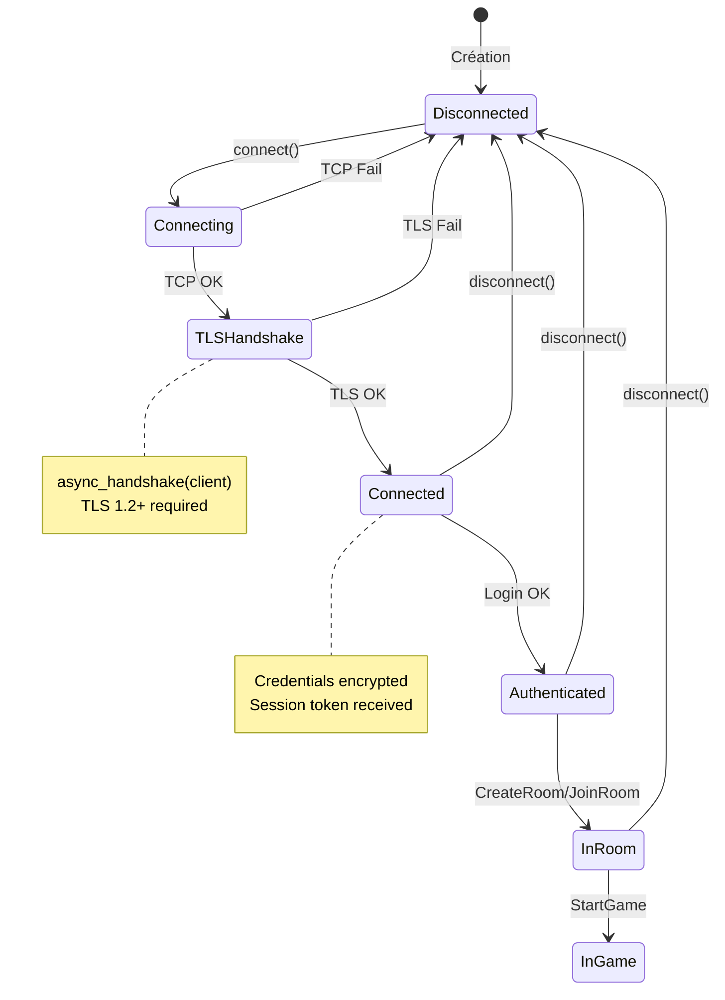

# TCPClient - Client Réseau TLS Asynchrone

## Vue d'Ensemble

Le **TCPClient** est le composant réseau du client R-Type, responsable de la communication authentifiée avec le serveur via **TCP/TLS**. Il utilise **Boost.Asio SSL** pour sécuriser les connexions.

!!! info "Localisation"
    - **Header**: `src/client/include/network/TCPClient.hpp`
    - **Implementation**: `src/client/src/network/TCPClient.cpp`
    - **Namespace**: `client::network`
    - **Dépendances**: Boost.ASIO, OpenSSL

!!! success "État Actuel"
    **FONCTIONNEL** : Connexion TLS 1.2+, authentification, gestion de rooms implémentés.

---

## Sécurité TLS

### Configuration

| Paramètre | Valeur |
|-----------|--------|
| **Port** | TCP 4125 |
| **Protocole** | TLS 1.2 minimum |
| **Vérification** | `verify_none` (développement) |
| **Mode production** | `verify_peer` avec CA certificates |

### Cipher Suites Supportées

Le serveur supporte les cipher suites modernes :
- ECDHE-ECDSA-AES256-GCM-SHA384
- ECDHE-RSA-AES256-GCM-SHA384
- ECDHE-ECDSA-AES128-GCM-SHA256
- ECDHE-RSA-AES128-GCM-SHA256
- ECDHE-ECDSA-CHACHA20-POLY1305
- ECDHE-RSA-CHACHA20-POLY1305

---

## Architecture



---

## Code Source

### Header (TCPClient.hpp)

```cpp
#ifndef TCPCLIENT_HPP_
#define TCPCLIENT_HPP_

#include <boost/asio.hpp>
#include <boost/asio/ssl.hpp>
#include <string>
#include <cstdint>
#include <thread>
#include <mutex>
#include <atomic>

#include "Protocol.hpp"
#include "NetworkEvents.hpp"

namespace client::network
{
    using boost::asio::ip::tcp;
    namespace ssl = boost::asio::ssl;

    class TCPClient
    {
    public:
        using OnConnectedCallback = std::function<void()>;
        using OnDisconnectedCallback = std::function<void()>;
        using OnReceiveCallback = std::function<void(const std::string &)>;
        using OnErrorCallback = std::function<void(const std::string &)>;

        TCPClient();
        ~TCPClient();

        // Connexion TLS
        void connect(const std::string &host, std::uint16_t port);
        void disconnect();
        bool isConnected() const;
        bool isConnecting() const;
        bool isAuthenticated() const;

        // Authentification
        void sendLoginData(const std::string& username, const std::string& password);
        void sendRegisterData(const std::string& username, const std::string& email, const std::string& password);

        // Room operations
        void createRoom(const std::string& name, uint8_t maxPlayers, bool isPrivate);
        void joinRoomByCode(const std::string& code);
        void leaveRoom();
        void setReady(bool ready);
        void startGame();

        // Event queue for thread-safe event polling
        std::optional<TCPEvent> pollEvent();

    private:
        void initSSLContext();
        void asyncConnect(tcp::resolver::results_type endpoints);
        void asyncRead();
        void handleConnect(const boost::system::error_code &error);
        void handleRead(const boost::system::error_code &error, std::size_t bytes);

        // TLS context and socket
        boost::asio::io_context _ioContext;
        ssl::context _sslContext;
        ssl::stream<tcp::socket> _socket;
        std::jthread _ioThread;

        // State
        std::atomic<bool> _connected{false};
        std::atomic<bool> _connecting{false};
        std::atomic<bool> _isAuthenticated{false};
        mutable std::mutex _mutex;
    };
}

#endif /* !TCPCLIENT_HPP_ */
```

### Points Clés du Design

#### 1. SSL Context Initialization

```cpp
void TCPClient::initSSLContext() {
    auto logger = client::logging::Logger::getNetworkLogger();

    // Development: accept self-signed certificates
    _sslContext.set_verify_mode(ssl::verify_none);

    // Load system CA certificates for future production use
    _sslContext.set_default_verify_paths();

    // Force TLS 1.2 minimum
    SSL_CTX_set_min_proto_version(_sslContext.native_handle(), TLS1_2_VERSION);

    logger->debug("SSL context initialized (TLS 1.2+)");
}
```

#### 2. Two-Phase Connection (TCP + TLS Handshake)

```cpp
void TCPClient::asyncConnect(tcp::resolver::results_type endpoints)
{
    // Phase 1: TCP connection
    boost::asio::async_connect(
        _socket.lowest_layer(),  // Connect on underlying TCP socket
        endpoints,
        [this](const boost::system::error_code &error, const tcp::endpoint &) {
            handleConnect(error);
        }
    );
}

void TCPClient::handleConnect(const boost::system::error_code &error)
{
    if (!error) {
        // Phase 2: TLS handshake
        _socket.async_handshake(
            ssl::stream_base::client,
            [this](const boost::system::error_code &hsError) {
                if (hsError) {
                    logger->error("TLS handshake failed: {}", hsError.message());
                    return;
                }
                logger->info("TLS handshake successful");
                // Start reading after successful handshake
                asyncRead();
            }
        );
    }
}
```

#### 3. Graceful SSL Shutdown

```cpp
void TCPClient::disconnect()
{
    // SSL shutdown (graceful close)
    boost::system::error_code ec;
    _socket.shutdown(ec);
    if (ec && ec != boost::asio::error::eof && ec != boost::asio::ssl::error::stream_truncated) {
        logger->debug("SSL shutdown notice: {}", ec.message());
    }
    _socket.lowest_layer().close(ec);

    // Recreate ssl::stream for potential reconnection
    _socket = ssl::stream<tcp::socket>(_ioContext, _sslContext);
}
```

---

## Flux de Connexion TLS



---

## Utilisation

### Exemple Connexion et Authentification

```cpp
#include "network/TCPClient.hpp"

int main() {
    client::network::TCPClient client;

    // Callbacks
    client.setOnConnected([]() {
        std::cout << "Connected to server (TLS)" << std::endl;
    });

    client.setOnError([](const std::string& error) {
        std::cerr << "Error: " << error << std::endl;
    });

    // Connexion TLS (port 4125)
    client.connect("127.0.0.1", 4125);

    // Attendre la connexion
    while (client.isConnecting()) {
        std::this_thread::sleep_for(std::chrono::milliseconds(100));
    }

    if (client.isConnected()) {
        // Authentification (chiffrée via TLS)
        client.sendLoginData("username", "password");
    }

    // Game loop - poll events
    while (running) {
        if (auto event = client.pollEvent()) {
            std::visit([](auto&& e) {
                // Handle event
            }, *event);
        }
    }

    return 0;
}
```

### Intégration avec SceneManager

```cpp
// Dans LoginScene
void LoginScene::onLoginButtonClick() {
    _context.tcpClient->sendLoginData(_usernameInput.getText(), _passwordInput.getText());
}

void LoginScene::update(float deltaTime) {
    if (auto event = _context.tcpClient->pollEvent()) {
        if (std::holds_alternative<TCPLoginSuccessEvent>(*event)) {
            auto& e = std::get<TCPLoginSuccessEvent>(*event);
            _context.sessionToken = e.token;
            _context.sceneManager->switchTo("MainMenu");
        }
        else if (std::holds_alternative<TCPErrorEvent>(*event)) {
            auto& e = std::get<TCPErrorEvent>(*event);
            showError(e.message);
        }
    }
}
```

---

## Diagramme d'États



---

## Gestion d'Erreurs TLS

### Erreurs Courantes

| Erreur | Cause | Solution |
|--------|-------|----------|
| `handshake: certificate verify failed` | Certificat non reconnu | Mode dev: `verify_none`, Prod: ajouter CA |
| `handshake: protocol version` | TLS version trop ancienne | Mettre à jour OpenSSL |
| `handshake: wrong ssl version` | Serveur/client incompatible | Vérifier configuration |

### Code de Gestion

```cpp
_socket.async_handshake(
    ssl::stream_base::client,
    [this](const boost::system::error_code &hsError) {
        if (hsError) {
            if (hsError == boost::asio::ssl::error::stream_truncated) {
                // Server closed connection during handshake
                logger->warn("Server closed TLS connection");
            } else {
                logger->error("TLS handshake failed: {}", hsError.message());
            }
            _eventQueue.push(TCPErrorEvent{"TLS handshake failed"});
            return;
        }
        // Success
    }
);
```

---

## Performance

### Overhead TLS

| Opération | Latence | Notes |
|-----------|---------|-------|
| TCP Connect | ~1ms | Local |
| TLS Handshake | ~5-10ms | Négociation crypto |
| Send/Receive | <1ms | Chiffrement AES-GCM |
| Disconnect | ~5ms | TLS shutdown + TCP FIN |

### Optimisations

- **TLS Session Resumption** : Non implémenté (connexions longues)
- **Keep-Alive** : Heartbeat toutes les secondes
- **Buffer Size** : 4096 bytes par défaut

---

## Vulnérabilités Corrigées

### CWE-319 : Cleartext Transmission

**Avant** : Credentials envoyés en clair via TCP

```cpp
// ❌ VULNÉRABLE
_socket.send(boost::asio::buffer(loginMessage));  // Plaintext!
```

**Après** : Chiffrement TLS automatique

```cpp
// ✅ SÉCURISÉ
ssl::stream<tcp::socket> _socket;  // TLS encryption
_socket.write_some(boost::asio::buffer(loginMessage));  // Encrypted
```

---

## Voir Aussi

- [Network Index](index.md) - Vue d'ensemble réseau
- [Voice Chat](voice-chat.md) - Communication vocale
- [TLS Security](../../../CLAUDE.md#tls-security) - Configuration TLS
- [Boot Documentation](../core/boot.md) - Orchestration du client
