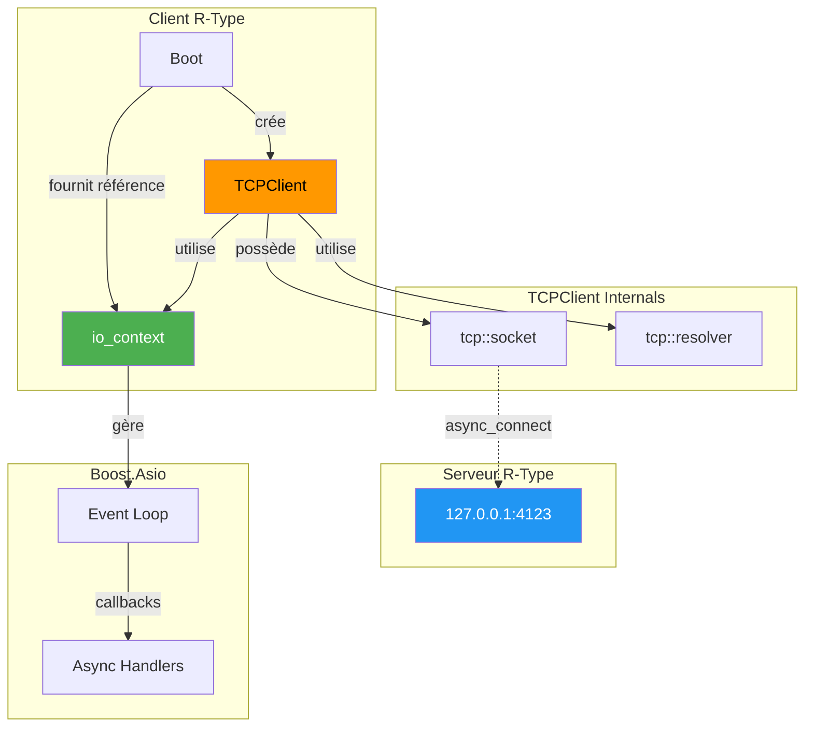
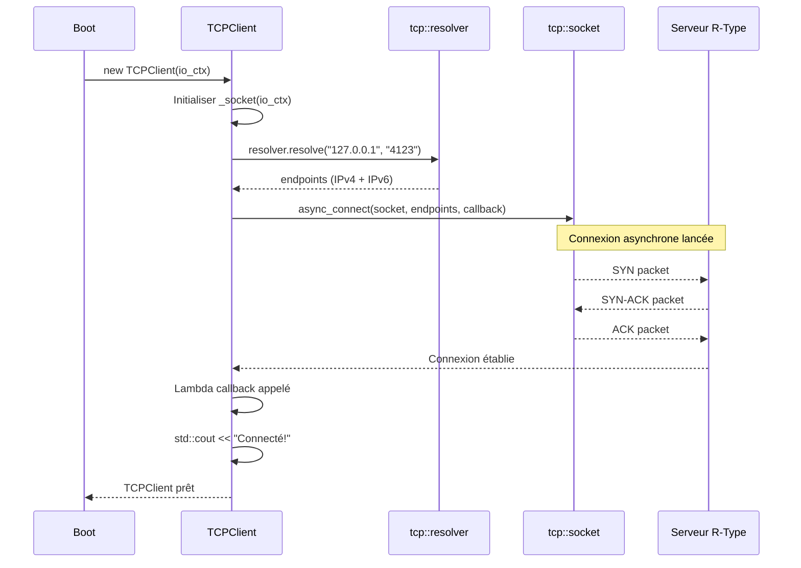
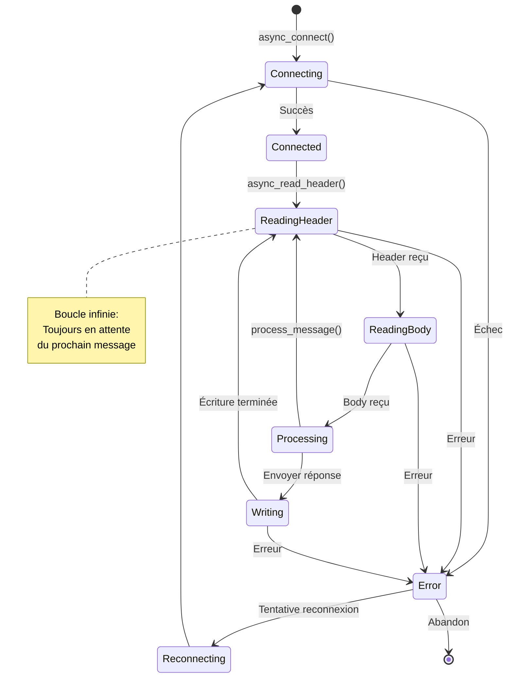

# TCPClient - Client Réseau Asynchrone

## Vue d'Ensemble

Le **TCPClient** est le composant réseau du client R-Type, responsable de la communication asynchrone avec le serveur de jeu via TCP. Il utilise **Boost.Asio** pour gérer les connexions, lectures et écritures de manière non-bloquante.

!!! info "Localisation"
    - **Header**: `/home/simia/epitech/second_year/projects/rtype/src/client/include/network/TCPClient.hpp`
    - **Implementation**: `/home/simia/epitech/second_year/projects/rtype/src/client/network/TCPClient.cpp`
    - **Namespace**: Global
    - **Dépendances**: Boost.Asio 1.89.0+

!!! warning "État Actuel"
    **PARTIELLEMENT IMPLÉMENTÉ** : La connexion fonctionne, mais la méthode `run()` est un stub.

---

## Architecture



---

## Code Source Complet

### Header (TCPClient.hpp)

```cpp
/*
** EPITECH PROJECT, 2025
** rtype [WSL: Ubuntu-24.04]
** File description:
** TCPClient
*/

#ifndef TCPCLIENT_HPP_
#define TCPCLIENT_HPP_

#include <boost/asio.hpp>
#include <boost/bind/bind.hpp>
#include <memory>

using boost::asio::ip::tcp;

class TCPClient {
    public:
        // Constructeur: prend une référence au io_context
        TCPClient(boost::asio::io_context& io_context);

        // Méthode pour lancer les opérations réseau (à implémenter)
        void run();

    protected:
    private:
        boost::asio::io_context& _io_ctx;  // Référence au contexte ASIO
        tcp::socket _socket;                // Socket TCP pour la connexion
};

#endif /* !TCPCLIENT_HPP_ */
```

### Implémentation (TCPClient.cpp)

```cpp
/*
** EPITECH PROJECT, 2025
** rtype [WSL: Ubuntu-24.04]
** File description:
** TCPClient
*/

#include "network/TCPClient.hpp"
#include <iostream>

TCPClient::TCPClient(boost::asio::io_context& io_context)
    : _io_ctx(io_context), _socket(_io_ctx)
{
    // Résolution DNS du serveur
    tcp::resolver resolver(_io_ctx);
    tcp::resolver::results_type endpoints = resolver.resolve("127.0.0.1", "4123");

    // Connexion asynchrone
    boost::asio::async_connect(
        _socket,
        endpoints,
        [this](boost::system::error_code ec, tcp::endpoint) {
            if (!ec) {
                // Connexion réussie
                std::cout << "Connecté au serveur R-Type!" << std::endl;
                // TODO: Lancer async_read ici
            } else {
                // Erreur de connexion
                std::cerr << "Erreur de connexion: " << ec.message() << std::endl;
            }
        }
    );
}

void TCPClient::run()
{
    // TODO: Implémenter les opérations de lecture/écriture
    // Actuellement stub
}
```

---

## Analyse Détaillée

### Constructeur

```cpp
TCPClient::TCPClient(boost::asio::io_context& io_context)
    : _io_ctx(io_context), _socket(_io_ctx)
```

**Étapes d'initialisation** :



**Points clés** :

1. **Référence à io_context** :
   ```cpp
   boost::asio::io_context& _io_ctx;
   ```
   - Pas de copie, juste une référence
   - Le io_context doit survivre au TCPClient

2. **Résolution DNS** :
   ```cpp
   tcp::resolver resolver(_io_ctx);
   tcp::resolver::results_type endpoints = resolver.resolve("127.0.0.1", "4123");
   ```
   - Convertit "127.0.0.1" et "4123" en endpoints TCP
   - Peut retourner plusieurs endpoints (IPv4, IPv6)
   - **Opération bloquante** (à améliorer avec `async_resolve`)

3. **Connexion Asynchrone** :
   ```cpp
   boost::asio::async_connect(_socket, endpoints, callback);
   ```
   - Tente de se connecter à tous les endpoints jusqu'à succès
   - Non-bloquant : retourne immédiatement
   - Callback appelé quand connexion établie ou échec

4. **Lambda Callback** :
   ```cpp
   [this](boost::system::error_code ec, tcp::endpoint) {
       if (!ec) {
           std::cout << "Connecté au serveur R-Type!" << std::endl;
       } else {
           std::cerr << "Erreur de connexion: " << ec.message() << std::endl;
       }
   }
   ```
   - Capture `this` pour accéder aux membres
   - `ec` : Code d'erreur (vide si succès)
   - `tcp::endpoint` : Endpoint réellement connecté (ignoré ici)

---

### Méthode `run()`

```cpp
void TCPClient::run()
{
    // TODO: Implémenter les opérations de lecture/écriture
}
```

**État actuel** : Stub vide, aucune implémentation.

**Ce qui devrait être fait** :

```cpp
void TCPClient::run()
{
    // Lancer la lecture asynchrone
    async_read_header();
}

private:
void async_read_header() {
    boost::asio::async_read(
        _socket,
        boost::asio::buffer(&_header, sizeof(_header)),
        [this](boost::system::error_code ec, std::size_t) {
            if (!ec) {
                async_read_body();
            } else {
                handle_error(ec);
            }
        }
    );
}

void async_read_body() {
    _buffer.resize(_header.size);
    boost::asio::async_read(
        _socket,
        boost::asio::buffer(_buffer),
        [this](boost::system::error_code ec, std::size_t) {
            if (!ec) {
                process_message(_buffer);
                async_read_header();  // Lire le message suivant
            } else {
                handle_error(ec);
            }
        }
    );
}
```

---

## Pattern Asynchrone



---

## Exemple d'Implémentation Complète

### TCPClient Complet (Proposition)

```cpp
#ifndef TCPCLIENT_HPP_
#define TCPCLIENT_HPP_

#include <boost/asio.hpp>
#include <memory>
#include <vector>
#include <queue>

using boost::asio::ip::tcp;

struct MessageHeader {
    uint32_t size;      // Taille du body
    uint32_t type;      // Type de message (PLAYER_MOVE, SHOOT, etc.)
};

class TCPClient {
public:
    TCPClient(boost::asio::io_context& io_context);

    // Envoyer un message au serveur
    void send(uint32_t type, const std::vector<uint8_t>& data);

    // Lancer les opérations réseau
    void run();

private:
    // Connexion
    void async_connect(tcp::resolver::results_type endpoints);

    // Lecture
    void async_read_header();
    void async_read_body();

    // Écriture
    void async_write();

    // Traitement
    void process_message(const std::vector<uint8_t>& data);

    // Gestion d'erreur
    void handle_error(const boost::system::error_code& ec);

    boost::asio::io_context& _io_ctx;
    tcp::socket _socket;

    MessageHeader _read_header;
    std::vector<uint8_t> _read_buffer;

    std::queue<std::vector<uint8_t>> _write_queue;
    bool _is_writing = false;
};

#endif
```

### Implémentation

```cpp
#include "network/TCPClient.hpp"
#include <iostream>

TCPClient::TCPClient(boost::asio::io_context& io_context)
    : _io_ctx(io_context), _socket(_io_ctx)
{
    tcp::resolver resolver(_io_ctx);
    auto endpoints = resolver.resolve("127.0.0.1", "4123");
    async_connect(endpoints);
}

void TCPClient::async_connect(tcp::resolver::results_type endpoints)
{
    boost::asio::async_connect(
        _socket,
        endpoints,
        [this](boost::system::error_code ec, tcp::endpoint) {
            if (!ec) {
                std::cout << "Connecté au serveur!" << std::endl;
                run();  // Lancer lecture/écriture
            } else {
                handle_error(ec);
            }
        }
    );
}

void TCPClient::run()
{
    async_read_header();
}

void TCPClient::async_read_header()
{
    boost::asio::async_read(
        _socket,
        boost::asio::buffer(&_read_header, sizeof(_read_header)),
        [this](boost::system::error_code ec, std::size_t) {
            if (!ec) {
                async_read_body();
            } else {
                handle_error(ec);
            }
        }
    );
}

void TCPClient::async_read_body()
{
    _read_buffer.resize(_read_header.size);

    boost::asio::async_read(
        _socket,
        boost::asio::buffer(_read_buffer),
        [this](boost::system::error_code ec, std::size_t) {
            if (!ec) {
                process_message(_read_buffer);
                async_read_header();  // Message suivant
            } else {
                handle_error(ec);
            }
        }
    );
}

void TCPClient::send(uint32_t type, const std::vector<uint8_t>& data)
{
    // Construire le message complet (header + body)
    std::vector<uint8_t> message;
    message.resize(sizeof(MessageHeader) + data.size());

    MessageHeader header{static_cast<uint32_t>(data.size()), type};
    std::memcpy(message.data(), &header, sizeof(header));
    std::memcpy(message.data() + sizeof(header), data.data(), data.size());

    // Ajouter à la queue d'écriture
    _write_queue.push(std::move(message));

    // Lancer l'écriture si pas déjà en cours
    if (!_is_writing) {
        async_write();
    }
}

void TCPClient::async_write()
{
    if (_write_queue.empty()) {
        _is_writing = false;
        return;
    }

    _is_writing = true;
    auto& message = _write_queue.front();

    boost::asio::async_write(
        _socket,
        boost::asio::buffer(message),
        [this](boost::system::error_code ec, std::size_t) {
            if (!ec) {
                _write_queue.pop();
                async_write();  // Message suivant
            } else {
                handle_error(ec);
            }
        }
    );
}

void TCPClient::process_message(const std::vector<uint8_t>& data)
{
    switch (_read_header.type) {
        case 1:  // PLAYER_POSITION
            std::cout << "Position joueur reçue" << std::endl;
            break;
        case 2:  // ENEMY_SPAWN
            std::cout << "Ennemi apparu" << std::endl;
            break;
        // ... autres types
    }
}

void TCPClient::handle_error(const boost::system::error_code& ec)
{
    std::cerr << "Erreur réseau: " << ec.message() << std::endl;

    // TODO: Tentative de reconnexion
}
```

---

## Intégration avec Boot

### Version Actuelle (Commentée)

```cpp
// Dans Boot::core()
void Boot::core()
{
    engine->initialize();
    engine->run();  // Bloquant

    // Le code réseau est commenté car run() n'est pas implémenté
    // std::thread network_thread([this]() {
    //     io_ctx.run();
    // });
    // tcpClient->run();
    // network_thread.join();
}
```

### Version Future

```cpp
void Boot::core()
{
    engine->initialize();

    // Thread réseau dédié
    std::thread network_thread([this]() {
        io_ctx.run();  // Boucle d'événements Boost.Asio
    });

    // Lancer le client réseau (non-bloquant)
    tcpClient->run();

    // Thread graphique (main thread, bloquant)
    engine->run();

    // Arrêt propre
    io_ctx.stop();
    network_thread.join();
}
```

---

## Protocole de Communication

### Format des Messages

```
┌─────────────────────────────────────────┐
│          Message Complet                │
├─────────────────┬───────────────────────┤
│     Header      │         Body          │
│   (8 bytes)     │   (size bytes)        │
├─────────┬───────┼───────────────────────┤
│  size   │ type  │      payload          │
│(4 bytes)│(4 bytes)│                      │
└─────────┴───────┴───────────────────────┘
```

### Exemples de Messages

**1. Mouvement du joueur (Client → Serveur)** :

```
Header:
  size: 8 bytes (2 floats)
  type: 0x0001 (PLAYER_MOVE)
Body:
  x: 150.5 (float)
  y: 200.0 (float)
```

**2. Tir (Client → Serveur)** :

```
Header:
  size: 12 bytes (position + direction)
  type: 0x0002 (PLAYER_SHOOT)
Body:
  x: 150.5 (float)
  y: 200.0 (float)
  angle: 90.0 (float)
```

**3. État du jeu (Serveur → Client)** :

```
Header:
  size: Variable
  type: 0x0100 (GAME_STATE)
Body:
  player_count: 4 (uint32_t)
  players: [...]
  enemies: [...]
```

---

## Problèmes Actuels et TODOs

### ❌ Problèmes

1. **`run()` non implémenté** : Méthode vide
2. **Port hardcodé** : "4123" en dur dans le code
3. **IP hardcodée** : "127.0.0.1" uniquement
4. **Pas de protocole** : Format de message non défini
5. **Pas de reconnexion** : Échec = arrêt du client
6. **Résolution DNS bloquante** : `resolve()` bloque le thread

### ✅ TODOs Prioritaires

- [ ] Implémenter `run()` avec `async_read` / `async_write`
- [ ] Définir protocole de messages (header + body)
- [ ] Ajouter paramètres configurables (IP, port)
- [ ] Implémenter reconnexion automatique
- [ ] Utiliser `async_resolve` au lieu de `resolve`
- [ ] Ajouter heartbeat pour détecter déconnexion
- [ ] Thread-safety pour send() depuis thread graphique

---

## Questions Fréquentes

**Q: Pourquoi utiliser Boost.Asio ?**

R: Boost.Asio est une bibliothèque C++ async I/O mature et performante. Alternative : ASIO standalone (même chose sans boost::).

**Q: Pourquoi async et pas synchrone ?**

R: Les opérations synchrones bloqueraient le jeu. L'async permet de continuer le rendu pendant l'attente réseau.

**Q: Comment tester sans serveur ?**

R: Utiliser `nc` (netcat) :
```bash
nc -l 127.0.0.1 4123
```

**Q: Comment changer l'IP du serveur ?**

R: Actuellement, il faut modifier le code source. Future amélioration : fichier de config.

---

## Ressources

- [Documentation Boost.Asio](https://www.boost.org/doc/libs/1_89_0/doc/html/boost_asio.html)
- [Tutoriel Async TCP](https://www.boost.org/doc/libs/1_89_0/doc/html/boost_asio/tutorial/tutdaytime3.html)
- [Boot Documentation](../core/boot.md)

---

## Résumé

**TCPClient** gère la communication réseau du client R-Type :

✅ **Connexion async** : Fonctionne
❌ **Lecture/Écriture** : À implémenter
⏳ **Protocole** : À définir
⏳ **Intégration** : En attente

**Architecture** : Boost.Asio avec callbacks asynchrones

**Future** : Thread réseau dédié + protocole binaire robuste
