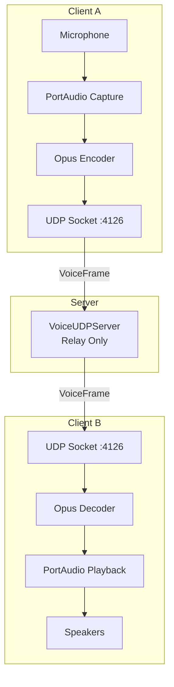

# Voice Chat - Communication Audio Temps Réel

Le système de **Voice Chat** permet la communication vocale en temps réel entre les joueurs d'une même room, utilisant le codec **Opus** pour la compression audio et **PortAudio** pour la capture/lecture.

## Vue d'Ensemble



## Caractéristiques

| Paramètre | Valeur | Description |
|-----------|--------|-------------|
| **Port UDP** | 4126 | Séparé du gameplay (4124) |
| **Codec** | Opus | Optimisé VoIP |
| **Sample Rate** | 48000 Hz | Standard Opus |
| **Frame Size** | 960 samples | 20ms @ 48kHz |
| **Bitrate** | 32 kbps | Bon ratio qualité/bande passante |
| **Channels** | 1 (mono) | Suffisant pour la voix |
| **Latence** | < 100ms | Temps réel |

## Modes de Transmission

### Push-to-Talk (PTT)

Mode par défaut : maintenir la touche **V** pour parler.

```cpp
// Dans GameScene::handleEvent()
if (key == events::Key::V && !_chatInputOpen) {
    VoiceChatManager::getInstance().startTalking();
}
// Sur relâchement
VoiceChatManager::getInstance().stopTalking();
```

### Voice Activity Detection (VAD)

Mode alternatif : détection automatique de la voix.

```cpp
auto& voice = VoiceChatManager::getInstance();
voice.setVoiceMode(VoiceMode::VoiceActivity);
voice.setVADThreshold(0.02f);  // Sensibilité (0.0 - 1.0)
```

## Architecture Client

### VoiceChatManager (Singleton)

```cpp
class VoiceChatManager {
public:
    static VoiceChatManager& getInstance();

    // Lifecycle
    bool init();
    void shutdown();

    // Connexion
    bool connect(const std::string& host, uint16_t port = 4126);
    void disconnect();
    void joinVoiceChannel(const SessionToken& token, const std::string& roomCode);
    void leaveVoiceChannel();

    // Transmission
    void startTalking();  // PTT: appeler quand V pressé
    void stopTalking();   // PTT: appeler quand V relâché
    bool isTalking() const;

    // Settings
    void setVoiceMode(VoiceMode mode);
    void setVADThreshold(float threshold);
    void setMicGain(float gain);      // 0.0 - 2.0
    void setPlaybackVolume(int vol);  // 0 - 100
    void setMuted(bool muted);

    // Audio Device Selection
    std::vector<AudioDeviceInfo> getInputDevices() const;
    std::vector<AudioDeviceInfo> getOutputDevices() const;
    void setPreferredInputDevice(const std::string& name);
    void setPreferredOutputDevice(const std::string& name);
    bool applyAudioDevices(const std::string& input, const std::string& output);

    // État
    bool isConnected() const;
    std::vector<uint8_t> getActiveSpeakers() const;

    // Appelé chaque frame
    void update();
};
```

### OpusCodec

```cpp
class OpusCodec {
public:
    bool init(int sampleRate = 48000, int channels = 1, int bitrate = 32000);
    void shutdown();

    // Encode PCM float → Opus bytes
    std::vector<uint8_t> encode(const float* pcmData, int frameSize);

    // Decode Opus bytes → PCM float
    std::vector<float> decode(const uint8_t* opusData, int opusSize, int frameSize);

    // Packet Loss Concealment
    std::vector<float> decodePLC(int frameSize);
};
```

## Protocole Réseau

### Messages Voice (port 4126)

| Type | Code | Direction | Payload |
|------|------|-----------|---------|
| VoiceJoin | 0x0300 | C→S | SessionToken (32B) + roomCode (6B) |
| VoiceJoinAck | 0x0301 | S→C | player_id (1B) |
| VoiceLeave | 0x0302 | C→S | player_id (1B) |
| VoiceFrame | 0x0303 | Both | speaker_id + seq + opus_data |
| VoiceMute | 0x0304 | Both | player_id + muted |

### Structure VoiceFrame

```cpp
struct VoiceFrame {
    uint8_t speaker_id;    // 1 byte - Qui parle
    uint16_t sequence;     // 2 bytes - Numéro de séquence
    uint16_t opus_len;     // 2 bytes - Taille des données Opus
    uint8_t opus_data[480]; // max 480 bytes - Audio compressé

    static constexpr size_t HEADER_SIZE = 5;
    static constexpr size_t MAX_WIRE_SIZE = 485;
};
```

## Architecture Serveur

### VoiceUDPServer

Le serveur **relay** les paquets audio sans les décoder :

```cpp
class VoiceUDPServer {
public:
    VoiceUDPServer(boost::asio::io_context& io_ctx,
                   std::shared_ptr<SessionManager> sessionManager);

    void start();  // Écoute sur port 4126
    void stop();

private:
    // Authentification via SessionToken existant
    // Relay VoiceFrame aux autres membres de la room
    // Pas de traitement audio (économie CPU)
};
```

## Intégration GameScene

```cpp
void GameScene::initVoiceChat() {
    auto& voice = VoiceChatManager::getInstance();
    if (!voice.isInitialized()) {
        voice.init();
    }

    // Connexion au serveur voice
    auto host = _context.tcpClient->getLastHost();
    voice.connect(host, VOICE_UDP_PORT);

    // Rejoindre le channel de la room
    auto tokenOpt = _context.tcpClient->getSessionToken();
    auto roomCodeOpt = _context.tcpClient->getCurrentRoomCode();
    if (tokenOpt && roomCodeOpt) {
        voice.joinVoiceChannel(*tokenOpt, *roomCodeOpt);
    }

    _voiceChatInitialized = true;
}

void GameScene::renderVoiceIndicator() {
    auto& voiceMgr = VoiceChatManager::getInstance();
    if (!voiceMgr.isConnected()) return;

    float indicatorX = SCREEN_WIDTH - 200.0f;
    float indicatorY = 20.0f;

    // Indicateur MUTED (gris)
    if (voiceMgr.isMuted()) {
        _context.window->drawRect(indicatorX, indicatorY, 80, 24, {100, 100, 100, 220});
        _context.window->drawText(FONT_KEY, "MUTED", indicatorX + 10, indicatorY + 4, 14, {200, 200, 200, 255});
        indicatorY += 30.0f;
    }
    // Indicateur MIC (rouge) quand on parle
    else if (voiceMgr.isTalking()) {
        _context.window->drawRect(indicatorX, indicatorY, 60, 24, {180, 40, 40, 220});
        _context.window->drawText(FONT_KEY, "MIC", indicatorX + 10, indicatorY + 4, 14, {255, 255, 255, 255});
        indicatorY += 30.0f;
    }

    // Liste des joueurs qui parlent (vert)
    auto speakers = voiceMgr.getActiveSpeakers();
    for (uint8_t speakerId : speakers) {
        _context.window->drawRect(indicatorX, indicatorY, 120, 22, {40, 120, 40, 200});
        std::string label = "P" + std::to_string(speakerId) + " speaking";
        _context.window->drawText(FONT_KEY, label, indicatorX + 8, indicatorY + 4, 12, {255, 255, 255, 255});
        indicatorY += 26.0f;
    }

    // Hint du mode voice en bas à droite
    if (!voiceMgr.isTalking() && speakers.empty() && !voiceMgr.isMuted()) {
        bool isVAD = (voiceMgr.getVoiceMode() == VoiceMode::VoiceActivity);
        std::string hint = isVAD ? "Voice Activity" : "[V] Push-to-Talk";
        _context.window->drawText(FONT_KEY, hint, SCREEN_WIDTH - 140, SCREEN_HEIGHT - 30, 12, {100, 100, 120, 255});
    }
}
```

## Sélection de Périphériques Audio

Le système permet à l'utilisateur de choisir ses périphériques d'entrée (microphone) et sortie (haut-parleurs).

### Structure AudioDeviceInfo

```cpp
struct AudioDeviceInfo {
    int index;                   // Index PortAudio
    std::string name;            // Nom du périphérique
    int maxInputChannels;        // 0 = sortie uniquement
    int maxOutputChannels;       // 0 = entrée uniquement
    double defaultSampleRate;    // Fréquence par défaut
    bool isDefault;              // Périphérique système par défaut
};
```

### Filtrage des Périphériques Virtuels

Les périphériques virtuels (PulseAudio, PipeWire bridges, etc.) sont automatiquement filtrés :

- WEBRTC VoiceEngine
- Firefox, Chrome, Chromium
- Discord, OBS, Zoom, Teams
- Steam, Spotify
- PulseAudio sinks/sources virtuels

### Sélection Cross-Platform

Le système détecte automatiquement les périphériques matériels préférés selon les conventions de nommage :

| Plateforme | Patterns Microphone | Patterns Haut-parleurs |
|------------|---------------------|------------------------|
| Windows | "Microphone", "Headset", "Capture" | "Speaker", "Headphones", "Output" |
| Linux/ALSA | "hw:", "plughw:", "cAVS Digital Microphone" | "hw:", "plughw:", "cAVS Speaker" |
| macOS | "Built-in Microphone", "USB" | "Built-in Output", "External" |

### Persistance des Préférences

Les préférences sont sauvegardées dans le profil utilisateur via MongoDB :

```cpp
// UserSettingsPayload (Protocol.hpp)
char audioInputDevice[64];   // Nom périphérique entrée ("" = auto)
char audioOutputDevice[64];  // Nom périphérique sortie ("" = auto)
```

### Exemple d'Utilisation

```cpp
auto& voice = VoiceChatManager::getInstance();

// Lister les périphériques disponibles
auto inputs = voice.getInputDevices();
auto outputs = voice.getOutputDevices();

// Sélectionner un périphérique spécifique
voice.setPreferredInputDevice("Raptor Lake-P/U/H cAVS Digital Microphone");
voice.setPreferredOutputDevice("Raptor Lake-P/U/H cAVS Speaker + Headphones");

// Appliquer les changements (réinitialise si nécessaire)
voice.applyAudioDevices(inputName, outputName);
```

## Fichiers Clés

| Fichier | Description |
|---------|-------------|
| `src/client/include/audio/VoiceChatManager.hpp` | Interface du manager voice |
| `src/client/src/audio/VoiceChatManager.cpp` | Implémentation (PortAudio + réseau) |
| `src/client/include/audio/OpusCodec.hpp` | Interface codec Opus |
| `src/client/src/audio/OpusCodec.cpp` | Encodage/décodage Opus |
| `src/server/infrastructure/adapters/in/network/VoiceUDPServer.hpp` | Serveur relay |
| `src/server/infrastructure/adapters/in/network/VoiceUDPServer.cpp` | Implémentation relay |
| `src/common/protocol/Protocol.hpp` | Structures VoiceJoin, VoiceFrame, etc. |

## Dépendances

```json
// vcpkg.json
{
  "dependencies": [
    "opus",
    "portaudio"
  ]
}
```

```cmake
# CMakeLists.txt (client)
find_package(Opus CONFIG REQUIRED)
find_package(portaudio CONFIG REQUIRED)

target_link_libraries(rtype_client PRIVATE
    Opus::opus
    portaudio
)
```

## Voir Aussi

- [Architecture Réseau](../../guides/network-architecture.md)
- [Système Audio](../audio/index.md)
- [GameScene](../core/scenes.md)
