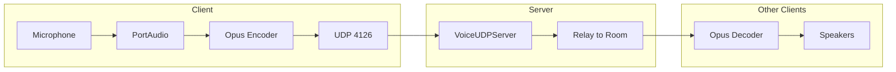

---
tags:
  - configuration
  - audio
---

# Configuration Audio

## Stockage

Les paramètres audio sont stockés **côté serveur** (MongoDB) et synchronisés à chaque connexion.

| Paramètre | Champ MongoDB | Type | Plage |
|-----------|---------------|------|-------|
| Volume voice | `voiceVolume` | uint8 | 0-100 |
| Gain micro | `micGain` | uint8 | 0-200 (×0.01) |
| Mode voice | `voiceMode` | uint8 | 0=PTT, 1=VAD |
| Seuil VAD | `vadThreshold` | uint8 | 0-100 (×0.01) |
| Périphérique entrée | `audioInputDevice` | string | 64 chars max |
| Périphérique sortie | `audioOutputDevice` | string | 64 chars max |

---

## Périphériques Audio

### Sélection

Les périphériques se configurent dans **Options > Audio** in-game.

- Chaîne vide (`""`) = sélection automatique
- Nom du périphérique = sélection explicite

### Lister les périphériques (debug)

```bash
# Linux (ALSA)
aplay -l        # Sorties
arecord -l      # Entrées

# Linux (PulseAudio)
pactl list sources short   # Entrées
pactl list sinks short     # Sorties
```

---

## Voice Chat

### Modes

| Mode | Valeur | Description |
|------|--------|-------------|
| Push-to-Talk | 0 | Maintenir une touche pour parler |
| Voice Activity | 1 | Détection automatique de la voix |

### Seuil VAD

| Valeur stockée | Valeur réelle | Sensibilité |
|----------------|---------------|-------------|
| 1 | 0.01 | Très haute |
| 2 | 0.02 | Haute (défaut) |
| 5 | 0.05 | Moyenne |
| 10 | 0.10 | Basse |

### Gain Microphone

| Valeur stockée | Valeur réelle | Effet |
|----------------|---------------|-------|
| 50 | 0.5× | Atténuation |
| 100 | 1.0× | Normal (défaut) |
| 150 | 1.5× | Amplification |
| 200 | 2.0× | Maximum |

---

## Codec Opus

Paramètres définis dans `OpusCodec.hpp` :

| Paramètre | Valeur | Constante |
|-----------|--------|-----------|
| Bitrate | **32 kbps** | `BITRATE = 32000` |
| Sample Rate | 48 kHz | `SAMPLE_RATE = 48000` |
| Frame Size | 960 samples (20 ms) | `FRAME_SIZE = 960` |
| Channels | 1 (mono) | `CHANNELS = 1` |
| Max Packet | 480 bytes | `MAX_PACKET_SIZE = 480` |

---

## Architecture Voice



Le serveur ne décode pas l'audio — il relaye les paquets Opus aux autres membres de la room.
