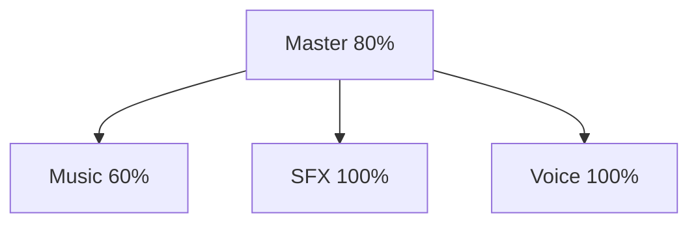

---
tags:
  - configuration
  - audio
---

# Configuration Audio

## Volumes



| Volume | Description | Défaut |
|--------|-------------|--------|
| `master_volume` | Global | 80 |
| `music_volume` | Musique | 60 |
| `sfx_volume` | Effets | 100 |
| `voice_volume` | Voice chat | 100 |

---

## Périphériques

### Lister les périphériques

```bash
# Linux
aplay -l        # Sortie
arecord -l      # Entrée
```

### Configuration

```json
{
  "audio": {
    "output_device": "default",
    "voice": {
      "input_device": "default",
      "output_device": "default"
    }
  }
}
```

---

## Voice Chat

### Modes

| Mode | Description |
|------|-------------|
| `ptt` | Push-to-Talk (défaut) |
| `vad` | Voice Activity Detection |

### Seuil VAD

| Valeur | Sensibilité |
|--------|-------------|
| 0.01 | Très haute |
| 0.02 | Haute (défaut) |
| 0.05 | Moyenne |
| 0.1 | Basse |

### Configuration complète

```json
{
  "audio": {
    "master_volume": 80,
    "music_volume": 60,
    "sfx_volume": 100,
    "voice_volume": 100,
    "voice": {
      "mode": "ptt",
      "ptt_key": "V",
      "vad_threshold": 0.02
    }
  }
}
```

---

## Codec Opus

| Paramètre | Valeur |
|-----------|--------|
| Bitrate | 24 kbps |
| Sample Rate | 48 kHz |
| Frame Size | 20 ms |
| Channels | 1 (mono) |
