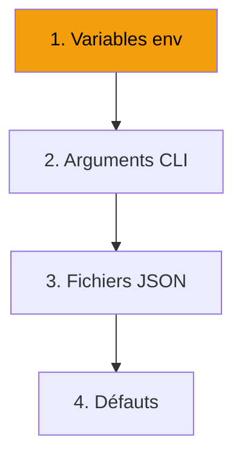

---
tags:
  - configuration
---

# Configuration

Personnalisez R-Type : serveur, client, accessibilité et audio.

<div class="grid-cards">
  <div class="card">
    <h3><a href="serveur/">🖥️ Serveur</a></h3>
    <p>Variables .env, ports, MongoDB</p>
  </div>
  <div class="card">
    <h3><a href="client/">🎮 Client</a></h3>
    <p>Options CLI, fichiers config</p>
  </div>
  <div class="card">
    <h3><a href="accessibilite/">♿ Accessibilité</a></h3>
    <p>Modes daltonien, rebinding</p>
  </div>
  <div class="card">
    <h3><a href="audio/">🔊 Audio</a></h3>
    <p>Périphériques, volumes, voice</p>
  </div>
</div>

---

## Fichiers

```
r-type/
├── .env                  # Variables serveur
├── config/
│   ├── server.json       # Config serveur
│   ├── client.json       # Config client
│   └── controls.json     # Contrôles
```

---

## Priorité


