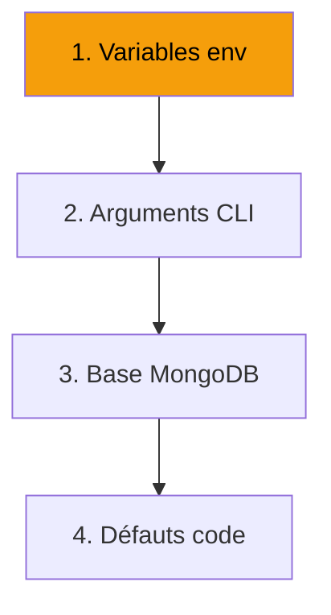

---
tags:
  - configuration
---

# Configuration

Personnalisez R-Type : serveur, client, accessibilité et audio.

<div class="grid-cards">
  <div class="card">
    <h3><a href="serveur/">🖥️ Serveur</a></h3>
    <p>Variables .env, ports, MongoDB</p>
  </div>
  <div class="card">
    <h3><a href="client/">🎮 Client</a></h3>
    <p>Options CLI, fichiers config</p>
  </div>
  <div class="card">
    <h3><a href="accessibilite/">♿ Accessibilité</a></h3>
    <p>Modes daltonien, rebinding</p>
  </div>
  <div class="card">
    <h3><a href="audio/">🔊 Audio</a></h3>
    <p>Périphériques, volumes, voice</p>
  </div>
</div>

---

## Configuration

La configuration du serveur se fait via **variables d'environnement** (fichier `.env`).
Les paramètres utilisateur sont stockés en **base MongoDB** et synchronisés à la connexion.

```
r-type/
├── .env                  # Variables serveur (MongoDB, TLS)
├── .env.example          # Exemple de configuration
└── certs/                # Certificats TLS
    ├── server.crt
    └── server.key
```

---

## Ports Réseau

| Service | Port | Protocole | Description |
|---------|------|-----------|-------------|
| Auth | 4125 | TCP/TLS | Authentification, rooms, chat |
| Game | 4124 | UDP | Gameplay temps réel |
| Voice | 4126 | UDP | Chat vocal Opus |

---

## Priorité


