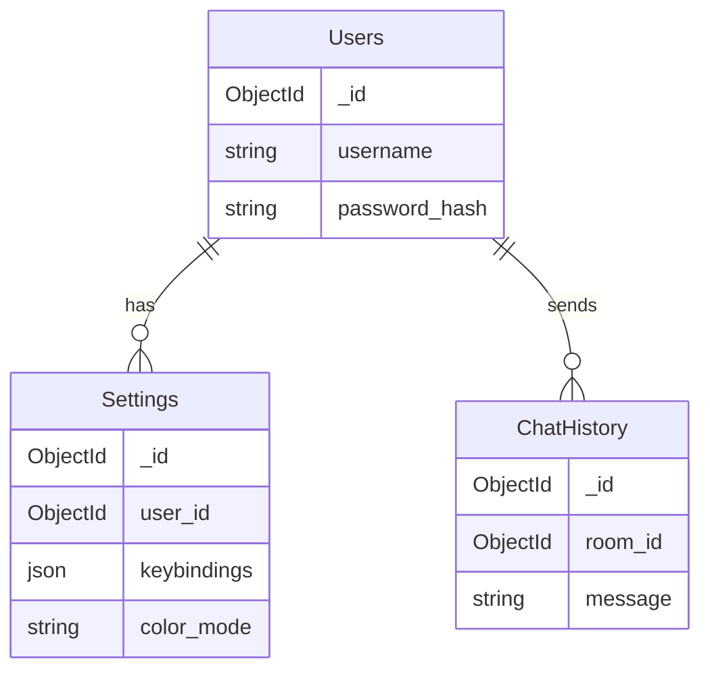

---
tags:
  - configuration
  - serveur
---

# Configuration Serveur

## Fichier .env

```bash
# .env

# Réseau
RTYPE_PORT=4242
RTYPE_VOICE_PORT=4243
RTYPE_MAX_CONNECTIONS=100

# Game
RTYPE_MAX_PLAYERS=4
RTYPE_TICK_RATE=60
RTYPE_TIMEOUT_MS=5000

# MongoDB
MONGO_URI=mongodb://localhost:27017
MONGO_DB_NAME=rtype

# Logging
RTYPE_LOG_LEVEL=info
RTYPE_LOG_FILE=logs/server.log

# Sécurité
RTYPE_JWT_SECRET=your-secret-key
```

---

## Options Réseau

| Variable | Description | Défaut |
|----------|-------------|--------|
| `RTYPE_PORT` | Port principal | 4242 |
| `RTYPE_VOICE_PORT` | Port voice | 4243 |
| `RTYPE_MAX_CONNECTIONS` | Connexions max | 100 |

---

## Options Gameplay

| Variable | Description | Défaut |
|----------|-------------|--------|
| `RTYPE_MAX_PLAYERS` | Joueurs/room | 4 |
| `RTYPE_TICK_RATE` | Ticks/sec | 60 |
| `RTYPE_TIMEOUT_MS` | Timeout (ms) | 5000 |

---

## MongoDB



---

## Arguments CLI

```bash
./r-type_server [OPTIONS]
  -p, --port <PORT>     Port d'écoute
  -c, --config <FILE>   Fichier config
  -v, --verbose         Mode debug
  --max-players <N>     Joueurs max
```

---

## Logs

| Niveau | Description |
|--------|-------------|
| `trace` | Très détaillé |
| `debug` | Debug |
| `info` | Général |
| `warn` | Avertissements |
| `error` | Erreurs |
