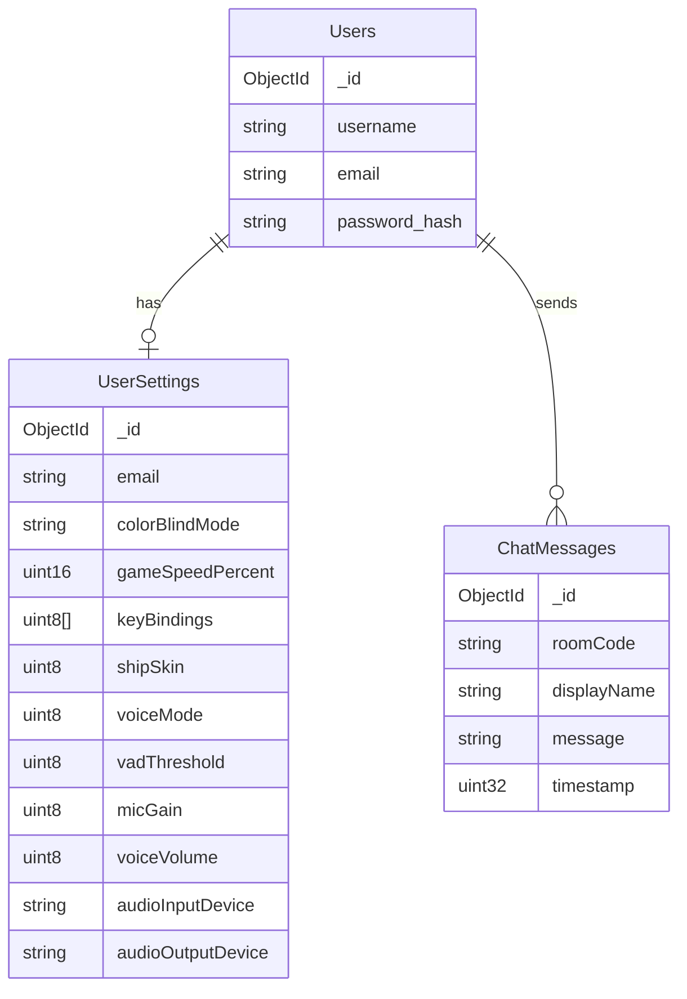

---
tags:
  - configuration
  - serveur
---

# Configuration Serveur

## Fichier .env

```bash
# .env

# MongoDB
MONGODB_URI=mongodb://localhost:8089
MONGODB_DB=rtype

# TLS (optionnel, défauts ci-dessous)
TLS_CERT_FILE=certs/server.crt
TLS_KEY_FILE=certs/server.key
```

!!! note "Ports fixes"
    Les ports réseau sont définis dans le code et ne sont pas configurables via `.env` :

    - **TCP 4125** : Authentification TLS, rooms, chat
    - **UDP 4124** : Gameplay temps réel (snapshots 20 Hz)
    - **UDP 4126** : Chat vocal Opus

---

## Variables d'Environnement

| Variable | Description | Défaut |
|----------|-------------|--------|
| `MONGODB_URI` | URI de connexion MongoDB | `mongodb://localhost:8089` |
| `MONGODB_DB` | Nom de la base de données | `rtype` |
| `TLS_CERT_FILE` | Chemin certificat TLS | `certs/server.crt` |
| `TLS_KEY_FILE` | Chemin clé privée TLS | `certs/server.key` |

---

## Constantes Gameplay

Ces valeurs sont définies dans le code source :

| Constante | Valeur | Fichier |
|-----------|--------|---------|
| `MAX_PLAYERS` | 4 | `Protocol.hpp` |
| `MAX_ROOM_PLAYERS` | 6 | `Protocol.hpp` |
| `BROADCAST_INTERVAL_MS` | 50 ms (20 Hz) | `UDPServer.cpp` |
| `CLIENT_TIMEOUT_MS` | 2000 ms | `TCPAuthServer.cpp` |
| `PLAYER_TIMEOUT_MS` | 2000 ms | `UDPServer.cpp` |

---

## MongoDB



---

## Lancement

Le serveur ne prend pas d'arguments CLI. Toute la configuration se fait via `.env` :

```bash
# Copier et éditer le fichier d'exemple
cp .env.example .env

# Lancer le serveur
./rtype_server
```

---

## Logs

Le serveur utilise **spdlog** avec interface TUI intégrée.

| Niveau | Description |
|--------|-------------|
| `trace` | Très détaillé |
| `debug` | Debug réseau |
| `info` | Événements généraux |
| `warn` | Avertissements |
| `error` | Erreurs |

---

## TLS / Certificats

Générer des certificats de développement :

```bash
./scripts/generate_dev_certs.sh
```

Cela crée le dossier `certs/` avec `server.crt` et `server.key`.

!!! warning "Production"
    En production, utilisez des certificats signés par une CA reconnue.
