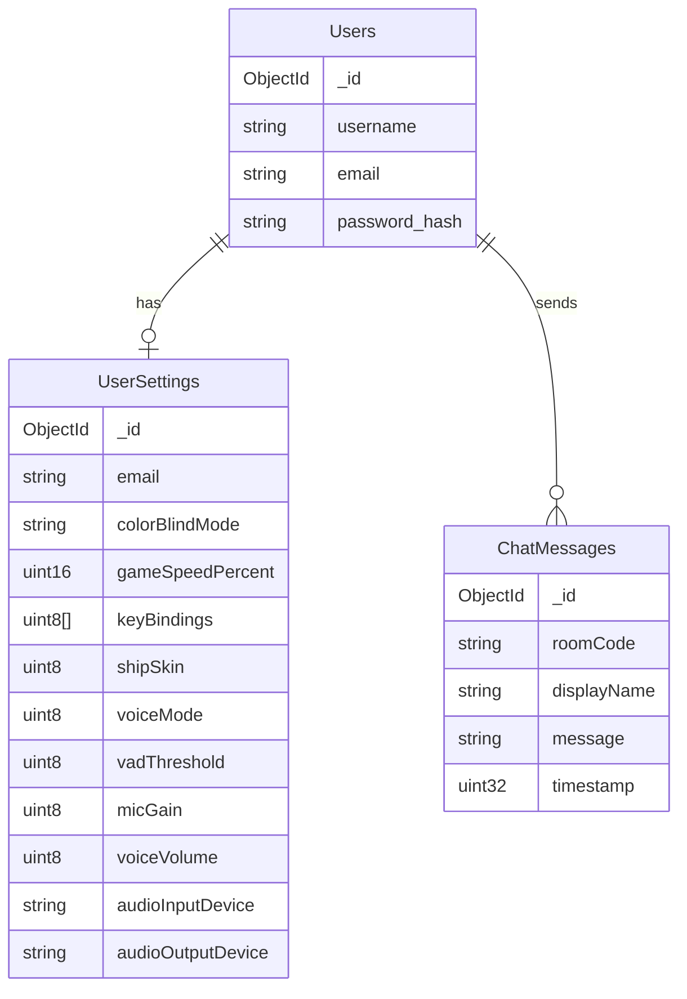

---
tags:
  - configuration
  - serveur
---

# Configuration Serveur

## Fichier .env

```bash
# .env

# MongoDB
MONGODB_URI=mongodb://localhost:8089
MONGODB_DB=rtype

# TLS (optionnel, défauts ci-dessous)
TLS_CERT_FILE=certs/server.crt
TLS_KEY_FILE=certs/server.key
```

!!! note "Ports fixes"
    Les ports réseau sont définis dans le code et ne sont pas configurables via `.env` :

    - **TCP 4125** : Authentification TLS, rooms, chat
    - **UDP 4124** : Gameplay temps réel (snapshots 20 Hz)
    - **UDP 4126** : Chat vocal Opus

---

## Variables d'Environnement

| Variable | Description | Défaut |
|----------|-------------|--------|
| `MONGODB_URI` | URI de connexion MongoDB | `mongodb://localhost:8089` |
| `MONGODB_DB` | Nom de la base de données | `rtype` |
| `TLS_CERT_FILE` | Chemin certificat TLS | `certs/server.crt` |
| `TLS_KEY_FILE` | Chemin clé privée TLS | `certs/server.key` |
| `ADMIN_TOKEN` | Token 256-bit pour TCPAdminServer | - (requis pour admin) |

---

## Constantes Gameplay

Ces valeurs sont définies dans le code source :

| Constante | Valeur | Fichier |
|-----------|--------|---------|
| `MAX_PLAYERS` | 4 | `Protocol.hpp` |
| `MAX_ROOM_PLAYERS` | 6 | `Protocol.hpp` |
| `BROADCAST_INTERVAL_MS` | 50 ms (20 Hz) | `UDPServer.cpp` |
| `CLIENT_TIMEOUT_MS` | 2000 ms | `TCPAuthServer.cpp` |
| `PLAYER_TIMEOUT_MS` | 2000 ms | `UDPServer.cpp` |

---

## MongoDB

### Lancement avec Docker

```bash
docker run -d --name rtype-mongodb -p 8089:27017 -v rtype_data:/data/db --restart unless-stopped mongo:latest
```

### Schéma



---

## Lancement

Le serveur ne prend pas d'arguments CLI. Toute la configuration se fait via `.env` :

```bash
# Copier et éditer le fichier d'exemple
cp .env.example .env

# Lancer le serveur
./rtype_server
```

---

## Logs

Le serveur utilise **spdlog** avec interface TUI intégrée.

| Niveau | Description |
|--------|-------------|
| `trace` | Très détaillé |
| `debug` | Debug réseau |
| `info` | Événements généraux |
| `warn` | Avertissements |
| `error` | Erreurs |

---

## TLS / Certificats

Générer des certificats de développement :

```bash
./scripts/generate_dev_certs.sh
```

Cela crée le dossier `certs/` avec `server.crt` et `server.key`.

!!! warning "Production"
    En production, utilisez des certificats signés par une CA reconnue.

---

## Déploiement VPS

Pour le déploiement sur le serveur de production (VPS France), consultez la [documentation VPS](../developpement/vps.md).

Le serveur de production utilise :

- **systemd** pour la gestion du service (`rtype_server.service`)
- **tmux** pour l'accès au TUI serveur multi-utilisateur
- **Python wrapper** pour les notifications Discord et le monitoring

---

## TCPAdminServer (Administration à Distance)

Le serveur expose une interface d'administration sur le port 4127 pour permettre l'administration à distance via le [Bot Admin Discord](../developpement/discord-admin-bot.md).

### Configuration

| Paramètre | Valeur |
|-----------|--------|
| Port | TCP 4127 |
| Bind | `127.0.0.1` (localhost uniquement) |
| Protocole | JSON-RPC (newline-delimited) |
| Authentification | Token 256-bit |

### Génération du token

```bash
# Générer un token sécurisé
openssl rand -hex 32

# Exemple de résultat
# a1b2c3d4e5f6...
```

Ajoutez le token à votre fichier `.env` :

```bash
ADMIN_TOKEN=votre_token_genere_ici
```

### Sécurité

| Protection | Description |
|------------|-------------|
| **Bind localhost** | Non accessible depuis l'extérieur |
| **Token requis** | Toute requête sans token valide est rejetée |
| **Commandes filtrées** | `quit`, `exit`, `zoom`, `interact`, `net` bloquées |
| **Thread-safe** | Validation du token protégée par mutex |

!!! warning "Token obligatoire"
    Si `ADMIN_TOKEN` n'est pas défini, le serveur refuse **toutes** les requêtes d'administration.

### Format des requêtes

```json
{"cmd": "status", "token": "votre_admin_token"}
```

### Format des réponses

```json
{"success": true, "output": ["ligne1", "ligne2"], "error": null}
```

### Commandes disponibles

Toutes les commandes du ServerCLI sont disponibles sauf les commandes interactives :

| Commande | Description |
|----------|-------------|
| `status` | État du serveur (users, sessions, uptime) |
| `sessions` | Liste des sessions actives |
| `users` | Liste des utilisateurs enregistrés |
| `user <email>` | Détails d'un utilisateur |
| `kick <email>` | Déconnecter un joueur |
| `ban <email> [reason]` | Bannir un utilisateur |
| `unban <email>` | Débannir un utilisateur |
| `bans` | Liste des utilisateurs bannis |
| `rooms` | Liste des salles actives |
| `room <code>` | Détails d'une salle |
| `broadcast <msg>` | Message à tous les joueurs |
| `help` | Liste des commandes |

Pour plus de détails sur l'utilisation via Discord, consultez la [documentation du Bot Admin](../developpement/discord-admin-bot.md).
