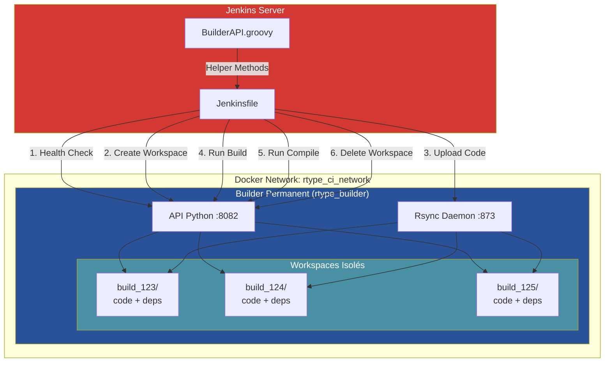
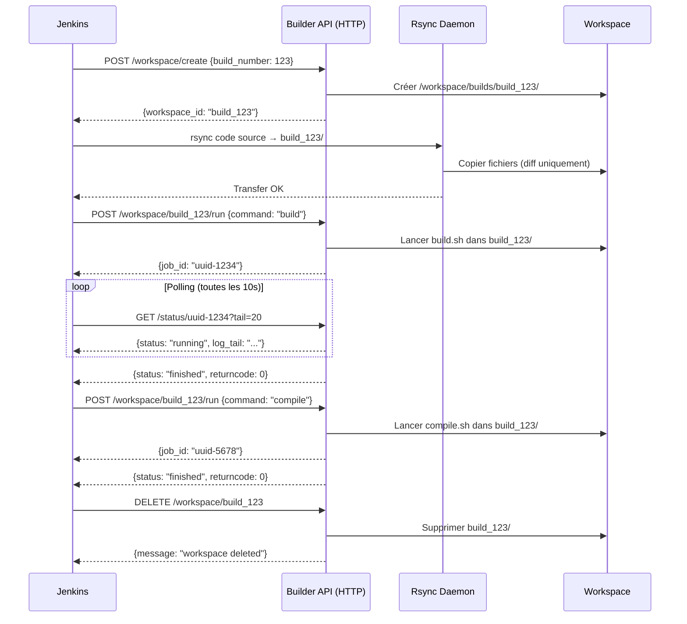
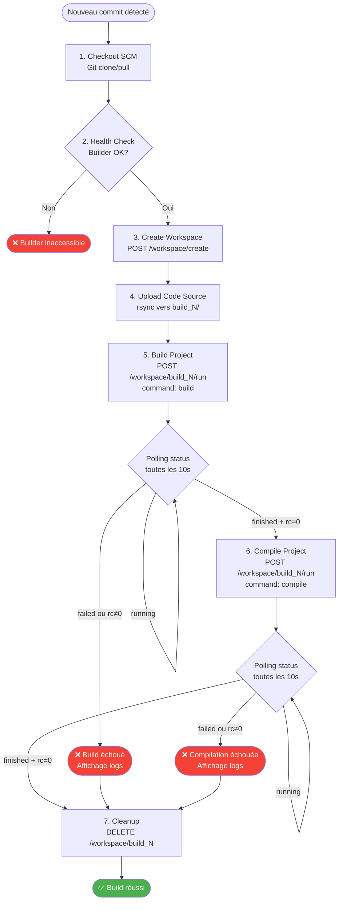
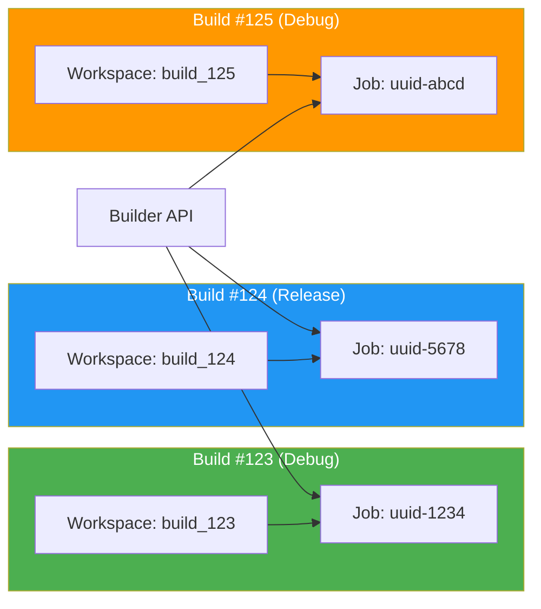
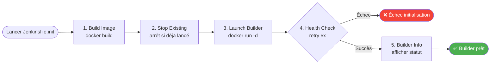
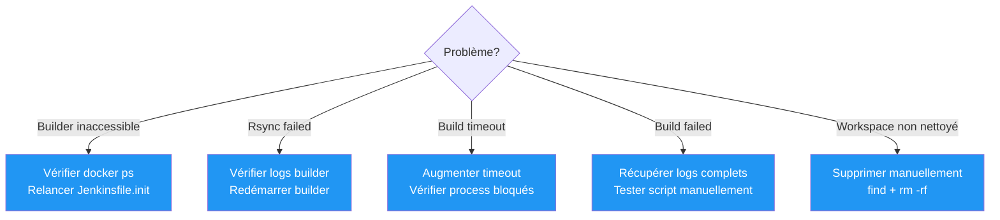

# Système CI/CD Jenkins

## Introduction

Le projet R-Type utilise une infrastructure CI/CD moderne basée sur Jenkins et un système de builder permanent. Cette architecture a été conçue pour répondre aux défis spécifiques du développement C++ avec des dépendances complexes (vcpkg, CMake) :

**Problématiques résolues :**

- **Performance** : Les builds C++ avec vcpkg sont extrêmement longs (10-30 minutes pour installer les dépendances). Recréer un conteneur à chaque build serait inefficace.
- **Isolation** : Plusieurs builds doivent pouvoir s'exécuter en parallèle sans conflit, chacun dans son propre workspace isolé.
- **Fiabilité** : Le système doit gérer les builds longs (jusqu'à 2 heures) sans timeout et fournir des logs détaillés en cas d'erreur.
- **Scalabilité** : L'architecture doit supporter de nombreux builds simultanés tout en optimisant l'utilisation des ressources.

**Approche retenue :**

Au lieu de créer un nouveau conteneur Docker pour chaque build (approche traditionnelle mais inefficace pour C++), nous utilisons un **builder permanent** qui reste actif et crée des **workspaces isolés** pour chaque build. Le code source est transféré via **rsync** (transfert incrémental rapide), et les builds sont orchestrés via une **API REST Python**.

!!! tip "Avantages de cette architecture"
    - Réutilisation du cache vcpkg entre les builds (gain de 90% du temps)
    - Isolation complète : chaque build a son propre répertoire de travail
    - Builds parallèles illimités sans conflit de ressources
    - Transfert de code rapide grâce à rsync (seulement les fichiers modifiés)
    - API REST pour un contrôle fin et asynchrone des jobs

## Architecture Globale

### Vue d'ensemble



### Flux de communication



## Composants du Système

### 1. Jenkins Server

**Rôle** : Orchestrateur principal du pipeline CI/CD.

**Responsabilités** :
- Détection des changements dans le SCM (polling toutes les 3 minutes)
- Orchestration des étapes du build (checkout, upload, build, compile)
- Communication avec le builder via l'API REST
- Gestion du cycle de vie des workspaces
- Affichage des logs et gestion des erreurs

**Configuration** :
- Pipeline défini dans `Jenkinsfile` (racine du projet)
- Timeout global : 2 heures
- Rétention : 10 derniers builds
- Paramètres : `BUILD_TYPE` (Debug/Release)

### 2. Builder Permanent

**Rôle** : Conteneur Docker toujours actif qui héberge l'environnement de build.

**Caractéristiques** :
- Image : `rtype-builder:latest` (basée sur Ubuntu 22.04)
- Nom du conteneur : `rtype_builder`
- Réseau : `rtype_ci_network` (réseau Docker dédié)
- Volumes : code source monté dans `/workspace`

**Services intégrés** :
1. **API Python** (port 8082) : orchestration des jobs de build
2. **Rsync Daemon** (port 873) : réception du code source

**Pourquoi permanent ?**
- Cache vcpkg persistant (économie de 10-30 minutes par build)
- Évite la reconstruction de l'image à chaque build
- Démarre une seule fois au début de la journée de travail

!!! warning "Initialisation requise"
    Le builder permanent doit être lancé **une fois** au début avec le job Jenkins `Jenkinsfile.init`. Il reste ensuite actif pour tous les builds suivants.

### 3. Workspaces Isolés

**Concept** : Chaque build Jenkins obtient son propre répertoire de travail isolé.

**Nomenclature** :
```
/workspace/builds/
├── build_123/          # Build Jenkins #123
│   ├── src/            # Code source uploadé
│   ├── third_party/    # Dépendances
│   ├── scripts/        # Scripts de build
│   ├── build/          # Répertoire CMake
│   └── artifacts/      # Logs des jobs
├── build_124/          # Build Jenkins #124
└── build_125/          # Build Jenkins #125
```

**Avantages** :
- **Isolation totale** : aucun conflit entre builds parallèles
- **Débogage facile** : chaque build conserve son workspace jusqu'au cleanup
- **Cache séparé** : chaque build peut avoir son propre cache CMake
- **Logs dédiés** : les logs sont stockés dans `artifacts/` de chaque workspace

**Cycle de vie** :
1. **Création** : via `POST /workspace/create` au début du build
2. **Utilisation** : upload du code + exécution des jobs
3. **Suppression** : via `DELETE /workspace/{id}` à la fin (dans le bloc `post`)

### 4. Rsync - Transfert Incrémental

**Rôle** : Transférer le code source de Jenkins vers le builder de manière optimisée.

**Pourquoi rsync plutôt que git clone ?**

| Méthode | Temps | Avantages | Inconvénients |
|---------|-------|-----------|---------------|
| `git clone` | ~30s | Simple | Télécharge tout à chaque fois |
| `docker cp` | ~20s | Natif Docker | Lent pour gros projets |
| **rsync** | **~2s** | Transfert différentiel | Nécessite daemon |

**Configuration rsync** (`rsyncd.conf`) :
```ini
[workspace]
    path = /workspace/builds      # Racine des workspaces
    read only = false             # Permet l'upload
    max connections = 20          # Support 20 builds parallèles
```

**Utilisation dans Jenkinsfile** :
```groovy
sh """
    rsync -avz --delete \
        --exclude='.git' \
        --exclude='build*' \
        --exclude='third_party/vcpkg/.git' \
        ${WORKSPACE}/ \
        rsync://${env.BUILDER_HOST}:873/workspace/${env.WORKSPACE_ID}/
"""
```

!!! tip "Optimisations rsync"
    - `-a` : mode archive (préserve permissions, timestamps)
    - `-v` : verbeux (pour logs Jenkins)
    - `-z` : compression à la volée
    - `--delete` : supprime fichiers supprimés du repo
    - `--exclude` : ignore .git, build artifacts, etc.

### 5. API REST Python

**Rôle** : Interface programmatique pour gérer les builds de manière asynchrone.

**Architecture** :
- Serveur HTTP threadé (`ThreadingMixIn`) pour gérer les requêtes parallèles
- Execution asynchrone des jobs (subprocess + threading)
- Stockage des jobs en mémoire (dictionnaire thread-safe)
- Logs persistants dans `artifacts/builder_jobs/`

**Endpoints disponibles** :
- `GET /health` : vérification de disponibilité
- `POST /workspace/create` : création de workspace
- `POST /workspace/{id}/run` : lancement d'un job dans un workspace
- `GET /status/{job_id}` : récupération du statut
- `DELETE /workspace/{id}` : suppression de workspace

*Voir [jenkins-builder-api.md](jenkins-builder-api.md) pour la référence complète.*

### 6. Réseau Docker (rtype_ci_network)

**Rôle** : Réseau bridge dédié pour la communication Jenkins ↔ Builder.

**Avantages** :
- **Isolation** : trafic CI/CD séparé du réseau Docker par défaut
- **DNS automatique** : résolution `rtype_builder` sans IP hardcodée
- **Sécurité** : pas d'exposition des ports sur l'hôte (communication interne)

**Configuration** :
```yaml
networks:
  rtype_ci_network:
    external: true
```

**Résolution DNS** :
- Jenkins peut accéder au builder via `http://rtype_builder:8082`
- Pas besoin de connaître l'IP du conteneur

## Workflow de Build Complet

### Étape par étape



### Description détaillée

#### 1. Checkout (Récupération du code)

Jenkins récupère le code source depuis le SCM (GitHub) dans son workspace local.

```groovy
stage('Checkout') {
    steps {
        echo '📥 Récupération du code source...'
        checkout scm
    }
}
```

**Variables d'environnement créées** :
- `WORKSPACE` : `/var/jenkins_home/workspace/rtype_main`
- `BUILD_NUMBER` : numéro incrémental du build (ex: 123)
- `WORKSPACE_ID` : `build_${BUILD_NUMBER}` (ex: `build_123`)

#### 2. Health Check (Vérification du builder)

Jenkins vérifie que le builder permanent est accessible avant de continuer.

```groovy
if (!api.healthCheck()) {
    error("Le builder permanent n'est pas accessible")
}
```

**Requête HTTP** :
```bash
curl http://rtype_builder:8082/health
# Réponse attendue: {"status": "ok", "allowed_commands": ["build", "compile"]}
```

!!! warning "Builder non accessible"
    Si le health check échoue, cela signifie que le builder permanent n'a pas été initialisé. Il faut lancer le job `Jenkinsfile.init` en premier.

#### 3. Create Workspace (Création du workspace isolé)

Le builder crée un répertoire dédié pour ce build.

```groovy
sh """
    curl -s -f -X POST http://${env.BUILDER_HOST}:${env.BUILDER_PORT}/workspace/create \
        -H 'Content-Type: application/json' \
        -d '{"build_number": ${env.BUILD_NUMBER}}'
"""
```

**Ce qui se passe côté builder** :
```python
workspace_path = "/workspace/builds/build_123"
os.makedirs(workspace_path, exist_ok=True)
os.makedirs(f"{workspace_path}/artifacts", exist_ok=True)
```

**Structure créée** :
```
/workspace/builds/build_123/
└── artifacts/          # Dossier pour les logs
```

#### 4. Upload Source Code (Transfert via rsync)

Le code source est transféré de Jenkins vers le workspace du builder.

```groovy
sh """
    rsync -avz --delete \
        --exclude='.git' \
        --exclude='build*' \
        ${WORKSPACE}/ \
        rsync://${env.BUILDER_HOST}:873/workspace/${env.WORKSPACE_ID}/
"""
```

**Performance** :
- Premier upload : ~10-15 secondes (projet complet)
- Uploads suivants : ~2-3 secondes (seulement les fichiers modifiés)

**Fichiers exclus** :
- `.git/` : historique Git (non nécessaire pour build)
- `build*/` : anciens builds locaux
- `cmake-build-*` : cache CMake local
- `*.o`, `*.a` : fichiers compilés temporaires

**Résultat** :
```
/workspace/builds/build_123/
├── src/
├── third_party/
├── scripts/
│   ├── build.sh
│   └── compile.sh
├── CMakeLists.txt
└── artifacts/
```

#### 5. Build Project (Configuration CMake + vcpkg)

Lancement du script `build.sh` qui configure CMake et installe les dépendances vcpkg.

```groovy
def jobId = api.runInWorkspace(env.WORKSPACE_ID, 'build')
def result = api.waitForJob(jobId, 10, 7200)
```

**Requêtes HTTP** :
```bash
# 1. Soumettre le job
curl -X POST http://rtype_builder:8082/workspace/build_123/run \
    -d '{"command": "build"}'
# Réponse: {"job_id": "550e8400-e29b-41d4-a716-446655440000"}

# 2. Polling du statut (toutes les 10 secondes)
curl http://rtype_builder:8082/status/550e8400-...?tail=20
# Réponse: {"status": "running", "log_tail": "[ 45%] Building CXX..."}
```

**Ce que fait `build.sh`** :
```bash
#!/bin/bash
# Installation vcpkg
./third_party/vcpkg/bootstrap-vcpkg.sh

# Configuration CMake
cmake -B build \
    -DCMAKE_BUILD_TYPE=${BUILD_TYPE} \
    -DCMAKE_TOOLCHAIN_FILE=./third_party/vcpkg/scripts/buildsystems/vcpkg.cmake
```

**Durée** :
- Premier build avec cache vide : ~20-30 minutes (installation vcpkg)
- Builds suivants avec cache : ~2-5 minutes (vcpkg déjà installé)

!!! tip "Cache vcpkg"
    Le cache vcpkg est partagé entre les workspaces grâce au volume monté. Une fois installé dans un workspace, les autres builds peuvent le réutiliser.

#### 6. Compile Project (Compilation du code)

Lancement du script `compile.sh` qui compile le projet.

```groovy
def jobId = api.runInWorkspace(env.WORKSPACE_ID, 'compile')
def result = api.waitForJob(jobId, 10, 7200)
```

**Ce que fait `compile.sh`** :
```bash
#!/bin/bash
cmake --build build --config ${BUILD_TYPE} -j$(nproc)
```

**Durée** :
- Compilation complète : ~3-10 minutes
- Recompilation incrémentale : ~30 secondes - 2 minutes

**Logs en temps réel** :
```
📊 Status: running | Command: compile
📋 Dernières lignes du log:
[ 78%] Building CXX object src/CMakeFiles/rtype_server.dir/main.cpp.o
[ 82%] Linking CXX executable rtype_server
[100%] Built target rtype_server
✅ Job terminé avec succès
```

#### 7. Cleanup (Nettoyage du workspace)

Suppression du workspace pour libérer de l'espace disque.

```groovy
post {
    always {
        sh """
            curl -s -X DELETE \
                http://${env.BUILDER_HOST}:${env.BUILDER_PORT}/workspace/${env.WORKSPACE_ID}
        """
    }
}
```

**Ce qui se passe** :
```python
shutil.rmtree("/workspace/builds/build_123")
```

!!! note "Nettoyage automatique"
    Le cleanup est exécuté dans le bloc `post { always }`, ce qui garantit qu'il s'exécute même en cas d'échec du build. Cela évite l'accumulation de workspaces orphelins.

## Builds Parallèles

### Isolation complète

Le système supporte **un nombre illimité de builds simultanés** grâce à l'isolation par workspace.



### Gestion de la concurrence

**Thread-safety au niveau de l'API** :
```python
jobs = {}                        # Dictionnaire des jobs
jobs_lock = threading.Lock()     # Lock pour accès concurrent

with jobs_lock:
    jobs[job_id] = {...}         # Modification thread-safe
```

**Isolation des fichiers** :
- Chaque workspace a son propre répertoire → aucune collision de fichiers
- Les logs sont stockés dans `build_123/artifacts/`, `build_124/artifacts/`, etc.
- Pas de conflit dans CMake (chaque workspace a son propre `build/`)

**Limites pratiques** :
- **CPU** : limité par le nombre de cœurs (chaque compilation utilise `-j$(nproc)`)
- **RAM** : chaque build consomme ~2-4 GB
- **Disque** : chaque workspace occupe ~500 MB - 1 GB

!!! tip "Builds parallèles dans Jenkins"
    Pour lancer plusieurs builds en parallèle, il suffit de déclencher plusieurs jobs Jenkins (manuellement ou via commits simultanés). Chaque job créera son propre workspace isolé.

### Exemple concret

**Scénario** : 3 développeurs poussent des commits simultanément.

| Build | Développeur | Branche | Type | Workspace | Status |
|-------|-------------|---------|------|-----------|--------|
| #123 | Alice | feature/auth | Debug | build_123 | Building... |
| #124 | Bob | feature/gameplay | Release | build_124 | Compiling... |
| #125 | Charlie | hotfix/crash | Debug | build_125 | Building... |

**Ce qui se passe** :
1. Jenkins détecte 3 commits → lance 3 jobs en parallèle
2. Chaque job crée son workspace (`build_123`, `build_124`, `build_125`)
3. Le code est uploadé via rsync dans chaque workspace
4. Les builds s'exécutent en parallèle sans conflit
5. Les logs sont accessibles séparément pour chaque build
6. À la fin, chaque workspace est nettoyé indépendamment

## Initialisation du Builder

### Première utilisation

Avant de lancer le premier build, il faut **initialiser le builder permanent** en exécutant le job Jenkins basé sur `Jenkinsfile.init`.

**Étapes d'initialisation** :



### Commandes exécutées

**1. Build de l'image** :
```bash
# Depuis la racine du projet (contexte = racine)
docker build -f ci_cd/docker/Dockerfile.build -t rtype-builder:latest .

# Ou utiliser le script fourni
cd ci_cd/docker
./build_image.sh
```

!!! note "Contexte de build"
    Le contexte Docker doit être la **racine du projet** (pas `ci_cd/docker/`) car le Dockerfile copie des fichiers depuis `ci_cd/docker/` avec des chemins relatifs (ex: `COPY ci_cd/docker/entrypoint.sh`).

**2. Lancement du builder** :
```bash
#!/bin/bash
# Script: launch_builder_permanent.sh

# Créer le réseau si nécessaire
docker network create rtype_ci_network 2>/dev/null || true

# Vérifier si déjà lancé
if docker ps | grep -q rtype_builder; then
    echo "Builder déjà actif"
    exit 0
fi

# Lancer le conteneur
docker run -d \
    --name rtype_builder \
    --network rtype_ci_network \
    -v $(pwd)/../..:/workspace \
    rtype-builder:latest

echo "Builder lancé avec succès"
```

**3. Health check** :
```groovy
retry(5) {
    sleep 2
    sh 'curl -f http://rtype_builder:8082/health'
}
```

### Comportement du job

Le job `Jenkinsfile.init` suit un comportement **simple et prévisible** sans paramètres conditionnels :

**À chaque exécution, le job :**

1. **Build systématiquement l'image** Docker `rtype-builder:latest`
2. **Stoppe le builder existant** (si présent) pour éviter les conflits
3. **Lance un nouveau builder** permanent avec la nouvelle image
4. **Vérifie la santé** du builder avec retry automatique

!!! tip "Simplicité par conception"
    Ce comportement uniforme élimine les choix conditionnels et garantit que chaque initialisation démarre avec une image fraîche et un builder propre. Cela simplifie le débogage et rend le comportement prévisible.

### Vérification post-initialisation

Après initialisation réussie, vous devriez voir :

```bash
$ docker ps | grep rtype_builder
rtype_builder   Up 2 minutes   8082/tcp, 873/tcp

$ curl http://localhost:8082/health
{"status": "ok", "allowed_commands": ["build", "compile"]}

$ docker network inspect rtype_ci_network
# Devrait afficher le builder dans "Containers"
```

!!! success "Builder opérationnel"
    Une fois l'initialisation terminée, le builder reste actif **indéfiniment** (ou jusqu'à redémarrage de la machine). Vous n'avez plus besoin de relancer `Jenkinsfile.init` sauf en cas de modification de l'image Docker.

## Troubleshooting

### Problème : Builder non accessible

**Symptôme** :
```
❌ Le builder permanent n'est pas accessible.
Lancez d'abord le job d'initialisation (Jenkinsfile.init).
```

**Cause** : Le conteneur `rtype_builder` n'est pas lancé ou n'est pas sur le bon réseau.

**Solutions** :

1. Vérifier si le conteneur est actif :
```bash
docker ps | grep rtype_builder
```

2. Si absent, lancer l'initialisation :
```bash
# Via Jenkins
Exécuter le job basé sur Jenkinsfile.init

# Ou manuellement
cd ci_cd/docker
./launch_builder_permanent.sh
```

3. Vérifier le réseau Docker :
```bash
docker network inspect rtype_ci_network
# Le builder doit apparaître dans "Containers"
```

4. Tester la connectivité :
```bash
# Depuis Jenkins container
docker exec -it jenkins curl http://rtype_builder:8082/health
```

### Problème : Rsync connection failed

**Symptôme** :
```
rsync: failed to connect to rtype_builder (873): Connection refused
```

**Cause** : Le daemon rsync n'est pas lancé dans le builder.

**Solutions** :

1. Vérifier les logs du builder :
```bash
docker logs rtype_builder
# Doit afficher: "✅ Rsync daemon lancé sur port 873"
```

2. Vérifier que rsync écoute :
```bash
docker exec rtype_builder netstat -tuln | grep 873
```

3. Redémarrer le builder :
```bash
cd ci_cd/docker
./stop_builder_permanent.sh
./launch_builder_permanent.sh
```

4. Vérifier le fichier `entrypoint.sh` :
```bash
# Doit contenir:
rsync --daemon --config=/etc/rsyncd.conf
```

### Problème : Build timeout

**Symptôme** :
```
Timeout waiting for job uuid-1234 (waited 7200s)
```

**Cause** : Le build dépasse le timeout configuré (2 heures par défaut).

**Solutions** :

1. Augmenter le timeout dans `BuilderAPI.groovy` :
```groovy
// Passer de 7200s (2h) à 10800s (3h)
def result = api.waitForJob(jobId, 10, 10800)
```

2. Vérifier que le build n'est pas bloqué :
```bash
# Récupérer les logs du job
curl "http://rtype_builder:8082/status/uuid-1234?tail=100"
```

3. Identifier l'étape bloquante (souvent vcpkg) :
```bash
docker exec rtype_builder ps aux
# Chercher les process cmake/vcpkg
```

### Problème : Workspace non supprimé

**Symptôme** : Accumulation de dossiers `build_*` dans `/workspace/builds/`.

**Cause** : Le cleanup a échoué (erreur réseau, API down, etc.).

**Solutions** :

1. Vérifier les logs Jenkins du build concerné (bloc `post`).

2. Supprimer manuellement le workspace :
```bash
docker exec rtype_builder rm -rf /workspace/builds/build_123
```

3. Nettoyer tous les workspaces orphelins :
```bash
# Lister les workspaces
docker exec rtype_builder ls -la /workspace/builds/

# Supprimer ceux qui ne correspondent pas à un build actif
docker exec rtype_builder find /workspace/builds/ -maxdepth 1 -type d -name "build_*" -mtime +1 -exec rm -rf {} \;
```

4. Ajouter un script de nettoyage automatique (cron dans le builder).

### Problème : Build failed with returncode 1

**Symptôme** :
```
❌ Job échoué avec returncode: 1
📋 Dernières lignes du log:
CMake Error: vcpkg not found
```

**Cause** : Erreur durant l'exécution du script `build.sh` ou `compile.sh`.

**Solutions** :

1. Récupérer les logs complets du job :
```bash
# Via l'API
curl "http://rtype_builder:8082/status/uuid-1234?tail=200"

# Ou directement dans le workspace
docker exec rtype_builder cat /workspace/builds/build_123/artifacts/uuid-1234.log
```

2. Identifier l'erreur :
```bash
# Erreur vcpkg
→ Vérifier que vcpkg est cloné: ls third_party/vcpkg

# Erreur CMake
→ Vérifier CMAKE_TOOLCHAIN_FILE dans build.sh

# Erreur compilation
→ Vérifier les erreurs C++ dans les logs
```

3. Tester manuellement le script :
```bash
docker exec -it rtype_builder bash
cd /workspace/builds/build_123
./scripts/build.sh
```

### Problème : Builds parallèles se bloquent mutuellement

**Symptôme** : Plusieurs builds en parallèle ralentissent ou échouent.

**Cause** : Ressources insuffisantes (CPU, RAM, disque).

**Solutions** :

1. Vérifier l'utilisation des ressources :
```bash
docker stats rtype_builder
```

2. Limiter le nombre de threads de compilation :
```bash
# Dans compile.sh, remplacer:
cmake --build build -j$(nproc)

# Par un nombre fixe:
cmake --build build -j4
```

3. Configurer Jenkins pour limiter les builds simultanés :
```groovy
options {
    throttle(['build_throttle'])  // Groupe de throttle
}
```

4. Augmenter les ressources Docker (via Docker Desktop ou daemon config).

## Références

### Documentation technique

- [API Builder - Référence complète](jenkins-builder-api.md)
- [README technique CI/CD](/ci_cd/jenkins/README.md)

### Scripts et configurations

| Fichier | Description | Emplacement |
|---------|-------------|-------------|
| `Jenkinsfile` | Pipeline principal | `/Jenkinsfile` |
| `Jenkinsfile.init` | Initialisation builder | `/ci_cd/jenkins/Jenkinsfile.init` |
| `BuilderAPI.groovy` | Helper Groovy pour Jenkins | `/ci_cd/jenkins/BuilderAPI.groovy` |
| `main.py` | API Python du builder | `/ci_cd/docker/builder/main.py` |
| `entrypoint.sh` | Démarrage du builder | `/ci_cd/docker/entrypoint.sh` |
| `rsyncd.conf` | Configuration rsync | `/ci_cd/docker/rsyncd.conf` |
| `build.sh` | Script de configuration CMake | `/scripts/build.sh` |
| `compile.sh` | Script de compilation | `/scripts/compile.sh` |

### Tests manuels

**Tester l'API manuellement** :
```bash
# Depuis le script de test
./ci_cd/jenkins/test_builder_api.sh

# Ou commande par commande
curl http://rtype_builder:8082/health
curl -X POST http://rtype_builder:8082/workspace/create -d '{"build_number": 999}'
curl -X POST http://rtype_builder:8082/workspace/build_999/run -d '{"command":"build"}'
```

**Tester les builds parallèles** :
```bash
./ci_cd/jenkins/test_parallel_builds.sh
```

### Diagramme de décision rapide



---

!!! tip "Support et contributions"
    Pour toute question ou amélioration du système CI/CD, consultez le [guide de contribution](contributing.md) ou ouvrez une issue sur GitHub.
