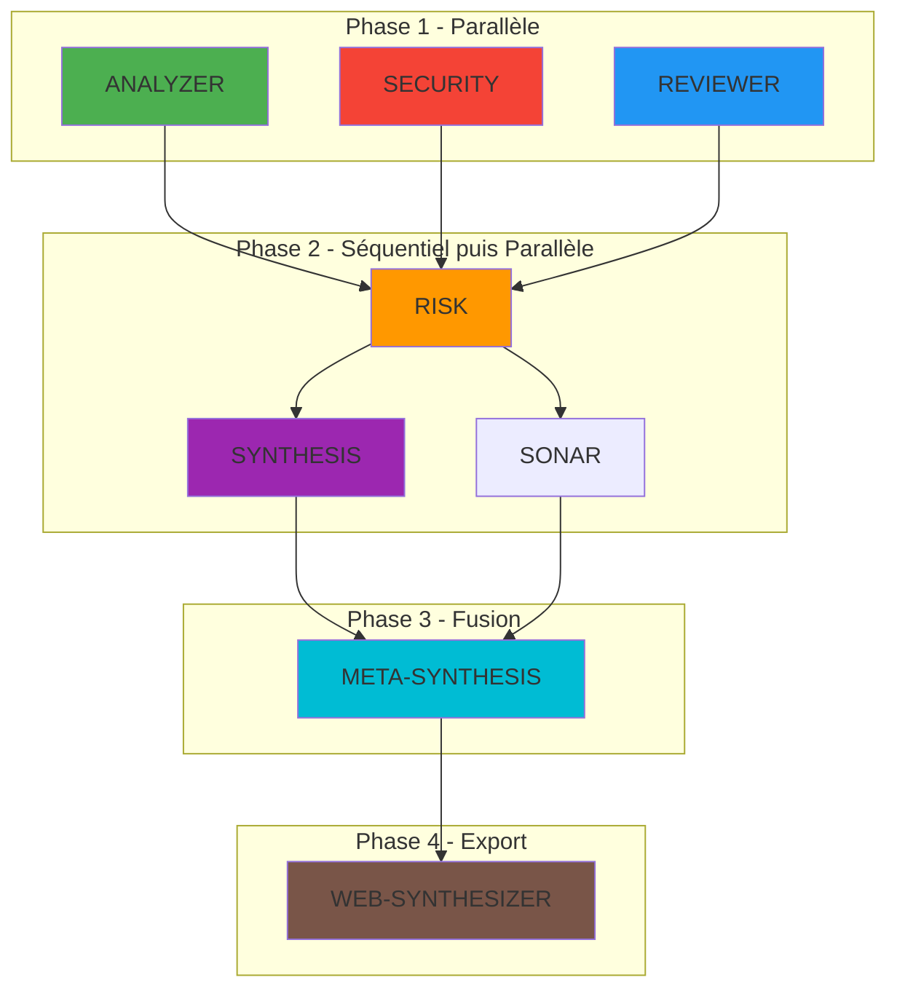

# Claude Code - Tooling d'Analyse

**Version:** 1.0.0
**Dernière mise à jour:** Décembre 2025

---

## Vue d'Ensemble

Le projet R-Type intègre un système complet d'analyse de code basé sur **Claude Code** avec :

- **8 agents spécialisés** pour l'analyse incrémentale
- **AgentDB** - Base SQLite pour le contexte du projet
- **MCP Servers** - Intégration Jira et AgentDB
- **Commande `/analyze`** - Analyse incrémentale intelligente

```
.claude/
├── agents/                 # 8 agents spécialisés
│   ├── analyzer.md        # Analyse d'impact
│   ├── security.md        # Audit sécurité
│   ├── reviewer.md        # Code review
│   ├── risk.md            # Évaluation des risques
│   ├── synthesis.md       # Synthèse des rapports
│   ├── sonar.md           # Enrichissement SonarQube
│   ├── meta-synthesis.md  # Fusion et dédoublonnage
│   └── web-synthesizer.md # Export JSON pour site web
├── agentdb/               # Base de données du projet
│   ├── db.sqlite          # Base SQLite
│   ├── schema.sql         # Schéma de la base
│   ├── crud.py            # Opérations CRUD
│   ├── queries.py         # Requêtes complexes
│   └── query.sh           # Interface shell
├── commands/              # Slash commands
│   └── analyze.md         # Commande /analyze
├── config/                # Configuration
│   └── agentdb.yaml       # Config AgentDB
├── mcp/                   # MCP Servers
│   ├── agentdb/           # Serveur AgentDB
│   └── jira/              # Serveur Jira
├── scripts/               # Scripts Python
│   ├── bootstrap.py       # Initialisation AgentDB
│   ├── update.py          # Mise à jour incrémentale
│   ├── transform-sonar.py # Transformation SonarQube
│   └── maintenance.py     # Maintenance base
├── reports/               # Rapports d'analyse
│   └── {date}-{commit}/   # Dossiers par analyse
├── sonar/                 # Données SonarQube
│   └── issues.json        # Issues exportées
├── logs/                  # Logs d'exécution
├── tests/                 # Tests Python
├── settings.json          # Config MCP servers
└── settings.local.json    # Overrides locaux
```

---

## Commande /analyze

La commande principale pour l'analyse de code. Elle orchestre les 8 agents et produit un rapport complet.

### Usage

```bash
# Analyse incrémentale depuis le dernier checkpoint
/analyze

# Analyse complète depuis le merge-base
/analyze --all

# Mettre le checkpoint à HEAD sans analyser
/analyze --reset

# Analyser des fichiers spécifiques
/analyze --files src/server/UDPServer.cpp src/client/Client.cpp

# Analyser un commit spécifique
/analyze abc123

# Analyser une plage de commits
/analyze abc123..def456
```

### Workflow d'Exécution



### Verdicts

| Score | Verdict | Emoji | Signification |
|-------|---------|-------|---------------|
| ≥80 | APPROVE | 🟢 | Peut être mergé |
| ≥60 | REVIEW | 🟡 | Review humaine recommandée |
| ≥40 | CAREFUL | 🟠 | Review approfondie requise |
| <40 | REJECT | 🔴 | Ne pas merger en l'état |

---

## Les 8 Agents

### Phase 1 - Analyse Parallèle

#### ANALYZER (analyzer.md)

**Mission:** Analyse l'impact des modifications sur le codebase.

**Requêtes AgentDB:**
- `file_context` - Contexte complet du fichier
- `symbol_callers` - Appelants d'une fonction
- `file_impact` - Impact sur les fichiers dépendants

**Output:** Impact LOCAL / MODULE / GLOBAL

#### SECURITY (security.md)

**Mission:** Audit de sécurité et détection de vulnérabilités.

**Requêtes AgentDB:**
- `error_history` - Historique des bugs
- `patterns` (category=security) - Patterns de sécurité

**Détecte:**
- Vulnérabilités CWE
- Régressions de bugs
- Fichiers sensibles modifiés

#### REVIEWER (reviewer.md)

**Mission:** Code review automatisée.

**Requêtes AgentDB:**
- `patterns` - Patterns du projet
- `file_metrics` - Métriques de complexité
- `architecture_decisions` - ADRs

**Vérifie:**
- Conventions de code
- Complexité cyclomatique
- Documentation

### Phase 2 - Évaluation et Synthèse

#### RISK (risk.md)

**Mission:** Calcule le score de risque global.

**Facteurs:**
- Criticité des fichiers modifiés
- Historique de bugs
- Complexité du code
- Couverture de tests
- Impact sur le projet

**Score:** 0-100 (100 = risque minimal)

#### SYNTHESIS (synthesis.md)

**Mission:** Synthétise les rapports des 4 premiers agents.

**Calcul du score global:**
```
Score = Security×0.35 + Risk×0.25 + Reviewer×0.25 + Analyzer×0.15
```

#### SONAR (sonar.md) - Optionnel

**Mission:** Enrichit les issues SonarQube avec le contexte AgentDB.

**Input:** `.claude/sonar/issues.json`
**Output:** `sonar-enriched.json` avec where/why/how

### Phase 3 - Fusion

#### META-SYNTHESIS (meta-synthesis.md)

**Mission:** Fusionne et dédoublonne SYNTHESIS + SONAR.

**Actions:**
1. Fusionne les issues des agents et SonarQube
2. Détecte les doublons (même fichier + ligne ±5)
3. Génère where/why/how pour chaque issue
4. Produit `meta-synthesis.json`

### Phase 4 - Export

#### WEB-SYNTHESIZER (web-synthesizer.md)

**Mission:** Transforme le rapport en JSON pour le site web.

**Output:** `reports/web-report-{date}-{commit}.json`

---

## AgentDB

Base de données SQLite contenant le contexte du projet pour les agents.

### Initialisation

```bash
# Bootstrap initial (indexe tout le projet)
python .claude/scripts/bootstrap.py

# Mise à jour incrémentale (uniquement les fichiers modifiés)
python .claude/scripts/bootstrap.py --incremental
```

### Données Indexées

| Table | Description |
|-------|-------------|
| `files` | Métadonnées des fichiers (module, criticité) |
| `symbols` | Fonctions, classes, variables |
| `dependencies` | Relations entre fichiers (includes, calls) |
| `error_history` | Historique des bugs et fixes |
| `patterns` | Patterns de code du projet |
| `architecture_decisions` | ADRs |
| `analysis_checkpoints` | Points de contrôle par branche |
| `pipeline_runs` | Historique des analyses |

### Requêtes Disponibles

```bash
# Contexte d'un fichier
bash .claude/agentdb/query.sh file_context "src/server/UDPServer.cpp"

# Appelants d'une fonction
bash .claude/agentdb/query.sh symbol_callers "handleReceive"

# Impact d'une modification
bash .claude/agentdb/query.sh file_impact "src/common/protocol/Protocol.hpp"

# Historique des erreurs
bash .claude/agentdb/query.sh error_history "src/server/" 90

# Patterns applicables
bash .claude/agentdb/query.sh patterns "src/server/UDPServer.cpp" "security"

# Checkpoint de branche
bash .claude/agentdb/query.sh get_checkpoint "feature/my-branch"

# Lister les analyses
bash .claude/agentdb/query.sh list_pipeline_runs
```

### Configuration (agentdb.yaml)

```yaml
project:
  name: "rtype"
  language: "cpp"
  root: "."

indexing:
  extensions:
    cpp: [".cpp", ".hpp", ".h"]
  exclude:
    - "build/**"
    - "third_party/**"

criticality:
  critical_paths:
    - "**/security/**"
    - "**/auth/**"
    - "**/main.*"

metrics:
  complexity:
    high: 20
    critical: 30

analysis:
  verdicts:
    approve: 80
    review: 60
    careful: 40
```

---

## MCP Servers

### AgentDB MCP

Serveur MCP pour exposer AgentDB aux agents Claude.

**Configuration (settings.json):**
```json
{
  "mcpServers": {
    "agentdb": {
      "command": "python",
      "args": ["-m", "mcp.agentdb.server"],
      "cwd": "${workspaceFolder}/.claude",
      "env": {
        "AGENTDB_PATH": "${workspaceFolder}/.claude/agentdb/db.sqlite"
      }
    }
  }
}
```

**Outils exposés:**
- `get_file_context` - Contexte complet d'un fichier
- `get_symbol_callers` - Appelants d'un symbole
- `get_symbol_callees` - Fonctions appelées
- `get_file_impact` - Impact d'une modification
- `get_error_history` - Historique des erreurs
- `get_patterns` - Patterns applicables
- `get_architecture_decisions` - ADRs
- `search_symbols` - Recherche de symboles
- `get_file_metrics` - Métriques d'un fichier
- `get_module_summary` - Résumé d'un module

### Jira MCP

Serveur MCP pour l'intégration Jira.

**Outils exposés:**
- `get_issue` - Récupérer un ticket
- `search_issues` - Recherche JQL
- `get_issue_from_text` - Extraire tickets d'un texte
- `get_project_info` - Info projet

---

## Rapports d'Analyse

### Structure des Rapports

```
.claude/reports/{date}-{commit}/
├── analyzer.md              # Rapport ANALYZER
├── security.md              # Rapport SECURITY
├── reviewer.md              # Rapport REVIEWER
├── risk.md                  # Rapport RISK
├── REPORT.md                # Rapport SYNTHESIS (principal)
├── sonar.md                 # Issues SonarQube (markdown)
├── sonar-issues.json        # Issues SonarQube (JSON)
├── sonar-enriched.md        # Issues enrichies (markdown)
├── sonar-enriched.json      # Issues enrichies (JSON)
├── meta-synthesis.json      # Rapport fusionné
└── meta-synthesis-report.md # Rapport fusionné (lisible)
```

### Exemple de Verdict

```
╔═══════════════════════════════════════════════════════════════╗
║                                                               ║
║     VERDICT: 🟢 APPROVE                                       ║
║                                                               ║
║     Score global: 85/100                                      ║
║                                                               ║
║     Les modifications sont conformes aux standards.           ║
║     Aucun problème de sécurité détecté.                       ║
║                                                               ║
╠═══════════════════════════════════════════════════════════════╣
║                                                               ║
║     Checkpoint mis à jour : abc1234                           ║
║     Prochaine /analyze partira de ce point.                   ║
║                                                               ║
╚═══════════════════════════════════════════════════════════════╝

Rapport complet : .claude/reports/2025-12-15-abc1234/REPORT.md
```

---

## Intégration SonarQube

### Export des Issues

1. Exporter les issues depuis SonarQube (JSON)
2. Placer dans `.claude/sonar/issues.json`

### Transformation Automatique

Le script `transform-sonar.py` filtre les issues :
- Par fichiers du diff
- Par date (depuis le checkpoint)

```bash
python .claude/scripts/transform-sonar.py \
    .claude/sonar/issues.json \
    --files "src/server/UDPServer.cpp,src/client/Client.cpp" \
    --since "2025-12-10T14:32:15+01:00" \
    --output ".claude/reports/2025-12-15-abc1234/sonar.md"
```

---

## Scripts de Maintenance

### bootstrap.py

```bash
# Initialisation complète
python .claude/scripts/bootstrap.py

# Mise à jour incrémentale
python .claude/scripts/bootstrap.py --incremental

# Forcer la réindexation
python .claude/scripts/bootstrap.py --force
```

### maintenance.py

```bash
# Nettoyer les anciens rapports (>30 jours)
python .claude/scripts/maintenance.py --cleanup-reports

# Vacuum de la base
python .claude/scripts/maintenance.py --vacuum

# Stats de la base
python .claude/scripts/maintenance.py --stats
```

### import-bug-history.py

```bash
# Importer l'historique des bugs depuis git
python .claude/scripts/import-bug-history.py --since "2024-01-01"
```

---

## Développement

### Tests

```bash
# Lancer les tests AgentDB
cd .claude && python -m pytest tests/ -v

# Test spécifique
python -m pytest tests/test_crud.py -v
```

### Logs

Les logs sont dans `.claude/logs/`:
- `bootstrap.log` - Logs d'initialisation
- `agentdb_queries.log` - Requêtes AgentDB

### Debug

```bash
# Activer le mode debug
export AGENTDB_LOG_LEVEL=DEBUG

# Requête avec debug
bash .claude/agentdb/query.sh file_context "src/server/main.cpp"
```

---

## Migration depuis Army2077

L'ancien système "Army2077" (docs/hive/) est remplacé par ce nouveau système d'agents.

| Army2077 (ancien) | Claude Code (nouveau) |
|-------------------|----------------------|
| Général | Orchestration via /analyze |
| Commandant Docs | - (docs séparées) |
| Commandant Git | - (git séparé) |
| Commandant Qualité | REVIEWER + ANALYZER |
| Commandant Sécurité | SECURITY |
| Soldat Architecte | ANALYZER |
| Soldat Code Review | REVIEWER |
| Soldat Mentor | - (apprentissage séparé) |

---

## Références

- [AgentDB Schema](.claude/agentdb/schema.sql)
- [Configuration AgentDB](.claude/config/agentdb.yaml)
- [Commande /analyze](.claude/commands/analyze.md)
- [MCP Agentdb](.claude/mcp/agentdb/)
- [MCP Jira](.claude/mcp/jira/)

---

*Dernière mise à jour: Décembre 2025 | Version 1.0.0*
