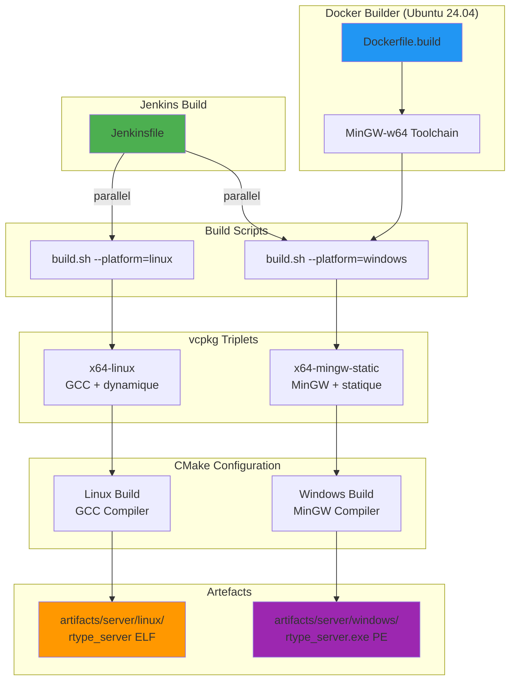

# Cross-Compilation Windows avec MinGW

**Dernière mise à jour:** 18 janvier 2025
**Version:** 1.0.0

---

## 📋 Vue d'Ensemble

Le projet R-Type supporte la cross-compilation des binaires Windows depuis un environnement Linux grâce à MinGW-w64. Cette approche permet de compiler des exécutables Windows (.exe) sans avoir besoin d'un agent Jenkins Windows.

### Plateformes Supportées

| Plateforme | Triplet vcpkg | Architecture | Linking | Statut |
|------------|---------------|--------------|---------|--------|
| **Linux** | `x64-linux` | x86_64 | Dynamique | ✅ Production |
| **Windows** | `x64-mingw-static` | x86_64 | Statique | ✅ Production |
| **macOS** | `x64-osx` | x86_64 | Dynamique | 📋 Planifié |

---

## 🎯 Pourquoi Cross-Compiler ?

### Avantages

✅ **Infrastructure simplifiée** - Pas besoin d'agent Windows séparé
✅ **Builds reproductibles** - Même environnement Docker pour toutes les plateformes
✅ **Pipeline unifié** - Un seul Jenkinsfile pour Linux + Windows
✅ **Binaires autonomes** - Exécutables statiques sans DLL externes
✅ **Coût réduit** - Pas de licence Windows Server pour CI/CD

### Inconvénients

⚠️ **Pas de tests natifs** - Les binaires Windows ne peuvent pas être testés sur Linux (Wine possible mais limité)
⚠️ **Compatibilité MinGW** - Quelques différences mineures vs MSVC (mais rare avec C++23 standard)
⚠️ **Taille des binaires** - Linking statique = exécutables plus gros (~80MB vs ~52MB)

---

## 🏗️ Architecture de Cross-Compilation



---

## 🔧 Configuration MinGW

### Dockerfile - Outils Cross-Compilation

Le Dockerfile `ci_cd/docker/Dockerfile.build` installe MinGW-w64 :

```dockerfile
RUN apt-get update && apt-get install -y \
    # ... autres dépendances ...
    # Cross-compilation tools for Windows
    mingw-w64 \
    g++-mingw-w64-x86-64 \
    gcc-mingw-w64-x86-64 \
    binutils-mingw-w64-x86-64 \
    wine64  # Optionnel: pour tester les binaires
```

**Outils installés:**
- `x86_64-w64-mingw32-gcc` - Compilateur C pour Windows
- `x86_64-w64-mingw32-g++` - Compilateur C++ pour Windows
- `x86_64-w64-mingw32-ar` - Archiver pour librairies statiques
- `x86_64-w64-mingw32-windres` - Compilateur de ressources Windows

### Triplet vcpkg Personnalisé

**Fichier:** `triplets/x64-mingw-static.cmake`

```cmake
set(VCPKG_TARGET_ARCHITECTURE x64)
set(VCPKG_CRT_LINKAGE static)       # Runtime C statique
set(VCPKG_LIBRARY_LINKAGE static)   # Toutes les libs en statique

set(VCPKG_CMAKE_SYSTEM_NAME MinGW)
set(VCPKG_CHAINLOAD_TOOLCHAIN_FILE
    ${CMAKE_CURRENT_LIST_DIR}/toolchains/mingw-w64-x86_64.cmake)

# Flags pour linking complet statique
set(VCPKG_CXX_FLAGS "-static -static-libgcc -static-libstdc++")
set(VCPKG_C_FLAGS "-static -static-libgcc")
set(VCPKG_LINKER_FLAGS "-static -static-libgcc -static-libstdc++")
```

**Pourquoi statique?**
Les binaires statiques n'ont pas besoin de DLLs externes (Boost, MongoDB, OpenSSL...), ce qui simplifie le déploiement sur Windows.

### Toolchain CMake MinGW

**Fichier:** `triplets/toolchains/mingw-w64-x86_64.cmake`

```cmake
set(CMAKE_SYSTEM_NAME Windows)
set(CMAKE_SYSTEM_PROCESSOR x86_64)

# Compilateurs MinGW
set(CMAKE_C_COMPILER /usr/bin/x86_64-w64-mingw32-gcc)
set(CMAKE_CXX_COMPILER /usr/bin/x86_64-w64-mingw32-g++)
set(CMAKE_RC_COMPILER /usr/bin/x86_64-w64-mingw32-windres)
set(CMAKE_AR /usr/bin/x86_64-w64-mingw32-ar)
set(CMAKE_RANLIB /usr/bin/x86_64-w64-mingw32-ranlib)

# Chemins de recherche
set(CMAKE_FIND_ROOT_PATH /usr/x86_64-w64-mingw32)
set(CMAKE_FIND_ROOT_PATH_MODE_PROGRAM NEVER)
set(CMAKE_FIND_ROOT_PATH_MODE_LIBRARY ONLY)
set(CMAKE_FIND_ROOT_PATH_MODE_INCLUDE ONLY)

# Flags statiques
set(CMAKE_CXX_FLAGS_INIT "-static -static-libgcc -static-libstdc++")
set(CMAKE_C_FLAGS_INIT "-static -static-libgcc")
```

---

## 🛠️ Utilisation en Local

### Compilation Linux (Native)

```bash
# Build standard Linux
./scripts/build.sh

# Résultat
artifacts/server/linux/rtype_server
```

### Compilation Windows (Cross-compilation)

```bash
# Build cross-compilé pour Windows
./scripts/build.sh --platform=windows

# Résultat
artifacts/server/windows/rtype_server.exe
```

**Note:** La compilation Windows prend plus de temps car vcpkg doit recompiler toutes les dépendances avec MinGW.

### Vérification du Binaire Windows

```bash
# Vérifier le type de fichier
file artifacts/server/windows/rtype_server.exe

# Sortie attendue:
# PE32+ executable (console) x86-64, for MS Windows

# Vérifier les dépendances (doit être vide = statique)
x86_64-w64-mingw32-objdump -p artifacts/server/windows/rtype_server.exe | grep "DLL Name"

# Sortie attendue: uniquement DLLs système Windows
# kernel32.dll, ntdll.dll, user32.dll, etc.
```

### Tester avec Wine (Optionnel)

```bash
# Installer Wine si nécessaire
sudo apt install wine64

# Lancer le binaire Windows sous Wine
wine64 artifacts/server/windows/rtype_server.exe

# Note: Peut ne pas fonctionner parfaitement (réseau, etc.)
```

---

## 🚀 Pipeline Jenkins

### Build Matrix Parallèle

Le Jenkinsfile compile Linux et Windows en parallèle :

```groovy
stage('🏗️ Build Matrix (Linux + Windows)') {
    parallel {
        stage('🐧 Linux Build') {
            stages {
                stage('🔨 Build Linux') {
                    // ./scripts/build.sh (défaut = linux)
                }
                stage('🔧 Compile Linux') {
                    // ./scripts/compile.sh
                }
            }
        }

        stage('🪟 Windows Build (cross-compilation)') {
            stages {
                stage('🔨 Build Windows') {
                    // ./scripts/build.sh --platform=windows
                }
                stage('🔧 Compile Windows') {
                    // ./scripts/compile.sh
                }
            }
        }
    }
}
```

### Artefacts Produits

Après le build Jenkins :

```
artifacts/
├── build_123/  # Workspace Jenkins
│   ├── linux/
│   │   ├── rtype_server       (ELF 64-bit, ~52MB)
│   │   └── server_tests
│   └── windows/
│       ├── rtype_server.exe   (PE32+, ~80MB)
│       └── server_tests.exe
```

---

## 📝 CMake Configuration

### Détection Automatique de Plateforme

**Fichier:** `CMakeLists.txt` (ligne 18-27)

```cmake
# Détecter la plateforme cible pour les artefacts
if(CMAKE_SYSTEM_NAME STREQUAL "Windows")
    set(PLATFORM_DIR "windows")
elseif(CMAKE_SYSTEM_NAME STREQUAL "Darwin")
    set(PLATFORM_DIR "macos")
else()
    set(PLATFORM_DIR "linux")
endif()

message(STATUS "Building for: ${CMAKE_SYSTEM_NAME} -> artifacts/server/${PLATFORM_DIR}")

set(CMAKE_RUNTIME_OUTPUT_DIRECTORY
    ${CMAKE_CURRENT_SOURCE_DIR}/artifacts/server/${PLATFORM_DIR})
```

### Sanitizers Conditionnels

**Fichier:** `src/server/CMakeLists.txt` (ligne 55-71)

```cmake
if (CMAKE_BUILD_TYPE STREQUAL "Debug")
    target_compile_options(rtype_server PRIVATE
        -O0 -g3 -Wall -Wextra -Wpedantic
        -fno-omit-frame-pointer
    )

    # Sanitizers: uniquement pour builds natifs (pas MinGW)
    if(NOT CMAKE_CROSSCOMPILING AND NOT MINGW)
        target_compile_options(rtype_server PRIVATE
            -fsanitize=address
            -fsanitize=undefined
            -fsanitize=leak
        )
        target_link_options(rtype_server PRIVATE
            -fsanitize=address -fsanitize=undefined -fsanitize=leak
            -static-libasan
        )
        message(STATUS "Sanitizers activés (build natif)")
    else()
        message(STATUS "Sanitizers désactivés (cross-compilation)")
    endif()
endif()
```

**Pourquoi désactiver les sanitizers?**
Les sanitizers (Address Sanitizer, etc.) ne fonctionnent pas correctement avec MinGW cross-compilation.

---

## 🐛 Dépannage

### Erreur: "x86_64-w64-mingw32-g++ not found"

**Cause:** MinGW non installé dans le Docker builder

**Solution:**
```bash
# Rebuild l'image Docker
docker-compose -f ci_cd/docker/docker-compose.yml build builder
docker-compose -f ci_cd/docker/docker-compose.yml up -d builder
```

### Erreur vcpkg: "triplet x64-mingw-static not found"

**Cause:** Triplet personnalisé non copié dans vcpkg

**Solution:**
```bash
# Copier le triplet manuellement
cp triplets/x64-mingw-static.cmake third_party/vcpkg/triplets/

# Ou utiliser --overlay-triplets avec CMake
cmake -S . -B build \
    -DVCPKG_OVERLAY_TRIPLETS=triplets \
    -DVCPKG_TARGET_TRIPLET=x64-mingw-static \
    ...
```

### Build Windows très lent (>30 minutes)

**Cause:** vcpkg recompile toutes les dépendances pour MinGW

**Solution:**
- **Première compilation:** Normal, vcpkg build Boost, MongoDB, etc. (~30-60 min)
- **Compilations suivantes:** Plus rapides, vcpkg cache les binaires (~5-10 min)

**Astuce:** Conserver le cache vcpkg entre builds Jenkins :
```bash
# Dans le Dockerfile ou volume Docker
VOLUME /workspace/third_party/vcpkg/buildtrees
VOLUME /workspace/third_party/vcpkg/packages
```

### Binaire Windows trop gros (>100MB)

**Cause:** Linking statique inclut toutes les librairies

**Solution:**
1. **Strip les symboles de debug:**
   ```bash
   x86_64-w64-mingw32-strip artifacts/server/windows/rtype_server.exe
   # Réduit de ~80MB à ~15MB
   ```

2. **Build Release au lieu de Debug:**
   ```bash
   ./scripts/build.sh --platform=windows
   # Modifier CMAKE_BUILD_TYPE=Release dans build.sh
   ```

### Erreur: "undefined reference to `__imp_WSAStartup'"

**Cause:** Librairies Windows socket manquantes

**Solution:** Ajouter dans `src/server/CMakeLists.txt`:
```cmake
if(WIN32)
    target_link_libraries(rtype_server PRIVATE
        ws2_32  # Winsock 2
        wsock32 # Winsock 1
        iphlpapi # IP Helper API
    )
endif()
```

---

## ✅ Checklist de Validation

Avant de merger un changement affectant la cross-compilation :

- [ ] **Build Linux compile** (`./scripts/build.sh`)
- [ ] **Build Windows compile** (`./scripts/build.sh --platform=windows`)
- [ ] **Binaires produits** dans `artifacts/server/linux/` et `artifacts/server/windows/`
- [ ] **Binaire Windows est PE32+** (`file rtype_server.exe`)
- [ ] **Binaire Linux est ELF 64-bit** (`file rtype_server`)
- [ ] **Jenkins pipeline OK** (tests sur CI)
- [ ] **Artefacts archivés** dans Jenkins

---

## 📚 Ressources

### Documentation Externe

- **[MinGW-w64](https://www.mingw-w64.org/)** - Compilateur GCC pour Windows
- **[vcpkg Triplets](https://learn.microsoft.com/en-us/vcpkg/users/triplets)** - Documentation triplets
- **[CMake Cross-Compiling](https://cmake.org/cmake/help/latest/manual/cmake-toolchains.7.html)** - Toolchains CMake

### Documentation Projet

- **[Architecture](../guides/architecture.md)** - Architecture globale
- **[Building](../getting-started/building.md)** - Guide de compilation
- **[CI/CD Jenkins](ci-cd.md)** - Pipeline Jenkins
- **[API Builder](jenkins-builder-api.md)** - API Python du builder

---

## 🔮 Évolutions Futures

### Support macOS

```bash
# À implémenter
./scripts/build.sh --platform=macos
```

**Prérequis:**
- Toolchain Clang pour macOS (osxcross)
- Triplet `x64-osx` vcpkg
- Agent Jenkins macOS (pour tests natifs)

### Build Release Optimisé

```bash
# Binaires de production optimisés
./scripts/build.sh --platform=windows --config=Release
```

**Optimisations:**
- `-O3` au lieu de `-O0`
- Strip automatique des symboles
- Link-Time Optimization (LTO)
- Taille binaire réduite (~15MB)

### Tests Automatisés Windows

```bash
# Avec Wine dans le pipeline
wine64 artifacts/server/windows/rtype_server.exe --run-tests
```

**Limitations Wine:**
- Réseau peut ne pas fonctionner
- Performances réduites
- Bugs potentiels spécifiques à Wine

---

**Dernière révision:** 18/01/2025
**Auteur:** Documentation Agent + Équipe R-Type 🚀
**Statut:** ✅ Production-ready
