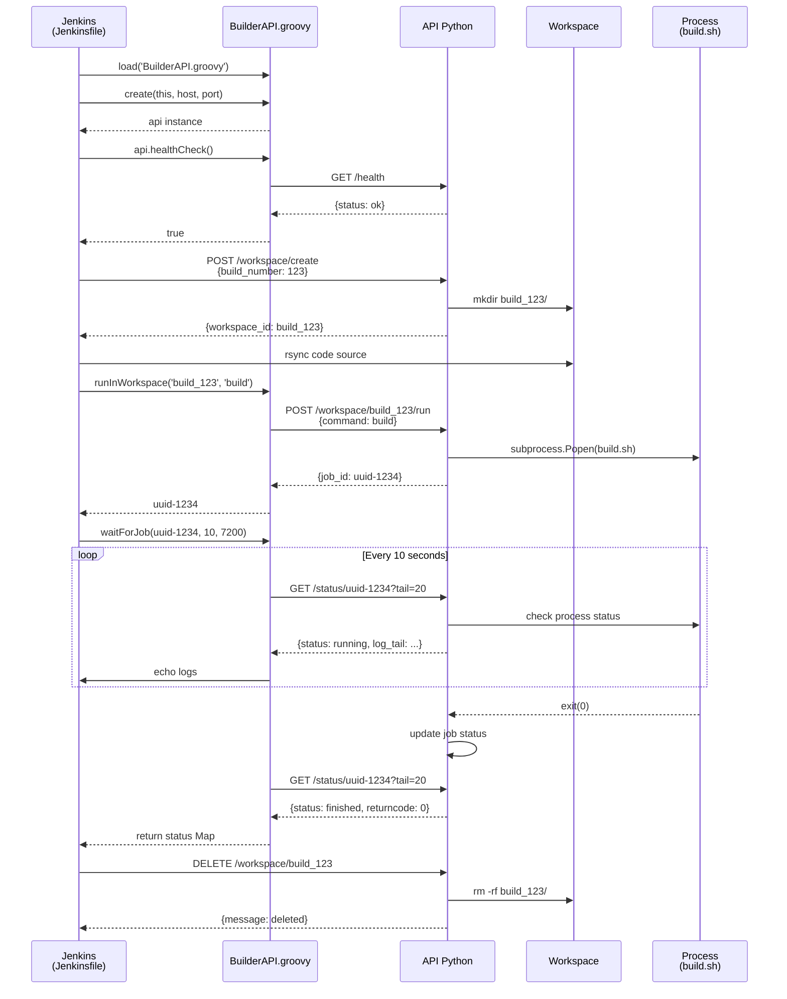

# API Builder - Référence Technique

## Vue d'ensemble

L'API Builder est un serveur HTTP Python qui s'exécute dans le conteneur `rtype_builder`. Elle fournit une interface REST pour orchestrer les builds de manière asynchrone et gérer les workspaces isolés.

### Architecture de l'API

```mermaid
graph TB
    subgraph API["Builder API (Python)"]
        HTTP[HTTPServer ThreadingMixIn]
        HANDLER[RequestHandler]

        subgraph Jobs["Jobs Manager"]
            JOBS_DICT[jobs: dict<uuid, JobInfo>]
            JOBS_LOCK[jobs_lock: threading.Lock]
        end

        subgraph Workspaces["Workspaces Manager"]
            WS_DICT[workspaces: dict<id, WorkspaceInfo>]
            WS_LOCK[workspaces_lock: threading.Lock]
        end

        HTTP --> HANDLER
        HANDLER --> Jobs
        HANDLER --> Workspaces
    end

    subgraph Execution["Execution Asynchrone"]
        THREAD1[Thread Job 1]
        THREAD2[Thread Job 2]
        THREAD3[Thread Job 3]

        PROC1[subprocess.Popen<br/>build.sh]
        PROC2[subprocess.Popen<br/>compile.sh]
        PROC3[subprocess.Popen<br/>build.sh]

        THREAD1 --> PROC1
        THREAD2 --> PROC2
        THREAD3 --> PROC3
    end

    HANDLER -->|Lance| Execution

    subgraph Storage["Stockage"]
        LOGS[/workspace/builds/build_N/artifacts/<br/>uuid-1234.log]
    end

    Execution -->|Écrit| LOGS

    style API fill:#2a5298,color:#fff
    style Jobs fill:#4a90a4,color:#fff
    style Workspaces fill:#4a90a4,color:#fff
    style Execution fill:#5cb85c,color:#fff
    style Storage fill:#f0ad4e,color:#fff
```

### Caractéristiques clés

- **Thread-safe** : utilisation de locks pour gérer les accès concurrent aux jobs et workspaces
- **Asynchrone** : les jobs sont exécutés dans des threads séparés, l'API retourne immédiatement
- **Sans timeout** : les jobs peuvent s'exécuter indéfiniment (utile pour vcpkg qui peut prendre 30+ minutes)
- **Logs persistants** : chaque job écrit ses logs dans un fichier dédié
- **Multi-workspace** : support de plusieurs workspaces isolés en parallèle

## Endpoints API

### GET /health

Vérification de la disponibilité de l'API.

**URL** : `http://rtype_builder:8082/health`

**Méthode** : `GET`

**Paramètres** : Aucun

**Réponse** :

```json
{
  "status": "ok",
  "allowed_commands": ["build", "compile"]
}
```

**Codes de retour** :
- `200 OK` : API opérationnelle

**Exemple d'utilisation** :

```bash
curl http://rtype_builder:8082/health
```

```groovy
// Depuis Jenkins (BuilderAPI.groovy)
def api = new BuilderAPI(this, 'rtype_builder', 8082)
if (api.healthCheck()) {
    echo "Builder opérationnel"
}
```

**Cas d'usage** :
- Vérifier que le builder est lancé avant de démarrer un build
- Health check Jenkins avec retry automatique
- Monitoring de l'état du builder

---

### POST /workspace/create

Création d'un nouveau workspace isolé pour un build.

**URL** : `http://rtype_builder:8082/workspace/create`

**Méthode** : `POST`

**Headers** :
- `Content-Type: application/json`

**Body** :
```json
{
  "build_number": 123
}
```

**Paramètres** :
- `build_number` (integer, requis) : Numéro du build Jenkins

**Réponse** :

```json
{
  "workspace_id": "build_123",
  "workspace_path": "/workspace/builds/build_123"
}
```

**Codes de retour** :
- `200 OK` : Workspace créé avec succès
- `400 Bad Request` : `build_number` manquant ou invalide
- `500 Internal Server Error` : Erreur lors de la création

**Exemple d'utilisation** :

```bash
curl -X POST http://rtype_builder:8082/workspace/create \
    -H 'Content-Type: application/json' \
    -d '{"build_number": 123}'
```

```groovy
// Depuis Jenkins
def createResponse = sh(
    script: """
        curl -s -f -X POST http://rtype_builder:8082/workspace/create \
            -H 'Content-Type: application/json' \
            -d '{"build_number": ${env.BUILD_NUMBER}}'
    """,
    returnStdout: true
).trim()

def workspace = readJSON(text: createResponse)
echo "Workspace créé: ${workspace.workspace_id}"
```

**Ce qui est créé** :
```
/workspace/builds/build_123/
└── artifacts/              # Dossier pour les logs de jobs
```

**Idempotence** : Appeler plusieurs fois avec le même `build_number` ne crée pas plusieurs workspaces (grâce à `makedirs(..., exist_ok=True)`).

---

### POST /workspace/{workspace_id}/run

Lancement d'un job (build ou compile) dans un workspace spécifique.

**URL** : `http://rtype_builder:8082/workspace/{workspace_id}/run`

**Méthode** : `POST`

**Headers** :
- `Content-Type: application/json`

**URL Parameters** :
- `workspace_id` (string) : Identifiant du workspace (ex: `build_123`)

**Body** :
```json
{
  "command": "build"
}
```

**Paramètres** :
- `command` (string, requis) : Commande à exécuter (`build` ou `compile`)

**Réponse** :

```json
{
  "job_id": "550e8400-e29b-41d4-a716-446655440000"
}
```

**Codes de retour** :
- `200 OK` : Job soumis avec succès
- `400 Bad Request` : Commande invalide ou manquante
- `404 Not Found` : Workspace inexistant
- `500 Internal Server Error` : Erreur lors du lancement

**Exemple d'utilisation** :

```bash
# Lancer le build
curl -X POST http://rtype_builder:8082/workspace/build_123/run \
    -H 'Content-Type: application/json' \
    -d '{"command": "build"}'

# Réponse
{"job_id": "a1b2c3d4-e5f6-7890-abcd-ef1234567890"}
```

```groovy
// Depuis Jenkins (via BuilderAPI.groovy)
def api = new BuilderAPI(this, 'rtype_builder', 8082)
def jobId = api.runInWorkspace('build_123', 'build')
echo "Job lancé: ${jobId}"
```

**Scripts exécutés** :
- `command: "build"` → `/workspace/scripts/build.sh` (CMake + vcpkg)
- `command: "compile"` → `/workspace/scripts/compile.sh` (compilation C++)

**Working directory** : Le script s'exécute dans le workspace (`/workspace/builds/build_123/`), pas dans `/workspace/`.

**Logs** : Écrits dans `/workspace/builds/build_123/artifacts/{job_id}.log`

**Exécution asynchrone** : L'API retourne immédiatement après avoir lancé le subprocess. Le job continue de s'exécuter en arrière-plan.

---

### GET /status/{job_id}

Récupération du statut et des logs d'un job.

**URL** : `http://rtype_builder:8082/status/{job_id}`

**Méthode** : `GET`

**URL Parameters** :
- `job_id` (uuid) : Identifiant unique du job

**Query Parameters** :
- `tail` (integer, optionnel) : Nombre de dernières lignes de log à retourner

**Réponse** :

```json
{
  "workspace_id": "build_123",
  "status": "finished",
  "command": "build",
  "pid": 1234,
  "started_at": 1700000000.0,
  "finished_at": 1700001000.0,
  "returncode": 0,
  "log_tail": "..."
}
```

**Champs de réponse** :
- `workspace_id` (string) : ID du workspace dans lequel le job s'exécute
- `status` (string) : État du job
  - `queued` : Job créé mais pas encore démarré
  - `running` : Job en cours d'exécution
  - `finished` : Job terminé (vérifier `returncode`)
- `command` (string) : Commande exécutée (`build` ou `compile`)
- `pid` (integer|null) : PID du processus (null si pas encore démarré)
- `started_at` (float|null) : Timestamp de démarrage (epoch)
- `finished_at` (float|null) : Timestamp de fin (epoch)
- `returncode` (integer|null) : Code de retour du script (0 = succès, ≠0 = échec)
- `log_tail` (string|null) : N dernières lignes de log (si paramètre `tail` fourni)

**Codes de retour** :
- `200 OK` : Statut récupéré avec succès
- `404 Not Found` : Job inexistant

**Exemples d'utilisation** :

```bash
# Statut simple
curl http://rtype_builder:8082/status/550e8400-e29b-41d4-a716-446655440000

# Avec les 50 dernières lignes de log
curl "http://rtype_builder:8082/status/550e8400-e29b-41d4-a716-446655440000?tail=50"
```

```groovy
// Depuis Jenkins (via BuilderAPI.groovy)
def api = new BuilderAPI(this, 'rtype_builder', 8082)
def status = api.getStatus(jobId, 20)  // 20 dernières lignes

echo "Status: ${status.status}"
echo "Returncode: ${status.returncode}"
if (status.log_tail) {
    echo "Logs:\n${status.log_tail}"
}
```

**Polling pattern** : Appelé en boucle avec un intervalle (ex: 10s) pour suivre la progression d'un job.

**Performance** : La lecture des logs avec `tail` lit le fichier complet puis extrait les N dernières lignes. Pour des logs très volumineux (>100 MB), préférer `tail=100` plutôt que `tail=10000`.

---

### DELETE /workspace/{workspace_id}

Suppression d'un workspace et de tous ses fichiers.

**URL** : `http://rtype_builder:8082/workspace/{workspace_id}`

**Méthode** : `DELETE`

**URL Parameters** :
- `workspace_id` (string) : Identifiant du workspace à supprimer

**Réponse** :

```json
{
  "message": "workspace deleted"
}
```

**Codes de retour** :
- `200 OK` : Workspace supprimé avec succès
- `404 Not Found` : Workspace inexistant

**Exemple d'utilisation** :

```bash
curl -X DELETE http://rtype_builder:8082/workspace/build_123
```

```groovy
// Depuis Jenkins (dans le bloc post)
post {
    always {
        sh """
            curl -s -X DELETE \
                http://rtype_builder:8082/workspace/${env.WORKSPACE_ID} || true
        """
    }
}
```

**Comportement** :
- Supprime le dictionnaire en mémoire (`workspaces[workspace_id]`)
- Supprime le répertoire physique (`rm -rf /workspace/builds/build_123`)
- Les jobs associés restent en mémoire (pour consultation des logs) mais ne peuvent plus être relancés

**Sécurité** : La suppression utilise `shutil.rmtree()` qui peut échouer si des process sont encore en cours d'exécution dans le workspace. Assurez-vous que tous les jobs sont terminés avant de supprimer.

---

### POST /run (Legacy)

Soumission d'un job dans le workspace racine (méthode héritée, déconseillée).

**URL** : `http://rtype_builder:8082/run`

**Méthode** : `POST`

**Headers** :
- `Content-Type: application/json`

**Body** :
```json
{
  "command": "build"
}
```

**Réponse** : Identique à `/workspace/{id}/run`

!!! warning "Méthode legacy"
    Cette méthode exécute le job directement dans `/workspace/` sans isolation. Elle est conservée pour compatibilité ascendante mais **ne doit plus être utilisée**. Préférez toujours `/workspace/{id}/run` pour bénéficier de l'isolation.

**Différences avec `/workspace/{id}/run`** :
- Working directory : `/workspace/` (racine)
- Logs : `/workspace/artifacts/builder_jobs/{job_id}.log`
- Pas de workspace_id dans la réponse de statut

**Cas d'usage** : Tests manuels rapides ou scripts de migration.

---

## BuilderAPI.groovy - Helper Groovy

### Vue d'ensemble

`BuilderAPI.groovy` est une classe helper qui simplifie l'interaction avec l'API Python depuis Jenkins. Elle encapsule les appels HTTP et fournit des méthodes de haut niveau.

### Instanciation

```groovy
// Charger le fichier
def builderAPI = load('ci_cd/jenkins/BuilderAPI.groovy')

// Créer une instance
def api = builderAPI.create(this, 'rtype_builder', 8082)
// Paramètres: (script context, host, port)
```

**Paramètres** :
- `script` (object) : Contexte Jenkins (`this` dans un pipeline)
- `host` (string) : Nom d'hôte du builder (défaut: `localhost`)
- `port` (integer) : Port de l'API (défaut: `8082`)

### Méthodes disponibles

#### healthCheck()

Vérifie la disponibilité de l'API.

```groovy
boolean healthCheck()
```

**Retour** : `true` si l'API répond avec `status: ok`, `false` sinon.

**Exemple** :
```groovy
if (!api.healthCheck()) {
    error("Builder non accessible")
}
```

**Utilisation** : Au début du pipeline pour s'assurer que le builder est opérationnel.

---

#### runInWorkspace()

Soumet un job dans un workspace spécifique.

```groovy
String runInWorkspace(String workspaceId, String command)
```

**Paramètres** :
- `workspaceId` (string) : ID du workspace (ex: `build_123`)
- `command` (string) : Commande à exécuter (`build` ou `compile`)

**Retour** : UUID du job créé

**Exemple** :
```groovy
def jobId = api.runInWorkspace('build_123', 'build')
echo "Job lancé: ${jobId}"
```

**Exceptions** : Appelle `error()` si la soumission échoue (curl -f).

---

#### getStatus()

Récupère le statut d'un job.

```groovy
Map getStatus(String jobId, Integer tailLines = null)
```

**Paramètres** :
- `jobId` (string) : UUID du job
- `tailLines` (integer, optionnel) : Nombre de lignes de log à récupérer

**Retour** : Map contenant le statut du job (voir structure dans la section API)

**Exemple** :
```groovy
def status = api.getStatus(jobId, 50)
echo "Status: ${status.status}"
echo "Returncode: ${status.returncode}"
echo "Logs:\n${status.log_tail}"
```

---

#### waitForJob()

Attend la complétion d'un job avec polling.

```groovy
Map waitForJob(String jobId, int pollInterval = 10, int maxWaitTime = 7200)
```

**Paramètres** :
- `jobId` (string) : UUID du job
- `pollInterval` (integer) : Intervalle de polling en secondes (défaut: 10)
- `maxWaitTime` (integer) : Timeout en secondes (défaut: 7200 = 2h)

**Retour** : Map du statut final du job

**Comportement** :
- Boucle de polling toutes les `pollInterval` secondes
- Affiche le statut et les logs (20 dernières lignes) à chaque itération
- S'arrête si `status == 'finished'`
- Appelle `error()` si `returncode != 0` ou si timeout atteint

**Exemple** :
```groovy
def jobId = api.runInWorkspace('build_123', 'compile')
def result = api.waitForJob(jobId, 10, 7200)
echo "Compilation terminée avec returncode: ${result.returncode}"
```

**Logs affichés** :
```
📊 Status: running | Command: compile
📋 Dernières lignes du log:
[ 45%] Building CXX object src/CMakeFiles/rtype.dir/main.cpp.o
[ 50%] Building CXX object src/CMakeFiles/rtype.dir/game.cpp.o
...
✅ Job terminé avec succès
```

---

#### submitJob() (Legacy)

Soumet un job dans le workspace racine (méthode héritée).

```groovy
String submitJob(String command)
```

!!! warning "Méthode legacy"
    Utilise l'endpoint `/run`. Préférez `runInWorkspace()` pour l'isolation.

---

#### waitForCompletion() (Legacy)

Attend la complétion d'un job (version simplifiée de `waitForJob`).

```groovy
Map waitForCompletion(String jobId, int pollInterval = 5, int maxWaitTime = 3600)
```

!!! note "Différence avec waitForJob"
    - N'affiche pas les logs pendant le polling
    - Timeout par défaut plus court (1h vs 2h)
    - Préférez `waitForJob()` qui est plus verbeux

---

#### runAndWait() (Legacy)

Soumet un job et attend sa complétion (all-in-one, legacy).

```groovy
Map runAndWait(String command, int pollInterval = 5, int maxWaitTime = 3600)
```

!!! warning "Méthode legacy"
    Utilise l'endpoint `/run` sans isolation. Pour les nouveaux pipelines, utilisez :
    ```groovy
    def jobId = api.runInWorkspace(workspaceId, command)
    def result = api.waitForJob(jobId)
    ```

---

### Exemple d'utilisation complète

```groovy
pipeline {
    agent any

    environment {
        BUILDER_HOST = "rtype_builder"
        BUILDER_PORT = "8082"
        WORKSPACE_ID = "build_${BUILD_NUMBER}"
    }

    stages {
        stage('Setup') {
            steps {
                script {
                    // Charger l'API
                    builderAPI = load('ci_cd/jenkins/BuilderAPI.groovy')
                    def api = builderAPI.create(this, env.BUILDER_HOST, env.BUILDER_PORT.toInteger())

                    // Health check
                    if (!api.healthCheck()) {
                        error("Builder non accessible")
                    }

                    // Créer workspace
                    sh """
                        curl -X POST http://${env.BUILDER_HOST}:${env.BUILDER_PORT}/workspace/create \
                            -H 'Content-Type: application/json' \
                            -d '{"build_number": ${env.BUILD_NUMBER}}'
                    """
                }
            }
        }

        stage('Build') {
            steps {
                script {
                    def api = builderAPI.create(this, env.BUILDER_HOST, env.BUILDER_PORT.toInteger())

                    // Lancer build
                    def jobId = api.runInWorkspace(env.WORKSPACE_ID, 'build')

                    // Attendre completion
                    def result = api.waitForJob(jobId, 10, 7200)

                    echo "Build terminé avec returncode: ${result.returncode}"
                }
            }
        }
    }

    post {
        always {
            // Cleanup workspace
            sh """
                curl -s -X DELETE \
                    http://${env.BUILDER_HOST}:${env.BUILDER_PORT}/workspace/${env.WORKSPACE_ID} || true
            """
        }
    }
}
```

## Variables d'environnement

### Côté Jenkins (Jenkinsfile)

| Variable | Valeur | Description |
|----------|--------|-------------|
| `BUILD_TYPE` | `${params.BUILD_TYPE}` | Type de build CMake (Debug/Release) |
| `BUILDER_HOST` | `rtype_builder` | Nom d'hôte du builder sur le réseau Docker |
| `BUILDER_PORT` | `8082` | Port de l'API HTTP |
| `WORKSPACE_ID` | `build_${BUILD_NUMBER}` | Identifiant unique du workspace |
| `BUILD_NUMBER` | Auto-incrémenté | Numéro du build Jenkins |

**Exemple de valeurs** :
```
BUILD_TYPE=Debug
BUILDER_HOST=rtype_builder
BUILDER_PORT=8082
WORKSPACE_ID=build_123
BUILD_NUMBER=123
```

### Côté Builder (container rtype_builder)

| Variable | Valeur | Description |
|----------|--------|-------------|
| `WORKSPACE` | `/workspace` | Répertoire racine monté depuis l'hôte |
| `BUILDER_PORT` | `8082` | Port d'écoute de l'API Python |
| `BUILD_TYPE` | Hérité de Jenkins | Transmis aux scripts build.sh/compile.sh |

**Transmission aux scripts** :
```bash
# Dans build.sh
cmake -B build -DCMAKE_BUILD_TYPE=${BUILD_TYPE}
```

Les variables sont transmises via l'environnement du subprocess :
```python
proc = subprocess.Popen(
    ["/bin/bash", script],
    cwd=workspace_path,
    env=os.environ.copy()  # Hérite des variables d'environnement
)
```

## Scripts de test

### test_builder_api.sh

Script pour tester l'API manuellement (workflow complet).

**Emplacement** : `/ci_cd/jenkins/test_builder_api.sh`

**Utilisation** :
```bash
chmod +x ci_cd/jenkins/test_builder_api.sh
./ci_cd/jenkins/test_builder_api.sh
```

**Ce que fait le script** :
1. Health check de l'API
2. Création d'un workspace de test (`build_999`)
3. Upload de code via rsync (si disponible)
4. Soumission d'un job de build
5. Polling du statut toutes les 5 secondes
6. Affichage des logs finaux
7. Suppression du workspace

**Sortie attendue** :
```
=== Test de l'API Builder ===

1. Health Check...
✅ Builder opérationnel

2. Création du workspace test...
✅ Workspace créé: build_999

3. Lancement du job build...
✅ Job soumis: 550e8400-e29b-41d4-a716-446655440000

4. Attente de complétion...
Status: running
Status: running
Status: finished

5. Logs finaux:
[BUILD] CMake configuration completed
[BUILD] vcpkg dependencies installed
✅ Build finished with returncode: 0

6. Nettoyage...
✅ Workspace supprimé

=== Test terminé avec succès ===
```

---

### test_parallel_builds.sh

Script pour tester les builds parallèles.

**Emplacement** : `/ci_cd/jenkins/test_parallel_builds.sh`

**Utilisation** :
```bash
chmod +x ci_cd/jenkins/test_parallel_builds.sh
./ci_cd/jenkins/test_parallel_builds.sh
```

**Ce que fait le script** :
1. Crée 3 workspaces simultanément (`build_100`, `build_101`, `build_102`)
2. Lance 3 jobs de build en parallèle
3. Surveille leur progression
4. Affiche les statuts finaux
5. Nettoie tous les workspaces

**Sortie attendue** :
```
=== Test de builds parallèles ===

Création de 3 workspaces...
✅ Workspace build_100 créé
✅ Workspace build_101 créé
✅ Workspace build_102 créé

Lancement de 3 jobs...
✅ Job 1: uuid-1111
✅ Job 2: uuid-2222
✅ Job 3: uuid-3333

Monitoring (5s polling)...
Job 1: running | Job 2: running | Job 3: running
Job 1: running | Job 2: finished | Job 3: running
Job 1: finished | Job 2: finished | Job 3: finished

Résultats:
✅ Job 1: returncode 0
✅ Job 2: returncode 0
✅ Job 3: returncode 0

Nettoyage...
✅ Tous les workspaces supprimés

=== Test réussi - 3 builds parallèles OK ===
```

**Utilité** : Valider que plusieurs builds peuvent s'exécuter simultanément sans conflit.

---

## Exemples d'utilisation avancés

### Gestion d'erreur personnalisée

```groovy
stage('Build with Error Handling') {
    steps {
        script {
            def api = builderAPI.create(this, env.BUILDER_HOST, env.BUILDER_PORT.toInteger())
            def jobId = api.runInWorkspace(env.WORKSPACE_ID, 'build')

            // Polling personnalisé
            def startTime = System.currentTimeMillis()
            def maxWait = 7200 * 1000  // 2h en ms

            while (true) {
                def status = api.getStatus(jobId, 30)

                echo "📊 ${status.command} | ${status.status} | PID: ${status.pid}"

                if (status.log_tail) {
                    echo "📋 Progress:\n${status.log_tail}"
                }

                if (status.status == 'finished') {
                    if (status.returncode == 0) {
                        echo "✅ Build réussi"
                        break
                    } else {
                        // Récupérer les 200 dernières lignes en cas d'erreur
                        def fullStatus = api.getStatus(jobId, 200)
                        echo "❌ Build échoué - Full logs:"
                        echo fullStatus.log_tail

                        // Archiver les logs avant d'échouer
                        writeFile file: "build_failure_${env.BUILD_NUMBER}.log",
                                  text: fullStatus.log_tail
                        archiveArtifacts artifacts: "build_failure_${env.BUILD_NUMBER}.log"

                        error("Build failed with returncode ${status.returncode}")
                    }
                }

                // Vérifier timeout
                def elapsed = System.currentTimeMillis() - startTime
                if (elapsed > maxWait) {
                    echo "⚠️ Timeout atteint - killing job"
                    // Note: pas d'endpoint pour kill, le job continuera
                    error("Build timeout after ${elapsed/1000}s")
                }

                sleep 15  // Poll toutes les 15 secondes
            }
        }
    }
}
```

### Build conditionnel par type

```groovy
stage('Conditional Build') {
    steps {
        script {
            def api = builderAPI.create(this, env.BUILDER_HOST, env.BUILDER_PORT.toInteger())

            // Déterminer la commande selon le paramètre
            def command = params.FULL_BUILD ? 'build' : 'compile'

            echo "🔧 Lancement de: ${command}"

            def jobId = api.runInWorkspace(env.WORKSPACE_ID, command)
            def result = api.waitForJob(jobId, 10, 7200)

            // Sauvegarder le returncode pour les étapes suivantes
            env.BUILD_RETURNCODE = result.returncode.toString()
        }
    }
}
```

### Récupération de métriques

```groovy
stage('Build Metrics') {
    steps {
        script {
            def api = builderAPI.create(this, env.BUILDER_HOST, env.BUILDER_PORT.toInteger())

            def jobId = api.runInWorkspace(env.WORKSPACE_ID, 'build')
            def result = api.waitForJob(jobId, 10, 7200)

            // Calculer la durée
            def duration = result.finished_at - result.started_at
            def minutes = (duration / 60).toInteger()
            def seconds = (duration % 60).toInteger()

            echo "📊 Métriques du build:"
            echo "  - Durée: ${minutes}m ${seconds}s"
            echo "  - Started: ${new Date((long)(result.started_at * 1000))}"
            echo "  - Finished: ${new Date((long)(result.finished_at * 1000))}"
            echo "  - PID: ${result.pid}"
            echo "  - Returncode: ${result.returncode}"

            // Publier comme propriété du build
            currentBuild.description = "Build time: ${minutes}m ${seconds}s"
        }
    }
}
```

---

## Diagramme de flux complet



---

## Notes de performance

### Optimisations recommandées

**Intervalle de polling** :
- Jobs courts (<5 min) : 5 secondes
- Jobs moyens (5-20 min) : 10 secondes (recommandé)
- Jobs longs (>20 min) : 15-30 secondes

**Taille des logs** :
- Polling régulier : `tail=20` (léger)
- Débogage : `tail=100`
- Erreur finale : `tail=200` ou plus

**Timeout** :
- Build (CMake + vcpkg) : 7200s (2h)
- Compile : 3600s (1h)
- Tests : selon la suite de tests

### Gestion de la mémoire

L'API stocke les jobs en mémoire. Pour les très longues sessions (plusieurs jours), le dictionnaire `jobs` peut grossir.

**Solutions** :
- Redémarrer le builder périodiquement (ex: chaque nuit)
- Implémenter un nettoyage automatique des jobs anciens (>24h)
- Persister les jobs dans une base SQLite (évolution future)

---

!!! tip "Ressources complémentaires"
    - [Guide CI/CD complet](ci-cd.md)
    - [README technique](/ci_cd/jenkins/README.md)
    - [Code source de l'API](/ci_cd/docker/builder/main.py)
