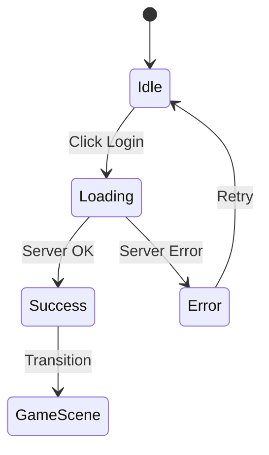

# Roadmap R-Type - Guide Complet d'Implémentation

**Version:** 1.0
**Dernière mise à jour:** 25 novembre 2025
**Objectif:** Terminer le projet R-Type multijoueur

---

## Vue d'Ensemble

Ce document présente la roadmap complète pour finaliser le projet R-Type. Il est organisé en **6 phases** progressives, chacune construisant sur la précédente.

### État Actuel du Projet

```
✅ COMPLÉTÉ                          🚧 EN COURS                    📋 À FAIRE
─────────────────────────────────────────────────────────────────────────────
• Architecture hexagonale serveur    • UI Components client         • ECS
• Client SFML (Boot, Engine, Loop)   • Intégration auth            • Gameplay
• Système de scènes                  • TextField                    • Multijoueur
• TCPClient/TCPServer                                               • Audio
• Authentification (Login/Register)                                 • Polish
• MongoDB (Users)
• Logging (12 loggers)
• AssetManager
```

### Estimation Globale

| Phase | Durée Estimée | Complexité | Priorité |
|-------|---------------|------------|----------|
| Phase 1: UI & Auth Integration | 1-2 semaines | Moyenne | Haute |
| Phase 2: ECS Architecture | 2-3 semaines | Haute | Haute |
| Phase 3: Gameplay Core | 2-3 semaines | Haute | Haute |
| Phase 4: Networking Gameplay | 2 semaines | Très Haute | Haute |
| Phase 5: Content & Polish | 1-2 semaines | Moyenne | Moyenne |
| Phase 6: Audio & Effects | 1 semaine | Basse | Basse |

**Total estimé:** 9-13 semaines

---

## Phase 1: UI & Intégration Authentification

**Objectif:** Interface utilisateur fonctionnelle et authentification complète client-serveur.

### 1.1 Système UI Complet

#### Tâches

| ID | Tâche | Fichiers | Design Pattern |
|----|-------|----------|----------------|
| 1.1.1 | Implémenter `IUIElement` interface | `include/ui/IUIElement.hpp` | Strategy |
| 1.1.2 | Créer `Button` interactif | `ui/Button.hpp/.cpp` | Observer |
| 1.1.3 | Finaliser `TextField` avec curseur | `utils/TextField.hpp/.cpp` | - |
| 1.1.4 | Créer `Label` pour texte statique | `ui/Label.hpp/.cpp` | - |
| 1.1.5 | Créer `Panel` conteneur | `ui/Panel.hpp/.cpp` | Composite |
| 1.1.6 | Implémenter `UIManager` | `ui/UIManager.hpp/.cpp` | Facade |

#### Architecture UI Recommandée

```
IUIElement (interface)
├── Button : IUIElement
│   ├── onClick callback
│   ├── hover state
│   └── disabled state
├── TextField : IUIElement
│   ├── text buffer
│   ├── cursor position
│   ├── selection
│   └── onSubmit callback
├── Label : IUIElement
│   └── text content
└── Panel : IUIElement (Composite)
    └── vector<IUIElement*> children
```

#### Design Pattern: Observer pour les événements UI

```cpp
// Observer Pattern pour Button
class IButtonObserver {
public:
    virtual void onClick(Button* button) = 0;
    virtual void onHover(Button* button) = 0;
};

class Button : public IUIElement {
    std::vector<IButtonObserver*> _observers;
public:
    void addObserver(IButtonObserver* obs);
    void click() {
        for (auto* obs : _observers) obs->onClick(this);
    }
};
```

### 1.2 LoginScene Fonctionnelle

#### Tâches

| ID | Tâche | Description |
|----|-------|-------------|
| 1.2.1 | Ajouter TextField email | Input pour l'email utilisateur |
| 1.2.2 | Ajouter TextField password | Input masqué pour mot de passe |
| 1.2.3 | Ajouter Button "Login" | Déclenche l'authentification |
| 1.2.4 | Ajouter Button "Register" | Bascule vers RegisterScene |
| 1.2.5 | Afficher messages d'erreur | Label pour feedback utilisateur |
| 1.2.6 | Gérer états (loading, error, success) | State Machine |

#### Flux d'Authentification



### 1.3 Intégration Client-Serveur Auth avec Protocol Buffers

#### Tâches

| ID | Tâche | Description |
|----|-------|-------------|
| 1.3.1 | Définir messages protobuf auth | `proto/auth.proto` |
| 1.3.2 | Compiler les fichiers .proto | Générer C++ avec protoc |
| 1.3.3 | Implémenter `AuthService` client | Encapsule logique auth |
| 1.3.4 | Connecter LoginScene à TCPClient | Envoi credentials sérialisés |
| 1.3.5 | Parser réponses serveur | Désérialisation protobuf |
| 1.3.6 | Stocker session utilisateur | Token ou user info |
| 1.3.7 | Créer RegisterScene | Inscription nouveaux users |

#### Fichier `proto/auth.proto`

```protobuf
syntax = "proto3";

package rtype.auth;

option cc_namespace = "rtype::proto::auth";

// ═══════════════════════════════════════════════════════════════
// ENUMS
// ═══════════════════════════════════════════════════════════════

enum AuthMessageType {
    AUTH_UNKNOWN = 0;
    AUTH_LOGIN_REQUEST = 1;
    AUTH_LOGIN_RESPONSE = 2;
    AUTH_REGISTER_REQUEST = 3;
    AUTH_REGISTER_RESPONSE = 4;
    AUTH_LOGOUT_REQUEST = 5;
    AUTH_LOGOUT_RESPONSE = 6;
}

enum AuthErrorCode {
    AUTH_ERROR_NONE = 0;
    AUTH_ERROR_INVALID_CREDENTIALS = 1;
    AUTH_ERROR_USER_NOT_FOUND = 2;
    AUTH_ERROR_EMAIL_ALREADY_EXISTS = 3;
    AUTH_ERROR_USERNAME_ALREADY_EXISTS = 4;
    AUTH_ERROR_INVALID_EMAIL_FORMAT = 5;
    AUTH_ERROR_PASSWORD_TOO_WEAK = 6;
    AUTH_ERROR_SERVER_ERROR = 7;
}

// ═══════════════════════════════════════════════════════════════
// REQUESTS
// ═══════════════════════════════════════════════════════════════

message LoginRequest {
    string email = 1;
    string password_hash = 2;  // SHA-256 hash côté client
}

message RegisterRequest {
    string username = 1;
    string email = 2;
    string password_hash = 3;
}

message LogoutRequest {
    string session_token = 1;
}

// ═══════════════════════════════════════════════════════════════
// RESPONSES
// ═══════════════════════════════════════════════════════════════

message UserInfo {
    string user_id = 1;
    string username = 2;
    string email = 3;
    uint64 last_login = 4;     // Unix timestamp
    uint64 created_at = 5;
}

message LoginResponse {
    bool success = 1;
    AuthErrorCode error_code = 2;
    string error_message = 3;

    // Si success == true
    string session_token = 4;
    UserInfo user = 5;
}

message RegisterResponse {
    bool success = 1;
    AuthErrorCode error_code = 2;
    string error_message = 3;

    // Si success == true
    UserInfo user = 4;
}

// ═══════════════════════════════════════════════════════════════
// WRAPPER MESSAGE (pour TCP)
// ═══════════════════════════════════════════════════════════════

message AuthMessage {
    AuthMessageType type = 1;

    oneof payload {
        LoginRequest login_request = 2;
        LoginResponse login_response = 3;
        RegisterRequest register_request = 4;
        RegisterResponse register_response = 5;
        LogoutRequest logout_request = 6;
    }
}
```

#### Utilisation Côté Client

```cpp
#include "proto/auth.pb.h"

class AuthService {
public:
    void login(const std::string& email, const std::string& password) {
        // 1. Créer le message
        rtype::proto::auth::AuthMessage msg;
        msg.set_type(rtype::proto::auth::AUTH_LOGIN_REQUEST);

        auto* request = msg.mutable_login_request();
        request->set_email(email);
        request->set_password_hash(hashSHA256(password));

        // 2. Sérialiser
        std::string serialized;
        msg.SerializeToString(&serialized);

        // 3. Envoyer via TCP (avec length prefix)
        uint32_t length = serialized.size();
        _tcpClient->send(reinterpret_cast<char*>(&length), 4);
        _tcpClient->send(serialized);
    }

    void handleResponse(const std::string& data) {
        rtype::proto::auth::AuthMessage msg;
        msg.ParseFromString(data);

        if (msg.type() == rtype::proto::auth::AUTH_LOGIN_RESPONSE) {
            auto& response = msg.login_response();
            if (response.success()) {
                _sessionToken = response.session_token();
                _currentUser = response.user();
                // Transition vers GameScene
            } else {
                // Afficher erreur
                showError(response.error_message());
            }
        }
    }
};
```

### 1.4 Livrables Phase 1

- [ ] UI System complet (Button, TextField, Label, Panel)
- [ ] LoginScene avec formulaire fonctionnel
- [ ] RegisterScene pour inscription
- [ ] Communication auth client-serveur
- [ ] Gestion d'erreurs et feedback utilisateur

---

## Phase 2: Architecture ECS (Entity Component System)

**Objectif:** Implémenter un ECS performant pour gérer les entités de jeu.

### 2.1 Pourquoi ECS ?

L'ECS sépare les données (Components) de la logique (Systems), permettant :
- Performance via cache-friendly data layout
- Flexibilité pour composer des entités
- Facilité de test des Systems isolés
- Parallélisation des Systems

### 2.2 Architecture ECS

```
ECS/
├── Entity.hpp              # Identifiant unique (uint64_t)
├── Component.hpp           # Base des composants
├── System.hpp              # Base des systèmes
├── Registry.hpp            # Conteneur principal
├── ComponentPool.hpp       # Stockage dense des composants
│
├── components/             # Composants de données
│   ├── Transform.hpp       # Position, Rotation, Scale
│   ├── Velocity.hpp        # Vitesse et direction
│   ├── Sprite.hpp          # Texture et animation frame
│   ├── Collider.hpp        # Hitbox et layer
│   ├── Health.hpp          # Points de vie
│   ├── Player.hpp          # Tag + input state
│   ├── Enemy.hpp           # Tag + AI state
│   ├── Projectile.hpp      # Tag + damage + owner
│   └── NetworkSync.hpp     # ID réseau + dirty flag
│
└── systems/                # Systèmes de logique
    ├── MovementSystem.hpp
    ├── RenderSystem.hpp
    ├── CollisionSystem.hpp
    ├── InputSystem.hpp
    ├── AISystem.hpp
    ├── ProjectileSystem.hpp
    ├── HealthSystem.hpp
    └── NetworkSyncSystem.hpp
```

### 2.3 Implémentation du Registry

#### Design Pattern: Registry (Entity Manager)

```cpp
class Registry {
public:
    // Création/Destruction d'entités
    Entity createEntity();
    void destroyEntity(Entity entity);

    // Gestion des composants
    template<typename T, typename... Args>
    T& addComponent(Entity entity, Args&&... args);

    template<typename T>
    void removeComponent(Entity entity);

    template<typename T>
    T& getComponent(Entity entity);

    template<typename T>
    bool hasComponent(Entity entity);

    // Itération sur les entités avec composants spécifiques
    template<typename... Components>
    auto view() -> View<Components...>;

private:
    std::queue<Entity> _availableEntities;
    std::array<Signature, MAX_ENTITIES> _signatures;
    std::unordered_map<std::type_index, std::unique_ptr<IComponentPool>> _pools;
};
```

### 2.4 Composants Détaillés

| Composant | Données | Usage |
|-----------|---------|-------|
| `Transform` | `Vec2f position, float rotation, Vec2f scale` | Position monde |
| `Velocity` | `Vec2f velocity, float maxSpeed` | Mouvement |
| `Sprite` | `std::string textureKey, IntRect texRect, int zOrder` | Rendu |
| `Animator` | `vector<Frame> frames, int current, float timer` | Animation |
| `Collider` | `FloatRect bounds, uint32_t layer, uint32_t mask` | Collision |
| `Health` | `float current, float max, bool invincible` | Vie |
| `Player` | `int playerId, InputState input` | Joueur |
| `Enemy` | `EnemyType type, AIState state` | Ennemi |
| `Projectile` | `float damage, Entity owner, float lifetime` | Projectile |
| `NetworkSync` | `uint32_t netId, bool isDirty, uint32_t lastUpdate` | Réseau |

### 2.5 Systèmes Détaillés

#### MovementSystem

```cpp
class MovementSystem : public System {
public:
    void update(Registry& registry, float deltaTime) {
        for (auto entity : registry.view<Transform, Velocity>()) {
            auto& transform = registry.getComponent<Transform>(entity);
            auto& velocity = registry.getComponent<Velocity>(entity);

            transform.position.x += velocity.velocity.x * deltaTime;
            transform.position.y += velocity.velocity.y * deltaTime;
        }
    }
};
```

#### CollisionSystem (AABB)

```cpp
class CollisionSystem : public System {
public:
    void update(Registry& registry) {
        auto entities = registry.view<Transform, Collider>();

        for (auto a : entities) {
            for (auto b : entities) {
                if (a >= b) continue;  // Éviter double check

                if (checkCollision(a, b, registry)) {
                    handleCollision(a, b, registry);
                }
            }
        }
    }

private:
    bool checkCollision(Entity a, Entity b, Registry& reg) {
        auto& colA = reg.getComponent<Collider>(a);
        auto& colB = reg.getComponent<Collider>(b);

        // Check layer mask
        if (!(colA.mask & colB.layer)) return false;

        auto& posA = reg.getComponent<Transform>(a);
        auto& posB = reg.getComponent<Transform>(b);

        // AABB intersection
        return intersects(
            posA.position + colA.bounds.position,
            colA.bounds.size,
            posB.position + colB.bounds.position,
            colB.bounds.size
        );
    }
};
```

### 2.6 Tâches Phase 2

| ID | Tâche | Priorité |
|----|-------|----------|
| 2.1.1 | Implémenter `Entity` (typedef uint64_t) | Haute |
| 2.1.2 | Implémenter `ComponentPool<T>` | Haute |
| 2.1.3 | Implémenter `Registry` | Haute |
| 2.1.4 | Implémenter `View<Components...>` | Haute |
| 2.2.1 | Créer composant `Transform` | Haute |
| 2.2.2 | Créer composant `Velocity` | Haute |
| 2.2.3 | Créer composant `Sprite` | Haute |
| 2.2.4 | Créer composant `Collider` | Haute |
| 2.2.5 | Créer composant `Health` | Moyenne |
| 2.2.6 | Créer composants tags (Player, Enemy, Projectile) | Moyenne |
| 2.3.1 | Implémenter `MovementSystem` | Haute |
| 2.3.2 | Implémenter `RenderSystem` | Haute |
| 2.3.3 | Implémenter `CollisionSystem` | Haute |
| 2.3.4 | Implémenter `InputSystem` | Haute |
| 2.4.1 | Intégrer ECS dans GameScene | Haute |
| 2.4.2 | Tests unitaires ECS | Moyenne |

### 2.7 Livrables Phase 2

- [ ] Registry ECS fonctionnel
- [ ] 8+ composants implémentés
- [ ] 4+ systèmes de base (Movement, Render, Collision, Input)
- [ ] Intégration dans GameScene
- [ ] Tests unitaires

---

## Phase 3: Gameplay Core

**Objectif:** Implémenter les mécaniques de jeu R-Type de base.

### 3.1 Vaisseau Joueur

#### Tâches

| ID | Tâche | Description |
|----|-------|-------------|
| 3.1.1 | Créer entité Player | Transform, Velocity, Sprite, Collider, Health, Player |
| 3.1.2 | Implémenter InputSystem | Lecture clavier (ZQSD/WASD + Espace) |
| 3.1.3 | Mouvement 4 directions | Limité aux bounds de l'écran |
| 3.1.4 | Animation vaisseau | Frames idle, up, down |
| 3.1.5 | Invincibilité temporaire | Après dégât, 2 secondes |

#### Input Mapping

```cpp
struct InputState {
    bool moveUp = false;
    bool moveDown = false;
    bool moveLeft = false;
    bool moveRight = false;
    bool fire = false;
    bool fireReleased = true;  // Pour tir unique
};

class InputSystem : public System {
    void update(Registry& registry, const sf::Event& event) {
        for (auto entity : registry.view<Player>()) {
            auto& player = registry.getComponent<Player>(entity);
            auto& velocity = registry.getComponent<Velocity>(entity);

            // Reset velocity
            velocity.velocity = {0, 0};

            if (sf::Keyboard::isKeyPressed(sf::Keyboard::Z))
                velocity.velocity.y = -player.speed;
            if (sf::Keyboard::isKeyPressed(sf::Keyboard::S))
                velocity.velocity.y = player.speed;
            // ... etc
        }
    }
};
```

### 3.2 Système de Tir

#### Tâches

| ID | Tâche | Description |
|----|-------|-------------|
| 3.2.1 | Créer ProjectileFactory | Factory pattern pour créer projectiles |
| 3.2.2 | Projectile basique | Sprite, vitesse constante, damage |
| 3.2.3 | Cooldown de tir | Délai entre chaque tir |
| 3.2.4 | Charge shot (optionnel) | Maintenir pour charger, relâcher pour tirer |
| 3.2.5 | Destruction hors écran | Remove entities hors bounds |

#### Design Pattern: Factory pour Projectiles

```cpp
class ProjectileFactory {
public:
    Entity createPlayerBullet(Registry& registry, Vec2f position) {
        Entity bullet = registry.createEntity();

        registry.addComponent<Transform>(bullet, position, 0.0f, {1, 1});
        registry.addComponent<Velocity>(bullet, {500.0f, 0.0f});
        registry.addComponent<Sprite>(bullet, "bullet_player", {0, 0, 16, 8});
        registry.addComponent<Collider>(bullet, {0, 0, 16, 8}, Layer::PlayerBullet, Layer::Enemy);
        registry.addComponent<Projectile>(bullet, 10.0f, playerId, 5.0f);

        return bullet;
    }

    Entity createEnemyBullet(Registry& registry, Vec2f position, Vec2f direction) {
        // Similar but different layer/mask
    }
};
```

### 3.3 Ennemis et IA

#### Types d'Ennemis R-Type Classiques

| Type | Comportement | Sprite | Points |
|------|--------------|--------|--------|
| `Basic` | Vol horizontal simple | Petit alien | 100 |
| `Wave` | Mouvement sinusoïdal | Méduse | 150 |
| `Shooter` | Tire vers le joueur | Tourelle | 200 |
| `Charger` | Fonce vers le joueur | Kamikaze | 250 |
| `Boss` | Patterns complexes | Grand sprite | 5000 |

#### Design Pattern: State Machine pour IA

```cpp
enum class AIState {
    Idle,
    Patrol,
    Chase,
    Attack,
    Retreat
};

class AISystem : public System {
    void update(Registry& registry, float dt) {
        for (auto entity : registry.view<Enemy, Transform, Velocity>()) {
            auto& enemy = registry.getComponent<Enemy>(entity);

            switch (enemy.state) {
                case AIState::Patrol:
                    handlePatrol(entity, registry, dt);
                    break;
                case AIState::Chase:
                    handleChase(entity, registry, dt);
                    break;
                // ...
            }
        }
    }
};
```

### 3.4 Système de Vagues (Wave System)

#### Tâches

| ID | Tâche | Description |
|----|-------|-------------|
| 3.4.1 | Créer `WaveManager` | Gère la progression des vagues |
| 3.4.2 | Format de définition de vague | JSON ou code |
| 3.4.3 | Spawn patterns | Timing et positions des spawns |
| 3.4.4 | Progression difficulté | Plus d'ennemis, plus rapides |
| 3.4.5 | Condition de victoire | Toutes vagues complétées |

#### Structure de Vague

```cpp
struct EnemySpawn {
    EnemyType type;
    Vec2f position;
    float delay;  // Secondes après début de vague
};

struct Wave {
    std::vector<EnemySpawn> spawns;
    float duration;  // Durée max avant prochaine vague
    bool bossWave = false;
};

class WaveManager {
    std::vector<Wave> _waves;
    int _currentWave = 0;
    float _waveTimer = 0;
    int _spawnIndex = 0;

public:
    void update(Registry& registry, float dt);
    bool isWaveComplete() const;
    void nextWave();
};
```

### 3.5 Power-ups

#### Types de Power-ups

| Power-up | Effet | Durée |
|----------|-------|-------|
| `SpeedUp` | +50% vitesse | 10s |
| `FireRate` | -50% cooldown tir | 15s |
| `Shield` | Absorbe 1 hit | Jusqu'à hit |
| `MultiShot` | 3 projectiles | 20s |
| `Heal` | +25% HP | Instant |

#### Implémentation

```cpp
struct PowerUp {
    PowerUpType type;
    float duration;  // -1 pour permanent/instant
};

class PowerUpSystem : public System {
    void update(Registry& registry, float dt) {
        // Check collisions player/powerup
        // Apply effect
        // Remove powerup entity
    }

    void applyPowerUp(Entity player, PowerUpType type, Registry& registry) {
        switch (type) {
            case PowerUpType::SpeedUp:
                auto& vel = registry.getComponent<Velocity>(player);
                vel.maxSpeed *= 1.5f;
                // Schedule removal of buff
                break;
            // ...
        }
    }
};
```

### 3.6 Tâches Phase 3

| ID | Tâche | Priorité |
|----|-------|----------|
| 3.1.x | Vaisseau joueur complet | Haute |
| 3.2.x | Système de tir | Haute |
| 3.3.1 | Ennemi Basic | Haute |
| 3.3.2 | Ennemi Wave | Haute |
| 3.3.3 | Ennemi Shooter | Moyenne |
| 3.3.4 | IA State Machine | Moyenne |
| 3.4.x | Wave Manager | Haute |
| 3.5.x | Power-ups (minimum 3) | Moyenne |
| 3.6.1 | Système de score | Basse |
| 3.6.2 | Game Over screen | Moyenne |
| 3.6.3 | Victory screen | Moyenne |

### 3.7 Livrables Phase 3

- [ ] Vaisseau joueur contrôlable
- [ ] Système de tir fonctionnel
- [ ] 3+ types d'ennemis
- [ ] Wave system avec progression
- [ ] 3+ power-ups
- [ ] Écrans Game Over / Victory

---

## Phase 4: Networking Gameplay avec Protocol Buffers

**Objectif:** Synchronisation multijoueur temps réel avec protobuf.

### 4.1 Architecture Réseau

```
┌─────────────────────────────────────────────────────────────┐
│                         SERVEUR                             │
│  ┌─────────────┐  ┌─────────────┐  ┌─────────────────────┐  │
│  │ TCP Server  │  │ UDP Server  │  │    Game Server      │  │
│  │  (Protobuf) │  │  (Protobuf) │  │  ┌───────────────┐  │  │
│  │  Auth/Chat  │  │  Gameplay   │  │  │   ECS World   │  │  │
│  └──────┬──────┘  └──────┬──────┘  │  │ (Authoritative)│  │  │
│         │                │         │  └───────────────┘  │  │
│         │                │         └─────────────────────┘  │
└─────────┼────────────────┼──────────────────────────────────┘
          │                │
          │   PROTOBUF     │
          │   MESSAGES     │
          │                │
┌─────────┼────────────────┼──────────────────────────────────┐
│         │                │           CLIENT                 │
│  ┌──────┴──────┐  ┌──────┴──────┐  ┌─────────────────────┐  │
│  │ TCP Client  │  │ UDP Client  │  │    Game Client      │  │
│  │  (Protobuf) │  │  (Protobuf) │  │  ┌───────────────┐  │  │
│  └─────────────┘  └─────────────┘  │  │  ECS World    │  │  │
│                                    │  │  (Predicted)  │  │  │
│                                    │  └───────────────┘  │  │
│                                    └─────────────────────┘  │
└─────────────────────────────────────────────────────────────┘
```

### 4.2 Fichier `proto/game.proto`

```protobuf
syntax = "proto3";

package rtype.game;

option cc_namespace = "rtype::proto::game";

// ═══════════════════════════════════════════════════════════════
// TYPES DE BASE
// ═══════════════════════════════════════════════════════════════

message Vec2 {
    float x = 1;
    float y = 2;
}

enum EntityType {
    ENTITY_UNKNOWN = 0;
    ENTITY_PLAYER = 1;
    ENTITY_ENEMY_BASIC = 2;
    ENTITY_ENEMY_WAVE = 3;
    ENTITY_ENEMY_SHOOTER = 4;
    ENTITY_ENEMY_CHARGER = 5;
    ENTITY_BOSS = 6;
    ENTITY_PROJECTILE_PLAYER = 7;
    ENTITY_PROJECTILE_ENEMY = 8;
    ENTITY_POWERUP = 9;
}

enum PowerUpType {
    POWERUP_NONE = 0;
    POWERUP_SPEED = 1;
    POWERUP_FIRERATE = 2;
    POWERUP_SHIELD = 3;
    POWERUP_MULTISHOT = 4;
    POWERUP_HEAL = 5;
}

// ═══════════════════════════════════════════════════════════════
// CLIENT → SERVEUR (UDP, envoyé à 60Hz)
// ═══════════════════════════════════════════════════════════════

message InputFlags {
    bool move_up = 1;
    bool move_down = 2;
    bool move_left = 3;
    bool move_right = 4;
    bool fire = 5;
    bool special = 6;  // Charge shot, bomb, etc.
}

message ClientInput {
    uint32 sequence_number = 1;  // Pour réconciliation
    uint32 client_tick = 2;      // Tick local du client
    uint64 timestamp_ms = 3;     // Timestamp Unix ms
    InputFlags input = 4;
}

// ═══════════════════════════════════════════════════════════════
// SERVEUR → CLIENT (UDP, envoyé à 20-30Hz)
// ═══════════════════════════════════════════════════════════════

message EntityState {
    uint32 network_id = 1;       // ID unique réseau
    EntityType type = 2;
    Vec2 position = 3;
    Vec2 velocity = 4;
    float rotation = 5;
    uint32 health = 6;           // 0-100
    uint32 max_health = 7;

    // Flags compactés
    bool is_invincible = 8;
    bool is_dead = 9;
    bool is_firing = 10;

    // Données spécifiques selon type
    oneof extra_data {
        PlayerData player_data = 20;
        ProjectileData projectile_data = 21;
        PowerUpData powerup_data = 22;
    }
}

message PlayerData {
    uint32 player_id = 1;        // ID du joueur (1-4)
    string username = 2;
    uint32 score = 3;
    uint32 lives = 4;
    repeated PowerUpType active_powerups = 5;
}

message ProjectileData {
    uint32 owner_network_id = 1;
    float damage = 2;
}

message PowerUpData {
    PowerUpType powerup_type = 1;
}

message WorldSnapshot {
    uint32 server_tick = 1;
    uint64 timestamp_ms = 2;
    uint32 last_processed_input = 3;  // Pour réconciliation client

    repeated EntityState entities = 4;

    // Événements survenus ce tick
    repeated GameEvent events = 5;
}

// ═══════════════════════════════════════════════════════════════
// ÉVÉNEMENTS DE JEU
// ═══════════════════════════════════════════════════════════════

enum GameEventType {
    EVENT_UNKNOWN = 0;
    EVENT_ENTITY_SPAWNED = 1;
    EVENT_ENTITY_DESTROYED = 2;
    EVENT_PLAYER_HIT = 3;
    EVENT_PLAYER_DIED = 4;
    EVENT_ENEMY_KILLED = 5;
    EVENT_POWERUP_COLLECTED = 6;
    EVENT_WAVE_START = 7;
    EVENT_WAVE_COMPLETE = 8;
    EVENT_BOSS_SPAWN = 9;
    EVENT_LEVEL_COMPLETE = 10;
    EVENT_GAME_OVER = 11;
}

message GameEvent {
    GameEventType type = 1;
    uint32 entity_id = 2;        // Entité concernée
    uint32 other_entity_id = 3;  // Autre entité (ex: killer)

    oneof event_data {
        SpawnEventData spawn = 10;
        ScoreEventData score = 11;
        WaveEventData wave = 12;
    }
}

message SpawnEventData {
    EntityType entity_type = 1;
    Vec2 position = 2;
}

message ScoreEventData {
    uint32 points = 1;
    uint32 total_score = 2;
}

message WaveEventData {
    uint32 wave_number = 1;
    uint32 enemy_count = 2;
}

// ═══════════════════════════════════════════════════════════════
// MESSAGES TCP (Lobby, Chat, etc.)
// ═══════════════════════════════════════════════════════════════

enum LobbyMessageType {
    LOBBY_UNKNOWN = 0;
    LOBBY_JOIN_REQUEST = 1;
    LOBBY_JOIN_RESPONSE = 2;
    LOBBY_LEAVE = 3;
    LOBBY_PLAYER_LIST = 4;
    LOBBY_READY = 5;
    LOBBY_START_GAME = 6;
    LOBBY_CHAT = 7;
}

message LobbyPlayer {
    uint32 player_id = 1;
    string username = 2;
    bool is_ready = 3;
    bool is_host = 4;
}

message LobbyJoinRequest {
    string session_token = 1;
    string room_code = 2;        // Optionnel, pour rejoindre une room spécifique
}

message LobbyJoinResponse {
    bool success = 1;
    string error_message = 2;
    string room_code = 3;
    uint32 your_player_id = 4;
    repeated LobbyPlayer players = 5;
}

message LobbyPlayerList {
    repeated LobbyPlayer players = 1;
}

message LobbyReadyMessage {
    bool is_ready = 1;
}

message LobbyChatMessage {
    uint32 player_id = 1;
    string username = 2;
    string message = 3;
    uint64 timestamp = 4;
}

message LobbyMessage {
    LobbyMessageType type = 1;

    oneof payload {
        LobbyJoinRequest join_request = 2;
        LobbyJoinResponse join_response = 3;
        LobbyPlayerList player_list = 4;
        LobbyReadyMessage ready = 5;
        LobbyChatMessage chat = 6;
    }
}

// ═══════════════════════════════════════════════════════════════
// WRAPPER PRINCIPAL
// ═══════════════════════════════════════════════════════════════

enum GameMessageType {
    MSG_UNKNOWN = 0;
    MSG_CLIENT_INPUT = 1;        // UDP: Client → Server
    MSG_WORLD_SNAPSHOT = 2;      // UDP: Server → Client
    MSG_LOBBY = 3;               // TCP: Bidirectionnel
}

message GameMessage {
    GameMessageType type = 1;

    oneof payload {
        ClientInput client_input = 2;
        WorldSnapshot world_snapshot = 3;
        LobbyMessage lobby = 4;
    }
}
```

### 4.3 Structure des Fichiers Proto

```
proto/
├── auth.proto          # Authentification (TCP)
├── game.proto          # Gameplay et Lobby
└── CMakeLists.txt      # Compilation protobuf

# Génère dans:
build/proto/
├── auth.pb.h
├── auth.pb.cc
├── game.pb.h
└── game.pb.cc
```

### 4.4 Configuration CMake pour Protobuf

```cmake
# Dans CMakeLists.txt racine
find_package(Protobuf REQUIRED)

# Compiler les fichiers .proto
file(GLOB PROTO_FILES "${CMAKE_SOURCE_DIR}/proto/*.proto")

protobuf_generate_cpp(PROTO_SRCS PROTO_HDRS ${PROTO_FILES})

# Créer une librairie
add_library(rtype_proto STATIC ${PROTO_SRCS} ${PROTO_HDRS})
target_link_libraries(rtype_proto PUBLIC protobuf::libprotobuf)
target_include_directories(rtype_proto PUBLIC ${CMAKE_CURRENT_BINARY_DIR})

# Linker avec client et serveur
target_link_libraries(rtype_client PRIVATE rtype_proto)
target_link_libraries(rtype_server PRIVATE rtype_proto)
```

### 4.3 Techniques de Synchronisation

#### Client-Side Prediction

Le client prédit localement le résultat de ses inputs sans attendre le serveur.

```cpp
class ClientPrediction {
    std::deque<PredictedState> _history;

    void processInput(InputState input) {
        // 1. Appliquer localement
        applyInput(input, _localPlayer);

        // 2. Sauvegarder pour réconciliation
        _history.push_back({_sequenceNumber++, input, _localPlayer.state});

        // 3. Envoyer au serveur
        sendToServer(input);
    }

    void reconcile(uint32_t lastProcessedSeq, EntityState serverState) {
        // 1. Supprimer les états confirmés
        while (!_history.empty() && _history.front().seq <= lastProcessedSeq) {
            _history.pop_front();
        }

        // 2. Si divergence, corriger et rejouer
        if (serverState != _localPlayer.state) {
            _localPlayer.state = serverState;
            for (auto& pred : _history) {
                applyInput(pred.input, _localPlayer);
            }
        }
    }
};
```

#### Entity Interpolation

Pour les autres joueurs/entités, interpoler entre deux états reçus.

```cpp
class EntityInterpolation {
    std::deque<TimestampedState> _buffer;
    float _interpolationDelay = 0.1f;  // 100ms

    EntityState getInterpolatedState(float currentTime) {
        float renderTime = currentTime - _interpolationDelay;

        // Trouver les deux états encadrant renderTime
        auto it = std::lower_bound(_buffer.begin(), _buffer.end(), renderTime);

        if (it == _buffer.begin() || it == _buffer.end()) {
            return _buffer.back().state;  // Extrapolation ou dernier état
        }

        auto& newer = *it;
        auto& older = *(it - 1);

        float t = (renderTime - older.time) / (newer.time - older.time);
        return lerp(older.state, newer.state, t);
    }
};
```

### 4.6 Utilisation Protobuf

#### Envoi d'Input (Client)

```cpp
#include "proto/game.pb.h"

class NetworkManager {
public:
    void sendInput(const InputState& input) {
        rtype::proto::game::GameMessage msg;
        msg.set_type(rtype::proto::game::MSG_CLIENT_INPUT);

        auto* clientInput = msg.mutable_client_input();
        clientInput->set_sequence_number(_sequenceNumber++);
        clientInput->set_client_tick(_localTick);
        clientInput->set_timestamp_ms(getCurrentTimeMs());

        auto* flags = clientInput->mutable_input();
        flags->set_move_up(input.moveUp);
        flags->set_move_down(input.moveDown);
        flags->set_move_left(input.moveLeft);
        flags->set_move_right(input.moveRight);
        flags->set_fire(input.fire);

        // Sérialiser et envoyer via UDP
        std::string data;
        msg.SerializeToString(&data);
        _udpClient->send(data);
    }
};
```

#### Réception WorldSnapshot (Client)

```cpp
void NetworkManager::handleUDPMessage(const std::string& data) {
    rtype::proto::game::GameMessage msg;
    if (!msg.ParseFromString(data)) {
        _logger->error("Failed to parse protobuf message");
        return;
    }

    if (msg.type() == rtype::proto::game::MSG_WORLD_SNAPSHOT) {
        const auto& snapshot = msg.world_snapshot();

        // Réconciliation
        _prediction.reconcile(snapshot.last_processed_input());

        // Mettre à jour les entités
        for (const auto& entityState : snapshot.entities()) {
            updateEntity(entityState);
        }

        // Traiter les événements
        for (const auto& event : snapshot.events()) {
            handleGameEvent(event);
        }
    }
}

void NetworkManager::updateEntity(const rtype::proto::game::EntityState& state) {
    uint32_t netId = state.network_id();

    if (state.is_dead()) {
        _registry.destroyEntity(netId);
        return;
    }

    // Créer ou mettre à jour
    Entity entity = getOrCreateEntity(netId, state.type());

    auto& transform = _registry.getComponent<Transform>(entity);
    transform.position = {state.position().x(), state.position().y()};

    auto& velocity = _registry.getComponent<Velocity>(entity);
    velocity.velocity = {state.velocity().x(), state.velocity().y()};

    if (_registry.hasComponent<Health>(entity)) {
        auto& health = _registry.getComponent<Health>(entity);
        health.current = state.health();
        health.max = state.max_health();
    }
}
```

### 4.7 Tâches Phase 4

| ID | Tâche | Priorité |
|----|-------|----------|
| **Protobuf Setup** |||
| 4.0.1 | Créer `proto/auth.proto` | Haute |
| 4.0.2 | Créer `proto/game.proto` | Haute |
| 4.0.3 | Configurer CMake pour protobuf | Haute |
| 4.0.4 | Tester compilation proto → C++ | Haute |
| **UDP Communication** |||
| 4.1.1 | Implémenter UDPClient (Boost.Asio) | Haute |
| 4.1.2 | Implémenter UDPServer game loop | Haute |
| 4.1.3 | Intégrer protobuf dans UDP send/receive | Haute |
| **Sérialisation** |||
| 4.2.1 | Helper serialize/deserialize GameMessage | Haute |
| 4.2.2 | Length-prefix framing pour TCP | Haute |
| 4.2.3 | Tests unitaires sérialisation | Moyenne |
| **Synchronisation** |||
| 4.3.1 | Client-side prediction (InputHistory) | Haute |
| 4.3.2 | Server reconciliation | Haute |
| 4.3.3 | Entity interpolation (autres joueurs) | Moyenne |
| **ECS Network** |||
| 4.4.1 | NetworkSyncSystem client | Haute |
| 4.4.2 | NetworkSyncSystem serveur | Haute |
| 4.4.3 | NetworkId component | Haute |
| **Lobby** |||
| 4.5.1 | LobbyScene client | Moyenne |
| 4.5.2 | Lobby management serveur | Moyenne |
| 4.5.3 | Chat en jeu | Basse |
| **Robustesse** |||
| 4.6.1 | Gestion déconnexion/reconnexion | Moyenne |
| 4.6.2 | Timeout et heartbeat | Moyenne |
| 4.6.3 | Latency compensation (optionnel) | Basse |

### 4.8 Livrables Phase 4

- [ ] Fichiers `.proto` complets (auth + game)
- [ ] Compilation protobuf intégrée au build
- [ ] Communication UDP client-serveur avec protobuf
- [ ] Sérialisation/Désérialisation fonctionnelle
- [ ] Client-side prediction
- [ ] Entity interpolation
- [ ] Lobby basique
- [ ] 2+ joueurs simultanés fonctionnels

---

## Phase 5: Contenu et Polish

**Objectif:** Enrichir le jeu avec du contenu et améliorer l'expérience.

### 5.1 Niveaux et Progression

#### Tâches

| ID | Tâche | Description |
|----|-------|-------------|
| 5.1.1 | Level Manager | Gestion des niveaux |
| 5.1.2 | Background scrolling | Parallax multi-couche |
| 5.1.3 | 3 niveaux différents | Thèmes visuels distincts |
| 5.1.4 | Boss de fin de niveau | 1 boss par niveau |
| 5.1.5 | Transition entre niveaux | Animation et stats |

#### Parallax Scrolling

```cpp
struct ParallaxLayer {
    std::string textureKey;
    float scrollSpeed;  // Relatif à la caméra
    Vec2f offset;
};

class BackgroundSystem : public System {
    std::vector<ParallaxLayer> _layers;

    void update(float dt, float cameraX) {
        for (auto& layer : _layers) {
            layer.offset.x -= layer.scrollSpeed * dt;

            // Wrap around
            if (layer.offset.x < -textureWidth) {
                layer.offset.x += textureWidth;
            }
        }
    }

    void render(IWindow& window) {
        for (auto& layer : _layers) {
            // Draw twice for seamless scrolling
            window.draw(layer.sprite, layer.offset);
            window.draw(layer.sprite, layer.offset + Vec2f{textureWidth, 0});
        }
    }
};
```

### 5.2 Interface Utilisateur Complète

#### Tâches

| ID | Tâche | Description |
|----|-------|-------------|
| 5.2.1 | Menu principal | Play, Settings, Quit |
| 5.2.2 | Menu pause | Resume, Settings, Quit to Menu |
| 5.2.3 | Lobby multijoueur | Liste joueurs, Ready, Start |
| 5.2.4 | Écran de fin | Score, Stats, Replay |
| 5.2.5 | HUD en jeu | Vie, Score, Power-ups actifs |

#### Design du HUD

```
┌────────────────────────────────────────────────────────────────┐
│ [♥♥♥♡♡]  Score: 12,500  │ LEVEL 2 │  [🔥 5s] [🛡️]  │ P2: Ready │
└────────────────────────────────────────────────────────────────┘
│                                                                 │
│                                                                 │
│                        GAME AREA                                │
│                                                                 │
│                                                                 │
└─────────────────────────────────────────────────────────────────┘
```

### 5.3 Assets Graphiques

#### Tâches

| ID | Tâche | Description |
|----|-------|-------------|
| 5.3.1 | Spritesheet joueur | 8+ frames animation |
| 5.3.2 | Spritesheets ennemis | 3+ types, animations |
| 5.3.3 | Projectiles | Joueur et ennemis |
| 5.3.4 | Power-ups | Icônes distinctes |
| 5.3.5 | Backgrounds | 3 thèmes (espace, planète, station) |
| 5.3.6 | UI assets | Boutons, panneaux, fonts |

### 5.4 Livrables Phase 5

- [ ] 3 niveaux jouables
- [ ] Background parallax
- [ ] Menu principal et pause
- [ ] Lobby multijoueur
- [ ] HUD complet
- [ ] Assets graphiques cohérents

---

## Phase 6: Audio et Effets

**Objectif:** Ajouter la dimension sonore et les effets visuels.

### 6.1 Système Audio

#### Architecture

```cpp
class AudioManager {
public:
    // Musique (streaming)
    void playMusic(const std::string& key, bool loop = true);
    void stopMusic();
    void setMusicVolume(float volume);  // 0.0 - 1.0

    // Effets sonores (buffered)
    void playSound(const std::string& key);
    void playSound(const std::string& key, Vec2f position);  // Spatial
    void setSoundVolume(float volume);

    // Preloading
    void loadSound(const std::string& key, const std::string& file);
    void loadMusic(const std::string& key, const std::string& file);

private:
    std::unordered_map<std::string, sf::SoundBuffer> _buffers;
    std::vector<sf::Sound> _activeSounds;  // Pool de sons
    sf::Music _music;
};
```

#### Sons Nécessaires

| Catégorie | Sons |
|-----------|------|
| **Joueur** | tir, hit, mort, power-up pickup |
| **Ennemis** | tir, explosion, spawn |
| **UI** | click, hover, transition |
| **Ambiance** | musique niveau, musique boss, game over, victory |

### 6.2 Effets Visuels

#### Système de Particules

```cpp
struct Particle {
    Vec2f position;
    Vec2f velocity;
    float lifetime;
    float maxLifetime;
    sf::Color color;
    float size;
};

class ParticleSystem : public System {
    std::vector<Particle> _particles;

public:
    void emit(Vec2f position, ParticleConfig config, int count);
    void update(float dt);
    void render(IWindow& window);
};

// Configs prédéfinies
ParticleConfig explosionConfig = {
    .velocityRange = {-100, 100},
    .lifetimeRange = {0.5f, 1.5f},
    .colorStart = sf::Color::Yellow,
    .colorEnd = sf::Color::Red,
    .sizeRange = {2, 8}
};
```

### 6.3 Tâches Phase 6

| ID | Tâche | Priorité |
|----|-------|----------|
| 6.1.1 | Implémenter AudioManager | Moyenne |
| 6.1.2 | Intégrer SFML Audio | Moyenne |
| 6.1.3 | Sons gameplay | Moyenne |
| 6.1.4 | Musiques (3 tracks) | Basse |
| 6.2.1 | Système de particules | Basse |
| 6.2.2 | Effet explosion | Basse |
| 6.2.3 | Screen shake | Basse |
| 6.2.4 | Flash on hit | Basse |

### 6.4 Livrables Phase 6

- [ ] AudioManager fonctionnel
- [ ] Sons pour toutes les actions
- [ ] 3+ musiques
- [ ] Système de particules
- [ ] Effets visuels (explosions, flash)

---

## Annexes

### A. Design Patterns Utilisés

| Pattern | Usage | Fichiers |
|---------|-------|----------|
| **ECS** | Architecture gameplay | `ECS/*` |
| **Factory** | Création entités | `ProjectileFactory`, `EnemyFactory` |
| **Observer** | Events UI, réseau | `Button`, `TCPClient` |
| **State** | IA ennemis, scènes | `AISystem`, `SceneManager` |
| **Strategy** | Comportements IA | `AIBehavior` |
| **Singleton** | Managers | `AudioManager`, `Logger` |
| **Facade** | Simplification API | `UIManager`, `NetworkManager` |
| **Composite** | UI containers | `Panel` |
| **Command** | Input, undo | `InputCommand` |
| **Object Pool** | Particules, sons | `ParticleSystem`, `AudioManager` |

### B. Ressources Recommandées

#### Livres
- *Game Programming Patterns* - Robert Nystrom
- *Multiplayer Game Programming* - Joshua Glazer

#### Articles
- [Fix Your Timestep!](https://gafferongames.com/post/fix_your_timestep/)
- [Networked Physics](https://gafferongames.com/categories/networked-physics/)
- [ECS FAQ](https://github.com/SanderMertens/ecs-faq)

#### Assets Gratuits
- [OpenGameArt.org](https://opengameart.org/)
- [itch.io Free Game Assets](https://itch.io/game-assets/free)
- [Kenney.nl](https://kenney.nl/assets)

### C. Guide Protocol Buffers

#### Installation

```bash
# Via vcpkg
./vcpkg install protobuf

# Ou système (Linux)
sudo apt install protobuf-compiler libprotobuf-dev
```

#### Compilation des fichiers .proto

```bash
# Manuelle
protoc --cpp_out=build/proto proto/auth.proto proto/game.proto

# Via CMake (automatique avec la config fournie en Phase 4)
cmake -B build && cmake --build build
```

#### Structure recommandée

```
proto/
├── auth.proto      # Messages authentification (TCP)
├── game.proto      # Messages gameplay (UDP) + Lobby (TCP)
└── CMakeLists.txt  # Config compilation

# Après compilation:
build/proto/
├── auth.pb.h       # Header C++ généré
├── auth.pb.cc      # Implémentation C++ générée
├── game.pb.h
└── game.pb.cc
```

#### Bonnes pratiques Protobuf

1. **Toujours utiliser `oneof`** pour les payloads variables (évite les fields optionnels multiples)
2. **Numéroter les fields** de manière stable (ne jamais réutiliser un numéro supprimé)
3. **Utiliser des enums** pour les types de messages
4. **Préfixer les enums** avec le nom du type (`AUTH_`, `MSG_`, etc.)
5. **Length-prefix** pour TCP (4 bytes big-endian avant chaque message)

#### Exemple complet

```cpp
// Envoi
rtype::proto::game::GameMessage msg;
msg.set_type(rtype::proto::game::MSG_CLIENT_INPUT);
// ... set payload ...

std::string buffer;
msg.SerializeToString(&buffer);

// Pour TCP: ajouter length prefix
uint32_t length = htonl(buffer.size());
send(&length, 4);
send(buffer.data(), buffer.size());

// Réception
rtype::proto::game::GameMessage received;
if (received.ParseFromString(data)) {
    switch (received.type()) {
        case rtype::proto::game::MSG_WORLD_SNAPSHOT:
            handleSnapshot(received.world_snapshot());
            break;
        // ...
    }
}
```

### D. Checklist Finale

```
□ PHASE 1: UI & Auth
  □ Button, TextField, Label, Panel
  □ LoginScene fonctionnelle
  □ RegisterScene
  □ Communication auth client-serveur (protobuf)

□ PHASE 2: ECS
  □ Registry avec ComponentPools
  □ 8+ Composants
  □ 4+ Systèmes (Movement, Render, Collision, Input)
  □ Intégration GameScene

□ PHASE 3: Gameplay
  □ Vaisseau joueur
  □ Système de tir
  □ 3+ types d'ennemis
  □ Wave system
  □ 3+ power-ups

□ PHASE 4: Networking
  □ Fichiers .proto (auth.proto, game.proto)
  □ Compilation protobuf intégrée CMake
  □ UDP client-serveur avec protobuf
  □ Client-side prediction
  □ Entity interpolation
  □ 2+ joueurs fonctionnels

□ PHASE 5: Content
  □ 3 niveaux
  □ Parallax backgrounds
  □ Menus (main, pause, lobby)
  □ HUD complet

□ PHASE 6: Audio & FX
  □ AudioManager
  □ Sons gameplay
  □ Musiques
  □ Particules et effets
```

---

**Bon courage pour la suite du développement !**

*Document créé le 25/11/2025*
