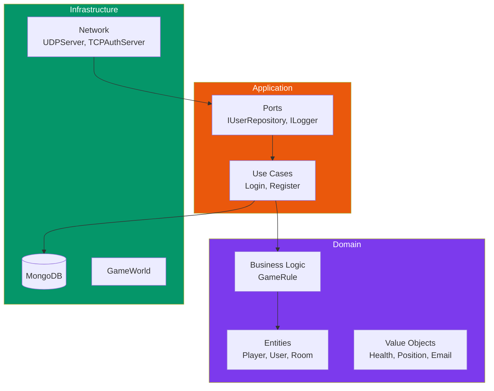
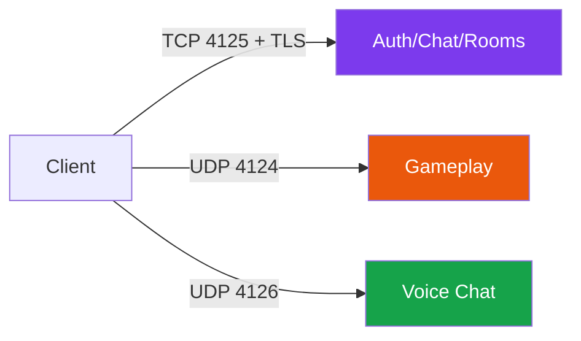
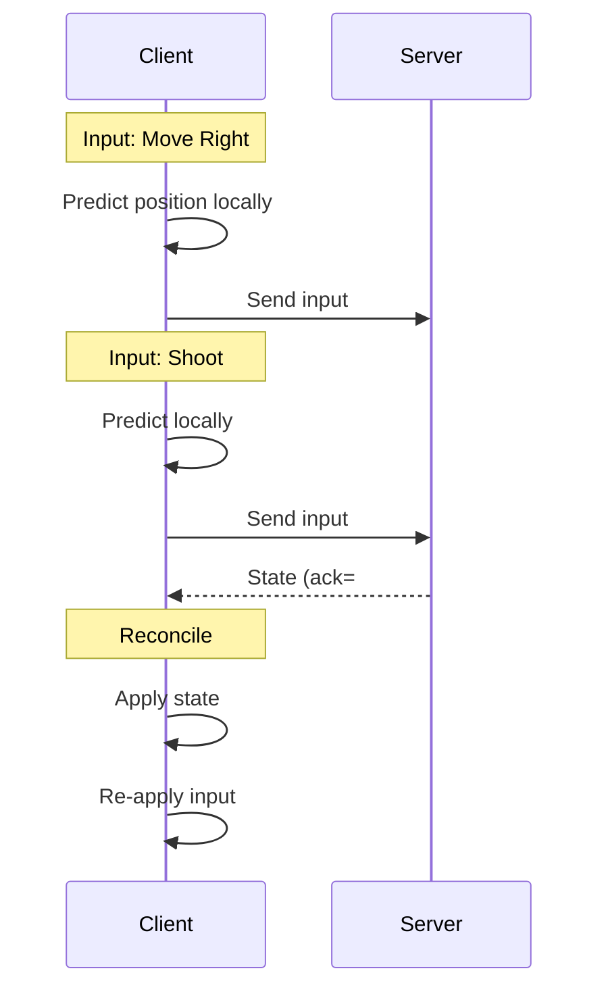

---
tags:
  - developpement
  - architecture
---

# Décisions Architecturales

Justification des choix architecturaux du projet.

## ADR-001: Architecture Hexagonale (Serveur)

### Contexte

Le serveur doit être testable, maintenable et extensible.

### Décision

Adopter l'architecture hexagonale (Ports & Adapters).

### Conséquences

**Positives:**

- Tests unitaires sans dépendances externes
- Facilité de changer les implémentations (ex: MongoDB -> PostgreSQL)
- Séparation claire des responsabilités

**Négatives:**

- Plus de code boilerplate (interfaces)
- Courbe d'apprentissage



---

## ADR-002: Pas d'ECS (Entités Simples)

### Contexte

Comment représenter les entités du jeu (joueurs, ennemis, missiles)?

### Options

1. **Entity Component System (ECS)**
2. **Héritage classique**

### Décision

Structures simples dans GameWorld pour la simplicité.

### Justification

- Nombre limité d'entités (~50 max)
- Types bien définis (Player, Enemy, Missile)
- Comportements spécifiques à chaque type
- ECS = over-engineering pour ce cas

```cpp
// Simple et efficace pour R-Type
struct ConnectedPlayer {
    uint8_t id;
    uint16_t x, y;
    uint8_t health;
    bool alive;
    udp::endpoint endpoint;
};

struct Missile {
    uint16_t id;
    uint8_t owner_id;
    float x, y;
};

struct Enemy {
    uint16_t id;
    float x, y;
    uint8_t health;
    uint8_t enemy_type;
};
```

---

## ADR-003: UDP vs TCP (Gameplay)

### Contexte

Quel protocole pour la synchronisation temps réel?

### Décision

- **TCP** (port 4125 + TLS) pour les données fiables (auth, chat, rooms)
- **UDP** (port 4124) pour les données temps réel (inputs, snapshots)
- **UDP** (port 4126) pour le chat vocal

### Justification

| Critère | TCP | UDP |
|---------|-----|-----|
| Latence | ~50ms+ | ~10ms |
| Fiabilité | Garantie | Non garantie |
| Ordre | Garanti | Non garanti |
| Utilisation | Auth, chat | Gameplay, voice |



---

## ADR-004: Client-Side Prediction

### Contexte

Comment masquer la latence réseau pour le joueur?

### Décision

Implémenter la prédiction côté client avec réconciliation serveur.

### Fonctionnement

1. Client applique immédiatement ses inputs localement
2. Client envoie les inputs au serveur
3. Serveur calcule l'état autoritatif
4. Client reçoit l'état serveur et réconcilie



---

## ADR-005: Abstraction Graphique

### Contexte

Support de SDL2 et SFML pour la portabilité.

### Décision

Interface `IWindow` avec implémentations SDL2 et SFML.

### Structure

```cpp
// Interface (src/client/include/graphics/IWindow.hpp)
class IWindow {
public:
    virtual void drawRect(float x, float y, float w, float h, rgba color) = 0;
    virtual void drawSprite(const std::string& key, float x, float y, float w, float h) = 0;
    virtual bool loadTexture(const std::string& key, const std::string& path) = 0;
    virtual events::Event pollEvent() = 0;
    virtual void clear() = 0;
    virtual void display() = 0;
};

// Implémentations
class SFMLWindow : public IWindow { /* lib/sfml/ */ };
class SDL2Window : public IWindow { /* lib/sdl2/ */ };
```

---

## ADR-006: Voice Chat (Opus + PortAudio)

### Contexte

Chat vocal entre joueurs pendant la partie.

### Décision

Utiliser Opus codec avec PortAudio pour l'I/O audio.

### Justification

- **Opus**: Meilleur codec audio pour la voix, open source
- **PortAudio**: Cross-platform, supporte multiples APIs

### Paramètres

| Paramètre | Valeur | Raison |
|-----------|--------|--------|
| Port | 4126 | Séparé du gameplay |
| Sample Rate | 48000 Hz | Standard Opus |
| Channels | 1 (mono) | Voix uniquement |
| Bitrate | 32 kbps | Balance qualité/bande passante |
| Frame Size | 960 samples | 20 ms @ 48kHz |

---

## ADR-007: MongoDB (Persistance)

### Contexte

Stockage des comptes utilisateurs et paramètres.

### Options

1. MongoDB (NoSQL)
2. PostgreSQL (SQL)
3. SQLite (embedded)

### Décision

MongoDB

### Justification

- Schéma flexible pour évolution future
- Requêtes simples (pas de jointures complexes)
- Scaling horizontal si nécessaire
- Bonne intégration C++ (mongocxx)

### Collections

| Collection | Contenu |
|------------|---------|
| `users` | Comptes (email, password hash) |
| `user_settings` | Préférences (audio, video) |
| `chat_messages` | Historique chat |

---

## ADR-008: Broadcast Rate 20 Hz

### Contexte

Fréquence de broadcast des snapshots serveur.

### Décision

20 broadcasts par seconde (50ms par snapshot).

### Justification

| Broadcast Rate | Intervalle | CPU | Use Case |
|----------------|------------|-----|----------|
| 20 Hz | 50ms | Faible | Shoot'em up (R-Type) |
| 60 Hz | 16ms | Moyen | FPS casual |
| 128 Hz | 8ms | Élevé | FPS compétitif |

R-Type est un shoot'em up horizontal où la précision frame-perfect n'est pas critique. 20 Hz (BROADCAST_INTERVAL_MS = 50ms) offre un excellent équilibre entre fluidité et bande passante.

---

## ADR-009: SessionToken 256-bit

### Contexte

Authentification des connexions UDP après login TCP.

### Décision

Token de 32 bytes (256 bits) généré avec OpenSSL RAND_bytes.

### Justification

- Généré cryptographiquement (CSPRNG)
- Assez long pour éviter les collisions
- Validité de 5 minutes pour connexion UDP
- Session timeout de 30 secondes d'inactivité

```cpp
struct SessionToken {
    uint8_t bytes[32];  // 256 bits

    std::string toHex() const;
    static std::optional<SessionToken> fromHex(const std::string& hex);
};
```

---

## Résumé

| Décision | Choix | Raison |
|----------|-------|--------|
| Architecture serveur | Hexagonale | Testabilité |
| Entités | Structs simples | Simplicité |
| Protocole gameplay | UDP 4124 | Latence |
| Protocole auth | TCP 4125 + TLS | Fiabilité, sécurité |
| Protocole voice | UDP 4126 | Temps réel |
| Latence | Prediction client | UX |
| Graphics | IWindow abstraction | Portabilité |
| Voice | Opus 32kbps + PortAudio | Qualité/cross-platform |
| Database | MongoDB | Flexibilité |
| Broadcast rate | 20 Hz | Balance latence/bande |
| Tokens | 256-bit CSPRNG | Sécurité |
