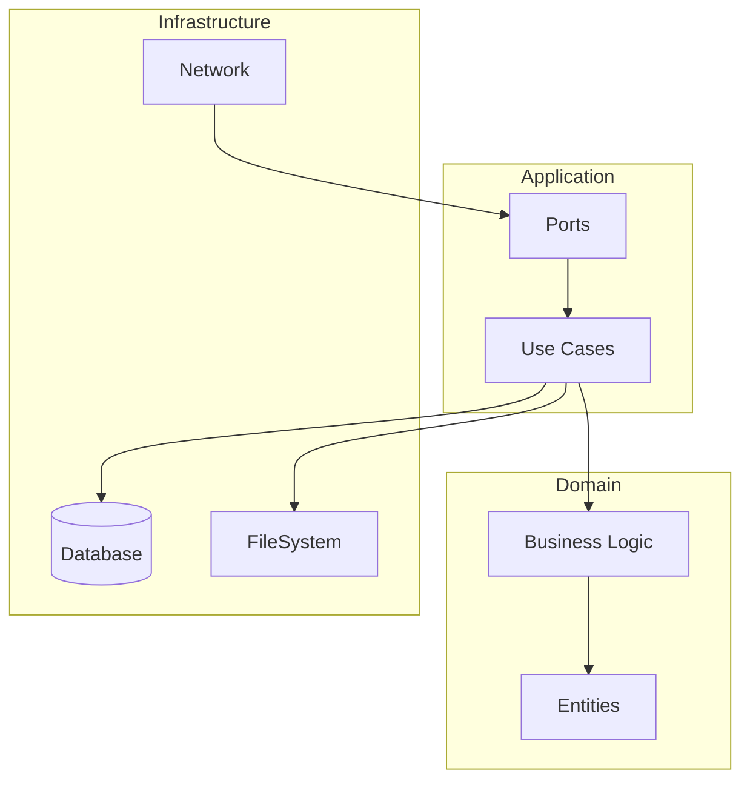
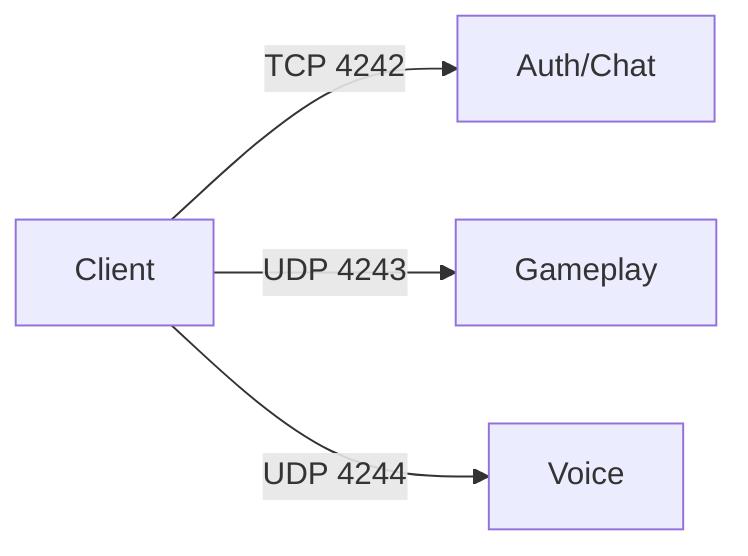
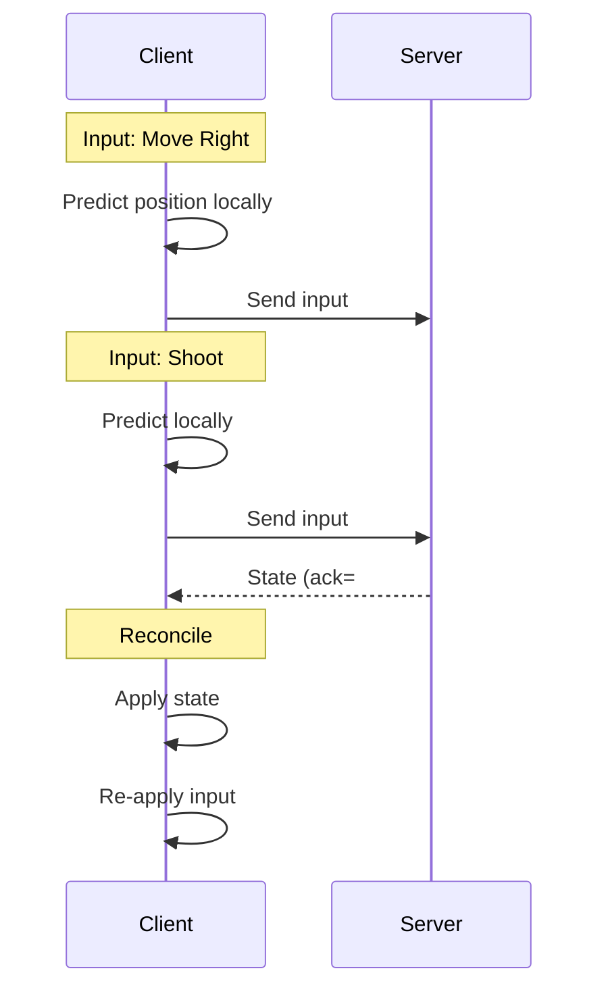

---
tags:
  - developpement
  - architecture
---

# Décisions Architecturales

Justification des choix architecturaux du projet.

## ADR-001: Architecture Hexagonale (Serveur)

### Contexte

Le serveur doit être testable, maintenable et extensible.

### Décision

Adopter l'architecture hexagonale (Ports & Adapters).

### Conséquences

**Positives:**

- Tests unitaires sans dépendances externes
- Facilité de changer les implémentations (ex: MongoDB → PostgreSQL)
- Séparation claire des responsabilités

**Négatives:**

- Plus de code boilerplate (interfaces)
- Courbe d'apprentissage



---

## ADR-002: ECS vs Héritage (Entités)

### Contexte

Comment représenter les entités du jeu (joueurs, ennemis, missiles)?

### Options

1. **Entity Component System (ECS)**
2. **Héritage classique**

### Décision

Héritage classique pour la simplicité.

### Justification

- Nombre limité d'entités (~50 max)
- Types bien définis (Player, Enemy, Missile)
- Comportements spécifiques à chaque type
- ECS = over-engineering pour ce cas

```cpp
// Simple et efficace pour R-Type
class Entity { /* base */ };
class Player : public Entity { /* ... */ };
class Enemy : public Entity { /* ... */ };
class Missile : public Entity { /* ... */ };
```

---

## ADR-003: UDP vs TCP (Gameplay)

### Contexte

Quel protocole pour la synchronisation temps réel?

### Décision

- **TCP** pour les données fiables (auth, chat, rooms)
- **UDP** pour les données temps réel (inputs, snapshots)

### Justification

| Critère | TCP | UDP |
|---------|-----|-----|
| Latence | ~50ms+ | ~10ms |
| Fiabilité | Garantie | Non garantie |
| Ordre | Garanti | Non garanti |
| Utilisation | Auth, chat | Gameplay |



---

## ADR-004: Client-Side Prediction

### Contexte

Comment masquer la latence réseau pour le joueur?

### Décision

Implémenter la prédiction côté client avec réconciliation serveur.

### Fonctionnement

1. Client applique immédiatement ses inputs localement
2. Client envoie les inputs au serveur
3. Serveur calcule l'état autoritatif
4. Client reçoit l'état serveur et réconcilie



---

## ADR-005: Abstraction Graphique

### Contexte

Support de SDL2 et SFML pour la portabilité.

### Décision

Interface `Renderer` avec implémentations SDL2 et SFML.

### Structure

```cpp
// Interface
class IRenderer {
public:
    virtual void clear() = 0;
    virtual void draw(const Sprite&) = 0;
    virtual void present() = 0;
};

// Implémentations
class SDL2Renderer : public IRenderer { /* ... */ };
class SFMLRenderer : public IRenderer { /* ... */ };

// Factory
auto renderer = createRenderer("sfml");  // ou "sdl2"
```

---

## ADR-006: Voice Chat (Opus)

### Contexte

Chat vocal entre joueurs pendant la partie.

### Décision

Utiliser Opus codec avec PortAudio.

### Justification

- **Opus**: Meilleur codec audio pour la voix, open source
- **PortAudio**: Cross-platform, supporte multiples APIs

### Paramètres

| Paramètre | Valeur | Raison |
|-----------|--------|--------|
| Sample Rate | 48000 Hz | Standard Opus |
| Channels | 1 (mono) | Voix uniquement |
| Bitrate | 24 kbps | Balance qualité/bande passante |
| Frame Size | 20 ms | Latence acceptable |

---

## ADR-007: MongoDB (Persistance)

### Contexte

Stockage des scores et profils joueurs.

### Options

1. MongoDB (NoSQL)
2. PostgreSQL (SQL)
3. SQLite (embedded)

### Décision

MongoDB

### Justification

- Schéma flexible pour évolution future
- Requêtes simples (pas de jointures complexes)
- Scaling horizontal si nécessaire
- Bonne intégration C++ (mongocxx)

---

## ADR-008: Tick Rate 20 Hz

### Contexte

Fréquence de broadcast des snapshots serveur.

### Décision

20 broadcasts par seconde (50ms par snapshot).

### Justification

| Tick Rate | Latence | CPU | Use Case |
|-----------|---------|-----|----------|
| 20 Hz | 50ms | Faible | Action (R-Type) |
| 60 Hz | 16ms | Moyen | FPS casual |
| 128 Hz | 8ms | Élevé | FPS compétitif |

R-Type est un shoot'em up horizontal où la précision frame-perfect n'est pas critique. 20 Hz (BROADCAST_INTERVAL_MS = 50ms) offre un excellent équilibre entre fluidité et bande passante.

---

## Résumé

| Décision | Choix | Raison |
|----------|-------|--------|
| Architecture serveur | Hexagonale | Testabilité |
| Entités | Héritage | Simplicité |
| Protocole gameplay | UDP | Latence |
| Latence | Prediction | UX |
| Graphics | Abstraction | Portabilité |
| Voice | Opus + PortAudio | Qualité |
| Database | MongoDB | Flexibilité |
| Tick rate | 20 Hz | Balance latence/bande passante |
