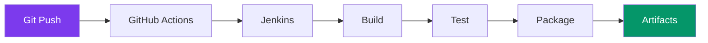
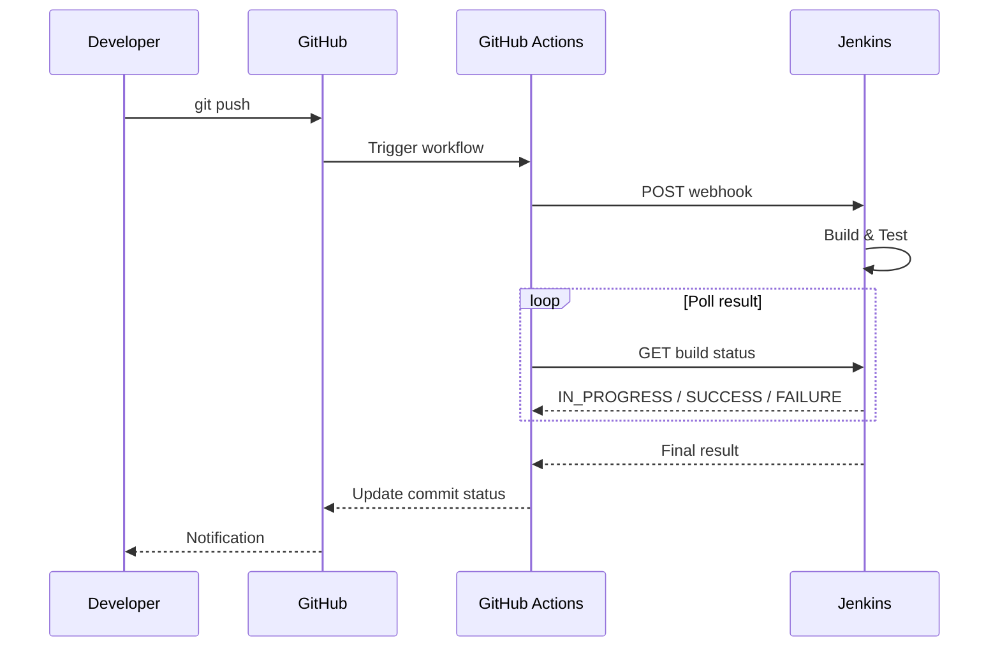

---
tags:
  - developpement
  - ci-cd
  - devops
---

# CI/CD Pipeline

Intégration et déploiement continus pour R-Type.

## Vue d'Ensemble



---

## Architecture CI/CD

Le projet utilise une combinaison de **GitHub Actions** et **Jenkins** :

| Composant | Rôle |
|-----------|------|
| GitHub Actions | Déclenche les builds Jenkins |
| Jenkins | Build, test, packaging multi-plateforme |
| vcpkg | Gestion des dépendances |
| Ninja | Génération de build rapide |

---

## GitHub Actions

### Workflow Jenkins Trigger

Le fichier `.github/workflows/jenkins-trigger.yml` déclenche automatiquement Jenkins à chaque push.

```yaml
name: Jenkins Build Trigger

on:
  push:
    branches:
      - '**'  # Toutes les branches

jobs:
  trigger-jenkins:
    runs-on: ubuntu-latest
    steps:
      - uses: actions/checkout@v4

      - name: Trigger and monitor Jenkins build
        env:
          JENKINS_PASSWORD: ${{ secrets.JENKINS_PASSWORD }}
        run: |
          # Déclenche le webhook Jenkins
          curl -sf -u "$JENKINS_USER:$JENKINS_PASSWORD" \
            "$JENKINS_BASE/multibranch-webhook-trigger/invoke?token=Trigger-Rtype"

          # Attend et vérifie le résultat du build
          # ...
```

### Fonctionnement

1. **Push** sur n'importe quelle branche
2. **GitHub Actions** déclenche le webhook Jenkins
3. **Jenkins** lance le build pour la branche
4. **GitHub Actions** attend le résultat (timeout 58min)
5. **Status** remonté dans la PR/commit

---

## Jenkins Pipeline

### Build Matrix

| Plateforme | Compilateur | Triplet vcpkg |
|------------|-------------|---------------|
| Linux | Clang 16+ | `x64-linux` |
| Windows | MinGW-w64 | `x64-mingw-static` |
| macOS | Clang 16+ | `x64-osx` |

### Étapes du Pipeline

```groovy
// Jenkinsfile (simplifié)
pipeline {
    agent any

    stages {
        stage('Checkout') {
            steps {
                checkout scm
            }
        }

        stage('Configure') {
            steps {
                sh './scripts/build.sh'
            }
        }

        stage('Build') {
            steps {
                sh './scripts/compile.sh'
            }
        }

        stage('Test') {
            steps {
                sh './scripts/test.sh'
            }
        }

        stage('Package') {
            steps {
                archiveArtifacts artifacts: 'artifacts/**/*'
            }
        }
    }
}
```

---

## Scripts de Build

### build.sh

Configure vcpkg et CMake :

```bash
#!/usr/bin/env bash
# Configure pour la plateforme spécifiée
./scripts/build.sh                    # Linux (défaut)
./scripts/build.sh --platform=windows # Windows cross-compile
./scripts/build.sh --platform=macos   # macOS
```

**Actions :**

1. Clone/update vcpkg dans `third_party/vcpkg/`
2. Bootstrap vcpkg
3. Configure CMake avec Ninja
4. Installe les dépendances vcpkg

### compile.sh

Compile le projet :

```bash
#!/usr/bin/env bash
ninja -C buildLinux   # ou buildWin, buildMac
```

### test.sh

Exécute les tests :

```bash
#!/usr/bin/env bash
cd buildLinux
ctest --output-on-failure
```

---

## Artifacts

Les artifacts sont générés dans `artifacts/` :

```
artifacts/
├── server/
│   ├── linux/
│   │   └── rtype_server
│   └── windows/
│       └── rtype_server.exe
└── client/
    ├── linux/
    │   └── rtype_client
    └── windows/
        └── rtype_client.exe
```

### Téléchargement

Les artifacts sont disponibles sur Jenkins après un build réussi :

```
https://jenkins.example.com/job/Rtype/job/<branch>/<build>/artifact/artifacts/
```

---

## Configuration vcpkg

### Dépendances

Le projet utilise vcpkg pour gérer les dépendances C++ :

| Package | Usage |
|---------|-------|
| `boost-asio` | Networking async |
| `gtest` | Tests unitaires |
| `spdlog` | Logging |
| `openssl` | TLS/Crypto |
| `protobuf` | Sérialisation |
| `sfml` | Client graphics (SFML backend) |
| `sdl2` | Client graphics (SDL2 backend) |
| `opus` | Voice codec |
| `portaudio` | Audio I/O |

### Triplets

| Plateforme | Triplet |
|------------|---------|
| Linux | `x64-linux` |
| Windows (MinGW) | `x64-mingw-static` |
| macOS | `x64-osx` |

---

## Secrets GitHub

| Secret | Description |
|--------|-------------|
| `JENKINS_PASSWORD` | Token d'authentification Jenkins |

---

## Monitoring du Build

Le workflow GitHub Actions :

1. Trouve le job Jenkins pour la branche
2. Déclenche le webhook
3. Poll toutes les 10s pour le résultat (max 350 tentatives = ~58min)
4. Vérifie que le commit correspond
5. Retourne SUCCESS/FAILURE/ABORTED

```yaml
# Statut final
case "$RESULT" in
  SUCCESS) exit 0 ;;
  FAILURE) exit 1 ;;
  ABORTED) exit 1 ;;
  *) exit 1 ;;
esac
```

---

## Diagramme de Séquence



---

## Troubleshooting

### Build Timeout

Si le build dépasse 58 minutes :

```
::error::Build did not complete after 58 minutes
```

**Solution** : Vérifier les logs Jenkins pour identifier le blocage.

### Branch Not Found

```
::warning::Branch feature/xyz not found in Jenkins jobs
```

**Solution** : Jenkins doit scanner les branches. Attendre ou déclencher manuellement.

### Artifacts Not Available

Les artifacts ne sont disponibles que si le build a réussi. En cas d'échec, consulter les logs Jenkins.
