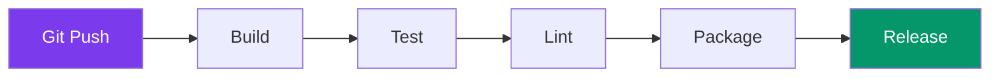

---
tags:
  - developpement
  - ci-cd
  - devops
---

# CI/CD Pipeline

Intégration et déploiement continus pour R-Type.

## Vue d'Ensemble



---

## GitHub Actions

### Workflow Principal

```yaml
# .github/workflows/ci.yml
name: CI

on:
  push:
    branches: [main, develop]
  pull_request:
    branches: [main, develop]

jobs:
  build:
    runs-on: ${{ matrix.os }}
    strategy:
      matrix:
        os: [ubuntu-latest, windows-latest, macos-latest]
        build_type: [Release, Debug]

    steps:
      - uses: actions/checkout@v4

      - name: Setup Python
        uses: actions/setup-python@v4
        with:
          python-version: '3.11'

      - name: Install Conan
        run: pip install conan

      - name: Configure Conan
        run: conan profile detect

      - name: Install Dependencies
        run: conan install . --build=missing -s build_type=${{ matrix.build_type }}

      - name: Configure CMake
        run: cmake --preset conan-${{ matrix.build_type | lower }}

      - name: Build
        run: cmake --build --preset conan-${{ matrix.build_type | lower }}

      - name: Test
        run: ctest --preset conan-${{ matrix.build_type | lower }} --output-on-failure
```

---

## Jobs Détaillés

### Build Matrix

| OS | Compiler | Build Type |
|----|----------|------------|
| Ubuntu | GCC 13 | Release, Debug |
| Windows | MSVC 2022 | Release, Debug |
| macOS | Clang 16 | Release, Debug |

### Lint Job

```yaml
lint:
  runs-on: ubuntu-latest
  steps:
    - uses: actions/checkout@v4

    - name: Install clang-format
      run: sudo apt-get install clang-format-16

    - name: Check Format
      run: |
        find . -name "*.cpp" -o -name "*.hpp" | \
        xargs clang-format-16 --dry-run --Werror

    - name: Run clang-tidy
      run: |
        cmake --preset conan-release
        run-clang-tidy -p build
```

### Test Job avec Coverage

```yaml
test-coverage:
  runs-on: ubuntu-latest
  steps:
    - uses: actions/checkout@v4

    - name: Build with Coverage
      run: |
        cmake -B build -DENABLE_COVERAGE=ON
        cmake --build build

    - name: Run Tests
      run: ctest --test-dir build --output-on-failure

    - name: Generate Coverage
      run: |
        lcov --capture --directory build --output-file coverage.info
        lcov --remove coverage.info '/usr/*' --output-file coverage.info

    - name: Upload to Codecov
      uses: codecov/codecov-action@v3
      with:
        files: coverage.info
```

---

## Release Pipeline

### Build Artifacts

```yaml
# .github/workflows/release.yml
name: Release

on:
  push:
    tags: ['v*']

jobs:
  build-release:
    runs-on: ${{ matrix.os }}
    strategy:
      matrix:
        include:
          - os: ubuntu-latest
            artifact: rtype-linux
          - os: windows-latest
            artifact: rtype-windows
          - os: macos-latest
            artifact: rtype-macos

    steps:
      - uses: actions/checkout@v4

      - name: Build
        run: |
          conan install . --build=missing -s build_type=Release
          cmake --preset conan-release
          cmake --build --preset conan-release

      - name: Package
        run: |
          mkdir -p dist
          cp build/client/rtype_client dist/
          cp build/server/rtype_server dist/
          cp -r assets dist/

      - name: Upload Artifact
        uses: actions/upload-artifact@v3
        with:
          name: ${{ matrix.artifact }}
          path: dist/

  create-release:
    needs: build-release
    runs-on: ubuntu-latest
    steps:
      - name: Download Artifacts
        uses: actions/download-artifact@v3

      - name: Create Archives
        run: |
          zip -r rtype-linux.zip rtype-linux/
          zip -r rtype-windows.zip rtype-windows/
          zip -r rtype-macos.zip rtype-macos/

      - name: Create Release
        uses: softprops/action-gh-release@v1
        with:
          files: |
            rtype-linux.zip
            rtype-windows.zip
            rtype-macos.zip
```

---

## Docker

### Dockerfile Server

```dockerfile
# Dockerfile.server
FROM ubuntu:24.04 AS builder

RUN apt-get update && apt-get install -y \
    build-essential cmake git python3 python3-pip

RUN pip install conan && conan profile detect

WORKDIR /app
COPY . .

RUN conan install . --build=missing -s build_type=Release
RUN cmake --preset conan-release
RUN cmake --build --preset conan-release --target rtype_server

# Runtime
FROM ubuntu:24.04

RUN apt-get update && apt-get install -y \
    libstdc++6 ca-certificates

COPY --from=builder /app/build/server/rtype_server /usr/local/bin/

EXPOSE 4242 4243 4244

CMD ["rtype_server"]
```

### Docker Compose

```yaml
# docker-compose.yml
version: '3.8'

services:
  server:
    build:
      context: .
      dockerfile: Dockerfile.server
    ports:
      - "4242:4242"
      - "4243:4243/udp"
      - "4244:4244/udp"
    environment:
      - MONGO_URI=mongodb://mongo:27017
    depends_on:
      - mongo

  mongo:
    image: mongo:7
    volumes:
      - mongo-data:/data/db

volumes:
  mongo-data:
```

---

## Conan Configuration

### conanfile.py

```python
from conan import ConanFile
from conan.tools.cmake import CMakeToolchain, CMakeDeps, cmake_layout

class RTypeRecipe(ConanFile):
    name = "rtype"
    version = "1.0.0"

    settings = "os", "compiler", "build_type", "arch"

    requires = [
        "sfml/2.6.1",
        "sdl/2.28.5",
        "opus/1.4",
        "portaudio/19.7.0",
        "mongo-cxx-driver/3.9.0",
        "gtest/1.14.0",
    ]

    def layout(self):
        cmake_layout(self)

    def generate(self):
        deps = CMakeDeps(self)
        deps.generate()
        tc = CMakeToolchain(self)
        tc.generate()
```

---

## Badges

```markdown
[](...)
[](...)
[](...)
```

---

## Secrets GitHub

| Secret | Description |
|--------|-------------|
| `CODECOV_TOKEN` | Token Codecov |
| `DOCKER_USERNAME` | Docker Hub username |
| `DOCKER_PASSWORD` | Docker Hub password |
