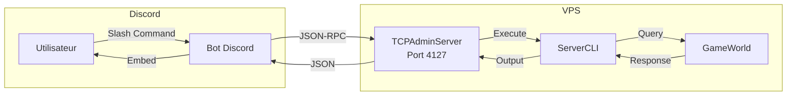

---
tags:
  - developpement
  - discord
  - admin
---

# Bot Admin Discord

Bot Discord pour l'administration a distance du serveur R-Type via le TCPAdminServer.

## Architecture



---

## Prerequis

- Python 3.12+
- discord.py 2.3+
- Acces au VPS (pour la configuration)

---

## Installation

```bash
cd discord-bot/admin
python3 -m venv venv
source venv/bin/activate
pip install -r requirements.txt
```

---

## Configuration

Copiez `.env.example` vers `.env` et configurez :

```bash
# Discord
DISCORD_TOKEN=votre_token_bot_discord
ADMIN_CHANNEL_ID=1234567890123456789    # Channel autorise
ADMIN_ROLE_ID=1234567890123456789       # Role requis

# Serveur R-Type
RTYPE_SERVER_HOST=localhost             # Toujours localhost (bot sur meme VPS)
RTYPE_ADMIN_PORT=4127
ADMIN_TOKEN=votre_admin_token_256bit    # Doit correspondre au serveur

# Logging
LOG_LEVEL=INFO
```

### Variables detaillees

| Variable | Description | Obligatoire |
|----------|-------------|-------------|
| `DISCORD_TOKEN` | Token du bot Discord | Oui |
| `ADMIN_CHANNEL_ID` | ID du channel ou les commandes sont autorisees | Oui |
| `ADMIN_ROLE_ID` | ID du role requis pour utiliser les commandes | Oui |
| `RTYPE_SERVER_HOST` | Adresse du TCPAdminServer | Oui |
| `RTYPE_ADMIN_PORT` | Port du TCPAdminServer (defaut: 4127) | Non |
| `ADMIN_TOKEN` | Token d'authentification (doit correspondre au serveur) | Oui |
| `LOG_LEVEL` | Niveau de log (DEBUG, INFO, WARNING, ERROR) | Non |

---

## Securite

| Couche | Protection |
|--------|------------|
| **Discord** | Role requis pour utiliser les commandes |
| **Discord** | Channel restreint (commandes ignorees ailleurs) |
| **Reseau** | TCPAdminServer bind sur localhost uniquement |
| **Authentification** | Token 256-bit requis pour chaque requete |
| **Commandes** | Commandes dangereuses filtrees cote serveur |

!!! warning "Token identique"
    Le `ADMIN_TOKEN` du bot **doit** correspondre exactement a celui configure dans le fichier `.env` du serveur R-Type.

---

## Slash Commands

### Administration serveur

| Commande | Description |
|----------|-------------|
| `/status` | Affiche l'etat du serveur (uptime, joueurs, sessions) |
| `/sessions` | Liste toutes les sessions actives |
| `/rooms` | Liste toutes les salles de jeu actives |
| `/room <code>` | Affiche les details d'une salle specifique |

### Gestion des utilisateurs

| Commande | Description |
|----------|-------------|
| `/users` | Liste tous les utilisateurs enregistres |
| `/user <email>` | Affiche les details d'un utilisateur |

### Moderation

| Commande | Description |
|----------|-------------|
| `/kick <email>` | Deconnecte un joueur |
| `/ban <email> [reason]` | Bannit un utilisateur |
| `/unban <email>` | Debannit un utilisateur |
| `/bans` | Liste les utilisateurs bannis |

### Communication

| Commande | Description |
|----------|-------------|
| `/broadcast <message>` | Envoie un message a tous les joueurs connectes |

### Utilitaires

| Commande | Description |
|----------|-------------|
| `/cli <command>` | Execute une commande CLI arbitraire |
| `/help` | Affiche l'aide |

---

## Exemples d'utilisation

### Verifier l'etat du serveur

```
/status
```

Resultat :
```
🖥️ Server Status
━━━━━━━━━━━━━━━━━━━━━━━━━━━━━━
📊 Users: 42 registered
🔗 Sessions: 8 active
🏠 Rooms: 3 active
⏱️ Uptime: 2d 5h 32m
```

### Bannir un joueur

```
/ban cheater@example.com Utilisation de hack
```

### Envoyer un message global

```
/broadcast Maintenance prevue dans 10 minutes !
```

---

## Lancement

### Developpement

```bash
cd discord-bot/admin
source venv/bin/activate
python bot.py
```

### Production (systemd)

```ini
# /etc/systemd/system/rtype-discord-admin.service

[Unit]
Description=R-Type Discord Admin Bot
After=network.target rtype-server.service

[Service]
Type=simple
User=rtype
WorkingDirectory=/opt/rtype/discord-bot/admin
ExecStart=/opt/rtype/discord-bot/admin/venv/bin/python bot.py
Restart=always
RestartSec=10
EnvironmentFile=/opt/rtype/discord-bot/admin/.env

[Install]
WantedBy=multi-user.target
```

```bash
# Activer et demarrer
sudo systemctl enable rtype-discord-admin
sudo systemctl start rtype-discord-admin

# Verifier le status
systemctl status rtype-discord-admin
```

---

## Structure du code

```
discord-bot/admin/
├── bot.py              # Point d'entree principal
├── config.py           # Configuration depuis .env
├── tcp_client.py       # Client TCP async pour TCPAdminServer
├── cogs/
│   ├── admin.py        # Commandes /status, /sessions, /rooms
│   ├── users.py        # Commandes /users, /user
│   └── moderation.py   # Commandes /kick, /ban, /unban
├── utils/
│   └── embeds.py       # Generateurs d'embeds Discord
├── requirements.txt
└── .env.example
```

---

## Depannage

??? question "Le bot ne repond pas aux commandes"
    - Verifiez que le bot est dans le bon channel (`ADMIN_CHANNEL_ID`)
    - Verifiez que l'utilisateur a le bon role (`ADMIN_ROLE_ID`)
    - Consultez les logs : `journalctl -u rtype-discord-admin -f`

??? question "Erreur de connexion au TCPAdminServer"
    - Verifiez que le serveur R-Type est demarre
    - Verifiez que `ADMIN_TOKEN` correspond
    - Le bot doit tourner sur le meme VPS (localhost)

??? question "Token Discord invalide"
    - Regenerez le token sur le [Discord Developer Portal](https://discord.com/developers/applications)
    - Mettez a jour `DISCORD_TOKEN` dans `.env`
    - Redemarrez le bot

---

## Liens

- [Configuration TCPAdminServer](../configuration/serveur.md#tcpadminserver-administration-a-distance)
- [Bot Leaderboard Discord](discord-leaderboard-bot.md)
- [Documentation VPS](vps.md)
