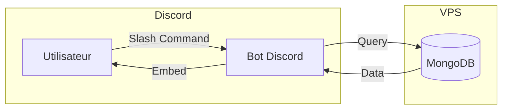

---
tags:
  - developpement
  - discord
  - leaderboard
---

# Bot Leaderboard Discord

Bot Discord pour afficher les statistiques, classements et achievements des joueurs R-Type.

## Architecture



---

## Prerequis

- Python 3.12+
- discord.py 2.3+
- motor (driver MongoDB async)
- Acces MongoDB (local ou distant)

---

## Installation

```bash
cd discord-bot/leaderboard
python3 -m venv venv
source venv/bin/activate
pip install -r requirements.txt
```

---

## Configuration

Copiez `.env.example` vers `.env` et configurez :

```bash
# Discord
DISCORD_TOKEN=votre_token_bot_discord
DISCORD_GUILD_ID=                       # Optionnel, pour sync rapide en dev
ALLOWED_CHANNEL_IDS=123,456,789         # Channels autorises (vide = tous)

# MongoDB
MONGODB_URI=mongodb://localhost:8089
MONGODB_DATABASE=rtype

# Optionnel
STATS_CHANNEL_ID=                       # Channel pour updates automatiques
LOG_LEVEL=INFO
EMBED_COLOR=0x00FF00                    # Couleur des embeds (hex)
```

### Variables detaillees

| Variable | Description | Obligatoire |
|----------|-------------|-------------|
| `DISCORD_TOKEN` | Token du bot Discord | Oui |
| `DISCORD_GUILD_ID` | ID du serveur pour sync rapide (dev only) | Non |
| `ALLOWED_CHANNEL_IDS` | IDs des channels autorises (separes par virgule) | Non |
| `MONGODB_URI` | URI de connexion MongoDB | Oui |
| `MONGODB_DATABASE` | Nom de la base de donnees | Oui |
| `STATS_CHANNEL_ID` | Channel pour les annonces automatiques | Non |
| `LOG_LEVEL` | Niveau de log (DEBUG, INFO, WARNING, ERROR) | Non |
| `EMBED_COLOR` | Couleur par defaut des embeds (hex) | Non |

---

## Slash Commands

### Classements

| Commande | Description |
|----------|-------------|
| `/leaderboard [category] [period] [mode] [limit]` | Affiche le classement |
| `/daily [mode]` | Raccourci pour le top 10 des dernieres 24h |
| `/rank <player> [mode]` | Position d'un joueur dans les classements |

#### Options de `/leaderboard`

| Option | Valeurs | Defaut |
|--------|---------|--------|
| `category` | score, kills, wave, kd, bosses, playtime | score |
| `period` | all-time, daily, weekly, monthly | all-time |
| `mode` | all, solo, duo, trio, 4p | all |
| `limit` | 5-50 | 10 |

### Statistiques joueur

| Commande | Description |
|----------|-------------|
| `/stats <player>` | Statistiques completes d'un joueur |
| `/kills <player>` | Repartition des kills par arme |
| `/compare <player1> <player2>` | Compare deux joueurs |

### Achievements

| Commande | Description |
|----------|-------------|
| `/achievements <player>` | Achievements d'un joueur avec rarete |

#### Indicateurs de rarete

| Symbole | Rarete | Pourcentage |
|---------|--------|-------------|
| 💎 | Legendaire | < 5% |
| 🟣 | Epique | 5-15% |
| 🔵 | Rare | 15-30% |
| 🟢 | Commun | 30-50% |
| ⚪ | Tres commun | > 50% |

### Historique

| Commande | Description |
|----------|-------------|
| `/history <player> [limit]` | Historique des parties (defaut: 5, max: 10) |

### Armes

| Commande | Description |
|----------|-------------|
| `/weapon <type> [limit]` | Top joueurs par arme specifique |

#### Types d'armes

| Type | Description |
|------|-------------|
| `standard` | Tir de base |
| `spread` | Tir en eventail |
| `laser` | Rayon laser |
| `missile` | Missile a tete chercheuse |

### Serveur

| Commande | Description |
|----------|-------------|
| `/online` | Sessions de jeu actives |
| `/server-stats` | Statistiques globales du serveur |

---

## Fonctionnalites speciales

### Pagination

Les classements longs utilisent des boutons de navigation :

| Bouton | Action |
|--------|--------|
| ⏮️ | Premiere page |
| ◀️ | Page precedente |
| ▶️ | Page suivante |
| ⏭️ | Derniere page |

### Autocompletion des joueurs

Toutes les commandes avec parametre `<player>` supportent l'autocompletion.
Commencez a taper le nom et Discord affiche les suggestions.

### Annonce changement de leader

Quand un joueur devient #1 all-time, une annonce automatique est envoyee dans `STATS_CHANNEL_ID` (si configure).

```
🏆 Nouveau Leader All-Time !

PlayerName vient de prendre la tete du classement avec 125,000 points !
```

---

## Collections MongoDB utilisees

| Collection | Champs utilises |
|------------|-----------------|
| `player_stats` | playerName, totalKills, totalDeaths, bestScore, bestWave, achievements, weapon kills |
| `leaderboard` | playerName, score, wave, kills, timestamp, playerCount |
| `game_history` | email, score, wave, kills, deaths, duration, timestamp, weapon kills |
| `achievements` | email, type (bit), unlockedAt |
| `users` | username, email |
| `current_sessions` | roomCode, players, currentWave |

---

## Lancement

### Developpement

```bash
cd discord-bot/leaderboard
source venv/bin/activate
python bot.py
```

### Production (systemd)

```ini
# /etc/systemd/system/rtype-discord-leaderboard.service

[Unit]
Description=R-Type Discord Leaderboard Bot
After=network.target mongod.service

[Service]
Type=simple
User=rtype
WorkingDirectory=/opt/rtype/discord-bot/leaderboard
ExecStart=/opt/rtype/discord-bot/leaderboard/venv/bin/python bot.py
Restart=always
RestartSec=10
EnvironmentFile=/opt/rtype/discord-bot/leaderboard/.env

[Install]
WantedBy=multi-user.target
```

```bash
# Activer et demarrer
sudo systemctl enable rtype-discord-leaderboard
sudo systemctl start rtype-discord-leaderboard

# Verifier le status
systemctl status rtype-discord-leaderboard
```

---

## Structure du code

```
discord-bot/leaderboard/
├── bot.py                      # Point d'entree principal
├── config.py                   # Configuration depuis .env
├── database/
│   ├── mongodb.py              # Connexion MongoDB singleton
│   ├── leaderboard_repo.py     # Requetes leaderboard
│   ├── player_stats_repo.py    # Requetes stats & achievements
│   └── session_repo.py         # Requetes sessions actives
├── cogs/
│   ├── leaderboard.py          # /leaderboard, /daily, /weapon, /rank
│   ├── stats.py                # /stats, /kills, /compare, /server-stats
│   ├── achievements.py         # /achievements
│   ├── history.py              # /history
│   └── online.py               # /online
├── utils/
│   ├── embeds.py               # Generateurs d'embeds Discord
│   ├── formatters.py           # Formatage nombres/durees/timestamps
│   └── pagination.py           # Vues paginées avec boutons
├── requirements.txt
└── .env.example
```

---

## Exemples d'utilisation

### Classement par score (top 10 all-time)

```
/leaderboard
```

### Classement solo du jour

```
/leaderboard category:score period:daily mode:solo
```

ou

```
/daily mode:solo
```

### Statistiques d'un joueur

```
/stats PlayerName
```

Resultat :
```
📊 Statistiques de PlayerName
━━━━━━━━━━━━━━━━━━━━━━━━━━━━━━
🎮 Parties jouees: 42
⚔️ K/D Ratio: 2.5 (250/100)
🏆 Meilleur score: 125,000
🌊 Meilleure vague: 35
⏱️ Temps de jeu: 12h 30m
🔫 Arme favorite: Laser (45%)
```

### Comparer deux joueurs

```
/compare Player1 Player2
```

---

## Depannage

??? question "Le bot ne repond pas aux commandes"
    - Verifiez que le bot est dans un channel autorise (`ALLOWED_CHANNEL_IDS`)
    - Si vide, le bot repond partout
    - Consultez les logs : `journalctl -u rtype-discord-leaderboard -f`

??? question "Erreur de connexion MongoDB"
    - Verifiez que MongoDB est demarre : `systemctl status mongod`
    - Verifiez l'URI dans `.env`
    - Testez la connexion : `mongosh mongodb://localhost:8089`

??? question "Autocompletion ne fonctionne pas"
    - L'autocompletion necessite des donnees dans `users`
    - Verifiez que des joueurs sont enregistres

??? question "Annonces de leader ne s'envoient pas"
    - Verifiez que `STATS_CHANNEL_ID` est configure
    - Verifiez que le bot a la permission d'ecrire dans ce channel

---

## Liens

- [Guide Leaderboard (joueur)](../guide/gameplay/leaderboard.md)
- [Bot Admin Discord](discord-admin-bot.md)
- [Documentation VPS](vps.md)
- [MongoDB](../technique/persistance/mongodb.md)
