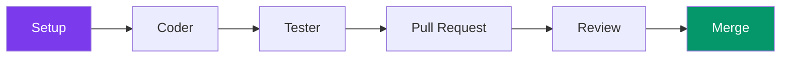

---
tags:
  - developpement
  - guide
---

# Guide Développement

Guide pour les contributeurs au projet R-Type.

## Vue d'Ensemble

Ce guide couvre tout ce dont vous avez besoin pour contribuer au projet R-Type.



---

## Prérequis

### Outils Requis

| Outil | Version | Description |
|-------|---------|-------------|
| C++ Compiler | GCC 13+ / Clang 16+ | Support C++23 |
| CMake | 3.30+ | Build system |
| Ninja | Latest | Build generator |
| Git | 2.40+ | Version control |
| Python | 3.10+ | Scripts et docs |

### Dépendances Système

```bash
# Ubuntu/Debian
sudo apt install build-essential cmake ninja-build git python3 python3-pip
sudo apt install clang clang-tools  # Pour Linux natif

# Pour cross-compile Windows
sudo apt install mingw-w64

# macOS
brew install cmake ninja git python3
```

---

## Structure du Projet

```
rtype/
├── src/
│   ├── client/                    # Application client
│   │   ├── include/
│   │   │   ├── core/             # Engine, GameLoop
│   │   │   ├── scenes/           # SceneManager, IScene
│   │   │   ├── network/          # UDPClient, TCPClient
│   │   │   ├── graphics/         # IWindow, IDrawable
│   │   │   └── audio/            # AudioManager, VoiceChatManager
│   │   ├── src/
│   │   └── lib/                  # Backends graphiques
│   │       ├── sfml/             # SFMLWindow, SFMLRenderer
│   │       └── sdl2/             # SDL2Window, SDL2Renderer
│   │
│   ├── server/                    # Application serveur
│   │   ├── include/
│   │   │   ├── domain/           # Entités, Value Objects
│   │   │   ├── application/      # Use Cases, Ports
│   │   │   └── infrastructure/   # Adapters, Network, Game
│   │   │       ├── adapters/in/network/  # UDPServer, TCPAuthServer
│   │   │       ├── game/         # GameWorld
│   │   │       ├── room/         # RoomManager
│   │   │       ├── session/      # SessionManager
│   │   │       └── bootstrap/    # GameBootstrap
│   │   └── infrastructure/
│   │
│   ├── common/                    # Code partagé
│   │   ├── protocol/             # Protocol.hpp
│   │   └── collision/            # AABB.hpp
│   │
│   └── ECS/                       # Entity Component System (future)
│
├── tests/                         # Tests unitaires
│   ├── server/                    # Tests serveur
│   └── client/                    # Tests client
│
├── docs/                          # Documentation MkDocs
├── assets/                        # Ressources graphiques/audio
├── scripts/                       # Scripts de build
├── third_party/vcpkg/             # Package manager
└── CMakeLists.txt                 # CMake racine
```

---

## Workflow Git

### Branches

| Branche | Description |
|---------|-------------|
| `main` | Production stable |
| `develop` | Intégration |
| `feature/*` | Nouvelles fonctionnalités |
| `fix/*` | Corrections de bugs |
| `docs/*` | Documentation |

### Commandes

```bash
# Créer une branche feature
git checkout develop
git pull origin develop
git checkout -b feature/ma-feature

# Après le développement
git add .
git commit -m "feat: description"
git push origin feature/ma-feature
```

---

## Build System

### vcpkg

Le projet utilise **vcpkg** comme gestionnaire de paquets, intégré dans `third_party/vcpkg/`.

```bash
# vcpkg est cloné et bootstrappé automatiquement par build.sh
./scripts/build.sh
```

### Scripts de Build

| Script | Description |
|--------|-------------|
| `scripts/build.sh` | Configure CMake + vcpkg |
| `scripts/compile.sh` | Compile le projet |
| `scripts/test.sh` | Exécute les tests |
| `scripts/run-client.sh` | Lance le client |

---

## Documentation

<div class="grid-cards">
  <div class="card">
    <h3><a href="architecture/">Architecture</a></h3>
    <p>Décisions architecturales</p>
  </div>
  <div class="card">
    <h3><a href="conventions/">Conventions</a></h3>
    <p>Style de code</p>
  </div>
  <div class="card">
    <h3><a href="tests/">Tests</a></h3>
    <p>Guide de test</p>
  </div>
  <div class="card">
    <h3><a href="ci-cd/">CI/CD</a></h3>
    <p>Intégration continue</p>
  </div>
  <div class="card">
    <h3><a href="contribution/">Contribution</a></h3>
    <p>Comment contribuer</p>
  </div>
</div>

---

## Quick Start

```bash
# 1. Cloner le repo
git clone https://github.com/your-org/rtype.git
cd rtype

# 2. Configurer (installe vcpkg + dépendances)
./scripts/build.sh

# 3. Compiler
./scripts/compile.sh

# 4. Exécuter les tests
./scripts/test.sh

# 5. Lancer
./artifacts/server/linux/rtype_server  # Serveur
./artifacts/client/linux/rtype_client  # Client
```

### Cross-Compilation Windows

```bash
# Depuis Linux
./scripts/build.sh --platform=windows
./scripts/compile.sh
# Binaires dans artifacts/*/windows/
```

---

## Ports Réseau

| Port | Protocole | Description |
|------|-----------|-------------|
| 4125 | TCP + TLS | Authentification, rooms, chat |
| 4124 | UDP | Game loop (20Hz broadcast) |
| 4126 | UDP | Voice chat (Opus) |
