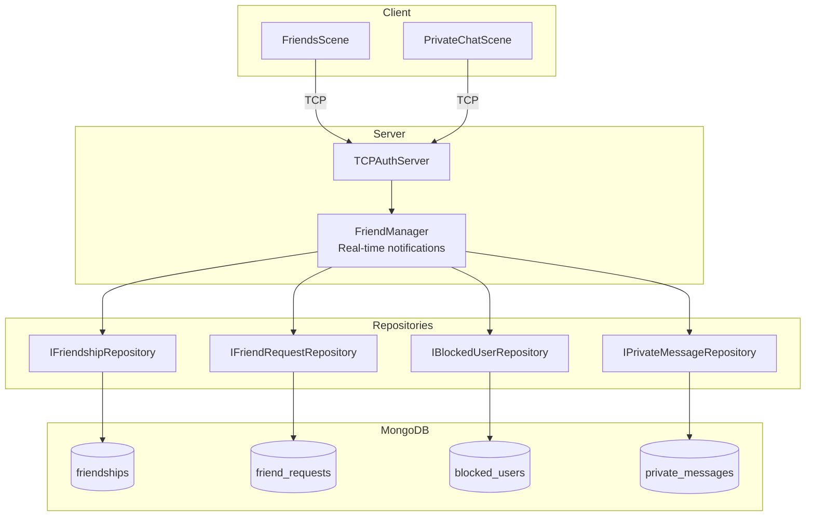

---
tags:
  - social
  - friends
  - messaging
  - tcp
---

# Friends & Private Messaging System

Systeme social avec demandes d'amis, amitiés, blocage et messages privés.

## Architecture



---

## TCP Protocol Messages (Friends)

| Type | Value | Direction | Description |
|------|-------|-----------|-------------|
| `SendFriendRequest` | 0x0600 | C→S | Envoyer demande d'ami |
| `FriendRequestSent` | 0x0601 | S→C | Confirmation envoi |
| `FriendRequestReceived` | 0x0602 | S→C | Notification demande reçue |
| `AcceptFriendRequest` | 0x0610 | C→S | Accepter demande |
| `RejectFriendRequest` | 0x0611 | C→S | Refuser demande |
| `FriendRequestAccepted` | 0x0612 | S→C | Notification acceptation |
| `FriendRequestRejected` | 0x0613 | S→C | Notification refus |
| `RemoveFriend` | 0x0620 | C→S | Supprimer ami |
| `FriendRemoved` | 0x0621 | S→C | Confirmation suppression |
| `BlockUser` | 0x0630 | C→S | Bloquer utilisateur |
| `UnblockUser` | 0x0631 | C→S | Débloquer utilisateur |
| `UserBlocked` | 0x0632 | S→C | Confirmation blocage |
| `UserUnblocked` | 0x0633 | S→C | Confirmation déblocage |
| `GetFriendsList` | 0x0640 | C→S | Demander liste amis |
| `FriendsListResponse` | 0x0641 | S→C | Liste des amis |
| `GetFriendRequests` | 0x0642 | C→S | Demander requêtes en attente |
| `FriendRequestsResponse` | 0x0643 | S→C | Requêtes en attente |
| `GetBlockedUsers` | 0x0644 | C→S | Demander liste bloqués |
| `BlockedUsersResponse` | 0x0645 | S→C | Liste des bloqués |
| `FriendStatusChanged` | 0x0650 | S→C | Notification statut en ligne |
| `FriendError` | 0x0698 | S→C | Réponse erreur |

---

## TCP Protocol Messages (Messages Privés)

| Type | Value | Direction | Description |
|------|-------|-----------|-------------|
| `SendPrivateMessage` | 0x0660 | C→S | Envoyer message privé |
| `PrivateMessageSent` | 0x0661 | S→C | Confirmation envoi |
| `PrivateMessageReceived` | 0x0662 | S→C | Notification message reçu |
| `GetConversation` | 0x0670 | C→S | Demander historique conversation |
| `ConversationResponse` | 0x0671 | S→C | Messages de la conversation |
| `GetConversationsList` | 0x0672 | C→S | Demander liste conversations |
| `ConversationsListResponse` | 0x0673 | S→C | Résumés des conversations |
| `MarkMessagesRead` | 0x0680 | C→S | Marquer messages comme lus |
| `MessagesMarkedRead` | 0x0681 | S→C | Confirmation lecture |

---

## Structures Wire

```cpp
// FriendEntryWire (98 bytes) - Ami dans la liste
struct FriendEntryWire {
    char email[MAX_EMAIL_LEN];          // 64 bytes
    char displayName[MAX_USERNAME_LEN]; // 32 bytes
    uint8_t onlineStatus;               // FriendOnlineStatus enum
    uint8_t padding;
};

// FriendRequestEntryWire (100 bytes) - Demande en attente
struct FriendRequestEntryWire {
    char fromEmail[MAX_EMAIL_LEN];      // 64 bytes
    char fromDisplayName[MAX_USERNAME_LEN]; // 32 bytes
    uint32_t timestamp;                 // Unix timestamp
};

// PrivateMessageWire (233 bytes) - Message dans conversation
struct PrivateMessageWire {
    uint64_t messageId;
    char senderEmail[MAX_EMAIL_LEN];    // 64 bytes
    char senderDisplayName[MAX_USERNAME_LEN]; // 32 bytes
    uint64_t timestamp;
    uint8_t isRead;
    char message[MAX_MESSAGE_LEN];      // 120 bytes
};

// ConversationSummaryWire (154 bytes) - Aperçu conversation
struct ConversationSummaryWire {
    char otherEmail[MAX_EMAIL_LEN];     // 64 bytes
    char otherDisplayName[MAX_USERNAME_LEN]; // 32 bytes
    char lastMessagePreview[50];
    uint64_t lastTimestamp;
    uint8_t unreadCount;
};
```

---

## Codes d'Erreur

```cpp
enum class FriendErrorCode : uint8_t {
    None = 0,
    UserNotFound = 1,
    AlreadyFriends = 2,
    RequestAlreadySent = 3,
    RequestNotFound = 4,
    CannotAddSelf = 5,
    UserBlocked = 6,
    BlockedByUser = 7,
    NotFriends = 8,
    AlreadyBlocked = 9,
    NotBlocked = 10,
    MessageTooLong = 11,
    MessageEmpty = 12,
    ConversationNotFound = 13,
    RateLimited = 14,
    ServerError = 15
};
```

---

## Collections MongoDB

| Collection | Description |
|------------|-------------|
| `friendships` | Relations d'amitié bidirectionnelles |
| `friend_requests` | Demandes d'amis en attente |
| `blocked_users` | Relations de blocage |
| `private_messages` | Historique des messages privés |

---

## Fichiers Clés

### Server

| Fichier | Description |
|---------|-------------|
| `src/server/include/infrastructure/social/FriendManager.hpp` | Gestionnaire notifications temps réel |
| `src/server/infrastructure/social/FriendManager.cpp` | Implémentation FriendManager |
| `src/server/include/application/ports/out/persistence/IFriendshipRepository.hpp` | Interface amitiés |
| `src/server/include/application/ports/out/persistence/IFriendRequestRepository.hpp` | Interface demandes |
| `src/server/include/application/ports/out/persistence/IBlockedUserRepository.hpp` | Interface blocage |
| `src/server/include/application/ports/out/persistence/IPrivateMessageRepository.hpp` | Interface messages |
| `src/server/infrastructure/adapters/out/persistence/MongoDBFriendshipRepository.cpp` | MongoDB amitiés |
| `src/server/infrastructure/adapters/out/persistence/MongoDBFriendRequestRepository.cpp` | MongoDB demandes |
| `src/server/infrastructure/adapters/out/persistence/MongoDBBlockedUserRepository.cpp` | MongoDB blocage |
| `src/server/infrastructure/adapters/out/persistence/MongoDBPrivateMessageRepository.cpp` | MongoDB messages |

### Client

| Fichier | Description |
|---------|-------------|
| `src/client/include/scenes/FriendsScene.hpp` | Scene UI amis (header) |
| `src/client/src/scenes/FriendsScene.cpp` | Scene UI amis (impl) |
| `src/client/include/scenes/PrivateChatScene.hpp` | Scene UI chat (header) |
| `src/client/src/scenes/PrivateChatScene.cpp` | Scene UI chat (impl) |

---

## Utilisation Client

```cpp
// Navigation vers la scene amis
auto& sceneManager = SceneManager::getInstance();
sceneManager.changeScene(std::make_unique<FriendsScene>());

// Envoyer demande d'ami
tcpClient.sendFriendRequest("friend@example.com");

// Accepter/refuser demande
tcpClient.acceptFriendRequest("requester@example.com");
tcpClient.rejectFriendRequest("requester@example.com");

// Bloquer/débloquer utilisateur
tcpClient.blockUser("user@example.com");
tcpClient.unblockUser("user@example.com");

// Supprimer ami
tcpClient.removeFriend("friend@example.com");

// Envoyer message privé
tcpClient.sendPrivateMessage("friend@example.com", "Hello!");

// Récupérer historique conversation (offset, limit)
tcpClient.getConversation("friend@example.com", 0, 50);

// Récupérer liste conversations
tcpClient.getConversationsList();

// Marquer messages comme lus
tcpClient.markMessagesRead("friend@example.com");
```

---

## Notifications Temps Réel

Le `FriendManager` gère les notifications push :

| Notification | Description |
|--------------|-------------|
| **FriendRequestReceived** | Quelqu'un vous envoie une demande |
| **FriendRequestAccepted** | Votre demande est acceptée |
| **FriendStatusChanged** | Un ami passe en ligne/hors ligne |
| **PrivateMessageReceived** | Nouveau message reçu |

!!! info "Push sans polling"
    Ces notifications sont poussées aux clients connectés via TCP sans nécessiter de polling.
