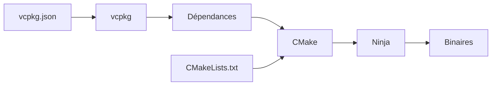

# Guide de Compilation

Ce guide détaille le système de build du projet R-Type, son fonctionnement et les options de compilation avancées.

## Vue d'ensemble du système de build

R-Type utilise une stack de build moderne :



- **vcpkg** : Gestionnaire de dépendances C++
- **CMake** : Générateur de système de build
- **Ninja** : Outil de build rapide
- **GCC** : Compilateur C++23

## Scripts de build

Le projet fournit plusieurs scripts dans `scripts/` :

### build.sh

Configure l'environnement et CMake.

```bash
#!/bin/bash
./scripts/build.sh
```

**Ce script effectue :**

1. Installe vcpkg dans `third_party/vcpkg`
2. Clone le repository Microsoft vcpkg
3. Bootstrap vcpkg (compile l'exécutable vcpkg)
4. Configure CMake avec :
   - Type de build : Debug
   - Générateur : Ninja
   - Toolchain : vcpkg
   - Triplet : x64-linux
   - Compilateurs : GCC/G++

**Options de configuration CMake :**

```cmake
-DCMAKE_BUILD_TYPE=Debug                    # Mode Debug
-DCMAKE_MAKE_PROGRAM=/usr/bin/ninja         # Utiliser Ninja
-G "Ninja"                                  # Générateur Ninja
-DCMAKE_CXX_COMPILER=g++                    # Compilateur C++
-DCMAKE_C_COMPILER=gcc                      # Compilateur C
-DVCPKG_TARGET_TRIPLET=x64-linux            # Architecture cible
-DCMAKE_TOOLCHAIN_FILE=third_party/vcpkg/scripts/buildsystems/vcpkg.cmake
```

### compile.sh

Compile le projet déjà configuré.

```bash
#!/bin/bash
./scripts/compile.sh
```

**Équivalent à :**

```bash
cmake --build build --config Debug
```

## Structure CMake

### CMakeLists.txt principal

**Chemin :** `CMakeLists.txt`

```cmake
cmake_minimum_required(VERSION 3.30)
project(rtype VERSION 0.0.1)

# Standard C++23
set(CMAKE_CXX_STANDARD 23)
set(CMAKE_CXX_STANDARD_REQUIRED ON)

# Intégration vcpkg
set(CMAKE_TOOLCHAIN_FILE
    "${CMAKE_SOURCE_DIR}/third_party/vcpkg/scripts/buildsystems/vcpkg.cmake"
    CACHE STRING "Vcpkg toolchain file")

# Support des tests
enable_testing()

# Dossier de sortie des binaires
set(CMAKE_RUNTIME_OUTPUT_DIRECTORY
    ${CMAKE_SOURCE_DIR}/artifacts/server/linux)

# Recherche des dépendances
find_package(Boost REQUIRED COMPONENTS system)
find_package(GTest REQUIRED)

# Sous-projets
add_subdirectory(src/server)
add_subdirectory(tests/server)
```

**Points clés :**

- Nécessite CMake 3.30+ pour le support complet C++23
- Utilise vcpkg comme toolchain
- Les binaires sont placés dans `artifacts/server/linux/`
- Inclut Boost.ASIO et Google Test

### CMakeLists.txt du serveur

**Chemin :** `src/server/CMakeLists.txt`

```cmake
# Créer l'exécutable serveur
add_executable(rtype_server main.cpp)

# Configuration Debug
target_compile_options(rtype_server PRIVATE
    -Wall -Wextra -Wpedantic    # Tous les warnings
    -g3                          # Debug symbols complets
    -O0                          # Pas d'optimisation
    -fno-omit-frame-pointer     # Pour les profilers
    -fsanitize=address          # AddressSanitizer
    -fsanitize=undefined        # UndefinedBehaviorSanitizer
    -fsanitize=leak             # LeakSanitizer
)

target_link_options(rtype_server PRIVATE
    -fsanitize=address
    -fsanitize=undefined
    -fsanitize=leak
)

# Librairies
target_link_libraries(rtype_server PRIVATE
    Boost::system
)
```

### CMakeLists.txt des tests

**Chemin :** `tests/server/CMakeLists.txt`

```cmake
# Créer l'exécutable de tests
add_executable(server_tests main.cpp)

# Librairies de test
target_link_libraries(server_tests PRIVATE
    GTest::gtest
    GTest::gtest_main
    Boost::system
)
```

## Dépendances vcpkg

### vcpkg.json

**Chemin :** `vcpkg.json`

```json
{
  "dependencies": ["boost-asio", "gtest", "mongo-cxx-driver"]
}
```

### vcpkg-configuration.json

**Chemin :** `vcpkg-configuration.json`

```json
{
  "default-registry": {
    "kind": "git",
    "repository": "https://github.com/microsoft/vcpkg",
    "baseline": "17ff26d0566ba0fa05e35c9209e92664adb304e3"
  }
}
```

La baseline fixe les versions des packages pour garantir la reproductibilité.

## Modes de compilation

### Mode Debug (par défaut)

Optimisé pour le développement et le débogage.

**Caractéristiques :**

- Symboles de debug complets (`-g3`)
- Pas d'optimisation (`-O0`)
- Sanitizers activés (ASan, UBSan, LSan)
- Warnings stricts

**Compilation :**

```bash
./scripts/build.sh
./scripts/compile.sh
```

**Ou manuellement :**

```bash
cmake -S . -B build \
    -DCMAKE_BUILD_TYPE=Debug \
    -DCMAKE_TOOLCHAIN_FILE=third_party/vcpkg/scripts/buildsystems/vcpkg.cmake \
    -G "Ninja"

cmake --build build
```

### Mode Release

Optimisé pour la production.

**Caractéristiques :**

- Optimisations maximales (`-O3`)
- Pas de symboles de debug
- Pas de sanitizers
- Code optimisé pour la vitesse

**Compilation :**

```bash
# Configuration Release
cmake -S . -B build \
    -DCMAKE_BUILD_TYPE=Release \
    -DCMAKE_TOOLCHAIN_FILE=third_party/vcpkg/scripts/buildsystems/vcpkg.cmake \
    -DCMAKE_CXX_COMPILER=g++ \
    -DCMAKE_C_COMPILER=gcc \
    -DVCPKG_TARGET_TRIPLET=x64-linux \
    -G "Ninja"

# Compilation
cmake --build build --config Release
```

### Mode RelWithDebInfo

Optimisé avec informations de debug.

```bash
cmake -S . -B build \
    -DCMAKE_BUILD_TYPE=RelWithDebInfo \
    -DCMAKE_TOOLCHAIN_FILE=third_party/vcpkg/scripts/buildsystems/vcpkg.cmake \
    -G "Ninja"

cmake --build build
```

## Cross-Compilation Multi-Plateforme

Le projet R-Type supporte la cross-compilation pour générer des binaires Windows depuis un environnement Linux.

### Plateformes Supportées

| Plateforme | Triplet | Architecture | Méthode | Statut |
|------------|---------|--------------|---------|--------|
| **Linux** | `x64-linux` | x86_64 | Native | ✅ Production |
| **Windows** | `x64-mingw-static` | x86_64 | Cross-compile (MinGW) | ✅ Production |
| **macOS** | `x64-osx` | x86_64 | Native / Cross-compile | 📋 Planifié |

### Compilation Linux (Native)

Par défaut, `build.sh` compile pour Linux :

```bash
./scripts/build.sh
./scripts/compile.sh

# Résultat
artifacts/server/linux/rtype_server  # Binaire ELF 64-bit
```

### Compilation Windows (Cross-compilation)

Pour compiler un binaire Windows depuis Linux avec MinGW :

```bash
./scripts/build.sh --platform=windows
./scripts/compile.sh

# Résultat
artifacts/server/windows/rtype_server.exe  # Binaire PE32+ 64-bit
```

**Prérequis:** MinGW-w64 doit être installé (déjà inclus dans le Docker builder).

**Caractéristiques du binaire Windows:**
- **Linking statique** - Aucune DLL externe nécessaire (Boost, MongoDB, etc.)
- **Taille** - ~80MB en Debug (vs ~15MB après strip en Release)
- **Portable** - Fonctionne sur Windows 7+ sans installation

### Vérification du Binaire

```bash
# Type de fichier
file artifacts/server/windows/rtype_server.exe
# Output: PE32+ executable (console) x86-64, for MS Windows

# Dépendances (doit être vide = statique)
x86_64-w64-mingw32-objdump -p artifacts/server/windows/rtype_server.exe | grep "DLL Name"
# Output: Uniquement DLLs système (kernel32.dll, ntdll.dll, ...)
```

### Test avec Wine (Optionnel)

```bash
# Installer Wine
sudo apt install wine64

# Exécuter le binaire Windows sous Linux
wine64 artifacts/server/windows/rtype_server.exe
```

!!! note "Limitations de Wine"
    Wine peut avoir des problèmes avec le réseau et certaines fonctionnalités. Pour un test complet, utilisez un vrai environnement Windows.

### Pipeline Jenkins Multi-Plateforme

Le pipeline Jenkins compile automatiquement Linux **et** Windows en parallèle :

```groovy
stage('🏗️ Build Matrix (Linux + Windows)') {
    parallel {
        stage('🐧 Linux Build') {
            // ./scripts/build.sh
        }
        stage('🪟 Windows Build') {
            // ./scripts/build.sh --platform=windows
        }
    }
}
```

**Résultat:** Les deux binaires sont archivés dans Jenkins sous `artifacts/build_XXX/`.

!!! tip "Documentation Complète Cross-Compilation"
    Pour tous les détails techniques (MinGW, triplets vcpkg, troubleshooting), consultez :

    📚 **[Guide Cross-Compilation](../development/cross-compilation.md)** - Documentation complète

---

## Compilation avec Docker

Le projet R-Type utilise un **système de builder permanent** pour les compilations CI/CD. Deux approches sont disponibles :

### 1. Compilation locale simple (docker-compose)

Pour compiler via l'infrastructure CI/CD :

```bash
# Lancer l'infrastructure CI/CD (Jenkins + Builder permanent)
cd ci_cd/docker
docker-compose up -d

# Le builder permanent s'initialise automatiquement
# Vous pouvez ensuite déclencher des builds via Jenkins sur http://localhost:8081
```

!!! tip "Builder permanent vs build local"
    Le builder permanent est conçu pour Jenkins et les builds automatisés. Pour le développement local quotidien, la **compilation native** (méthode 1) est plus rapide et recommandée.

    L'infrastructure CI/CD offre :
    - Builds parallèles avec workspaces isolés
    - Cache vcpkg partagé entre builds
    - Intégration avec Jenkins pour automatisation

---

### 2. Builder permanent avec Jenkins (CI/CD avancé)

Pour les **builds automatisés et parallèles**, le projet utilise un builder permanent avec workspaces isolés.

**Architecture :**
- **Builder permanent** : Conteneur Docker toujours actif
- **Workspaces isolés** : Chaque build a son propre répertoire
- **Transfert rsync** : Upload incrémental du code source
- **API REST** : Orchestration asynchrone des builds

**Initialisation du builder permanent :**

```bash
# Lancer Jenkins et le builder
cd scripts
./launch_ci_cd.sh

# Initialiser le builder permanent (via Jenkins)
# Ouvrir http://localhost:8082 et lancer le job "Jenkinsfile.init"
```

**Avantages du builder permanent :**
- ✅ Réutilisation du cache vcpkg entre builds (gain 90% temps)
- ✅ Builds parallèles illimités sans conflit
- ✅ Isolation complète entre builds simultanés
- ✅ Transfert de code rapide (rsync incrémental)

!!! tip "Documentation complète CI/CD"
    Pour tout savoir sur le système de builder permanent, consultez :

    - **[Guide CI/CD complet](../development/ci-cd.md)** : Architecture, workflow, troubleshooting
    - **[Référence API Builder](../development/jenkins-builder-api.md)** : Endpoints, BuilderAPI.groovy, exemples

---

### Dockerfile.build

**Chemin :** `ci_cd/docker/Dockerfile.build`

L'image de build intègre :
- **Ubuntu 22.04** avec tous les outils (GCC, CMake, Ninja, vcpkg)
- **API Python** (main.py) pour l'orchestration des builds
- **Rsync daemon** pour le transfert de code
- **Scripts de build** uploadés par workspace (isolation)

```dockerfile
FROM ubuntu:22.04

# Installer dépendances + rsync
RUN apt-get update && apt-get install -y \
    build-essential cmake git ninja-build \
    libssl-dev rsync python3 && apt-get clean

# Copier l'API builder
COPY ci_cd/docker/builder/main.py /workspace/ci_cd/docker/builder/main.py
COPY ci_cd/docker/rsyncd.conf /etc/rsyncd.conf
COPY ci_cd/docker/entrypoint.sh /entrypoint.sh

# Lancer rsync + API
ENTRYPOINT ["/entrypoint.sh"]
```

!!! note "Scripts dans les workspaces"
    Les scripts `build.sh` et `compile.sh` ne sont **plus copiés dans l'image Docker**. Ils sont uploadés dans chaque workspace via rsync, permettant des versions différentes par build.

## Compilation incrémentale

Pour recompiler après des modifications :

```bash
# Compilation rapide (sans reconfiguration)
./scripts/compile.sh

# Ou avec Ninja directement
ninja -C build

# Ou avec CMake
cmake --build build
```

Ninja détecte automatiquement les fichiers modifiés et ne recompile que le nécessaire.

## Nettoyage

### Nettoyage des objets compilés

```bash
# Nettoyer les .o et binaires
cmake --build build --target clean

# Ou avec Ninja
ninja -C build clean
```

### Nettoyage complet

```bash
# Supprimer tout le dossier de build
rm -rf build/

# Supprimer les artifacts
rm -rf artifacts/

# Reconfigurer
./scripts/build.sh
```

### Nettoyage vcpkg

```bash
# Supprimer les packages buildtrees (économise de l'espace)
rm -rf third_party/vcpkg/buildtrees/
rm -rf third_party/vcpkg/packages/

# Réinstaller les dépendances
./third_party/vcpkg/vcpkg install --clean-after-build
```

## Compilation parallèle

Ninja utilise automatiquement tous les cœurs disponibles.

Pour contrôler le parallélisme :

```bash
# Utiliser 4 jobs en parallèle
ninja -C build -j4

# Utiliser tous les cœurs
ninja -C build -j$(nproc)
```

## Targets CMake

### Lister tous les targets

```bash
cmake --build build --target help
```

### Targets principaux

| Target         | Description                 |
| -------------- | --------------------------- |
| `rtype_server` | Compile le serveur          |
| `server_tests` | Compile les tests           |
| `all`          | Compile tout (défaut)       |
| `clean`        | Nettoie les objets compilés |

### Compiler un target spécifique

```bash
# Compiler uniquement le serveur
cmake --build build --target rtype_server

# Compiler uniquement les tests
cmake --build build --target server_tests
```

## Options de compilation avancées

### Compilation verbose

Pour voir les commandes exactes exécutées :

```bash
cmake --build build --verbose

# Ou avec Ninja
ninja -C build -v
```

### Profiling de la compilation

```bash
# Mesurer le temps de compilation
time cmake --build build

# Avec Ninja, afficher les statistiques
ninja -C build -d stats
```

### Compilation avec Clang

Pour utiliser Clang au lieu de GCC :

```bash
cmake -S . -B build \
    -DCMAKE_CXX_COMPILER=clang++ \
    -DCMAKE_C_COMPILER=clang \
    -DCMAKE_TOOLCHAIN_FILE=third_party/vcpkg/scripts/buildsystems/vcpkg.cmake \
    -G "Ninja"

cmake --build build
```

## Cache CMake

### Voir le cache

```bash
cmake -L build
```

### Modifier le cache

```bash
# Changer le type de build
cmake -B build -DCMAKE_BUILD_TYPE=Release

# Voir toutes les options
ccmake build  # Interface interactive
```

### Nettoyer le cache

```bash
rm build/CMakeCache.txt
cmake -S . -B build
```

## Analyse statique

### Compilation avec warnings complets

Les warnings sont déjà activés par défaut :

```cmake
-Wall -Wextra -Wpedantic
```

### Compiler avec warnings as errors

```bash
cmake -S . -B build \
    -DCMAKE_CXX_FLAGS="-Werror" \
    -DCMAKE_TOOLCHAIN_FILE=third_party/vcpkg/scripts/buildsystems/vcpkg.cmake

cmake --build build
```

## Résolution des problèmes de compilation

### Erreur : "undefined reference to..."

Problème de linkage. Vérifier que toutes les librairies sont liées :

```bash
# Reconfigurer proprement
rm -rf build/
./scripts/build.sh
./scripts/compile.sh
```

### Erreur : "fatal error: boost/asio.hpp: No such file"

Dépendances vcpkg manquantes :

```bash
# Réinstaller les dépendances
cd third_party/vcpkg
./vcpkg install
cd ../..
cmake --build build
```

### Erreur de sanitizer

```bash
# Si les sanitizers posent problème, les désactiver temporairement
cmake -S . -B build \
    -DCMAKE_CXX_FLAGS="" \
    -DCMAKE_TOOLCHAIN_FILE=third_party/vcpkg/scripts/buildsystems/vcpkg.cmake

cmake --build build
```

### Compilation très lente

```bash
# Utiliser la compilation en cache
export CCACHE_DIR=$HOME/.ccache
cmake -S . -B build \
    -DCMAKE_CXX_COMPILER_LAUNCHER=ccache \
    -DCMAKE_TOOLCHAIN_FILE=third_party/vcpkg/scripts/buildsystems/vcpkg.cmake
```

## Scripts vcpkg

### scripts/vcpkg/install_vcpkg.sh

Installe et configure vcpkg :

```bash
#!/bin/bash
PROJECT_ROOT="$(cd "$(git rev-parse --show-toplevel)" && pwd)"
VCPKG_DIR="$PROJECT_ROOT/third_party/vcpkg"

# Cloner vcpkg
git clone https://github.com/microsoft/vcpkg.git "$VCPKG_DIR"

# Bootstrap
cd "$VCPKG_DIR"
./bootstrap-vcpkg.sh
```

### scripts/vcpkg/vcpkg.sh

Wrapper pour exécuter vcpkg :

```bash
#!/bin/bash
export VCPKG_ROOT="$PROJECT_ROOT/third_party/vcpkg"
"$VCPKG_ROOT/vcpkg" "$@"
```

## Artifacts générés

Après compilation, la structure dépend de la plateforme cible :

### Build Linux (native)

```
artifacts/
└── server/
    └── linux/
        ├── rtype_server      # ELF 64-bit, ~52 MB (Debug), ~5 MB (Release)
        └── server_tests      # ~10 MB
```

### Build Windows (cross-compilation)

```
artifacts/
└── server/
    └── windows/
        ├── rtype_server.exe  # PE32+ 64-bit, ~80 MB (Debug), ~15 MB (Release stripped)
        └── server_tests.exe  # ~20 MB
```

### Build Multi-Plateforme (Jenkins)

Quand Jenkins compile en parallèle, les deux sont générés :

```
artifacts/
└── server/
    ├── linux/
    │   ├── rtype_server
    │   └── server_tests
    └── windows/
        ├── rtype_server.exe
        └── server_tests.exe
```

## Prochaines étapes

- Consultez le [Guide des tests](../development/testing.md)
- Explorez l'[Architecture](../guides/architecture.md)
- Lisez le [Guide de contribution](../development/contributing.md)

## Ressources

- [Documentation CMake](https://cmake.org/documentation/)
- [Documentation vcpkg](https://vcpkg.io/)
- [Documentation Ninja](https://ninja-build.org/manual.html)
- [Documentation GCC](https://gcc.gnu.org/onlinedocs/)
