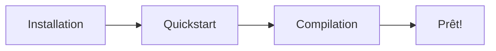

# Pour Commencer avec R-Type

Bienvenue dans le guide de démarrage rapide du projet R-Type! Cette section vous guidera à travers l'installation, la configuration, et le premier lancement du projet.

## 🚀 Parcours Recommandé



### 1. [Installation](installation.md)
**Temps: ~15 minutes**

Préparez votre environnement de développement:

- Installation des prérequis (GCC 11+, CMake 3.30+, Docker)
- Configuration vcpkg (gestionnaire de dépendances)
- Vérification de l'environnement

**Plateformes supportées:**
- ✅ Linux (Ubuntu 22.04+ recommandé)
- ✅ WSL2 (Windows Subsystem for Linux)
- ✅ macOS (expérimental)

[→ Commencer l'installation](installation.md)

---

### 2. [Démarrage Rapide](quickstart.md)
**Temps: ~5 minutes**

Lancez le projet en quelques commandes:

```bash
# Clone + Build + Run
git clone https://github.com/Pluenet-Killian/rtype.git
cd rtype
./scripts/launch_ci_cd.sh  # Infrastructure (Jenkins + Docs)
./scripts/build.sh          # Installation dépendances
./scripts/compile.sh        # Compilation
./artifacts/server/linux/rtype_server  # Lancement
```

**Vous aurez accès à:**
- 🌐 Documentation: http://localhost:8000
- 🔧 Jenkins CI/CD: http://localhost:8081
- 🎮 Serveur de jeu: localhost:4125 (TCP/TLS auth) + localhost:4124 (UDP gameplay)

[→ Lancer rapidement](quickstart.md)

---

### 3. [Compilation](building.md)
**Temps: Variable**

Guide détaillé de compilation:

- Configuration CMake et options
- Build Debug vs Release
- Compilation incrémentale
- Sanitizers (AddressSanitizer, ThreadSanitizer, LeakSanitizer)
- Cross-compilation Windows

**Commandes utiles:**
```bash
# Build standard
./scripts/build.sh && ./scripts/compile.sh

# Build avec sanitizers
ENABLE_SANITIZERS=true ./scripts/compile.sh

# Build Release optimisé
BUILD_TYPE=Release ./scripts/compile.sh
```

[→ Guide de compilation](building.md)

---

## Vérification Post-Installation

### 1. Tests Automatiques

```bash
# Tests serveur
./artifacts/server/linux/server_tests

# Output attendu:
# [==========] Running X tests...
# [==========] X tests from Y test suites ran.
# [  PASSED  ] X tests.
```

### 2. Logs Système

```bash
# Vérifier logs client/serveur
ls -lh logs/

# Contenu attendu:
# client.log   # Logs client (si exécuté)
# server.log   # Logs serveur (si exécuté)
```

### 3. Documentation

```bash
# Ouvrir documentation locale
xdg-open http://localhost:8000  # Linux
open http://localhost:8000      # macOS
```

## Prérequis Détaillés

### Matériel Minimum

| Composant | Minimum | Recommandé |
|-----------|---------|------------|
| CPU | 2 cores | 4+ cores |
| RAM | 4 GB | 8+ GB |
| Disque | 5 GB libre | 10+ GB libre |
| GPU | OpenGL 3.3+ | Dédié (NVIDIA/AMD) |

### Logiciels Requis

**Compilateur C++23:**
- GCC 11+ (recommandé: GCC 13)
- Clang 15+ (alternatif)

**Build Tools:**
- CMake 3.30+
- Ninja Build (optionnel mais recommandé)
- Git 2.30+

**Conteneurisation:**
- Docker Engine 20.10+
- Docker Compose 2.0+

**Dépendances (via vcpkg):**
- Boost.ASIO
- Google Test
- MongoDB C++ Driver
- SFML 3.0+
- spdlog

## Structure du Projet

```
rtype/
├── scripts/              # Scripts de build et lancement
│   ├── build.sh         # Installation dépendances + CMake
│   ├── compile.sh       # Compilation projet
│   └── launch_ci_cd.sh  # Lancement infrastructure
│
├── src/
│   ├── client/          # Code source client
│   └── server/          # Code source serveur
│
├── tests/               # Tests unitaires
│
├── artifacts/           # Binaires compilés
│   ├── client/linux/
│   └── server/linux/
│
├── logs/                # Logs système (créé automatiquement)
│   ├── client.log
│   └── server.log
│
├── ci_cd/               # Infrastructure Docker/Jenkins
├── docs/                # Documentation (MkDocs)
└── third_party/vcpkg/   # Dépendances (géré par vcpkg)
```

## Modes de Lancement

### Mode Développement (Recommandé)

```bash
# Infrastructure Docker + Compilation native
./scripts/launch_ci_cd.sh  # Une seule fois
./scripts/compile.sh        # À chaque modification

# Avantages:
# - Compilation rapide
# - Debugging facile
# - Hot reload possible
```

### Mode Docker Complet

```bash
# Tout dans Docker
cd ci_cd/docker
docker-compose up

# Avantages:
# - Environnement isolé
# - Reproductible
# - CI/CD local
```

### Mode CI/CD (Automatique)

```bash
# Push vers repository
git push origin main

# Jenkins build automatiquement
# Résultats: http://localhost:8081
```

## Dépannage

### Problème: vcpkg install échoue

```bash
# Nettoyage cache vcpkg
rm -rf third_party/vcpkg/packages
rm -rf third_party/vcpkg/buildtrees

# Réinstallation
./scripts/build.sh
```

### Problème: Docker ne démarre pas

```bash
# Vérifier status Docker
sudo systemctl status docker

# Redémarrer Docker
sudo systemctl restart docker

# Vérifier permissions
sudo usermod -aG docker $USER
# Puis relancer terminal
```

### Problème: Compilation échoue

```bash
# Vérifier compilateur
g++ --version  # Doit être 11+
cmake --version  # Doit être 3.30+

# Clean build
rm -rf build/
./scripts/build.sh
./scripts/compile.sh
```

### Problème: Tests échouent

```bash
# Vérifier logs
cat logs/server.log

# Lancer avec verbose
./artifacts/server/linux/server_tests --gtest_verbose

# Vérifier sanitizers
LSAN_OPTIONS=suppressions=lsan.supp ./artifacts/server/linux/server_tests
```

## Prochaines Étapes

Après avoir installé et lancé le projet:

1. **Explorer le Code**
   - [Architecture Client](../client/index.md)
   - [Architecture Serveur](../guides/hexagonal-architecture.md)

2. **Comprendre les Systèmes**
   - [Système de Logging](../development/logging.md)
   - [Architecture Réseau](../guides/network-architecture.md)

3. **Contribuer**
   - [Guide de Contribution](../development/contributing.md)
   - [Politiques de Commit](../development/COMMIT_POLICES.md)

4. **Aller Plus Loin**
   - [Tests et Qualité](../development/testing.md)
   - [CI/CD Jenkins](../development/ci-cd.md)

## Support

**Besoin d'aide?**

1. 📖 Consultez la [FAQ](../reference/faq.md)
2. 🐛 Vérifiez les [Issues GitHub](https://github.com/Pluenet-Killian/rtype/issues)
3. 💬 Contactez l'équipe de développement

## Ressources Externes

- [C++23 Features](https://en.cppreference.com/w/cpp/23)
- [CMake Documentation](https://cmake.org/documentation/)
- [vcpkg Guide](https://vcpkg.io/en/getting-started.html)
- [Boost.ASIO Tutorial](https://www.boost.org/doc/libs/release/doc/html/boost_asio/tutorial.html)
- [SFML 3.0 Documentation](https://www.sfml-dev.org/documentation/3.0.0/)
