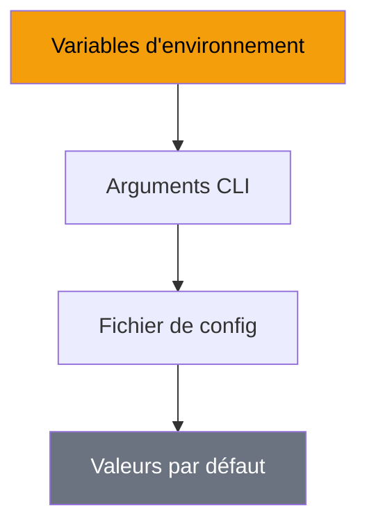

---
tags:
  - guide
  - configuration
---

# Configuration

Personnalisez R-Type selon vos besoins avec les fichiers de configuration.

## Fichiers de Configuration

```
config/
├── server.json      # Configuration serveur
├── client.json      # Configuration client
└── controls.json    # Mapping des contrôles
```

---

## Configuration Serveur

`config/server.json`

```json
{
  "network": {
    "port": 4242,
    "max_players": 4,
    "tick_rate": 60,
    "timeout_ms": 5000
  },
  "game": {
    "difficulty": "normal",
    "friendly_fire": false,
    "respawn_time": 3
  },
  "logging": {
    "level": "info",
    "file": "logs/server.log"
  }
}
```

### Options Réseau

| Paramètre | Type | Description | Défaut |
|-----------|------|-------------|--------|
| `port` | int | Port d'écoute UDP | `4242` |
| `max_players` | int | Nombre max de joueurs | `4` |
| `tick_rate` | int | Mises à jour par seconde | `60` |
| `timeout_ms` | int | Timeout de connexion (ms) | `5000` |

### Options de Jeu

| Paramètre | Type | Description | Défaut |
|-----------|------|-------------|--------|
| `difficulty` | string | `easy`, `normal`, `hard` | `normal` |
| `friendly_fire` | bool | Tir allié activé | `false` |
| `respawn_time` | int | Temps de réapparition (s) | `3` |

---

## Configuration Client

`config/client.json`

```json
{
  "graphics": {
    "backend": "sdl2",
    "resolution": {
      "width": 1920,
      "height": 1080
    },
    "fullscreen": false,
    "vsync": true,
    "fps_limit": 144
  },
  "audio": {
    "master_volume": 80,
    "music_volume": 60,
    "sfx_volume": 100
  },
  "network": {
    "server_host": "127.0.0.1",
    "server_port": 4242
  }
}
```

### Options Graphiques

| Paramètre | Type | Description | Défaut |
|-----------|------|-------------|--------|
| `backend` | string | `sdl2` ou `sfml` | `sdl2` |
| `resolution.width` | int | Largeur en pixels | `1920` |
| `resolution.height` | int | Hauteur en pixels | `1080` |
| `fullscreen` | bool | Mode plein écran | `false` |
| `vsync` | bool | Synchronisation verticale | `true` |
| `fps_limit` | int | Limite de FPS (0 = illimité) | `144` |

### Options Audio

| Paramètre | Type | Description | Défaut |
|-----------|------|-------------|--------|
| `master_volume` | int | Volume global (0-100) | `80` |
| `music_volume` | int | Volume musique (0-100) | `60` |
| `sfx_volume` | int | Volume effets (0-100) | `100` |

---

## Mapping des Contrôles

`config/controls.json`

```json
{
  "keyboard": {
    "move_up": "Up",
    "move_down": "Down",
    "move_left": "Left",
    "move_right": "Right",
    "shoot": "Space",
    "pause": "Escape",
    "fullscreen": "F11"
  },
  "gamepad": {
    "move": "LeftStick",
    "shoot": "A",
    "pause": "Start"
  }
}
```

### Touches Disponibles

??? info "Liste des touches clavier"
    - Lettres : `A` à `Z`
    - Chiffres : `0` à `9`
    - Flèches : `Up`, `Down`, `Left`, `Right`
    - Modificateurs : `LShift`, `RShift`, `LCtrl`, `RCtrl`, `LAlt`, `RAlt`
    - Spéciales : `Space`, `Enter`, `Escape`, `Tab`, `Backspace`
    - Fonction : `F1` à `F12`

---

## Variables d'Environnement

| Variable | Description | Exemple |
|----------|-------------|---------|
| `RTYPE_CONFIG_DIR` | Dossier des configurations | `/etc/rtype` |
| `RTYPE_LOG_LEVEL` | Niveau de log | `debug`, `info`, `warn`, `error` |
| `RTYPE_BACKEND` | Backend graphique | `sdl2`, `sfml` |

```bash
# Exemple d'utilisation
RTYPE_LOG_LEVEL=debug RTYPE_BACKEND=sfml ./r-type_client
```

---

## Priorité de Configuration



Les sources de configuration sont appliquées dans cet ordre (la première trouvée gagne) :

1. **Variables d'environnement** (priorité max)
2. **Arguments en ligne de commande**
3. **Fichiers de configuration**
4. **Valeurs par défaut** (priorité min)

---

## Rechargement à Chaud

Le client supporte le rechargement de certaines configurations sans redémarrage :

| Configuration | Rechargeable |
|---------------|--------------|
| Volume audio | ✅ |
| Résolution | ❌ |
| Contrôles | ✅ |
| Backend graphique | ❌ |

Pour recharger :
```
Menu > Options > Recharger Configuration
```

Ou raccourci : ++ctrl+r++
