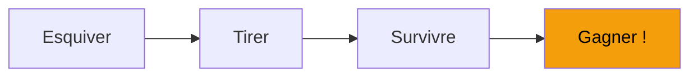
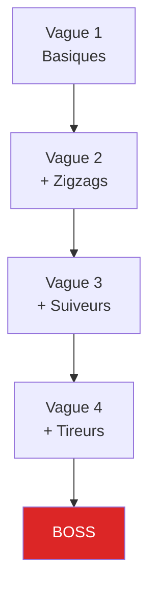

---
tags:
  - guide
  - gameplay
---

# Gameplay

Bienvenue dans R-Type ! Découvrez les mécaniques de jeu et maîtrisez votre vaisseau.

## Le Concept

R-Type est un **shoot 'em up horizontal** (shmup) multijoueur coopératif jusqu'à 4 joueurs.

---

## Objectifs

| Objectif | Description |
|----------|-------------|
| **Survivre** | Évitez ennemis et projectiles |
| **Éliminer** | Détruisez toutes les vagues |
| **Coopérer** | Jouez en équipe |
| **Scorer** | Maximisez votre score |

---

## Types d'Ennemis

5 types avec comportements uniques :

| Ennemi | Comportement | Danger |
|--------|--------------|--------|
| **Basique** | Ligne droite | ⭐ |
| **Zigzag** | Mouvement erratique | ⭐⭐ |
| **Suiveur** | Vous traque | ⭐⭐⭐ |
| **Tireur** | Projectiles | ⭐⭐⭐⭐ |
| **Boss** | Fin de niveau | ⭐⭐⭐⭐⭐ |

---

## Système de Vagues

---

## Guides

  

    <h3><a href="controles/">🎮 Contrôles</a></h3>
    
Clavier et manette

  

  

    <h3><a href="multijoueur/">👥 Multijoueur</a></h3>
    
Créer/rejoindre une partie

  

  

    <h3><a href="voice-chat/">🎤 Voice Chat</a></h3>
    
Communication vocale

  

