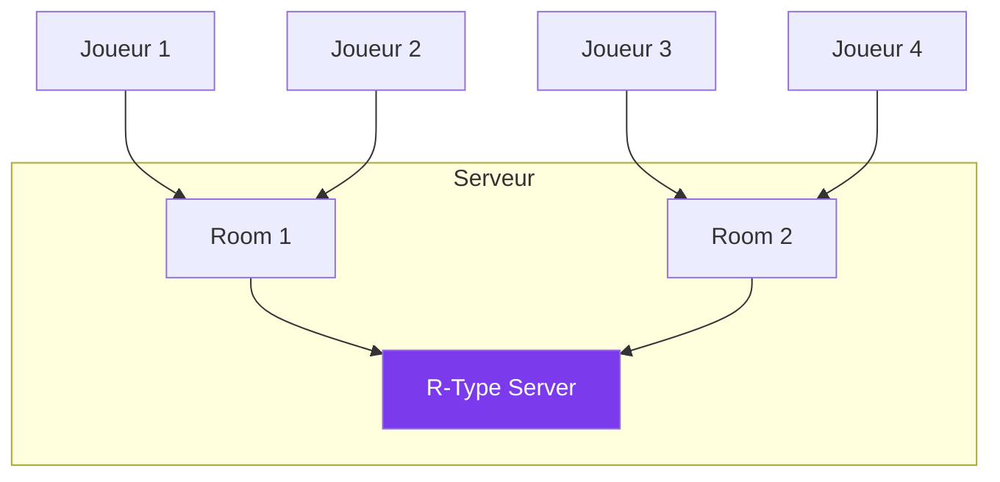

---
tags:
  - guide
  - gameplay
  - multijoueur
---

# Mode Multijoueur

Jouez jusqu'à 4 joueurs en coopération !

## Architecture



---

## Rejoindre une Partie

```bash
./r-type_client -h <IP_SERVEUR> -p 4242 --name "MonPseudo"
```

Ou via le menu : **Multijoueur → Rejoindre**

---

## Héberger une Partie

1. Lancez le serveur :
```bash
./r-type_server -p 4242
```

2. Partagez votre IP :
```bash
curl ifconfig.me  # IP publique
```

3. Les joueurs se connectent avec votre IP

---

## Ports à Ouvrir

| Port | Protocole | Usage |
|------|-----------|-------|
| 4242 | TCP | Auth, rooms, chat |
| 4242 | UDP | Game sync |
| 4243 | UDP | Voice chat |

---

## Indicateurs Réseau

| Icône | Ping | État |
|-------|------|------|
| 🟢 | < 50ms | Excellent |
| 🟡 | 50-100ms | Bon |
| 🟠 | 100-200ms | Moyen |
| 🔴 | > 200ms | Mauvais |

---

## Dépannage

??? question "Impossible de se connecter"
    - Vérifiez l'IP et le port
    - Testez : `nc -vz <IP> 4242`
    - Vérifiez le pare-feu

??? question "Les autres ne peuvent pas me rejoindre"
    - Configurez le port forwarding sur votre routeur
    - Utilisez votre IP publique (pas locale)
