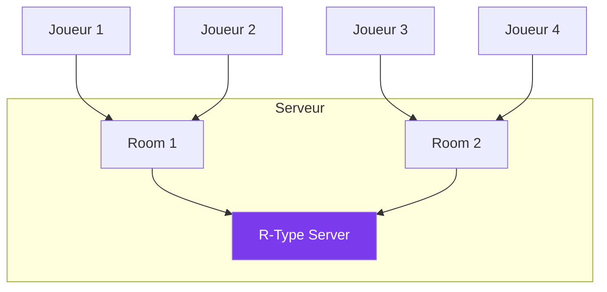

---
tags:
  - guide
  - gameplay
  - multijoueur
---

# Mode Multijoueur

Jouez jusqu'à 4 joueurs en coopération !

## Architecture



---

## Rejoindre une Partie

Le client se connecte actuellement à `127.0.0.1` par défaut. Pour rejoindre un serveur distant, vous devez modifier le code source :

1. Éditez `src/client/src/boot/Boot.cpp` lignes 82-83 :
```cpp
tcpClient->connect("<IP_SERVEUR>", 4125);
udpClient->connect("<IP_SERVEUR>", 4124);
```

2. Recompilez le client :
```bash
./scripts/compile.sh --client --no-launch
```

3. Lancez le client :
```bash
./artifacts/client/linux/rtype_client
```

---

## Héberger une Partie

1. Lancez le serveur :
```bash
./artifacts/server/linux/rtype_server
```

2. Partagez votre IP publique :
```bash
curl ifconfig.me  # Affiche votre IP publique
```

3. Les joueurs modifient leur client avec votre IP et se connectent

---

## Ports à Ouvrir

| Port | Protocole | Usage |
|------|-----------|-------|
| 4125 | TCP | Authentification, rooms, chat |
| 4124 | UDP | Synchronisation de jeu (snapshots, inputs) |
| 4126 | UDP | Voice chat (Opus) |

!!! warning "Configuration réseau"
    Pour héberger une partie accessible depuis Internet, vous devez configurer le port forwarding sur votre routeur pour les 3 ports ci-dessus.

---

## Configuration Serveur

Le serveur utilise un fichier `.env` pour la configuration :

```bash
# Ports
TCP_PORT=4125        # Authentification TCP
UDP_PORT=4124        # Game UDP
VOICE_PORT=4126      # Voice chat UDP

# MongoDB
MONGO_URI=mongodb://localhost:27017
MONGO_DB=rtype
```

---

## Indicateurs Réseau

| Icône | Ping | État |
|-------|------|------|
| 🟢 | < 50ms | Excellent |
| 🟡 | 50-100ms | Bon |
| 🟠 | 100-200ms | Moyen |
| 🔴 | > 200ms | Mauvais |

---

## Dépannage

??? question "Impossible de se connecter"
    - Vérifiez l'IP et les ports (4125 TCP, 4124 UDP)
    - Testez la connectivité : `nc -vz <IP> 4125`
    - Vérifiez que le pare-feu autorise les connexions

??? question "Les autres ne peuvent pas me rejoindre"
    - Configurez le port forwarding sur votre routeur (ports 4124, 4125, 4126)
    - Utilisez votre IP publique (pas 192.168.x.x ou 127.0.0.1)
    - Vérifiez que le serveur est bien démarré

??? question "Déconnexions fréquentes"
    - Le serveur envoie des heartbeats pour maintenir la connexion
    - Vérifiez la stabilité de votre connexion réseau
    - Un ping > 200ms peut causer des timeouts
