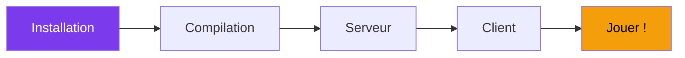

---
tags:
  - guide
  - débutant
---

# Guide Utilisateur

Bienvenue ! Cette section vous accompagne de l'installation à votre première partie.

  

    
📥

    <h3><a href="installation/">Installation</a></h3>
    
Prérequis et dépendances

  

  

    
🚀

    <h3><a href="quickstart/">Démarrage Rapide</a></h3>
    
Première partie en 5 minutes

  

  

    
🔨

    <h3><a href="compilation/">Compilation</a></h3>
    
Options de build avancées

  

  

    
🎮

    <h3><a href="gameplay/">Gameplay</a></h3>
    
Contrôles, multijoueur, voice chat

  

---

## Prérequis

| Composant | Version |
|-----------|---------|
| **OS** | Linux (Ubuntu 22.04+), Windows 10+ |
| **Compilateur** | GCC 11+ ou Clang 15+ |
| **CMake** | 3.20+ |
| **vcpkg** | Latest |

---

## Flux

!!! tip "Premier lancement ?"
    Suivez le [Démarrage Rapide](quickstart.md) pour une expérience guidée.
