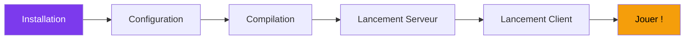

---
tags:
  - guide
  - débutant
---

# Guide Utilisateur

Bienvenue dans le guide utilisateur R-Type ! Cette section vous accompagne de l'installation au lancement de votre première partie.

  

    
📥

    <h3><a href="installation/">Installation</a></h3>
    
Prérequis et installation des dépendances.

  

  

    
🚀

    <h3><a href="quickstart/">Démarrage Rapide</a></h3>
    
Lancez votre première partie en 5 minutes.

  

  

    
⚙️

    <h3><a href="configuration/">Configuration</a></h3>
    
Personnalisez le client et le serveur.

  

  

    
🔨

    <h3><a href="building/">Compilation</a></h3>
    
Options de build et compilation avancée.

  

---

## Prérequis Rapides

| Composant | Version Minimum |
|-----------|-----------------|
| **OS** | Linux (Ubuntu 22.04+), Windows 10+ |
| **Compilateur** | GCC 11+ ou Clang 15+ |
| **CMake** | 3.20+ |
| **vcpkg** | Latest |

---

## Flux de Démarrage

!!! tip "Premier lancement ?"
    Suivez le [Démarrage Rapide](quickstart.md) pour une expérience guidée pas à pas.
