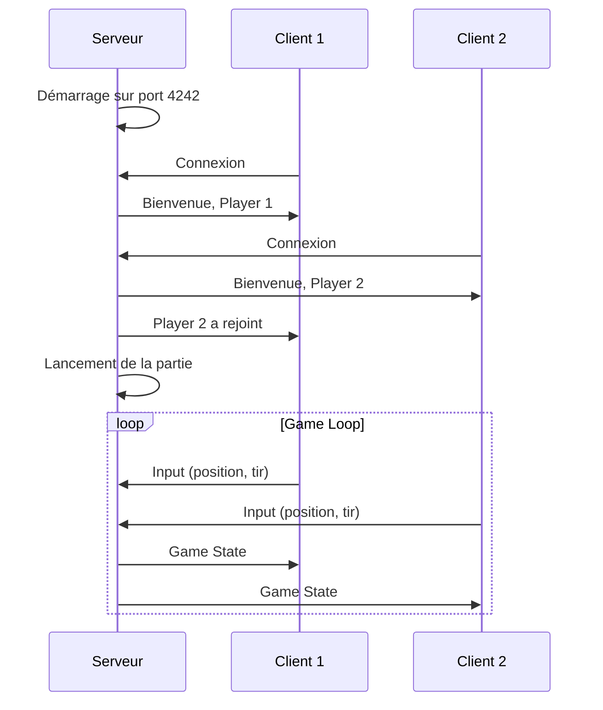

---
tags:
  - guide
  - quickstart
---

# Démarrage Rapide

Lancez votre première partie R-Type en 5 minutes !

## TL;DR

```bash
# Configuration (première fois)
./scripts/build.sh

# Compilation + Lancement serveur
./scripts/compile.sh

# Dans un autre terminal : Lancement client
./scripts/compile.sh --client --no-launch && ./artifacts/client/linux/rtype_client
```

---

## Étape 1 : Compilation

```bash
cd r-type

# Configuration initiale (installe vcpkg et configure CMake)
./scripts/build.sh

# Compilation
./scripts/compile.sh --no-launch
```

!!! info "Temps de compilation"
    La première compilation peut prendre plusieurs minutes car vcpkg installe les dépendances.

---

## Étape 2 : Lancer le Serveur

Dans un premier terminal :

```bash
./artifacts/server/linux/rtype_server
```

Ou directement avec le script :

```bash
./scripts/compile.sh --server
```

Sortie attendue :
```
[INFO] R-Type Server v1.0.0
[INFO] Loading configuration...
[INFO] Server listening on 0.0.0.0:4242
[INFO] Waiting for players...
```

### Options du Serveur

| Option | Description | Défaut |
|--------|-------------|--------|
| `-p, --port` | Port d'écoute | `4242` |
| `-c, --config` | Fichier de configuration | `config/server.json` |
| `-v, --verbose` | Mode verbeux | `false` |

---

## Étape 3 : Lancer le Client

Dans un second terminal :

```bash
./artifacts/client/linux/rtype_client
```

Ou avec le script :

```bash
./scripts/compile.sh --client
```

### Options du Client

| Option | Description | Défaut |
|--------|-------------|--------|
| `-h, --host` | Adresse du serveur | `127.0.0.1` |
| `-p, --port` | Port du serveur | `4242` |
| `--backend` | Backend graphique (`sdl2` ou `sfml`) | `sdl2` |
| `-f, --fullscreen` | Mode plein écran | `false` |

---

## Étape 4 : Jouer !

### Contrôles

| Touche | Action |
|--------|--------|
| ++arrow-up++ ++arrow-down++ ++arrow-left++ ++arrow-right++ | Déplacement |
| ++space++ | Tir |
| ++escape++ | Menu pause |
| ++f11++ | Plein écran |

---

## Mode Multijoueur

### Héberger une Partie

```bash
# Sur la machine hôte
./artifacts/server/linux/rtype_server -p 4242
```

Communiquez votre IP publique aux autres joueurs.

### Rejoindre une Partie

```bash
# Sur les machines clientes
./artifacts/client/linux/rtype_client -h <IP_HOTE> -p 4242
```

---

## Schéma de Démarrage



---

## Prochaines Étapes

<div class="grid-cards">
  <div class="card">
    <h3><a href="../configuration/">⚙️ Configuration</a></h3>
    <p>Personnalisez les paramètres du jeu.</p>
  </div>
  <div class="card">
    <h3><a href="../../technique/graphiques/">🎨 Backends Graphiques</a></h3>
    <p>Choisissez entre SDL2 et SFML.</p>
  </div>
</div>
