---
tags:
  - guide
  - quickstart
---

# Démarrage Rapide

Lancez votre première partie R-Type en 5 minutes !

## TL;DR

```bash
# Configuration (première fois)
./scripts/build.sh
./scripts/generate_dev_certs.sh  # Certificats TLS

# Compilation + Lancement serveur
./scripts/compile.sh

# Dans un autre terminal : Lancement client
./scripts/compile.sh --client --no-launch && ./artifacts/client/linux/rtype_client
```

---

## Étape 1 : Compilation

```bash
cd rtype

# Configuration initiale (installe vcpkg et configure CMake)
./scripts/build.sh

# Compilation
./scripts/compile.sh --no-launch
```

!!! info "Temps de compilation"
    La première compilation peut prendre plusieurs minutes car vcpkg installe les dépendances.

---

## Étape 2 : Lancer le Serveur

### Certificats TLS (première fois)

Le serveur utilise TLS pour l'authentification. Générez les certificats de développement :

```bash
./scripts/generate_dev_certs.sh
```

Cela crée le dossier `certs/` avec `server.crt` et `server.key`.

### Lancement

Dans un premier terminal :

```bash
./artifacts/server/linux/rtype_server
```

Ou directement avec le script :

```bash
./scripts/compile.sh --server
```

Sortie attendue :
```
[INFO] R-Type server starting...
[INFO] Loaded configuration from .env file
[INFO] TCP Auth Server listening on port 4125
[INFO] UDP Game Server listening on port 4124
[INFO] Voice UDP Server listening on port 4126
```

### Configuration du Serveur

Le serveur utilise un fichier `.env` pour la configuration. Copiez d'abord le fichier exemple :

```bash
cp .env.example .env
```

Puis éditez `.env` selon vos besoins :

```bash
# Ports
TCP_PORT=4125        # Authentification TCP
UDP_PORT=4124        # Game UDP
VOICE_PORT=4126      # Voice chat UDP

# MongoDB
MONGO_URI=mongodb://localhost:27017
MONGO_DB=rtype
```

| Port | Protocol | Usage |
|------|----------|-------|
| 4124 | UDP | Synchronisation de jeu (snapshots, inputs) |
| 4125 | TCP | Authentification, rooms, chat |
| 4126 | UDP | Voice chat (Opus) |

---

## Étape 3 : Lancer le Client

Dans un second terminal :

```bash
./artifacts/client/linux/rtype_client
```

Ou avec le script :

```bash
./scripts/compile.sh --client
```

### Options du Client

| Option | Description | Défaut |
|--------|-------------|--------|
| `--graphics=<name>` | Backend graphique (`sdl2` ou `sfml`) | `sfml` |
| `--graphics-path=<path>` | Chemin vers un plugin graphique custom | - |
| `-h, --help` | Afficher l'aide | - |

!!! note "Adresse serveur"
    L'adresse du serveur est configurée en dur dans le code (`127.0.0.1`).
    Pour se connecter à un serveur distant, modifiez `src/client/src/boot/Boot.cpp`.

---

## Étape 4 : Jouer !

### Contrôles

| Touche | Action |
|--------|--------|
| ++arrow-up++ ++arrow-down++ ++arrow-left++ ++arrow-right++ | Déplacement |
| ++space++ | Tir |
| ++v++ | Voice Chat (Push-to-Talk) |
| ++t++ | Ouvrir le chat |
| ++escape++ | Fermer le chat |

---

## Mode Multijoueur

### Héberger une Partie

```bash
# Sur la machine hôte
./artifacts/server/linux/rtype_server
```

Le serveur écoute sur les ports :
- **4124** (UDP) : Game
- **4125** (TCP) : Auth
- **4126** (UDP) : Voice

Communiquez votre IP publique aux autres joueurs et ouvrez ces ports sur votre routeur.

### Rejoindre une Partie

Pour l'instant, l'adresse du serveur est codée en dur. Pour rejoindre un serveur distant :

1. Modifiez `src/client/src/boot/Boot.cpp` ligne 82-83 :
```cpp
tcpClient->connect("<IP_HOTE>", 4125);
udpClient->connect("<IP_HOTE>", 4124);
```
2. Recompilez le client

---

## Schéma de Démarrage

```mermaid
sequenceDiagram
    participant S as Serveur
    participant C1 as Client 1
    participant C2 as Client 2

    S->>S: Démarrage (TCP:4125, UDP:4124)
    C1->>S: Login (TCP)
    S->>C1: LoginAck + SessionToken
    C1->>S: CreateRoom (TCP)
    S->>C1: CreateRoomAck + RoomCode
    C2->>S: Login (TCP)
    S->>C2: LoginAck + SessionToken
    C2->>S: JoinRoomByCode (TCP)
    S->>C2: JoinRoomAck
    S->>C1: RoomUpdate (Player 2 joined)
    Note over S,C2: Host starts game
    C1->>S: JoinGame (UDP + Token)
    C2->>S: JoinGame (UDP + Token)
    S->>C1: JoinGameAck (player_id)
    S->>C2: JoinGameAck (player_id)
    loop Game Loop (20Hz)
        C1->>S: PlayerInput (keys bitfield)
        C2->>S: PlayerInput (keys bitfield)
        S->>C1: Snapshot (all players, missiles, enemies)
        S->>C2: Snapshot
    end
```



---

## Prochaines Étapes

<div class="grid-cards">
  <div class="card">
    <h3><a href="../../configuration/">⚙️ Configuration</a></h3>
    <p>Personnalisez les paramètres du jeu.</p>
  </div>
  <div class="card">
    <h3><a href="../../technique/graphiques/">🎨 Backends Graphiques</a></h3>
    <p>Choisissez entre SDL2 et SFML.</p>
  </div>
</div>
