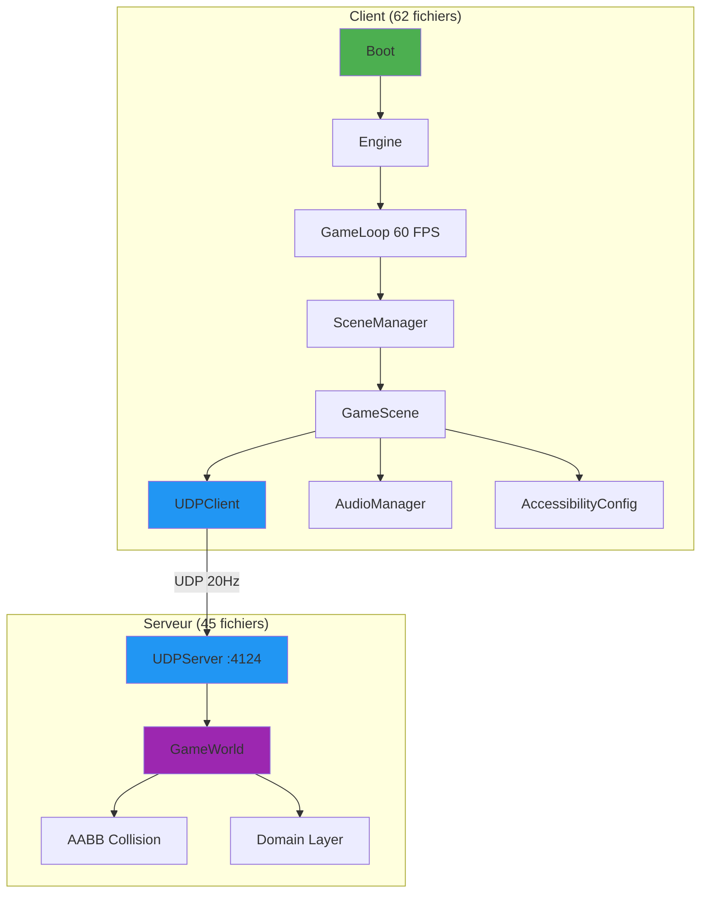
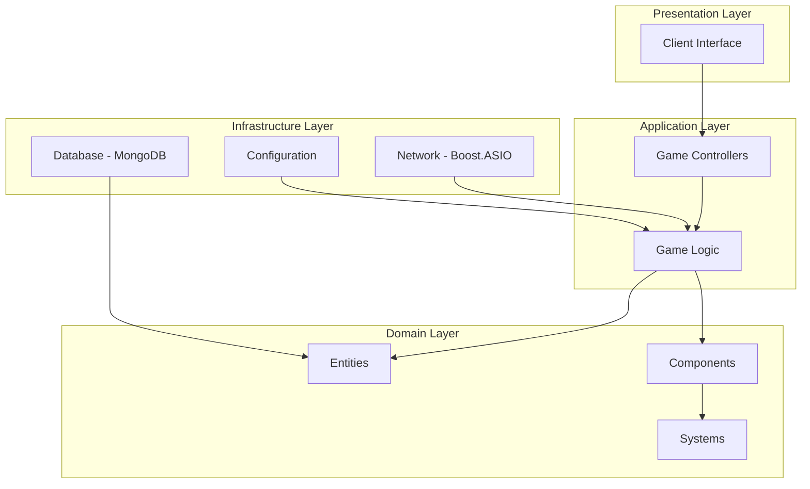
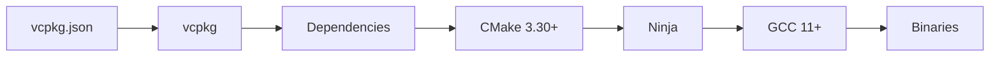
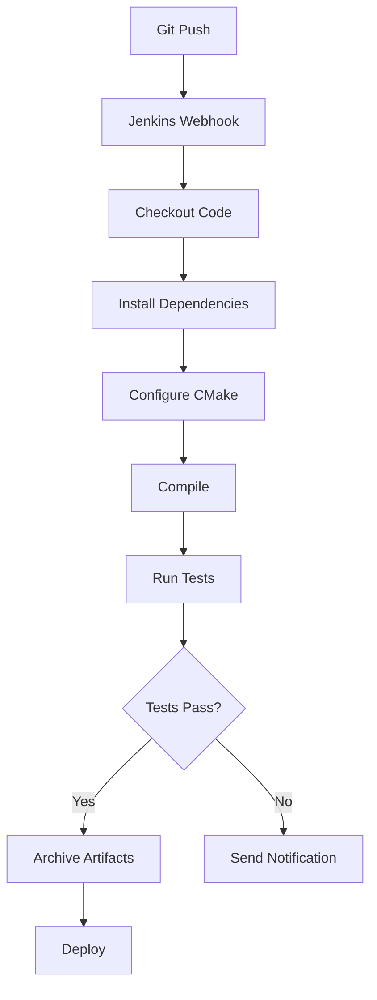
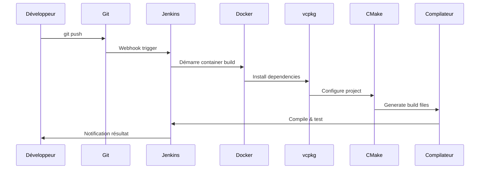
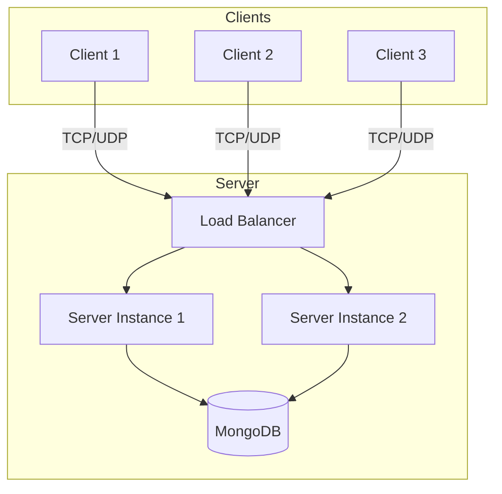

# Architecture du Projet

> **État d'Implémentation:** Cette documentation décrit l'architecture **ACTUELLE** du projet R-Type v0.5.1.
> Le projet dispose d'un client gameplay complet et d'un serveur avec GameWorld fonctionnel.
> Consultez la [page d'état du projet](../project-status.md) pour plus de détails.
>
> **Légende:**
> - ✅ **Implémenté** - Code fonctionnel et testé
> - 🚧 **En cours** - Développement actif
> - 📋 **Planifié** - Conception faite, code à venir

## ✅ État Actuel (v0.5.1 - Décembre 2025)

**Ce qui est implémenté aujourd'hui (95% du gameplay) :**

### Infrastructure Réseau ✅
- **UDPServer** - Serveur UDP asynchrone sur port **4124** (gameplay temps réel, broadcast 20Hz)
- **UDPClient** - Client UDP thread-safe (Boost.ASIO)
- **Protocol binaire** - 14 types de messages avec network byte order
- **Documentation complète:** [Network Architecture](network-architecture.md)

### Architecture Hexagonale ✅
- **Domain Layer** - Entités (Player, User), Value Objects (9 VOs), Exceptions (10)
- **Application Layer** - Use Cases (Move, Login, Register), Ports (IGameCommands, IPlayerRepository)
- **Infrastructure Layer** - GameWorld, UDPServer, Collision System
- **Documentation complète:** [Hexagonal Architecture](hexagonal-architecture.md)

### Client Graphique Multi-Backend ✅
- **SDL2 Backend** (défaut) - SDL2Window, SDL2Renderer, SDL2Plugin
- **SFML Backend** (alternatif) - SFMLWindow, SFMLRenderer, SFMLPlugin
- **Chargement dynamique** - DynamicLib avec dlopen()
- **GameScene complet** - HUD, missiles, ennemis, parallax stars, death screen
- **AudioManager** - SDL2_mixer (musique + SFX)
- **AccessibilityConfig** - Remapping clavier, modes daltonien, vitesse de jeu

### Gameplay Serveur ✅
- **GameWorld** - Joueurs, missiles, ennemis, collisions
- **5 types d'ennemis** - Basic, Tracker, Zigzag, Fast, Bomber (IA unique)
- **Wave spawning** - Vagues automatiques (6-12s, 2-6 ennemis)
- **Collision AABB** - Détection et damage events

### Blob-ECS Library ✅
- **Sparse set architecture** - 51.3M ops/s
- **Entity/Component/System** - Framework complet
- **Non intégré** - Prêt pour future refactorisation

**Prochaines étapes:** Intégration ECS, UI avancée, power-ups

---

Ce document présente l'architecture technique du projet R-Type et son organisation.

## Vue d'ensemble

R-Type est un projet C++23 moderne structuré en architecture client-serveur avec communication UDP temps réel à 20Hz.



## Structure des Répertoires

```
rtype/
├── ci_cd/                      # Infrastructure CI/CD
│   ├── docker/                 # Dockerfiles et compose
│   │   ├── Dockerfile.build    # Image builder permanent
│   │   ├── Dockerfile.jenkins  # Image Jenkins CI/CD
│   │   ├── Dockerfile.docs     # Image documentation
│   │   ├── docker-compose.yml  # Jenkins + Builder
│   │   ├── docker-compose.docs.yml  # Documentation locale
│   │   ├── builder/            # API Python du builder
│   │   │   └── main.py         # Serveur HTTP REST
│   │   ├── entrypoint.sh       # Entrypoint builder (rsync + API)
│   │   ├── rsyncd.conf         # Config rsync daemon
│   │   ├── build_imageBuilder.sh      # Script build image
│   │   ├── launch_builder_permanent.sh
│   │   └── stop_builder_permanent.sh
│   └── jenkins/                # Configuration Jenkins
│       ├── Jenkinsfile.init    # Initialisation builder
│       ├── BuilderAPI.groovy   # Helper API Groovy
│       ├── README.md           # Doc technique API
│       └── test_*.sh           # Scripts de test
│
├── docs/                       # Documentation MkDocs
│   ├── index.md               # Page d'accueil
│   ├── getting-started/       # Guides de démarrage
│   ├── guides/                # Guides utilisateur
│   ├── api/                   # Référence API
│   ├── development/           # Guides développeur
│   └── reference/             # Glossaire, FAQ
│
├── scripts/                    # Scripts de build
│   ├── build.sh               # Configuration CMake
│   ├── compile.sh             # Compilation
│   └── vcpkg/                 # Scripts vcpkg
│       ├── install_vcpkg.sh
│       └── vcpkg.sh
│
├── src/                        # Code source
│   ├── server/                # Serveur de jeu
│   │   ├── main.cpp
│   │   ├── CMakeLists.txt
│   │   └── include/           # Headers serveur
│   └── client/                # Client (à venir)
│
├── tests/                      # Tests unitaires
│   ├── server/                # Tests serveur
│   │   ├── main.cpp
│   │   └── CMakeLists.txt
│   └── client/                # Tests client (à venir)
│
├── third_party/                # Dépendances externes
│   └── vcpkg/                 # Gestionnaire vcpkg
│
├── artifacts/                  # Binaires compilés
│   ├── client/                # Binaires client
│   └── server/                # Binaires serveur
│       └── linux/
│           ├── rtype_server
│           └── server_tests
│
├── buildLinux/                 # Build CMake (Linux)
├── buildWin/                   # Build CMake (Windows cross-compile)
├── buildMac/                   # Build CMake (macOS)
├── vcpkg_installed/           # Packages vcpkg
│
├── CMakeLists.txt             # Configuration CMake racine
├── vcpkg.json                 # Manifest des dépendances
├── vcpkg-configuration.json   # Configuration vcpkg
├── mkdocs.yml                 # Configuration documentation
├── Jenkinsfile                # Pipeline CI/CD
├── .dockerignore              # Exclusions Docker
└── .gitignore                 # Exclusions Git
```

## Architecture Logicielle

### Couches Applicatives



### Serveur

**Responsabilités :**

- Gérer les connexions client via Boost.ASIO
- Traiter la logique de jeu
- Synchroniser l'état entre les clients
- Persister les données dans MongoDB
- Valider les actions des joueurs

**Technologies :**

- **Boost.ASIO** : Communication réseau asynchrone
- **MongoDB C++ Driver** : Persistance des données
- **C++23** : Fonctionnalités modernes (coroutines, ranges)

**Fichiers principaux :**

- `src/server/main.cpp` - Point d'entrée
- `src/server/CMakeLists.txt` - Configuration build

### Client (✅ Implémenté - 62 fichiers)

**Responsabilités :**

- **Rendu graphique** multi-backend (SDL2/SFML via plugins dynamiques)
- **GameScene** complet avec HUD, missiles, ennemis, parallax stars
- **UDPClient** thread-safe pour synchronisation temps réel
- **AudioManager** (SDL2_mixer) pour musique et effets sonores
- **AccessibilityConfig** pour remapping clavier et modes daltonien
- **Event system** avec std::variant (KeyPressed, KeyReleased, WindowClosed)

**Technologies :**

- **SDL2 + SDL2_image + SDL2_mixer + SDL2_ttf** : Backend graphique par défaut
- **SFML 3.0+** : Backend graphique alternatif
- **Boost.ASIO** : UDPClient asynchrone
- **spdlog** : 6 loggers (Network, Engine, Graphics, Scene, UI, Boot)

## Stack Technique

### Langage et Standard

- **C++23** : Dernières fonctionnalités du standard
  - Coroutines pour l'asynchrone
  - Ranges et views
  - Modules (planifié)

### Système de Build



**Composants :**

1. **vcpkg** - Gestionnaire de dépendances

   - Installation automatique
   - Gestion des versions
   - Compilation depuis les sources

2. **CMake** - Générateur de build

   - Configuration cross-platform
   - Intégration vcpkg
   - Gestion des tests

3. **Ninja** - Outil de build

   - Compilation rapide
   - Build incrémental
   - Parallélisation automatique

4. **GCC** - Compilateur
   - Support C++23
   - Optimisations avancées
   - Sanitizers (Debug)

### Dépendances

| Dépendance             | Version   | Utilisation            |
| ---------------------- | --------- | ---------------------- |
| **Boost.ASIO**         | Via vcpkg | UDPServer, UDPClient (async I/O) |
| **SDL2**               | Via vcpkg | Backend graphique par défaut |
| **SDL2_image**         | Via vcpkg | Chargement textures (PNG) |
| **SDL2_mixer**         | Via vcpkg | AudioManager (musique, SFX) |
| **SDL2_ttf**           | Via vcpkg | Rendu de texte |
| **SFML 3.0**           | Via vcpkg | Backend graphique alternatif |
| **spdlog**             | Via vcpkg | Logging (12 loggers) |
| **Google Test**        | Via vcpkg | Tests unitaires        |
| **MongoDB C++ Driver** | Via vcpkg | Base de données NoSQL  |

## Pipeline CI/CD

### Architecture Jenkins



### Stages du Pipeline

**Jenkinsfile :** Pipeline déclaratif en 6 étapes

1. **Checkout** - Clone le repository
2. **Install System Dependencies** - apt-get des outils
3. **Install vCPKG** - Setup vcpkg
4. **Install Dependencies** - vcpkg install
5. **Build** - Configuration CMake
6. **Compile and Run Tests** - Compilation + tests

### Infrastructure Docker

#### Image de Build (Dockerfile.build)

- **Base :** Ubuntu 22.04
- **Outils :** build-essential, cmake, git, ninja-build
- **Usage :** Compilation isolée

```bash
# Lancer l'infrastructure CI/CD complète
cd ci_cd/docker
docker-compose up
```

#### Image de Documentation (Dockerfile.docs)

- **Base :** Python 3.11-slim
- **Outils :** MkDocs, Material theme
- **Usage :** Documentation live-reload

```bash
docker-compose -f ci_cd/docker/docker-compose.docs.yml up
# http://localhost:8000
```

#### Jenkins (docker-compose.yml)

- **Image :** Jenkins LTS
- **Ports :** 8081 (UI), 50000 (agents)
- **Volumes :** jenkins_data
- **Features :** Docker-in-Docker

## Gestion des Dépendances

### Manifest vcpkg (vcpkg.json)

```json
{
  "dependencies": ["boost-asio", "gtest", "mongo-cxx-driver"]
}
```

### Configuration vcpkg

- **Registry :** Microsoft vcpkg (GitHub)
- **Baseline :** Version fixe pour reproductibilité
- **Triplet :** x64-linux (architecture cible)

### Installation

```bash
# Automatique via script
./scripts/build.sh

# Manuel
cd third_party/vcpkg
./vcpkg install
```

## Système de Tests

### Framework : Google Test

**Structure :**

```
tests/
└── server/
    ├── main.cpp          # Tests serveur
    └── CMakeLists.txt    # Configuration
```

**Exécution :**

```bash
./artifacts/server/linux/server_tests
```

**Intégration :**

- Exécution automatique dans Jenkins
- Support dans CMake via `enable_testing()`
- Lié avec GTest::gtest et GTest::gtest_main

### Types de Tests

| Type                  | Status     | Localisation            |
| --------------------- | ---------- | ----------------------- |
| **Unit Tests**        | Implémenté | `tests/server/main.cpp` |
| **Integration Tests** | Planifié   | À venir                 |
| **End-to-End Tests**  | Planifié   | À venir                 |

## Configuration CMake

### CMakeLists.txt Principal

**Caractéristiques clés :**

```cmake
cmake_minimum_required(VERSION 3.30)
project(rtype VERSION 0.0.1)

# C++23
set(CMAKE_CXX_STANDARD 23)
set(CMAKE_CXX_STANDARD_REQUIRED ON)

# vcpkg toolchain
set(CMAKE_TOOLCHAIN_FILE
    "${CMAKE_SOURCE_DIR}/third_party/vcpkg/scripts/buildsystems/vcpkg.cmake")

# Output directory
set(CMAKE_RUNTIME_OUTPUT_DIRECTORY
    ${CMAKE_SOURCE_DIR}/artifacts/server/linux)

# Tests
enable_testing()

# Subdirectories
add_subdirectory(src/server)
add_subdirectory(tests/server)
```

### Flags de Compilation

#### Mode Debug (défaut)

```cmake
-Wall -Wextra -Wpedantic     # Warnings
-g3                          # Debug symbols
-O0                          # No optimization
-fsanitize=address           # Memory errors
-fsanitize=undefined         # UB detection
-fsanitize=leak              # Memory leaks
-fno-omit-frame-pointer      # Better stack traces
```

#### Mode Release

```cmake
-O3                          # Max optimization
-Wall -Wextra -Wpedantic     # Warnings
```

## Documentation

### MkDocs avec Material Theme

**Configuration :** `mkdocs.yml`

**Fonctionnalités :**

- Thème Material moderne
- Mode clair/sombre
- Recherche avec suggestions
- Diagrammes Mermaid
- Syntax highlighting
- Navigation par onglets
- Live-reload pour développement

**Structure :**

```
docs/
├── index.md                    # Accueil
├── getting-started/            # Installation, quickstart, build
├── guides/                     # Architecture, tutoriels
├── api/                        # Référence API
├── development/                # Contribution, tests
└── reference/                  # Glossaire, FAQ
```

**Génération :**

```bash
# Local
mkdocs serve

# Docker
docker-compose -f ci_cd/docker/docker-compose.docs.yml up
```

## Patterns et Bonnes Pratiques

### Organisation du Code

1. **Séparation des préoccupations**

   - Source dans `src/`
   - Tests dans `tests/`
   - Config dans fichiers dédiés

2. **Build reproductible**

   - Versions fixées (vcpkg baseline)
   - Toolchain vcpkg
   - Configuration versionnée

3. **Tests automatisés**
   - Intégration CI/CD
   - Exécution à chaque commit
   - Feedback rapide

### Conventions

- **Langage :** C++23 strict
- **Build :** Ninja pour rapidité
- **Tests :** Google Test
- **Documentation :** Markdown avec MkDocs

## Évolutions Futures

### Court terme

- [x] ~~Implémentation complète du serveur~~ ✅
- [x] ~~Architecture ECS~~ ✅ (Blob-ECS, non intégré)
- [x] ~~Système de networking robuste~~ ✅ (UDP 20Hz)
- [ ] Intégration Blob-ECS dans gameplay
- [ ] Tests d'intégration UDP

### Moyen terme

- [x] ~~Client graphique (SFML/SDL)~~ ✅ Multi-backend
- [x] ~~Protocole réseau custom~~ ✅ (14 types de messages)
- [ ] Power-ups et bonus
- [ ] Niveaux et progression
- [ ] Matchmaking et lobby

### Long terme

- [ ] Support multi-plateforme complet (Windows via cross-compile)
- [ ] Mode spectateur
- [ ] Replays
- [ ] UI avancée (menus, settings)

## Diagrammes Techniques

### Flux de Compilation



### Architecture Réseau (Planifiée)



## Ressources

- [CMake Documentation](https://cmake.org/documentation/)
- [vcpkg Documentation](https://vcpkg.io/)
- [Boost.ASIO](https://www.boost.org/doc/libs/release/doc/html/boost_asio.html)
- [Google Test](https://google.github.io/googletest/)
- [MkDocs Material](https://squidfunk.github.io/mkdocs-material/)

## Prochaines étapes

- Consultez le [Guide de compilation](../getting-started/building.md)
- Lisez le [Guide de contribution](../development/contributing.md)
- Explorez les [Bonnes pratiques](best-practices.md)
