# Architecture du Projet

> **État d'Implémentation:** Cette documentation décrit l'architecture **ACTUELLE** du projet R-Type v0.5.1.
> Le projet dispose d'un client gameplay complet et d'un serveur avec GameWorld fonctionnel.
> Consultez la [page d'état du projet](../project-status.md) pour plus de détails.
>
> **Légende:**
> - ✅ **Implémenté** - Code fonctionnel et testé
> - 🚧 **En cours** - Développement actif
> - 📋 **Planifié** - Conception faite, code à venir

## ✅ État Actuel (v0.5.1 - Décembre 2025)

**Ce qui est implémenté aujourd'hui (95% du gameplay) :**

### Infrastructure Réseau ✅
- **UDPServer** - Serveur UDP asynchrone sur port **4124** (gameplay temps réel, broadcast 20Hz)
- **UDPClient** - Client UDP thread-safe (Boost.ASIO)
- **Protocol binaire** - 14 types de messages avec network byte order
- **Documentation complète:** [Network Architecture](network-architecture.md)

### Architecture Hexagonale ✅
- **Domain Layer** - Entités (Player, User), Value Objects (9 VOs), Exceptions (10)
- **Application Layer** - Use Cases (Move, Login, Register), Ports (IGameCommands, IPlayerRepository)
- **Infrastructure Layer** - GameWorld, UDPServer, Collision System
- **Documentation complète:** [Hexagonal Architecture](hexagonal-architecture.md)

### Client Graphique Multi-Backend ✅
- **SDL2 Backend** (défaut) - SDL2Window, SDL2Renderer, SDL2Plugin
- **SFML Backend** (alternatif) - SFMLWindow, SFMLRenderer, SFMLPlugin
- **Chargement dynamique** - DynamicLib avec dlopen()
- **GameScene complet** - HUD, missiles, ennemis, parallax stars, death screen
- **AudioManager** - SDL2_mixer (musique + SFX)
- **AccessibilityConfig** - Remapping clavier, modes daltonien, vitesse de jeu

### Gameplay Serveur ✅
- **GameWorld** - Joueurs, missiles, ennemis, collisions
- **5 types d'ennemis** - Basic, Tracker, Zigzag, Fast, Bomber (IA unique)
- **Wave spawning** - Vagues automatiques (6-12s, 2-6 ennemis)
- **Collision AABB** - Détection et damage events

### Blob-ECS Library ✅
- **Sparse set architecture** - 51.3M ops/s
- **Entity/Component/System** - Framework complet
- **Non intégré** - Prêt pour future refactorisation

**Prochaines étapes:** Intégration ECS, UI avancée, power-ups

---

Ce document présente l'architecture technique du projet R-Type et son organisation.

## Vue d'ensemble

R-Type est un projet C++23 moderne structuré en architecture client-serveur avec communication UDP temps réel à 20Hz.


## Structure des Répertoires

```
rtype/
├── ci_cd/                      # Infrastructure CI/CD
│   ├── docker/                 # Dockerfiles et compose
│   │   ├── Dockerfile.build    # Image builder permanent
│   │   ├── Dockerfile.jenkins  # Image Jenkins CI/CD
│   │   ├── Dockerfile.docs     # Image documentation
│   │   ├── docker-compose.yml  # Jenkins + Builder
│   │   ├── docker-compose.docs.yml  # Documentation locale
│   │   ├── builder/            # API Python du builder
│   │   │   └── main.py         # Serveur HTTP REST
│   │   ├── entrypoint.sh       # Entrypoint builder (rsync + API)
│   │   ├── rsyncd.conf         # Config rsync daemon
│   │   ├── build_imageBuilder.sh      # Script build image
│   │   ├── launch_builder_permanent.sh
│   │   └── stop_builder_permanent.sh
│   └── jenkins/                # Configuration Jenkins
│       ├── Jenkinsfile.init    # Initialisation builder
│       ├── BuilderAPI.groovy   # Helper API Groovy
│       ├── README.md           # Doc technique API
│       └── test_*.sh           # Scripts de test
│
├── docs/                       # Documentation MkDocs
│   ├── index.md               # Page d'accueil
│   ├── getting-started/       # Guides de démarrage
│   ├── guides/                # Guides utilisateur
│   ├── api/                   # Référence API
│   ├── development/           # Guides développeur
│   └── reference/             # Glossaire, FAQ
│
├── scripts/                    # Scripts de build
│   ├── build.sh               # Configuration CMake
│   ├── compile.sh             # Compilation
│   └── vcpkg/                 # Scripts vcpkg
│       ├── install_vcpkg.sh
│       └── vcpkg.sh
│
├── src/                        # Code source
│   ├── server/                # Serveur de jeu
│   │   ├── main.cpp
│   │   ├── CMakeLists.txt
│   │   └── include/           # Headers serveur
│   └── client/                # Client (à venir)
│
├── tests/                      # Tests unitaires
│   ├── server/                # Tests serveur
│   │   ├── main.cpp
│   │   └── CMakeLists.txt
│   └── client/                # Tests client (à venir)
│
├── third_party/                # Dépendances externes
│   └── vcpkg/                 # Gestionnaire vcpkg
│
├── artifacts/                  # Binaires compilés
│   ├── client/                # Binaires client
│   └── server/                # Binaires serveur
│       └── linux/
│           ├── rtype_server
│           └── server_tests
│
├── buildLinux/                 # Build CMake (Linux)
├── buildWin/                   # Build CMake (Windows cross-compile)
├── buildMac/                   # Build CMake (macOS)
├── vcpkg_installed/           # Packages vcpkg
│
├── CMakeLists.txt             # Configuration CMake racine
├── vcpkg.json                 # Manifest des dépendances
├── vcpkg-configuration.json   # Configuration vcpkg
├── mkdocs.yml                 # Configuration documentation
├── Jenkinsfile                # Pipeline CI/CD
├── .dockerignore              # Exclusions Docker
└── .gitignore                 # Exclusions Git
```

## Architecture Logicielle

### Couches Applicatives


### Serveur

**Responsabilités :**

- Gérer les connexions client via Boost.ASIO
- Traiter la logique de jeu
- Synchroniser l'état entre les clients
- Persister les données dans MongoDB
- Valider les actions des joueurs

**Technologies :**

- **Boost.ASIO** : Communication réseau asynchrone
- **MongoDB C++ Driver** : Persistance des données
- **C++23** : Fonctionnalités modernes (coroutines, ranges)

**Fichiers principaux :**

- `src/server/main.cpp` - Point d'entrée
- `src/server/CMakeLists.txt` - Configuration build

### Client (✅ Implémenté - 62 fichiers)

**Responsabilités :**

- **Rendu graphique** multi-backend (SDL2/SFML via plugins dynamiques)
- **GameScene** complet avec HUD, missiles, ennemis, parallax stars
- **UDPClient** thread-safe pour synchronisation temps réel
- **AudioManager** (SDL2_mixer) pour musique et effets sonores
- **AccessibilityConfig** pour remapping clavier et modes daltonien
- **Event system** avec std::variant (KeyPressed, KeyReleased, WindowClosed)

**Technologies :**

- **SDL2 + SDL2_image + SDL2_mixer + SDL2_ttf** : Backend graphique par défaut
- **SFML 3.0+** : Backend graphique alternatif
- **Boost.ASIO** : UDPClient asynchrone
- **spdlog** : 6 loggers (Network, Engine, Graphics, Scene, UI, Boot)

## Stack Technique

### Langage et Standard

- **C++23** : Dernières fonctionnalités du standard
  - Coroutines pour l'asynchrone
  - Ranges et views
  - Modules (planifié)

### Système de Build


**Composants :**

1. **vcpkg** - Gestionnaire de dépendances

   - Installation automatique
   - Gestion des versions
   - Compilation depuis les sources

2. **CMake** - Générateur de build

   - Configuration cross-platform
   - Intégration vcpkg
   - Gestion des tests

3. **Ninja** - Outil de build

   - Compilation rapide
   - Build incrémental
   - Parallélisation automatique

4. **GCC** - Compilateur
   - Support C++23
   - Optimisations avancées
   - Sanitizers (Debug)

### Dépendances

| Dépendance             | Version   | Utilisation            |
| ---------------------- | --------- | ---------------------- |
| **Boost.ASIO**         | Via vcpkg | UDPServer, UDPClient (async I/O) |
| **SDL2**               | Via vcpkg | Backend graphique par défaut |
| **SDL2_image**         | Via vcpkg | Chargement textures (PNG) |
| **SDL2_mixer**         | Via vcpkg | AudioManager (musique, SFX) |
| **SDL2_ttf**           | Via vcpkg | Rendu de texte |
| **SFML 3.0**           | Via vcpkg | Backend graphique alternatif |
| **spdlog**             | Via vcpkg | Logging (12 loggers) |
| **Google Test**        | Via vcpkg | Tests unitaires        |
| **MongoDB C++ Driver** | Via vcpkg | Base de données NoSQL  |

## Pipeline CI/CD

### Architecture Jenkins


### Stages du Pipeline

**Jenkinsfile :** Pipeline déclaratif en 6 étapes

1. **Checkout** - Clone le repository
2. **Install System Dependencies** - apt-get des outils
3. **Install vCPKG** - Setup vcpkg
4. **Install Dependencies** - vcpkg install
5. **Build** - Configuration CMake
6. **Compile and Run Tests** - Compilation + tests

### Infrastructure Docker

#### Image de Build (Dockerfile.build)

- **Base :** Ubuntu 22.04
- **Outils :** build-essential, cmake, git, ninja-build
- **Usage :** Compilation isolée

```bash
# Lancer l'infrastructure CI/CD complète
cd ci_cd/docker
docker-compose up
```

#### Image de Documentation (Dockerfile.docs)

- **Base :** Python 3.11-slim
- **Outils :** MkDocs, Material theme
- **Usage :** Documentation live-reload

```bash
docker-compose -f ci_cd/docker/docker-compose.docs.yml up
# http://localhost:8000
```

#### Jenkins (docker-compose.yml)

- **Image :** Jenkins LTS
- **Ports :** 8081 (UI), 50000 (agents)
- **Volumes :** jenkins_data
- **Features :** Docker-in-Docker

## Gestion des Dépendances

### Manifest vcpkg (vcpkg.json)

```json
{
  "dependencies": ["boost-asio", "gtest", "mongo-cxx-driver"]
}
```

### Configuration vcpkg

- **Registry :** Microsoft vcpkg (GitHub)
- **Baseline :** Version fixe pour reproductibilité
- **Triplet :** x64-linux (architecture cible)

### Installation

```bash
# Automatique via script
./scripts/build.sh

# Manuel
cd third_party/vcpkg
./vcpkg install
```

## Système de Tests

### Framework : Google Test

**Structure :**

```
tests/
└── server/
    ├── main.cpp          # Tests serveur
    └── CMakeLists.txt    # Configuration
```

**Exécution :**

```bash
./artifacts/server/linux/server_tests
```

**Intégration :**

- Exécution automatique dans Jenkins
- Support dans CMake via `enable_testing()`
- Lié avec GTest::gtest et GTest::gtest_main

### Types de Tests

| Type                  | Status     | Localisation            |
| --------------------- | ---------- | ----------------------- |
| **Unit Tests**        | Implémenté | `tests/server/main.cpp` |
| **Integration Tests** | Planifié   | À venir                 |
| **End-to-End Tests**  | Planifié   | À venir                 |

## Configuration CMake

### CMakeLists.txt Principal

**Caractéristiques clés :**

```cmake
cmake_minimum_required(VERSION 3.30)
project(rtype VERSION 0.0.1)

# C++23
set(CMAKE_CXX_STANDARD 23)
set(CMAKE_CXX_STANDARD_REQUIRED ON)

# vcpkg toolchain
set(CMAKE_TOOLCHAIN_FILE
    "${CMAKE_SOURCE_DIR}/third_party/vcpkg/scripts/buildsystems/vcpkg.cmake")

# Output directory
set(CMAKE_RUNTIME_OUTPUT_DIRECTORY
    ${CMAKE_SOURCE_DIR}/artifacts/server/linux)

# Tests
enable_testing()

# Subdirectories
add_subdirectory(src/server)
add_subdirectory(tests/server)
```

### Flags de Compilation

#### Mode Debug (défaut)

```cmake
-Wall -Wextra -Wpedantic     # Warnings
-g3                          # Debug symbols
-O0                          # No optimization
-fsanitize=address           # Memory errors
-fsanitize=undefined         # UB detection
-fsanitize=leak              # Memory leaks
-fno-omit-frame-pointer      # Better stack traces
```

#### Mode Release

```cmake
-O3                          # Max optimization
-Wall -Wextra -Wpedantic     # Warnings
```

## Documentation

### MkDocs avec Material Theme

**Configuration :** `mkdocs.yml`

**Fonctionnalités :**

- Thème Material moderne
- Mode clair/sombre
- Recherche avec suggestions
- Diagrammes Mermaid
- Syntax highlighting
- Navigation par onglets
- Live-reload pour développement

**Structure :**

```
docs/
├── index.md                    # Accueil
├── getting-started/            # Installation, quickstart, build
├── guides/                     # Architecture, tutoriels
├── api/                        # Référence API
├── development/                # Contribution, tests
└── reference/                  # Glossaire, FAQ
```

**Génération :**

```bash
# Local
mkdocs serve

# Docker
docker-compose -f ci_cd/docker/docker-compose.docs.yml up
```

## Patterns et Bonnes Pratiques

### Organisation du Code

1. **Séparation des préoccupations**

   - Source dans `src/`
   - Tests dans `tests/`
   - Config dans fichiers dédiés

2. **Build reproductible**

   - Versions fixées (vcpkg baseline)
   - Toolchain vcpkg
   - Configuration versionnée

3. **Tests automatisés**
   - Intégration CI/CD
   - Exécution à chaque commit
   - Feedback rapide

### Conventions

- **Langage :** C++23 strict
- **Build :** Ninja pour rapidité
- **Tests :** Google Test
- **Documentation :** Markdown avec MkDocs

## Évolutions Futures

### Court terme

- [x] ~~Implémentation complète du serveur~~ ✅
- [x] ~~Architecture ECS~~ ✅ (Blob-ECS, non intégré)
- [x] ~~Système de networking robuste~~ ✅ (UDP 20Hz)
- [ ] Intégration Blob-ECS dans gameplay
- [ ] Tests d'intégration UDP

### Moyen terme

- [x] ~~Client graphique (SFML/SDL)~~ ✅ Multi-backend
- [x] ~~Protocole réseau custom~~ ✅ (14 types de messages)
- [ ] Power-ups et bonus
- [ ] Niveaux et progression
- [ ] Matchmaking et lobby

### Long terme

- [ ] Support multi-plateforme complet (Windows via cross-compile)
- [ ] Mode spectateur
- [ ] Replays
- [ ] UI avancée (menus, settings)

## Diagrammes Techniques

### Flux de Compilation

```mermaid
sequenceDiagram
    participant Dev as Développeur
    participant Git as Git
    participant Jen as Jenkins
    participant Docker as Docker
    participant VCP as vcpkg
    participant CMake as CMake
    participant GCC as Compilateur

    Dev->>Git: git push
    Git->>Jen: Webhook trigger
    Jen->>Docker: Démarre container build
    Docker->>VCP: Install dependencies
    VCP->>CMake: Configure project
    CMake->>GCC: Generate build files
    GCC->>Jen: Compile & test
    Jen->>Dev: Notification résultat
```



### Architecture Réseau (Planifiée)


## Ressources

- [CMake Documentation](https://cmake.org/documentation/)
- [vcpkg Documentation](https://vcpkg.io/)
- [Boost.ASIO](https://www.boost.org/doc/libs/release/doc/html/boost_asio.html)
- [Google Test](https://google.github.io/googletest/)
- [MkDocs Material](https://squidfunk.github.io/mkdocs-material/)

## Prochaines étapes

- Consultez le [Guide de compilation](../getting-started/building.md)
- Lisez le [Guide de contribution](../development/contributing.md)
- Explorez les [Bonnes pratiques](best-practices.md)
