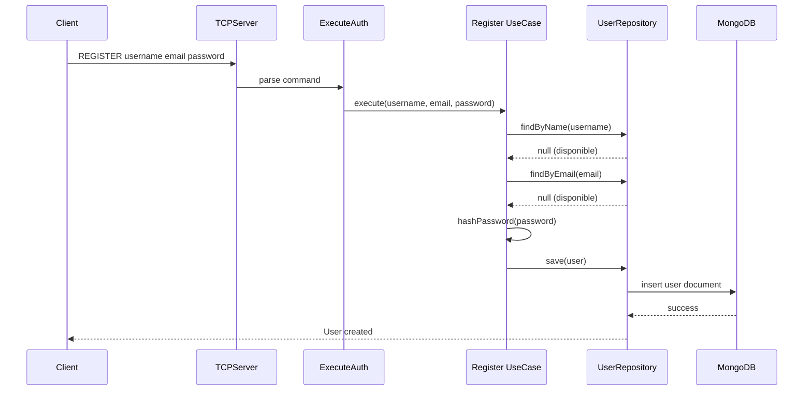
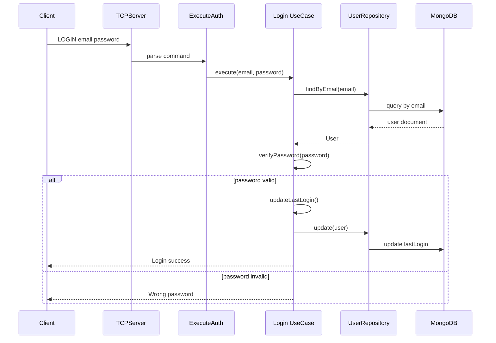

# Guide du Système d'Authentification

**État:** ✅ Implémenté et Documenté
**Version:** 0.3.0
**Dernière mise à jour:** 17 janvier 2025

---

## 📋 Vue d'Ensemble

Le système d'authentification du R-Type permet aux utilisateurs de créer un compte et de se connecter de manière sécurisée. Il utilise une architecture hexagonale avec MongoDB comme base de données et communique via le serveur TCP.

**Architecture:**
```
Réseau (TCP)
    ↓
ExecuteAuth (Command Handler)
    ↓
Use Cases (Login, Register)
    ↓
MongoDBUserRepository
    ↓
MongoDB
```

**Composants Principaux:**

- **Value Objects** - Email, Password (avec validation et hachage)
- **Entité User** - Représentation d'un utilisateur authentifié
- **Use Cases** - Login, Register (logique métier)
- **Repository** - MongoDBUserRepository (persistence)
- **Command Handler** - ExecuteAuth (traitement des commandes réseau)

---

## 🔐 Fonctionnalités

### ✅ Inscription (Register)

Permet à un nouvel utilisateur de créer un compte.

**Validations:**
- Username unique dans la base de données
- Email valide selon RFC 5322 et unique
- Mot de passe haché avec SHA-256

**Flux:**


### ✅ Connexion (Login)

Permet à un utilisateur existant de s'authentifier avec son email.

**Validations:**
- Email existe dans la base de données
- Mot de passe correspond au hash stocké
- Mise à jour automatique de lastLogin

**Flux:**


---

## 🏗️ Architecture Détaillée

### Couche Domain

#### Value Object: Email

**Fichier:** `domain/value_objects/user/Email.hpp`

Représente une adresse email validée.

**Validation:**
- Regex RFC 5322 complète
- Longueur maximale: 254 caractères
- Format: `local@domain.tld`

```cpp
#include "domain/value_objects/user/Email.hpp"

// Création d'un email valide
Email email("user@example.com");
std::string value = email.value(); // "user@example.com"

// Email invalide lance EmailException
try {
    Email invalid("not-an-email");
} catch (const EmailException& e) {
    // "Invalid email format: not-an-email."
}
```

**Exceptions:**
- `EmailException` - Format invalide ou longueur > 254

#### Value Object: Password

**Fichier:** `domain/value_objects/user/Password.hpp`

Représente un hash de mot de passe (SHA-256).

**Important:** Ce VO stocke le **hash**, pas le mot de passe en clair !

```cpp
#include "domain/value_objects/user/Password.hpp"
#include "domain/value_objects/user/utils/PasswordUtils.hpp"

// Hacher un mot de passe
std::string hash = utils::hashPassword("my_password");
Password password(hash);

// Vérifier un mot de passe
bool valid = password.verify("my_password"); // true
bool invalid = password.verify("wrong"); // false
```

**Méthodes:**
- `value()` - Retourne le hash stocké
- `verify(plaintext)` - Vérifie un mot de passe en clair

#### Utilitaires: PasswordUtils

**Fichier:** `domain/value_objects/user/utils/PasswordUtils.hpp`

Fonctions utilitaires pour le hachage des mots de passe.

```cpp
#include "domain/value_objects/user/utils/PasswordUtils.hpp"

namespace domain::value_objects::user::utils {
    std::string hashPassword(std::string password);
}
```

**Algorithme:** SHA-256 (OpenSSL)

**Note de Sécurité:**
> ⚠️ SHA-256 est utilisé actuellement mais **n'est pas recommandé** pour les mots de passe en production.
> Préférez **bcrypt**, **Argon2** ou **scrypt** qui sont conçus pour être lents et résistants au brute-force.
>
> **TODO:** Migration vers Argon2 (RT-XX)

#### Entité: User

**Fichier:** `domain/entities/User.hpp`

Représente un utilisateur authentifié dans le système.

**Attributs:**

| Attribut | Type | Description |
|----------|------|-------------|
| `_id` | `UserId` | Identifiant unique (ObjectId MongoDB) |
| `_username` | `Username` | Nom d'utilisateur unique |
| `_email` | `Email` | Adresse email unique |
| `_passwordHash` | `Password` | Hash du mot de passe |
| `_lastLogin` | `time_point` | Date de dernière connexion |
| `_createdAt` | `time_point` | Date de création du compte |

**Constructeur:**
```cpp
User(
    UserId id,
    Username username,
    Email email,
    Password passwordHash,
    std::chrono::system_clock::time_point lastLogin = std::chrono::system_clock::now(),
    std::chrono::system_clock::time_point createdAt = std::chrono::system_clock::now()
);
```

**Méthodes:**
```cpp
// Getters
const UserId& getId() const;
const Username& getUsername() const;
const Email& getEmail() const;
const Password& getPasswordHash() const;
const std::chrono::system_clock::time_point& getLastLogin() const;
const std::chrono::system_clock::time_point& getCreatedAt() const;

// Actions
bool verifyPassword(const std::string& password);
void updateLastLogin();
```

**Exemple:**
```cpp
#include "domain/entities/User.hpp"

// Création d'un utilisateur
User user(
    UserId(bsoncxx::oid().to_string()),
    Username("john_doe"),
    Email("john@example.com"),
    Password(utils::hashPassword("secret123"))
);

// Vérification du mot de passe
if (user.verifyPassword("secret123")) {
    user.updateLastLogin();
    std::cout << "Login successful!" << std::endl;
}
```

---

### Couche Application

#### Use Case: Register

**Fichier:** `application/use_cases/auth/Register.hpp`

Gère l'inscription d'un nouvel utilisateur.

**Signature:**
```cpp
void execute(
    const std::string& username,
    const std::string& email,
    const std::string& unHashedPassword
);
```

**Algorithme:**
1. Vérifier que le username n'existe pas (`findByName`)
2. Vérifier que l'email n'existe pas (`findByEmail`)
3. Générer un `UserId` unique (ObjectId MongoDB)
4. Hacher le mot de passe avec `utils::hashPassword`
5. Créer l'entité `User`
6. Sauvegarder via le repository (`save`)

**Gestion d'Erreurs:**
- Username déjà pris → Message console "Name already exist"
- Email déjà pris → Message console "Email already exist"

**Exemple:**
```cpp
#include "application/use_cases/auth/Register.hpp"

auto userRepo = std::make_shared<MongoDBUserRepository>(mongoConfig);
Register registerUseCase(userRepo);

// Inscription d'un utilisateur
registerUseCase.execute("alice", "alice@example.com", "password123");
```

#### Use Case: Login

**Fichier:** `application/use_cases/auth/Login.hpp`

Gère la connexion d'un utilisateur existant.

**Signature:**
```cpp
void execute(
    const std::string& email,
    const std::string& password
);
```

**Algorithme:**
1. Rechercher l'utilisateur par email (`findByEmail`)
2. Si non trouvé → Message "User name not found"
3. Vérifier le mot de passe (`verifyPassword`)
4. Si invalide → Message "Wrong password"
5. Mettre à jour `lastLogin` (`updateLastLogin`)
6. Sauvegarder via le repository (`update`)

**Exemple:**
```cpp
#include "application/use_cases/auth/Login.hpp"

auto userRepo = std::make_shared<MongoDBUserRepository>(mongoConfig);
Login loginUseCase(userRepo);

// Connexion d'un utilisateur
loginUseCase.execute("alice@example.com", "password123");
```

---

### Couche Infrastructure

#### Repository: MongoDBUserRepository

**Fichier:** `infrastructure/adapters/out/persistence/MongoDBUserRepository.hpp`

Implémentation MongoDB du repository utilisateur.

**Interface (IUserRespository):**
```cpp
class IUserRespository {
public:
    virtual void save(const User& user) const = 0;
    virtual void update(const User& user) = 0;
    virtual std::optional<User> findById(const std::string& id) = 0;
    virtual std::optional<User> findByName(const std::string& username) = 0;
    virtual std::optional<User> findByEmail(const std::string& email) = 0;
    virtual std::vector<User> findAll() = 0;
};
```

**Méthodes Implémentées:**

##### `save(user)`
Sauvegarde un nouvel utilisateur dans MongoDB.

**Validations:**
- Vérifie que le username n'existe pas déjà
- Vérifie que l'email n'existe pas déjà

**Document MongoDB:**
```json
{
    "_id": ObjectId("..."),
    "username": "alice",
    "email": "alice@example.com",
    "password": "5e884898da28047151d0e56f8dc62927...",
    "lastLogin": ISODate("2025-01-17T10:30:00Z"),
    "createAt": ISODate("2025-01-17T10:30:00Z")
}
```

##### `findByEmail(email)`
Recherche un utilisateur par son adresse email.

**Retour:** `std::optional<User>` (empty si non trouvé)

##### `findByName(username)`
Recherche un utilisateur par son nom d'utilisateur.

**Retour:** `std::optional<User>` (empty si non trouvé)

##### `findById(id)`
Recherche un utilisateur par son ObjectId.

**Retour:** `std::optional<User>` (empty si non trouvé)

**Conversions:**

La classe fournit des helpers pour convertir entre MongoDB et le domaine :

```cpp
// Convertir time_point → BSON date
bsoncxx::types::b_date timePointToDate(
    const std::chrono::system_clock::time_point& tp
) const;

// Convertir document BSON → User entity
User documentToUser(const bsoncxx::document::view& doc);
```

**Exemple d'Utilisation:**
```cpp
auto mongoConfig = std::make_shared<MongoDBConfiguration>(dbConfig);
auto userRepo = std::make_shared<MongoDBUserRepository>(mongoConfig);

// Créer un utilisateur
User user(/* ... */);
userRepo->save(user);

// Rechercher par email
auto found = userRepo->findByEmail("alice@example.com");
if (found.has_value()) {
    std::cout << "Found: " << found->getUsername().value() << std::endl;
}
```

#### Command Handler: ExecuteAuth

**Fichier:** `infrastructure/adapters/in/network/execute/auth/ExecuteAuth.hpp`

Gère le routing des commandes d'authentification reçues via TCP.

**Commandes Supportées:**
- `LOGIN` - Authentification
- `REGISTER` - Inscription

**Constructeur:**
```cpp
ExecuteAuth(
    const Command& cmd,
    std::shared_ptr<Login> loginUser,
    std::shared_ptr<Register> registerUser
);
```

**Algorithme:**
1. Parse le type de commande (`cmd.type`)
2. Route vers `login()` ou `signupUser()`
3. Extrait les arguments de `cmd.args`
4. Appelle le use case approprié

**Format des Commandes:**

```
REGISTER <username> <email> <password>
LOGIN <email> <password>
```

**Parsing des Arguments:**
```cpp
// Pour REGISTER
args[0] = "REGISTER"
args[1] = username
args[2] = email
args[3] = password

// Pour LOGIN
args[0] = "LOGIN"
args[1] = email
args[2] = password
```

**Exemple:**
```cpp
Command cmd = parser.parse("REGISTER alice alice@example.com pass123");

auto login = std::make_shared<Login>(userRepo);
auto registerUC = std::make_shared<Register>(userRepo);

ExecuteAuth handler(cmd, login, registerUC);
// → Appelle registerUC->execute("alice", "alice@example.com", "pass123")
```

#### Intégration TCP Server

**Fichiers:** `infrastructure/adapters/in/network/TCPServer.{hpp,cpp}`

Le serveur TCP route les commandes d'authentification via `ExecuteAuth`.

**Flux:**
1. `TCPServer` accepte une connexion sur le port 4123
2. Crée une `Session` avec le `MongoDBUserRepository`
3. `Session::handle_command` parse la commande avec `CommandParser`
4. Instancie `Execute` qui délègue à `ExecuteAuth`
5. `ExecuteAuth` appelle le use case approprié

**Code d'Intégration:**
```cpp
void Session::handle_command(std::size_t length) {
    CommandParser cmdParser;
    Command cmd = cmdParser.parse(std::string(_data, length));

    Execute execute(cmd, _userRepository);
    // → Execute instancie Login/Register et appelle ExecuteAuth
}
```

---

## 🔒 Sécurité

### Pratiques Actuelles

✅ **Bonnes Pratiques Implémentées:**
- Mots de passe jamais stockés en clair
- Hachage SHA-256 de tous les mots de passe
- Validation stricte des emails (RFC 5322)
- Vérification de l'unicité username/email
- Séparation des responsabilités (Domain/Application/Infrastructure)

### Améliorations Recommandées

⚠️ **Vulnérabilités à Corriger:**

1. **Algorithme de Hachage Faible**
   - **Problème:** SHA-256 est rapide, donc vulnérable au brute-force
   - **Solution:** Migrer vers Argon2id ou bcrypt
   - **Ticket:** RT-XX

2. **Pas de Rate Limiting**
   - **Problème:** Attaques par force brute possibles
   - **Solution:** Limiter les tentatives de login (ex: 5/minute)
   - **Ticket:** RT-XX

3. **Pas de Gestion de Sessions**
   - **Problème:** Aucun token/session après login
   - **Solution:** Implémenter JWT ou sessions Redis
   - **Ticket:** RT-XX

4. **Messages d'Erreur Trop Verbeux**
   - **Problème:** "User name not found" vs "Wrong password" = énumération d'emails
   - **Solution:** Message générique "Invalid credentials"
   - **Ticket:** RT-XX

5. **Pas de Validation de Force du Mot de Passe**
   - **Problème:** Accepte "123" comme mot de passe
   - **Solution:** Politique de mots de passe (longueur min, complexité)
   - **Ticket:** RT-XX

6. **Communication TCP en Clair**
   - **Problème:** Mots de passe transmis sans chiffrement
   - **Solution:** TLS/SSL obligatoire
   - **Ticket:** RT-XX

---

## 📝 Exemples d'Utilisation

### Scénario Complet: Inscription + Connexion

```cpp
#include "infrastructure/adapters/out/persistence/MongoDBConfiguration.hpp"
#include "infrastructure/adapters/out/persistence/MongoDBUserRepository.hpp"
#include "application/use_cases/auth/Register.hpp"
#include "application/use_cases/auth/Login.hpp"

int main() {
    // 1. Configuration MongoDB
    DBConfig dbConfig{
        .host = "localhost",
        .port = 27017,
        .database = "rtype",
        .username = "admin",
        .password = "admin"
    };
    auto mongoConfig = std::make_shared<MongoDBConfiguration>(dbConfig);
    auto userRepo = std::make_shared<MongoDBUserRepository>(mongoConfig);

    // 2. Use Cases
    Register registerUC(userRepo);
    Login loginUC(userRepo);

    // 3. Inscription
    std::cout << "=== Inscription ===" << std::endl;
    registerUC.execute("bob", "bob@example.com", "secure_password");
    // Output: User créé avec succès

    // 4. Tentative d'inscription duplicate
    std::cout << "\n=== Inscription duplicate ===" << std::endl;
    registerUC.execute("bob", "bob@example.com", "autre_mdp");
    // Output: "Name already exist"

    // 5. Connexion avec bon mot de passe
    std::cout << "\n=== Connexion réussie ===" << std::endl;
    loginUC.execute("bob@example.com", "secure_password");
    // Output: Login successful, lastLogin mis à jour

    // 6. Connexion avec mauvais mot de passe
    std::cout << "\n=== Connexion échouée ===" << std::endl;
    loginUC.execute("bob@example.com", "wrong_password");
    // Output: "Wrong password"

    // 7. Connexion avec email inexistant
    std::cout << "\n=== Email inexistant ===" << std::endl;
    loginUC.execute("nonexistent@example.com", "any_password");
    // Output: "User name not found"

    return 0;
}
```

### Test Client TCP (Python)

```python
#!/usr/bin/env python3
import socket

def send_command(host, port, command):
    with socket.socket(socket.AF_INET, socket.SOCK_STREAM) as sock:
        sock.connect((host, port))
        sock.sendall(command.encode('utf-8'))
        response = sock.recv(1024)
        print(f"Response: {response.decode('utf-8')}")

# Inscription
send_command('localhost', 4123, 'REGISTER charlie charlie@example.com mypass123')

# Connexion
send_command('localhost', 4123, 'LOGIN charlie@example.com mypass123')
```

---

## 🧪 Tests

### Tests Unitaires Recommandés

**Value Objects:**
```cpp
TEST(EmailTest, ValidEmail) {
    EXPECT_NO_THROW(Email("test@example.com"));
}

TEST(EmailTest, InvalidEmailThrows) {
    EXPECT_THROW(Email("not-an-email"), EmailException);
}

TEST(EmailTest, TooLongEmailThrows) {
    std::string longEmail(255, 'a');
    longEmail += "@example.com";
    EXPECT_THROW(Email(longEmail), EmailException);
}

TEST(PasswordTest, VerifyCorrectPassword) {
    std::string hash = utils::hashPassword("secret");
    Password pwd(hash);
    EXPECT_TRUE(pwd.verify("secret"));
}

TEST(PasswordTest, VerifyWrongPassword) {
    std::string hash = utils::hashPassword("secret");
    Password pwd(hash);
    EXPECT_FALSE(pwd.verify("wrong"));
}
```

**Use Cases:**
```cpp
TEST(RegisterTest, SuccessfulRegistration) {
    auto mockRepo = std::make_shared<MockUserRepository>();
    EXPECT_CALL(*mockRepo, findByName(_)).WillOnce(Return(std::nullopt));
    EXPECT_CALL(*mockRepo, findByEmail(_)).WillOnce(Return(std::nullopt));
    EXPECT_CALL(*mockRepo, save(_)).Times(1);

    Register useCase(mockRepo);
    EXPECT_NO_THROW(useCase.execute("user", "user@test.com", "pass"));
}

TEST(RegisterTest, DuplicateUsername) {
    auto mockRepo = std::make_shared<MockUserRepository>();
    User existingUser(/* ... */);
    EXPECT_CALL(*mockRepo, findByName("user")).WillOnce(Return(existingUser));

    Register useCase(mockRepo);
    useCase.execute("user", "new@test.com", "pass");
    // Devrait afficher "Name already exist"
}
```

### Tests d'Intégration

**MongoDB Repository:**
```cpp
TEST(MongoDBUserRepositoryTest, SaveAndFind) {
    auto mongoConfig = createTestMongoConfig();
    MongoDBUserRepository repo(mongoConfig);

    User user(
        UserId(bsoncxx::oid().to_string()),
        Username("testuser"),
        Email("test@example.com"),
        Password(utils::hashPassword("pass"))
    );

    repo.save(user);

    auto found = repo.findByEmail("test@example.com");
    ASSERT_TRUE(found.has_value());
    EXPECT_EQ(found->getUsername().value(), "testuser");
}
```

---

## 📚 Références

### Documentation Liée

- [API Domain Layer](../api/domain.md) - Documentation complète des entités et value objects
- [API Adapters Layer](../api/adapters.md) - Documentation des adapters (TCPServer, MongoDB)
- [Architecture Hexagonale](hexagonal-architecture.md) - Principes architecturaux
- [Network Architecture](network-architecture.md) - Détails du serveur TCP

### Fichiers Source

**Domain:**
- `src/server/domain/value_objects/user/Email.{hpp,cpp}`
- `src/server/domain/value_objects/user/Password.{hpp,cpp}`
- `src/server/domain/value_objects/user/utils/PasswordUtils.{hpp,cpp}`
- `src/server/domain/entities/User.{hpp,cpp}`
- `src/server/domain/exceptions/user/EmailException.{hpp,cpp}`

**Application:**
- `src/server/application/use_cases/auth/Register.{hpp,cpp}`
- `src/server/application/use_cases/auth/Login.{hpp,cpp}`
- `src/server/application/ports/out/persistence/IUserRespository.hpp`

**Infrastructure:**
- `src/server/infrastructure/adapters/out/persistence/MongoDBUserRepository.{hpp,cpp}`
- `src/server/infrastructure/adapters/in/network/execute/auth/ExecuteAuth.{hpp,cpp}`
- `src/server/infrastructure/adapters/in/network/execute/Execute.{hpp,cpp}`
- `src/server/infrastructure/adapters/in/network/TCPServer.{hpp,cpp}`

### Tickets Linear

- RT-XX: Epic - Système d'Authentification Utilisateur
- RT-XX: Feature - Value Object Email
- RT-XX: Refactor - Utilitaires Password
- RT-XX: Refactor - Extension User avec Email
- RT-XX: Feature - MongoDB User Repository
- RT-XX: Feature - Use Case Register
- RT-XX: Refactor - Use Case Login avec Email
- RT-XX: Feature - Gestionnaire ExecuteAuth

### Commits Git

```bash
git log --oneline --grep="auth\|AUTH\|Email\|Password\|User\|Register\|Login"
```

**Commits récents:**
- `5018963` BUILD: mise à jour du sous-module vcpkg
- `1115463` BUILD: ajout des nouveaux fichiers d'authentification au CMake
- `37719d0` REFACTOR: intégration du repository dans le serveur TCP
- `ecb8e8a` FEAT: ajout du gestionnaire de commandes d'authentification
- `fd1fcb5` REFACTOR: modification du use case Login pour utiliser l'email
- `f52d4b5` FEAT: ajout du use case Register pour l'inscription utilisateur
- `45b8312` FEAT: implémentation complète du MongoDBUserRepository
- `09ded81` REFACTOR: ajout du champ email à l'entité User
- `5f0094c` FEAT: ajout du value object Email avec validation
- `3d35cb7` REFACTOR: extraction de la fonction de hachage vers PasswordUtils

---

## 🎯 Prochaines Étapes

**Priorité Haute:**
1. ✅ Système d'authentification de base (terminé)
2. 🚧 Gestion de sessions JWT (en cours)
3. 📋 TLS/SSL pour le serveur TCP (planifié)
4. 📋 Migration SHA-256 → Argon2id (planifié)

**Priorité Moyenne:**
5. 📋 Rate limiting pour Login
6. 📋 Politique de mots de passe forts
7. 📋 Gestion des tokens de réinitialisation
8. 📋 Confirmation d'email

**Priorité Basse:**
9. 📋 OAuth2/OpenID Connect
10. 📋 Authentification à deux facteurs (2FA)

---

*Dernière mise à jour: 17 janvier 2025 | Version 0.3.0*
