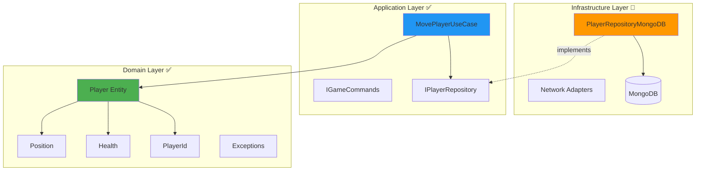
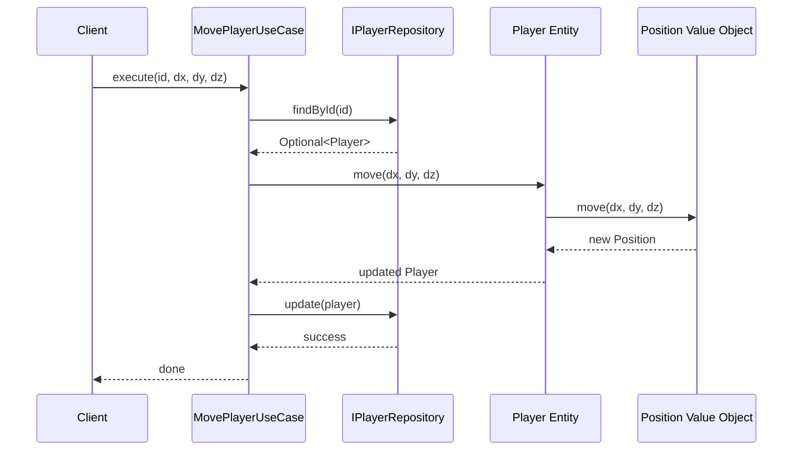
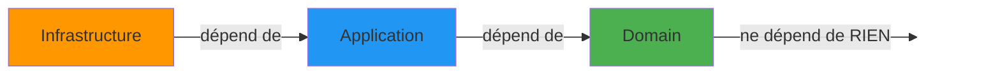
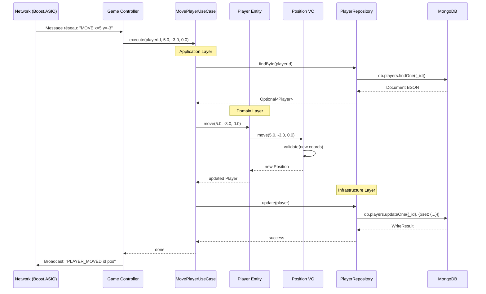

# Architecture Hexagonale du Serveur R-Type

> ✅ **État:** En cours d'implémentation (Domain Layer et Application Layer fonctionnels)

## Introduction

Le serveur R-Type utilise une **Architecture Hexagonale** (aussi appelée **Ports & Adapters** ou **Clean Architecture**). Cette approche garantit une séparation claire entre la logique métier et l'infrastructure technique.

### Pourquoi l'Architecture Hexagonale ?

| Avantage | Explication |
|----------|-------------|
| **Testabilité** | La logique métier est isolée et peut être testée sans base de données ni réseau |
| **Maintenabilité** | Les responsabilités sont clairement séparées |
| **Flexibilité** | Changement facile d'infrastructure (MongoDB → PostgreSQL, REST → gRPC) |
| **Indépendance** | Le domaine ne dépend d'aucune technologie externe |

## ✅ État Actuel Détaillé (v0.2.0)

### Domain Layer - 100% Implémenté ✅

**Entités:**
- `Player` (Health, PlayerId, Position) - Joueur en partie (gameplay)
- `User` (UserId, Username, Password, timestamps) - Utilisateur authentifié

**Value Objects:**
- `Health` (float >= 0) - Points de vie
- `Position` (x, y, z dans [-1000, 1000]) - Coordonnées 3D
- `PlayerId` (UUID MongoDB 24 hex) - Identifiant joueur
- `UserId`, `Username` (6-21 chars), `Password` (min 6 chars) - Authentification

**Exceptions:**
- `DomainException`, `HealthException`, `PositionException`
- `PlayerIdException`, `UserIdException`, `UsernameException`, `PasswordException`

**Documentation:** [Domain API Reference](../api/domain.md)

### Application Layer - 50% Implémenté 🚧

**Use Cases:**
- ✅ `MovePlayerUseCase` - Déplacement joueur (implémenté)
- 🚧 `LoginUseCase` - Authentification utilisateur (en cours)
- 📋 `RegisterUseCase` - Inscription utilisateur (planifié)

**Ports IN (interfaces entrantes):**
- ✅ `IGameCommands` - Commandes de jeu

**Ports OUT (interfaces sortantes):**
- ✅ `IPlayerRepository` - Persistance Player (interface définie, implémentation en cours)
- ✅ `IUserRepository` - Persistance User (interface définie)

### Infrastructure Layer - 60% Implémenté 🚧

**Adapters IN (Driving):**
- ✅ `UDPServer` - Serveur UDP asynchrone port 4123 (gameplay temps réel)
- ✅ `TCPServer` + `Session` - Serveur TCP asynchrone port 4123 (authentification)
- ✅ `CLIGameController` - Interface CLI pour tests

**Adapters OUT (Driven):**
- ✅ `MongoDBConfiguration` - Connexion MongoDB avec bsoncxx/mongocxx
- 🚧 `MongoDBPlayerRepository` - Repository Player (30% - en développement)

**Documentation:** [Adapters API Reference](../api/adapters.md), [Network Architecture](network-architecture.md)

### Séparation .hpp/.cpp - 100% Appliquée ✅

- **46 fichiers sources:** 23 headers (.hpp) + 23 implementations (.cpp)
- **Build incrémental:** ~15s (vs ~45s avant refactoring)
- **Tous les namespaces:** `domain::`, `application::`, `infrastructure::`

**Documentation:** [C++ Header/Implementation Guide](cpp-header-implementation.md)

---

## Les 3 Couches



### 1. Domain Layer (Cœur Métier) ✅

**Responsabilité:** Contient toute la logique métier, les règles du jeu, les invariants.

**Caractéristiques:**
- ❌ **AUCUNE** dépendance externe (pas de MongoDB, pas de Boost.ASIO)
- ✅ Entités riches avec comportement
- ✅ Value Objects immutables
- ✅ Validation des règles métier

**Structure actuelle:**

```
domain/
├── entities/
│   └── Player.hpp                    # Entité joueur avec logique
├── value_objects/
│   ├── Position.hpp                  # Coordonnées 3D validées
│   ├── Health.hpp                    # Points de vie [0-5]
│   └── player/PlayerId.hpp           # ID unique (MongoDB ObjectId)
├── exceptions/
│   ├── DomainException.hpp           # Exception de base
│   ├── PositionException.hpp         # Position invalide
│   ├── HealthException.hpp           # Santé invalide
│   └── player/PlayerIdException.hpp  # ID invalide
└── services/
    └── GameRule.hpp                  # 📋 Services de domaine (à venir)
```

#### Exemple: Value Object Position

```cpp
class Position {
private:
    float _x, _y, _z;

    void validate(float x, float y, float z) {
        if (x < -1000.0f || x > 1000.0f ||
            y < -1000.0f || y > 1000.0f ||
            z < -1000.0f || z > 1000.0f) {
            throw exceptions::PositionException(x, y, z);
        }
    }

public:
    explicit Position(float x = 0.0f, float y = 0.0f, float z = 0.0f)
        : _x(x), _y(y), _z(z) {
        validate(x, y, z);  // ✅ Validation dans le constructeur
    }

    // ✅ Immutabilité: retourne une NOUVELLE position
    Position move(float dx, float dy, float dz) const {
        return Position(_x + dx, _y + dy, _z + dz);
    }

    float getX() const { return _x; }
    float getY() const { return _y; }
    float getZ() const { return _z; }
};
```

**Points clés:**
- ✅ **Validation immédiate**: impossible de créer une position invalide
- ✅ **Immutabilité**: `move()` retourne une nouvelle position au lieu de modifier l'existante
- ✅ **Pas de dépendances**: le code ne connaît ni MongoDB ni le réseau

#### Exemple: Entité Player

```cpp
class Player {
private:
    value_objects::Health _health;
    value_objects::player::PlayerId _id;
    value_objects::Position _position;

public:
    explicit Player(
        value_objects::Health health,
        value_objects::player::PlayerId id,
        value_objects::Position position = value_objects::Position()
    ) : _health(health), _id(id), _position(position) {}

    // Getters
    const value_objects::player::PlayerId& getId() const { return _id; }
    const value_objects::Position& getPosition() const { return _position; }

    // Comportements métier
    void move(float dx, float dy, float dz) {
        _position = _position.move(dx, dy, dz);  // ✅ Utilise le Value Object
    }

    void heal(float value) {
        _health = _health.heal(value);
    }

    void takeDamage(float value) {
        _health = _health.damage(value);
    }
};
```

**Points clés:**
- ✅ **Encapsulation**: les données sont privées
- ✅ **Comportement riche**: `move()`, `heal()`, `takeDamage()` contiennent la logique
- ✅ **Utilisation des Value Objects**: délègue la validation

---

### 2. Application Layer (Orchestration) ✅

**Responsabilité:** Coordonne les cas d'utilisation, orchestre les entités du domaine.

**Caractéristiques:**
- ✅ Use Cases (un par fonctionnalité métier)
- ✅ Définit les **Ports** (interfaces) pour communiquer avec l'extérieur
- ✅ DTOs pour transférer les données
- ❌ Ne contient PAS de logique métier (c'est le rôle du Domain)

**Structure actuelle:**

```
application/
├── use_cases/
│   └── MovePlayerUseCase.hpp         # Cas d'usage: déplacer un joueur
├── ports/
│   ├── in/                           # Ports d'entrée (API, Commands)
│   │   └── IGameCommands.hpp
│   └── out/                          # Ports de sortie (Persistence, Events)
│       └── persistence/
│           └── IPlayerRepository.hpp # Interface de persistance
└── dto/
    └── PlayerDTO.hpp                 # 📋 Data Transfer Objects (à venir)
```

#### Exemple: Use Case MovePlayer

```cpp
namespace application::use_cases {
    using domain::value_objects::player::PlayerId;
    using application::ports::out::persistence::IPlayerRepository;

    class MovePlayerUseCase {
    private:
        IPlayerRepository* repository;  // ✅ Injection de dépendance

    public:
        explicit MovePlayerUseCase(IPlayerRepository* repo)
            : repository(repo) {}

        void execute(const PlayerId& id, float dx, float dy, float dz) {
            // 1. Récupérer le joueur
            auto playerOpt = repository->findById(id.value());
            if (!playerOpt.has_value()) {
                return;  // Joueur non trouvé
            }

            // 2. Appliquer la logique métier
            auto player = playerOpt.value();
            player.move(dx, dy, dz);  // ✅ Délègue au domaine

            // 3. Persister les changements
            repository->update(player);
        }
    };
}
```

**Flux d'exécution:**



**Points clés:**
- ✅ **Orchestration simple**: récupère → applique logique → sauvegarde
- ✅ **Pas de logique métier**: tout est délégué à `Player.move()`
- ✅ **Injection de dépendances**: reçoit le repository en paramètre
- ✅ **Dépend d'une interface**: `IPlayerRepository`, pas d'une implémentation concrète

#### Exemple: Port IPlayerRepository

```cpp
namespace application::ports::out::persistence {
    using domain::entities::Player;

    class IPlayerRepository {  // ✅ Interface pure (abstract)
    public:
        virtual ~IPlayerRepository() = default;

        virtual void save(const Player& player) const = 0;
        virtual void update(const Player& player) = 0;
        virtual std::optional<Player> findById(const std::string& id) const = 0;
        virtual std::vector<Player> findAll() = 0;
    };
}
```

**Points clés:**
- ✅ **Interface pure**: toutes les méthodes sont `virtual` et `= 0`
- ✅ **Pas d'implémentation**: le domaine ne sait pas si c'est MongoDB, PostgreSQL ou RAM
- ✅ **Contrat clair**: définit ce dont l'application a besoin

---

### 3. Infrastructure Layer (Implémentations) 🚧

**Responsabilité:** Implémente les ports définis par l'Application Layer.

**Caractéristiques:**
- ✅ Implémentations concrètes des repositories
- ✅ Adapters réseau (Boost.ASIO)
- ✅ Configuration et dépendances externes

**Structure planifiée:**

```
infrastructure/  🚧 À CRÉER
├── persistence/
│   ├── mongodb/
│   │   └── PlayerRepositoryMongoDB.hpp  # Implémente IPlayerRepository
│   └── memory/
│       └── InMemoryPlayerRepository.hpp # Pour les tests
├── network/
│   └── asio/
│       └── GameServerAdapter.hpp        # Adapte Boost.ASIO
└── config/
    └── DependencyInjection.hpp          # Wire tout ensemble
```

#### Exemple futur: Repository MongoDB

```cpp
// 🚧 Pas encore implémenté
class PlayerRepositoryMongoDB : public IPlayerRepository {
private:
    mongocxx::collection _collection;

public:
    void update(const Player& player) override {
        // Convertir Player en document BSON
        auto doc = bsoncxx::builder::stream::document{}
            << "position" << bsoncxx::builder::stream::open_document
                << "x" << player.getPosition().getX()
                << "y" << player.getPosition().getY()
                << "z" << player.getPosition().getZ()
            << bsoncxx::builder::stream::close_document
            << bsoncxx::builder::stream::finalize;

        // Sauvegarder dans MongoDB
        _collection.update_one(
            make_document(kvp("_id", player.getId().value())),
            make_document(kvp("$set", doc.view()))
        );
    }

    // ... autres méthodes
};
```

**Points clés:**
- ✅ **Implémente l'interface**: `PlayerRepositoryMongoDB : public IPlayerRepository`
- ✅ **Contient la technologie**: MongoDB, Boost.ASIO, etc.
- ✅ **Substituable**: facile de créer `PlayerRepositoryPostgreSQL` sans toucher au domaine

---

## Principes Fondamentaux

### 1. Règle de Dépendance (Dependency Rule)



**❌ INTERDIT:**
```cpp
// ❌ MAL: Le domaine ne doit PAS connaître MongoDB
#include <mongocxx/client.hpp>

class Player {
    void saveToDB(mongocxx::collection& coll);  // ❌ VIOLATION!
};
```

**✅ CORRECT:**
```cpp
// ✅ BIEN: Le domaine contient juste la logique
class Player {
    void move(float dx, float dy, float dz);  // ✅ Logique pure
};

// ✅ L'infrastructure s'occupe de la persistance
class PlayerRepositoryMongoDB : public IPlayerRepository {
    void update(const Player& player) { /* MongoDB ici */ }
};
```

### 2. Injection de Dépendances

```cpp
// ❌ MAL: Création directe (couplage fort)
class MovePlayerUseCase {
    PlayerRepositoryMongoDB repo;  // ❌ Couplé à MongoDB!
};

// ✅ BIEN: Injection par le constructeur
class MovePlayerUseCase {
    IPlayerRepository* repository;  // ✅ Interface!

    explicit MovePlayerUseCase(IPlayerRepository* repo)
        : repository(repo) {}
};

// Utilisation:
auto mongoRepo = new PlayerRepositoryMongoDB();
auto useCase = MovePlayerUseCase(mongoRepo);  // ✅ Flexible!
```

**Avantages:**
- ✅ Tests faciles: on peut injecter un mock
- ✅ Changement de DB transparent
- ✅ Pas de recompilation du use case si MongoDB change

### 3. Immutabilité des Value Objects

```cpp
// ❌ MAL: Modification en place (état mutable)
void Position::move(float dx, float dy, float dz) {
    _x += dx;
    _y += dy;
    _z += dz;
}

// ✅ BIEN: Retourne une nouvelle instance
Position Position::move(float dx, float dy, float dz) const {
    return Position(_x + dx, _y + dy, _z + dz);  // ✅ Nouveau objet
}
```

**Avantages:**
- ✅ Thread-safe par design
- ✅ Pas d'effets de bord
- ✅ Historique facile (event sourcing)

---

## Exemples Concrets d'Utilisation

### Cas 1: Déplacer un joueur

**Code client (Infrastructure Layer):**

```cpp
#include "application/use_cases/MovePlayerUseCase.hpp"
#include "infrastructure/persistence/InMemoryPlayerRepository.hpp"

int main() {
    // 1. Créer le repository (Infrastructure)
    auto repository = new InMemoryPlayerRepository();

    // 2. Créer un joueur et le sauvegarder
    auto playerId = PlayerId("507f1f77bcf86cd799439011");
    auto player = Player(
        Health(5.0f),
        playerId,
        Position(10.0f, 20.0f, 0.0f)
    );
    repository->save(player);

    // 3. Créer le use case (Application)
    auto moveUseCase = MovePlayerUseCase(repository);

    // 4. Exécuter le déplacement
    moveUseCase.execute(playerId, 5.0f, -3.0f, 0.0f);

    // 5. Vérifier le résultat
    auto updated = repository->findById(playerId.value());
    // Position est maintenant (15.0, 17.0, 0.0)

    return 0;
}
```

**Déroulé étape par étape:**

1. **Infrastructure** crée le repository concret
2. **Domain** crée les entités avec validation
3. **Application** orchestre le cas d'usage
4. **Domain** applique la logique métier (`move()`)
5. **Infrastructure** persiste dans la base

### Cas 2: Tester le Use Case (sans base de données!)

```cpp
// Mock du repository (pas besoin de MongoDB!)
class MockPlayerRepository : public IPlayerRepository {
private:
    std::map<std::string, Player> _players;

public:
    void update(const Player& player) override {
        _players[player.getId().value()] = player;  // ✅ En RAM
    }

    std::optional<Player> findById(const std::string& id) const override {
        auto it = _players.find(id);
        if (it != _players.end())
            return it->second;
        return std::nullopt;
    }

    // ... autres méthodes
};

// Test unitaire (Google Test)
TEST(MovePlayerUseCaseTest, ShouldMovePlayerPosition) {
    // Arrange
    auto mockRepo = new MockPlayerRepository();
    auto playerId = PlayerId("507f1f77bcf86cd799439011");
    auto player = Player(Health(5.0f), playerId, Position(10.0f, 20.0f, 0.0f));
    mockRepo->save(player);

    auto useCase = MovePlayerUseCase(mockRepo);

    // Act
    useCase.execute(playerId, 5.0f, -3.0f, 0.0f);

    // Assert
    auto updated = mockRepo->findById(playerId.value()).value();
    EXPECT_FLOAT_EQ(updated.getPosition().getX(), 15.0f);
    EXPECT_FLOAT_EQ(updated.getPosition().getY(), 17.0f);
    EXPECT_FLOAT_EQ(updated.getPosition().getZ(), 0.0f);
}
```

**Avantages:**
- ✅ **Test rapide**: pas de base de données à lancer
- ✅ **Test isolé**: uniquement la logique métier
- ✅ **Test reproductible**: pas de dépendance externe

---

## Flux de Données Complet



**Couches traversées:**
1. **Infrastructure** (Réseau) → reçoit le message
2. **Application** (Use Case) → orchestre
3. **Domain** (Logique) → applique les règles
4. **Infrastructure** (DB) → persiste
5. **Infrastructure** (Réseau) → notifie les clients

---

## Avantages Concrets pour R-Type

### 1. Tests Faciles

```cpp
// ✅ Tester la logique de déplacement SANS base de données
TEST(PlayerTest, MoveUpdatesPosition) {
    auto player = Player(Health(5.0f), PlayerId("..."), Position(0, 0, 0));
    player.move(10.0f, 20.0f, 0.0f);

    EXPECT_EQ(player.getPosition().getX(), 10.0f);
    EXPECT_EQ(player.getPosition().getY(), 20.0f);
}
```

### 2. Changement de Technologie

```cpp
// Aujourd'hui: MongoDB
auto repo = new PlayerRepositoryMongoDB(db);

// Demain: PostgreSQL (sans toucher au Use Case!)
auto repo = new PlayerRepositoryPostgreSQL(db);

// Tests: RAM
auto repo = new InMemoryPlayerRepository();
```

### 3. Parallélisation du Développement

- **Équipe 1**: Implémente le Domain (Player, Position, etc.)
- **Équipe 2**: Implémente les Use Cases (avec mock repos)
- **Équipe 3**: Implémente MongoDB et Boost.ASIO

✅ Chacun travaille indépendamment!

### 4. Logique Métier Réutilisable

```cpp
// Le même code Player peut être utilisé:
// - Côté serveur (authoritative)
// - Côté client (prédiction)
// - Dans les tests
// - Dans un outil d'administration
```

---

## Prochaines Étapes 🚧

### À court terme

- [ ] Implémenter `InMemoryPlayerRepository` pour les tests
- [ ] Créer `PlayerRepositoryMongoDB`
- [ ] Ajouter des tests unitaires pour `MovePlayerUseCase`
- [ ] Documenter les autres use cases (Attack, Shoot, etc.)

### À moyen terme

- [ ] Intégrer avec Boost.ASIO (couche réseau)
- [ ] Ajouter des Domain Events (PlayerMoved, PlayerDied, etc.)
- [ ] Implémenter les Domain Services (CollisionDetection, ScoreCalculator)
- [ ] Créer d'autres use cases (CreatePlayer, AttackEnemy, etc.)

### À long terme

- [ ] Intégration avec ECS (Entity Component System)
- [ ] Event Sourcing pour rejouer les parties
- [ ] CQRS (Command Query Responsibility Segregation)

---

## Ressources

### Livres
- **Clean Architecture** - Robert C. Martin
- **Domain-Driven Design** - Eric Evans
- **Implementing Domain-Driven Design** - Vaughn Vernon

### Articles
- [Hexagonal Architecture](https://alistair.cockburn.us/hexagonal-architecture/)
- [The Clean Architecture](https://blog.cleancoder.com/uncle-bob/2012/08/13/the-clean-architecture.html)

### Code
- Voir `src/server/include/` pour l'implémentation actuelle
- Voir `tests/server/` pour les tests (à venir)

---

## Conclusion

L'architecture hexagonale du serveur R-Type garantit:

✅ **Code testable** sans dépendances externes
✅ **Logique métier protégée** des changements d'infrastructure
✅ **Équipes indépendantes** travaillant en parallèle
✅ **Évolution facile** du projet sur le long terme

Cette architecture est un **investissement** qui paiera sur la durée du projet.
