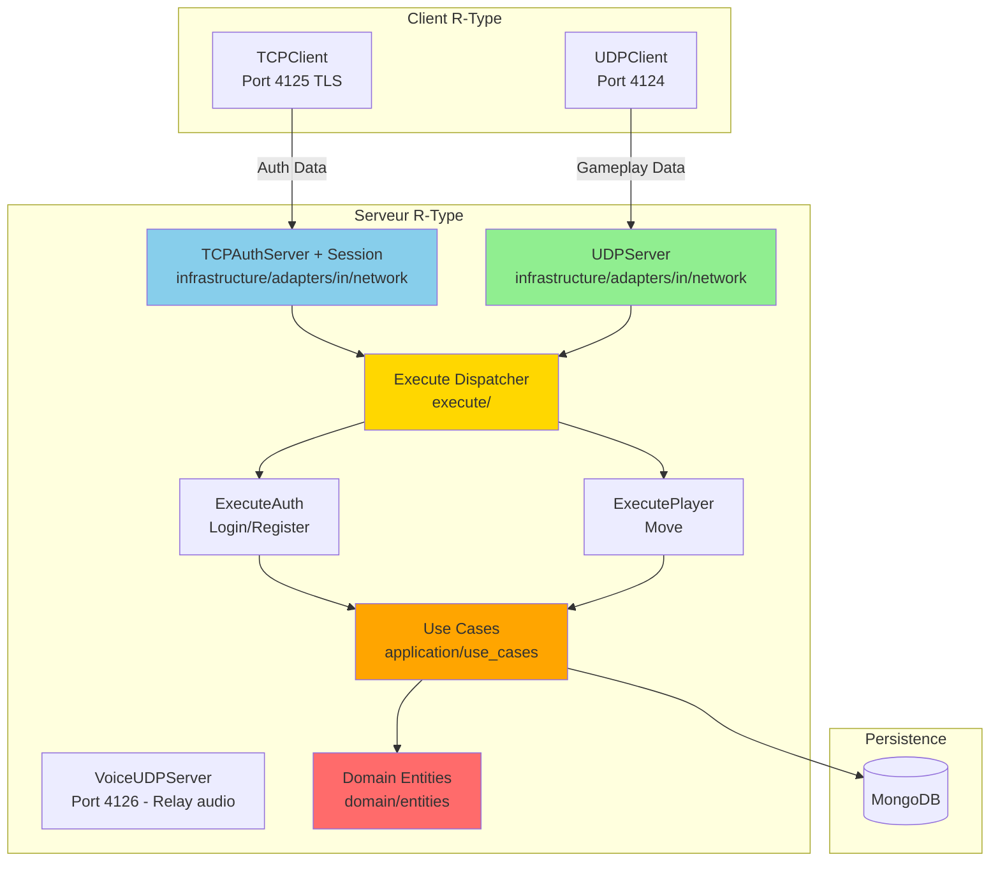
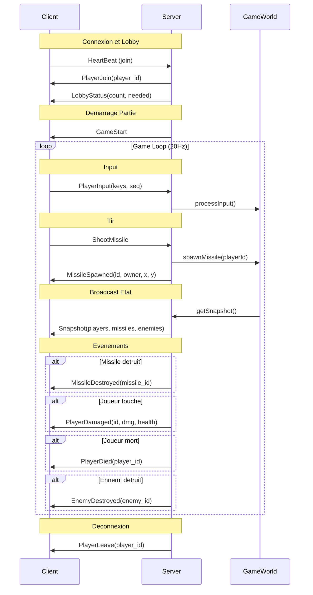
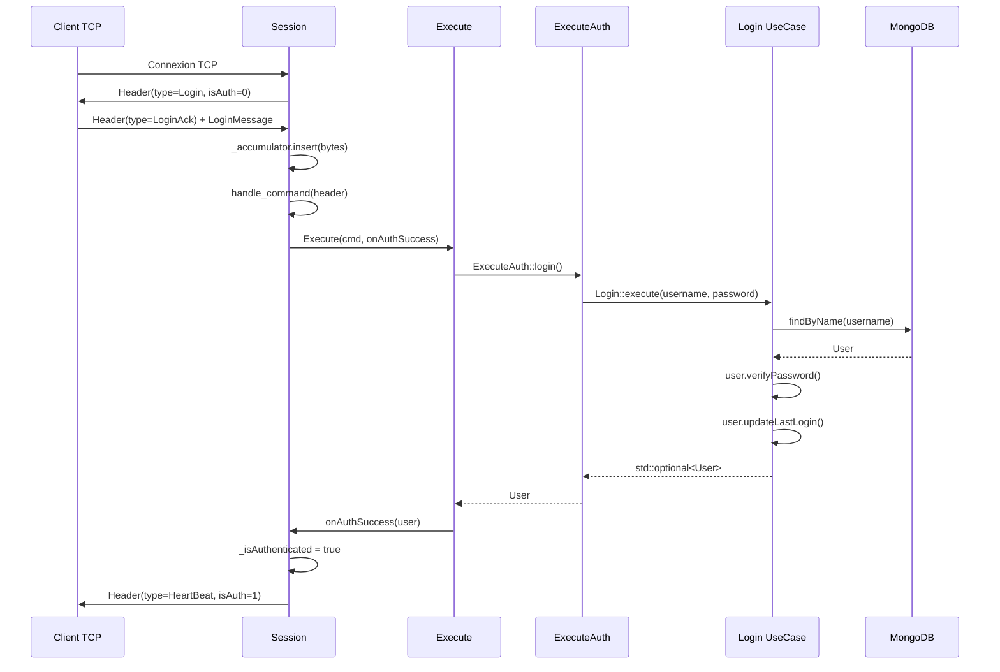
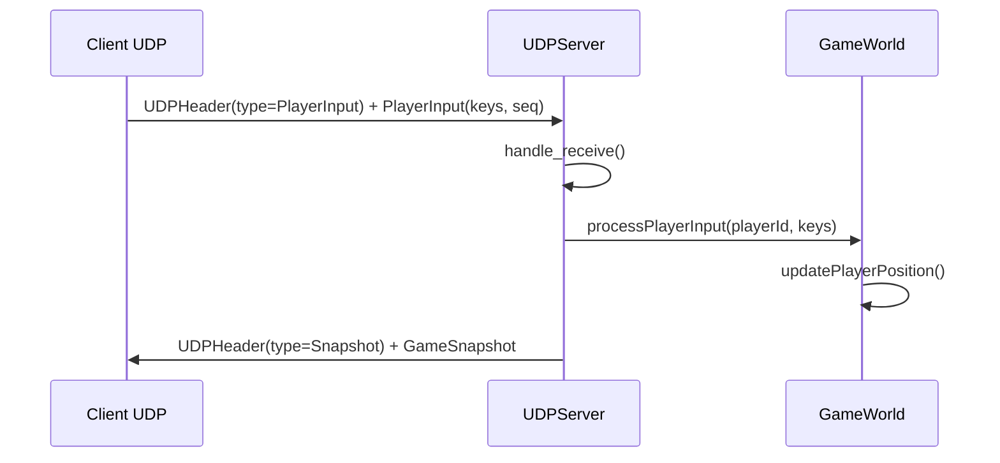

# Architecture Reseau R-Type

**Etat:** Implemente - Protocole binaire TCP/UDP operationnel
**Version:** 1.0.0
**Derniere mise a jour:** 15 decembre 2025

---

## Vue d'Ensemble

Le serveur R-Type utilise une architecture reseau **hybride UDP/TCP** avec Boost.Asio pour gerer les communications client-serveur. Cette architecture separe les preoccupations entre donnees temps reel (UDP) et communications fiables (TCP).

### Justification Architecturale

| Protocole | Port | Utilisation | Raison |
|-----------|------|-------------|--------|
| **TCP/TLS** | 4125 | Authentification (Login/Register) | **Fiabilite + Securite** - TLS 1.2+ pour credentials |
| **UDP** | 4124 | Positions, mouvements, actions de jeu | **Vitesse** - Pas besoin de fiabilite, les anciennes donnees sont obsoletes |
| **UDP** | 4126 | Chat vocal (VoiceFrame Opus) | **Temps reel** - Audio ne doit pas etre retarde |

---

## Architecture Globale



---

## Protocole Binaire v0.5.0

### Header TCP (7 bytes)

```
Offset  Type       Taille  Endianness  Description
------  ---------  ------  ----------  -----------
0       uint8_t    1       -           isAuthenticated (0=false, 1=true)
1       uint16_t   2       Big-endian  type (MessageType enum)
3       uint32_t   4       Big-endian  payload_size (taille du payload)

Total: 7 bytes (WIRE_SIZE)
```

### Header UDP (12 bytes)

```
Offset  Type       Taille  Endianness  Description
------  ---------  ------  ----------  -----------
0       uint16_t   2       Big-endian  type (MessageType)
2       uint16_t   2       Big-endian  sequence_num
4       uint64_t   8       Big-endian  timestamp (millisecondes)

Total: 12 bytes (WIRE_SIZE)
```

### Types de Messages (MessageType enum)

| Type | Code | Direction | Description |
|------|------|-----------|-------------|
| HeartBeat | 0x0001 | Bidirectionnel | Keep-alive |
| Login | 0x0010 | Server -> Client | Demande de login (TCP) |
| LoginAck | 0x0011 | Client -> Server | Reponse login avec credentials (TCP) |
| Register | 0x0020 | Server -> Client | Demande d'inscription (TCP) |
| RegisterAck | 0x0021 | Client -> Server | Reponse inscription (TCP) |
| Basic | 0x0030 | - | Reserve |
| BasicAck | 0x0031 | - | Reserve |
| Snapshot | 0x0040 | S → C | Etat complet du jeu (20Hz) |
| Player | 0x0050 | - | Reserve |
| PlayerInput | 0x0061 | C → S | Commandes joueur (4 bytes bitfield) |
| PlayerJoin | 0x0070 | S → C | Nouveau joueur connecte (1 byte) |
| PlayerLeave | 0x0071 | S → C | Joueur deconnecte (1 byte) |
| ShootMissile | 0x0080 | C → S | Demande de tir (0 byte) |
| MissileSpawned | 0x0081 | S → C | Missile cree (7 bytes) |
| MissileDestroyed | 0x0082 | S → C | Missile detruit (2 bytes) |
| EnemySpawned | 0x0090 | S → C | Ennemi apparu (8 bytes) |
| EnemyDestroyed | 0x0091 | S → C | Ennemi detruit (2 bytes) |
| PlayerDamaged | 0x00A0 | S → C | Joueur blesse (3 bytes) |
| PlayerDied | 0x00A1 | S → C | Joueur mort (1 byte) |
| GameStart | 0x00B0 | S → C | Debut de partie (0 byte) |
| LobbyStatus | 0x00B1 | S → C | Etat du lobby (2 bytes) |
| VoiceJoin | 0x0300 | C → S | Rejoindre channel vocal (38 bytes) |
| VoiceJoinAck | 0x0301 | S → C | Confirmation (1 byte) |
| VoiceLeave | 0x0302 | C → S | Quitter channel vocal (1 byte) |
| VoiceFrame | 0x0303 | Bidirectionnel | Audio Opus encode (5-485 bytes) |
| VoiceMute | 0x0304 | Bidirectionnel | Notification mute (2 bytes) |

### Structures de Messages

#### LoginMessage (287 bytes)

```cpp
struct LoginMessage {
    char username[32];   // 32 bytes
    char password[255];  // 255 bytes
};
```

#### RegisterMessage (542 bytes)

```cpp
struct RegisterMessage {
    char username[32];   // 32 bytes
    char email[255];     // 255 bytes
    char password[255];  // 255 bytes
};
```

#### PlayerInput (4 bytes)

```cpp
struct PlayerInput {
    uint16_t keys;        // Bitfield (Up/Down/Left/Right/Shoot)
    uint16_t sequenceNum; // Pour reconciliation client-side prediction
};

// InputKeys namespace
namespace InputKeys {
    constexpr uint16_t Up    = 0x01;
    constexpr uint16_t Down  = 0x02;
    constexpr uint16_t Left  = 0x04;
    constexpr uint16_t Right = 0x08;
    constexpr uint16_t Shoot = 0x10;
}
```

#### PlayerJoin (1 byte)

```cpp
struct PlayerJoin {
    uint8_t player_id;  // ID du nouveau joueur (0-3)
};
```

#### PlayerLeave (1 byte)

```cpp
struct PlayerLeave {
    uint8_t player_id;  // ID du joueur qui quitte
};
```

#### ShootMissile (0 byte)

```cpp
struct ShootMissile {
    // Pas de payload - le serveur utilise la position du joueur
};
```

#### MissileState (7 bytes)

Structure commune pour representer l'etat d'un missile (joueur ou ennemi).

```cpp
struct MissileState {
    uint16_t id;        // 2 bytes - ID unique du missile
    uint8_t owner_id;   // 1 byte - ID proprietaire (0xFF = ennemi)
    uint16_t x;         // 2 bytes - Position X
    uint16_t y;         // 2 bytes - Position Y
};
```

#### MissileSpawned (7 bytes)

```cpp
struct MissileSpawned {
    uint16_t missile_id;  // 2 bytes - ID du missile cree
    uint8_t owner_id;     // 1 byte - ID du joueur tireur
    uint16_t x;           // 2 bytes - Position initiale X
    uint16_t y;           // 2 bytes - Position initiale Y
};
```

#### MissileDestroyed (2 bytes)

```cpp
struct MissileDestroyed {
    uint16_t missile_id;  // ID du missile detruit
};
```

#### PlayerState (7 bytes)

```cpp
struct PlayerState {
    uint8_t id;       // 1 byte - ID joueur (0-3)
    uint16_t x;       // 2 bytes - Position X
    uint16_t y;       // 2 bytes - Position Y
    uint8_t health;   // 1 byte - Points de vie (0-100)
    uint8_t alive;    // 1 byte - 0=mort, 1=vivant
};
```

#### EnemyState (8 bytes)

```cpp
struct EnemyState {
    uint16_t id;          // 2 bytes - ID unique ennemi
    uint16_t x;           // 2 bytes - Position X
    uint16_t y;           // 2 bytes - Position Y
    uint8_t health;       // 1 byte - Points de vie
    uint8_t enemy_type;   // 1 byte - Type d'ennemi (0=basic, 1=fast, etc.)
};
```

#### EnemyDestroyed (2 bytes)

```cpp
struct EnemyDestroyed {
    uint16_t enemy_id;  // ID de l'ennemi detruit
};
```

#### PlayerDamaged (3 bytes)

```cpp
struct PlayerDamaged {
    uint8_t player_id;   // ID du joueur touche
    uint8_t damage;      // Degats infliges
    uint8_t new_health;  // Points de vie restants
};
```

#### PlayerDied (1 byte)

```cpp
struct PlayerDied {
    uint8_t player_id;  // ID du joueur mort
};
```

#### GameStart (0 byte)

```cpp
struct GameStart {
    // Pas de payload - signal de debut de partie
};
```

#### LobbyStatus (2 bytes)

```cpp
struct LobbyStatus {
    uint8_t player_count;    // Nombre de joueurs actuels
    uint8_t players_needed;  // Nombre de joueurs requis pour demarrer
};
```

#### GameSnapshot (taille variable)

Structure principale contenant l'etat complet du jeu, diffusee a 20Hz.

```cpp
struct GameSnapshot {
    uint8_t player_count;                       // 1 byte
    PlayerState players[MAX_PLAYERS];           // 7 * player_count bytes
    uint8_t missile_count;                      // 1 byte
    MissileState missiles[MAX_MISSILES];        // 7 * missile_count bytes
    uint8_t enemy_count;                        // 1 byte
    EnemyState enemies[MAX_ENEMIES];            // 8 * enemy_count bytes
    uint8_t enemy_missile_count;                // 1 byte
    MissileState enemy_missiles[MAX_MISSILES];  // 7 * enemy_missile_count bytes
};

// Constantes
static constexpr uint8_t MAX_PLAYERS = 4;
static constexpr uint8_t MAX_MISSILES = 32;
static constexpr uint8_t MAX_ENEMIES = 16;
static constexpr uint8_t MAX_ENEMY_MISSILES = 32;
static constexpr uint8_t ENEMY_OWNER_ID = 0xFF;  // Identifie les missiles ennemis
```

**Calcul de la taille:**
```
wire_size = 1 + player_count * 7
          + 1 + missile_count * 7
          + 1 + enemy_count * 8
          + 1 + enemy_missile_count * 7
```

#### VoiceJoin (38 bytes)

```cpp
struct VoiceJoin {
    SessionToken token;      // 32 bytes - Reutilise auth existante
    char roomCode[6];        // 6 bytes - Code de la room
};
```

#### VoiceFrame (5-485 bytes)

Structure audio comprimee avec codec Opus (20ms de voix).

```cpp
struct VoiceFrame {
    uint8_t speaker_id;       // 1 byte - ID du joueur qui parle
    uint16_t sequence;        // 2 bytes - Detection perte paquets
    uint16_t opus_len;        // 2 bytes - Taille donnees Opus
    uint8_t opus_data[480];   // max 480 bytes - Audio Opus encode
};

// Constantes
static constexpr uint16_t VOICE_UDP_PORT = 4126;
static constexpr size_t MAX_OPUS_FRAME_SIZE = 480;
```

#### VoiceMute (2 bytes)

```cpp
struct VoiceMute {
    uint8_t player_id;  // ID du joueur
    uint8_t muted;      // 0 = unmuted, 1 = muted
};
```

### Persistance des Parametres Audio

Les preferences audio sont stockees dans UserSettingsPayload et synchronisees avec MongoDB :

```cpp
// UserSettingsPayload (ajouts voice chat)
struct UserSettingsPayload {
    // ... champs existants ...
    uint8_t voiceMode;                        // 0 = PTT, 1 = VAD
    uint8_t vadThreshold;                     // 0-100 (sensibilite)
    uint8_t micGain;                          // 0-200 (gain micro)
    uint8_t voiceVolume;                      // 0-100 (volume playback)
    char audioInputDevice[64];                // Nom peripherique entree
    char audioOutputDevice[64];               // Nom peripherique sortie

    static constexpr size_t WIRE_SIZE = /* ... */ + 4 + 128;  // +4 voice params +128 device names
};
```

| Champ | Taille | Description |
|-------|--------|-------------|
| voiceMode | 1 byte | 0=PushToTalk, 1=VoiceActivity |
| vadThreshold | 1 byte | 0-100 (mappe vers 0.0-1.0) |
| micGain | 1 byte | 0-200 (mappe vers 0.0-2.0) |
| voiceVolume | 1 byte | 0-100 |
| audioInputDevice | 64 bytes | Nom du peripherique d'entree (ou vide pour auto) |
| audioOutputDevice | 64 bytes | Nom du peripherique de sortie (ou vide pour auto) |

---

## Flux de Gameplay UDP

### Sequence de Jeu



### Format Binaire sur le Fil

Chaque message UDP suit ce format:

```
+------------------+------------------+
|    UDPHeader     |     Payload      |
|    (12 bytes)    |   (variable)     |
+------------------+------------------+

UDPHeader:
+--------+--------+--------+--------+--------+--------+--------+--------+--------+--------+--------+--------+
| type_h | type_l | seq_h  | seq_l  |            timestamp (8 bytes, big-endian)                           |
+--------+--------+--------+--------+--------+--------+--------+--------+--------+--------+--------+--------+
   0        1        2        3        4        5        6        7        8        9       10       11
```

**Exemple: Message PlayerInput**
```
Offset  Valeur   Description
------  -------  -----------
0-1     0x00 61  type = PlayerInput (0x0061)
2-3     0x00 0A  sequence_num = 10
4-11    ...      timestamp (ms depuis epoch)
12-13   0x00 09  keys = Up(0x01) + Right(0x08) = 0x09
14-15   0x00 42  inputSeqNum = 66
```

---

## TCPServer - Authentification

### Architecture Session

```cpp
class Session : public std::enable_shared_from_this<Session> {
private:
    tcp::socket _socket;
    char _readBuffer[BUFFER_SIZE];
    std::vector<uint8_t> _accumulator;  // Buffer messages fragmentes
    bool _isAuthenticated = false;       // Etat authentification
    std::optional<User> _user;           // User apres login
    std::function<void(const User&)> _onAuthSuccess;  // Callback

    void do_read();
    void do_write(const MessageType&, const std::string&);
    void handle_command(const Header&);
    void onLoginSuccess(const User& user);
};
```

### Flux d'Authentification



### Gestion Accumulator (Fix Boucle Infinie)

```cpp
void Session::do_read() {
    _socket.async_read_some(
        boost::asio::buffer(_readBuffer, BUFFER_SIZE),
        [this, self](error_code ec, size_t bytes) {
            if (!ec) {
                _accumulator.insert(_accumulator.end(),
                                   _readBuffer, _readBuffer + bytes);

                // Traiter TOUS les messages complets
                while (_accumulator.size() >= Header::WIRE_SIZE) {
                    Header head = Header::from_bytes(_accumulator.data());
                    size_t totalSize = Header::WIRE_SIZE + head.payload_size;

                    // Attendre message complet
                    if (_accumulator.size() < totalSize) break;

                    handle_command(head);

                    // IMPORTANT: Retirer donnees traitees
                    _accumulator.erase(_accumulator.begin(),
                                      _accumulator.begin() + totalSize);
                }
                do_read();
            }
        }
    );
}
```

---

## UDPServer - Gameplay Temps Reel

### Architecture

```cpp
class UDPServer {
private:
    udp::socket _socket;
    udp::endpoint _remote_endpoint;
    std::array<char, BUFFER_SIZE> _recv_buffer;

    void start_receive();
    void handle_receive(error_code, size_t);
};
```

### Flux Input Joueur



---

## Execute Dispatcher

### Architecture Command Pattern

```cpp
class Execute {
public:
    Execute(
        const Command& cmd,
        std::shared_ptr<MongoDBUserRepository> userRepository,
        std::unordered_map<std::string, User>& users,
        std::function<void(const User&)> onLoginSuccess
    );
};

struct Command {
    uint16_t type;
    std::vector<uint8_t> buf;
};
```

### Routing des Commandes

```
Command.type
    |
    +-- LoginAck/RegisterAck --> ExecuteAuth
    |                               |
    |                               +-- LoginAck --> Login::execute()
    |                               +-- RegisterAck --> Register::execute()
    |
    +-- PlayerInput --> GameWorld
                           |
                           +-- MovePlayer --> Move::execute()
```

---

## Client Integration

### TCPClient

```cpp
class TCPClient {
    void connect(const std::string& host, uint16_t port);
    void sendLoginData(const std::string& username, const std::string& password);
    void sendRegisterData(const std::string& username, const std::string& email,
                         const std::string& password);
    bool isAuthenticated() const;

    // Callbacks
    void setOnConnected(const OnConnectedCallback&);
    void setOnDisconnected(const OnDisconnectedCallback&);
    void setOnReceive(const OnReceiveCallback&);
    void setOnError(const OnErrorCallback&);
};
```

### UDPClient

```cpp
class UDPClient {
    void connect(std::shared_ptr<TCPClient> tcpClient,
                const std::string& host, uint16_t port);
    void movePlayer(uint16_t x, uint16_t y);
    bool isAuthenticated();  // Verifie auth TCP
};
```

### Boot Sequence

```cpp
// Boot.cpp
TCPClient tcpClient;
UDPClient udpClient;

tcpClient.connect("127.0.0.1", 4125);  // TCP/TLS auth
udpClient.connect(tcpClient, "127.0.0.1", 4124);  // UDP gameplay

Engine::initialize(tcpClient, udpClient);
Engine::run();
```

---

## Serialisation Binaire

### to_bytes / from_bytes

```cpp
// Header serialisation
void Header::to_bytes(uint8_t* buf) const {
    uint16_t net_type = swap16(type);
    uint32_t net_size = swap32(payload_size);

    buf[0] = isAuthenticated;  // Pas de swap pour 1 byte
    std::memcpy(buf + 1, &net_type, 2);
    std::memcpy(buf + 3, &net_size, 4);
}

// Header deserialisation
static Header from_bytes(const uint8_t* buf) {
    Header head;
    uint16_t net_type;
    uint32_t net_size;

    head.isAuthenticated = buf[0];
    std::memcpy(&net_type, buf + 1, 2);
    std::memcpy(&net_size, buf + 3, 4);

    head.type = swap16(net_type);
    head.payload_size = swap32(net_size);
    return head;
}
```

### Endianness (Network Byte Order)

```cpp
inline uint64_t swap64(uint64_t v) { return __builtin_bswap64(v); }
inline uint32_t swap32(uint32_t v) { return __builtin_bswap32(v); }
inline uint16_t swap16(uint16_t v) { return __builtin_bswap16(v); }
```

---

## Configuration

### Ports

| Service | Port | Protocole |
|---------|------|-----------|
| Authentification | 4125 | TCP/TLS |
| Gameplay | 4124 | UDP |
| Chat Vocal | 4126 | UDP |

### Buffer Size

```cpp
static constexpr std::size_t BUFFER_SIZE = 4096;
```

---

## Tests

### Integration TCP

```cpp
TEST(TCPIntegrationTest, SessionAccumulator) {
    // Test que l'accumulator gere les messages fragmentes
}

TEST(TCPIntegrationTest, LoginFlow) {
    // Test flux complet login
}
```

### Integration UDP

```cpp
TEST(UDPIntegrationTest, PlayerInput) {
    // Test envoi/reception PlayerInput
}
```

---

## Fichiers Cles

| Fichier | Description |
|---------|-------------|
| `src/common/protocol/Protocol.hpp` | Structures protocole binaire |
| `src/server/infrastructure/adapters/in/network/TCPAuthServer.cpp` | Serveur TCP/TLS + Session |
| `src/server/infrastructure/adapters/in/network/UDPServer.cpp` | Serveur UDP |
| `src/server/infrastructure/adapters/in/network/execute/Execute.cpp` | Command dispatcher |
| `src/client/src/network/TCPClient.cpp` | Client TCP |
| `src/client/src/network/UDPClient.cpp` | Client UDP |
| `src/server/infrastructure/adapters/in/network/VoiceUDPServer.cpp` | Serveur Voice (relay) |
| `src/client/src/audio/VoiceChatManager.cpp` | Client Voice Chat |
| `src/client/src/audio/OpusCodec.cpp` | Encodeur/Decodeur Opus |

---

## Evolutions Futures

1. ~~**Snapshots UDP** - Envoi etat jeu complet aux clients~~ ✅ Implemente
2. ~~**Missiles et Combat** - Systeme de tir et collisions~~ ✅ Implemente
3. ~~**Ennemis** - Spawn et destruction d'ennemis~~ ✅ Implemente
4. ~~**Systeme de Lobby** - Attente des joueurs avant partie~~ ✅ Implemente
5. ~~**Chat Vocal** - Communication temps reel Opus/PortAudio~~ ✅ Implemente
6. **Interpolation** - Prediction cote client
6. **Reconnexion** - Gestion deconnexion/reconnexion
7. **Chiffrement** - TLS pour TCP
8. **Compression** - Delta compression pour snapshots
9. **Power-ups** - Bonus et ameliorations temporaires

---

**Derniere revision:** 13/01/2026
**Auteur:** General + Claude Code
**Statut:** A jour avec le code (v1.1.0 - Audio device selection)
