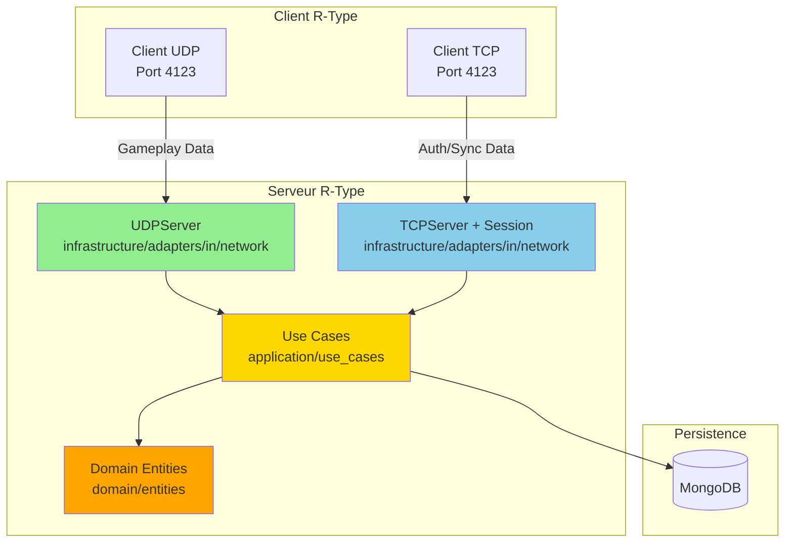
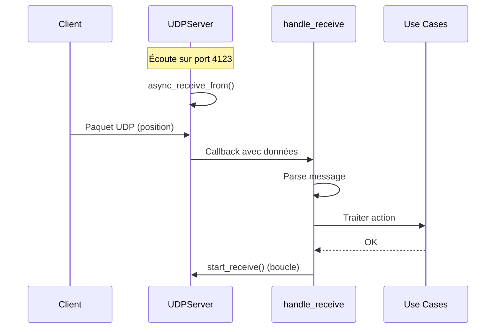
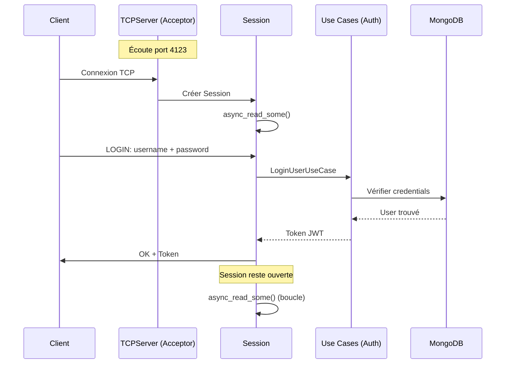
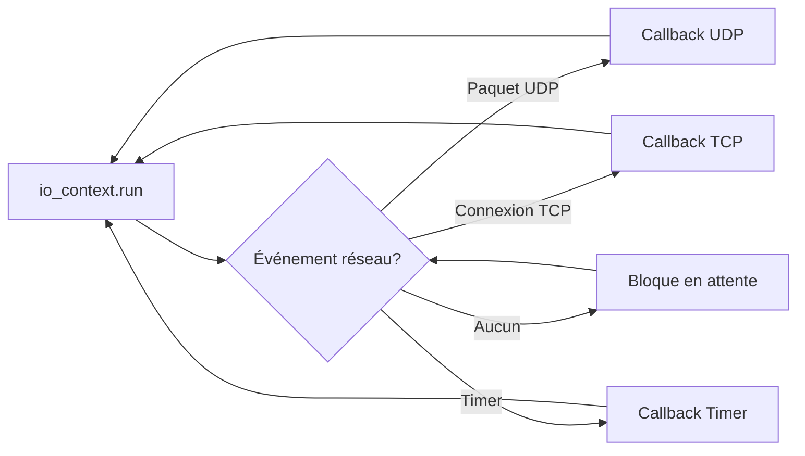

# Architecture Réseau R-Type

**État:** ✅ Implémenté - Protocole binaire TCP opérationnel
**Version:** 0.3.0
**Dernière mise à jour:** 30 novembre 2025

---

## 📋 Vue d'Ensemble

Le serveur R-Type utilise une architecture réseau **hybride UDP/TCP** avec Boost.Asio pour gérer les communications client-serveur. Cette architecture sépare les préoccupations entre données temps réel (UDP) et communications fiables (TCP).

### Justification Architecturale

| Protocole | Utilisation | Raison |
|-----------|-------------|--------|
| **UDP** | Positions, mouvements, actions de jeu | **Vitesse** - Pas besoin de fiabilité, les anciennes données sont obsolètes |
| **TCP** | Authentification, chat, synchronisation état | **Fiabilité** - Les données doivent arriver dans l'ordre |

---

## 🏗️ Architecture Globale



---

## 📡 UDPServer - Serveur Temps Réel

### Caractéristiques

- **Port:** 4123
- **Type:** Asynchrone (Boost.Asio)
- **Buffer:** 1024 bytes
- **Pattern:** Async receive loop

### Architecture

```cpp
// Fichiers: infrastructure/adapters/in/network/UDPServer.hpp/.cpp

namespace infrastructure::adapters::in::network {
    class UDPServer {
        private:
            udp::socket _socket;
            boost::asio::io_context& _io_ctx;
            udp::endpoint _remote_endpoint;
            std::array<char, 1024> _recv_buffer;

            void start_receive();
            void handle_receive(const boost::system::error_code& error,
                              std::size_t bytes_transferred);

        public:
            UDPServer(boost::asio::io_context& io_ctx);
            void start(boost::asio::io_context& io_ctx);
            void run();
            void stop();
    };
}
```

### Flux de Données UDP



### Exemple d'Utilisation

```cpp
// main.cpp - Point d'entrée actuel

int main() {
    boost::asio::io_context io_ctx;

    // Créer serveur UDP
    UDPServer udpServer(io_ctx);

    // Démarrer l'écoute
    udpServer.start(io_ctx);

    std::cout << "Serveur UDP prêt sur port 4123" << std::endl;

    // Lancer boucle événementielle (bloquant)
    udpServer.run();

    return 0;
}
```

### Format des Messages UDP (Planifié)

```
┌─────────────────────────────────────┐
│ Message UDP R-Type (32 bytes)       │
├─────────────────────────────────────┤
│ Type (1 byte)     │ 0x01 = MOVE     │
│                   │ 0x02 = SHOOT    │
│                   │ 0x03 = POSITION │
├───────────────────┼─────────────────┤
│ PlayerId (16B)    │ UUID            │
├───────────────────┼─────────────────┤
│ Data (15 bytes)   │ Spécifique type │
└─────────────────────────────────────┘
```

**Exemple MOVE:**
```
Type: 0x01
PlayerId: "507f1f77bcf86cd799439011"
Data:
  - dx (float, 4 bytes)
  - dy (float, 4 bytes)
  - dz (float, 4 bytes)
  - timestamp (uint32, 3 bytes restants)
```

---

## 🔐 TCPServer - Serveur Fiable

### Caractéristiques

- **Port:** 4123 (même port, protocoles différents)
- **Type:** Asynchrone avec sessions
- **Pattern:** Acceptor + Session par connexion
- **Gestion:** shared_ptr pour lifecycle

### Architecture

```cpp
// Fichiers: infrastructure/adapters/in/network/TCPServer.hpp/.cpp

namespace infrastructure::adapters::in::network {
    // Session = une connexion client
    class Session: public std::enable_shared_from_this<Session> {
        private:
            tcp::socket _socket;
            static constexpr std::size_t max_length = 1024;
            char _data[max_length];

            void do_read();
            void do_write(std::size_t length);

        public:
            Session(tcp::socket socket);
            void start();
    };

    // Serveur TCP = accepte connexions
    class TCPServer {
        private:
            tcp::acceptor _acceptor;
            boost::asio::io_context& _io_ctx;

            void start_accept();

        public:
            TCPServer(boost::asio::io_context& io_ctx);
            void start(boost::asio::io_context& io_ctx);
            void run();
    };
}
```

### Flux de Données TCP



### Pattern Session

Le pattern `shared_from_this()` garantit que la Session reste en vie pendant les opérations asynchrones:

```cpp
void Session::do_read() {
    auto self = shared_from_this();  // Garde la session vivante

    _socket.async_read_some(
        boost::asio::buffer(_data, max_length),
        [this, self](boost::system::error_code ec, std::size_t length) {
            if (!ec) {
                // Traiter données
                do_write(length);  // Echo pour test
            }
            // Si ec, la session se détruit automatiquement
        }
    );
}
```

### Format des Messages TCP (Implémenté)

Le protocole TCP utilise un format **binaire** avec header + payload, défini dans `src/common/protocol/Protocol.hpp`:

#### Structure Header (6 bytes)

```
┌─────────────────────────────────────┐
│ Header (6 bytes)                     │
├─────────────────────────────────────┤
│ Type (2 bytes)   │ uint16_t (big-endian) │
├──────────────────┼────────────────────────┤
│ PayloadSize (4B) │ uint32_t (big-endian) │
└─────────────────────────────────────┘
```

#### Types de Messages

| Type | Code | Description |
|------|------|-------------|
| HeartBeat | 0x0001 | Ping/pong |
| Login | 0x0010 | Demande de login |
| LoginAck | 0x0011 | Réponse login |
| Register | 0x0020 | Demande d'inscription |
| RegisterAck | 0x0021 | Réponse inscription |

#### LoginMessage (287 bytes)

```
┌─────────────────────────────────────┐
│ LoginMessage (287 bytes)             │
├─────────────────────────────────────┤
│ username (32 bytes) │ char[32]       │
├─────────────────────┼────────────────┤
│ password (255 bytes)│ char[255]      │
└─────────────────────────────────────┘
```

#### RegisterMessage (542 bytes)

```
┌─────────────────────────────────────┐
│ RegisterMessage (542 bytes)          │
├─────────────────────────────────────┤
│ username (32 bytes) │ char[32]       │
├─────────────────────┼────────────────┤
│ email (255 bytes)   │ char[255]      │
├─────────────────────┼────────────────┤
│ password (255 bytes)│ char[255]      │
└─────────────────────────────────────┘
```

#### Exemple de Flux

```cpp
// Envoi d'un LoginMessage
Header head = {.type = 0x0011, .payload_size = 287};
LoginMessage login = {.username = "player1", .password = "secret"};

// Sérialisation (network byte order)
head.to_bytes(buffer);
login.to_bytes(buffer + 6);

// Envoi: 6 bytes header + 287 bytes payload = 293 bytes total
```

---

## 🔄 io_context - Cœur de Boost.Asio

### Qu'est-ce que io_context?

`boost::asio::io_context` est le **moteur événementiel** qui gère toutes les opérations asynchrones:

```cpp
boost::asio::io_context io_ctx;

// Enregistrer opérations asynchrones
UDPServer udp(io_ctx);    // Enregistre async_receive_from
TCPServer tcp(io_ctx);    // Enregistre async_accept

udp.start(io_ctx);
tcp.start(io_ctx);

// Lancer la boucle événementielle
io_ctx.run();  // BLOQUE et traite les événements
```

### Diagramme de Fonctionnement



---

## 🎮 Intégration avec Architecture Hexagonale

### Position dans les Couches

```
┌─────────────────────────────────────────────┐
│         Infrastructure Layer                 │
│  (Adapters IN - Réseau)                     │
│                                              │
│  ┌──────────────┐      ┌──────────────┐    │
│  │  UDPServer   │      │  TCPServer   │    │
│  │  Port 4123   │      │  Port 4123   │    │
│  └──────┬───────┘      └──────┬───────┘    │
└─────────┼──────────────────────┼────────────┘
          │                      │
          ▼                      ▼
┌─────────────────────────────────────────────┐
│         Application Layer                    │
│  (Use Cases - Logique Métier)               │
│                                              │
│  MovePlayerUseCase    LoginUserUseCase      │
│  ShootUseCase         RegisterUserUseCase   │
└─────────────────────────────────────────────┘
          │
          ▼
┌─────────────────────────────────────────────┐
│         Domain Layer                         │
│  (Entités Métier)                           │
│                                              │
│  Player, User, Position, Health...          │
└─────────────────────────────────────────────┘
```

### Exemple Complet de Flux

**Scénario:** Client envoie position du joueur

1. **Client UDP** → Envoie paquet (type=MOVE, playerId, dx, dy, dz)
2. **UDPServer** → `handle_receive()` reçoit paquet
3. **Parse** → Extraction des données du buffer
4. **Adapter** → Appelle `MovePlayerUseCase.execute(playerId, dx, dy, dz)`
5. **Use Case** → Charge Player depuis repository
6. **Domain** → `player.move(dx, dy, dz)` avec validation Position
7. **Repository** → Sauvegarde nouveau state
8. **Broadcast** → (À impl.) Envoie nouvelles positions à tous les clients

---

## 🚀 Évolutions Futures

### Prochaines Étapes (Par Priorité)

#### 1. Protocole Réseau Complet 🔴 Urgent

**À implémenter:**
- Format de sérialisation (JSON? Binaire?)
- Types de messages (MOVE, SHOOT, SPAWN, etc.)
- Gestion des séquences et timestamps
- Compression des données

**Fichiers à créer:**
```
infrastructure/network/
├── protocol/
│   ├── MessageType.hpp
│   ├── MessageSerializer.hpp/.cpp
│   └── MessageDeserializer.hpp/.cpp
└── handlers/
    ├── GameplayHandler.hpp/.cpp
    └── AuthHandler.hpp/.cpp
```

#### 2. Gestion des Sessions 🟠 Important

**À implémenter:**
- SessionManager pour tracker clients connectés
- Heartbeat (ping/pong) pour détecter déconnexions
- Reconnexion automatique
- Timeouts

#### 3. Broadcast et Multicast 🟠 Important

**Pour le gameplay multijoueur:**
- Envoyer positions de tous les joueurs à tous les clients
- Optimisation: ne pas renvoyer à l'émetteur
- Rate limiting (ex: 60 updates/seconde max)

#### 4. Sécurité 🟡 Moyen Terme

**À implémenter:**
- Validation des paquets (taille, format)
- Rate limiting anti-DDoS
- Chiffrement TLS pour TCP (auth)
- Signature des paquets UDP

#### 5. Monitoring 🟢 Nice-to-Have

**Métriques à tracker:**
- Latence moyenne par client
- Paquets perdus (UDP)
- Bande passante utilisée
- Nombre de connexions actives

---

## 📊 Performances Attendues

### Objectifs

| Métrique | Cible | Actuel | Statut |
|----------|-------|--------|--------|
| **Latence moyenne** | < 50ms | N/A | À mesurer |
| **Clients simultanés** | 100+ | N/A | À tester |
| **Updates/sec** | 60 | N/A | À implémenter |
| **Packet loss** | < 5% | N/A | À mesurer |

### Optimisations Prévues

1. **Object Pooling** - Réutiliser buffers et objets
2. **Lock-free structures** - Pour le SessionManager
3. **Batching** - Grouper messages UDP
4. **Delta compression** - N'envoyer que les changements

---

## 🔧 Configuration

### Ports Utilisés

```cpp
// infrastructure/configuration/NetworkConfig.hpp (à créer)

struct NetworkConfig {
    uint16_t udp_port = 4123;  // Gameplay
    uint16_t tcp_port = 4123;  // Auth
    size_t buffer_size = 1024;
    size_t max_clients = 100;
    std::chrono::seconds timeout = std::chrono::seconds(30);
};
```

### Variables d'Environnement (Futures)

```bash
RTYPE_UDP_PORT=4123
RTYPE_TCP_PORT=4123
RTYPE_MAX_CLIENTS=100
RTYPE_BUFFER_SIZE=1024
```

---

## 🧪 Tests

### Tests Unitaires (À créer)

```cpp
// tests/server/network/UDPServerTest.cpp

TEST(UDPServerTest, ReceivesPacket) {
    boost::asio::io_context io_ctx;
    UDPServer server(io_ctx);

    // TODO: Envoyer paquet test
    // TODO: Vérifier réception
}

TEST(TCPServerTest, AcceptsConnection) {
    boost::asio::io_context io_ctx;
    TCPServer server(io_ctx);

    // TODO: Connecter client test
    // TODO: Vérifier session créée
}
```

### Tests d'Intégration

```bash
# Lancer serveur (Linux)
./artifacts/server/linux/rtype_server

# Lancer serveur (Windows - via Wine)
wine64 ./artifacts/server/windows/rtype_server.exe

# Dans un autre terminal - Test UDP
echo "TEST_MESSAGE" | nc -u localhost 4123

# Test TCP
telnet localhost 4123
```

---

## 📚 Références

### Boost.Asio

- **Documentation:** https://www.boost.org/doc/libs/release/doc/html/boost_asio.html
- **Tutoriels:** https://think-async.com/Asio/
- **Patterns:** Proactor pattern (async I/O)

### Protocoles Réseau

- **UDP RFC:** RFC 768
- **TCP RFC:** RFC 793
- **Best Practices:** Gaffer on Games - Networking for Game Programmers

### Architecture

- **Hexagonal Architecture:** [guides/hexagonal-architecture.md](hexagonal-architecture.md)
- **Domain Layer:** [api/domain.md](../api/domain.md)
- **Adapters:** [api/adapters.md](../api/adapters.md)

---

## 📝 Notes

> ✅ **État Actuel:**
>
> L'infrastructure réseau TCP est **opérationnelle avec protocole binaire**:
> - ✅ UDPServer écoute et reçoit paquets
> - ✅ TCPServer accepte connexions et crée sessions
> - ✅ Protocole binaire implémenté (Header + Payload)
> - ✅ Messages Login/Register avec sérialisation
> - ✅ Intégration avec Use Cases (Login, Register)
> - ⏳ Gestion des sessions (en cours)
>
> **Prochaine itération:** Implémenter HeartBeat et gestion sessions

> 💡 **Design Decision - Pourquoi même port pour UDP/TCP?**
>
> Techniquement possible car UDP et TCP sont des protocoles différents.
> Avantages:
> - Simplifie configuration firewall côté client
> - Un seul port à ouvrir
> - Convention claire: 4123 = R-Type server
>
> Si conflit, facile de changer: `udp_port = 4123`, `tcp_port = 4124`

---

**Dernière révision:** 30/11/2025
**Auteur:** Agent Documentation + Claude Code
**Statut:** ✅ À jour avec le code (v0.3.0)
