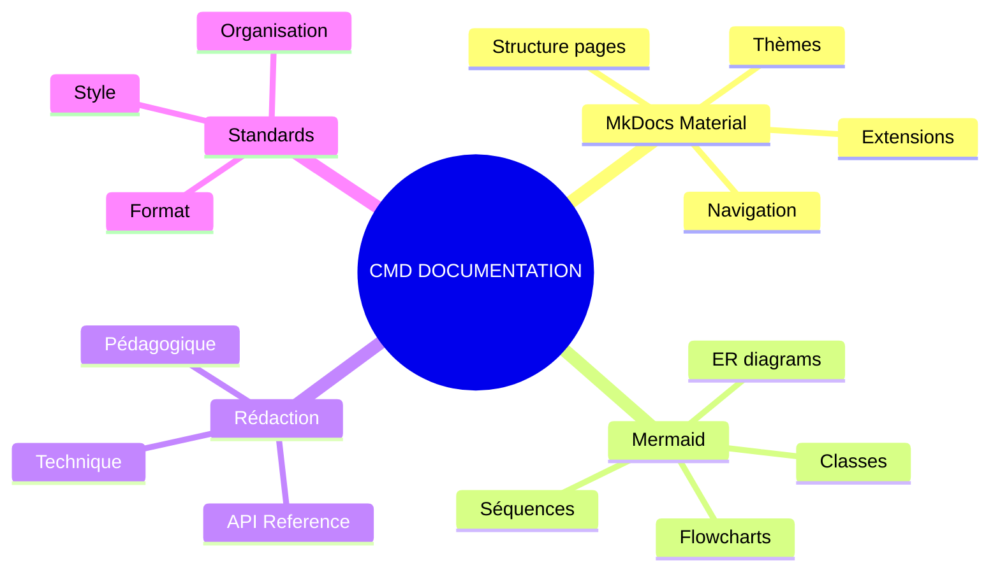
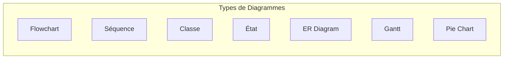
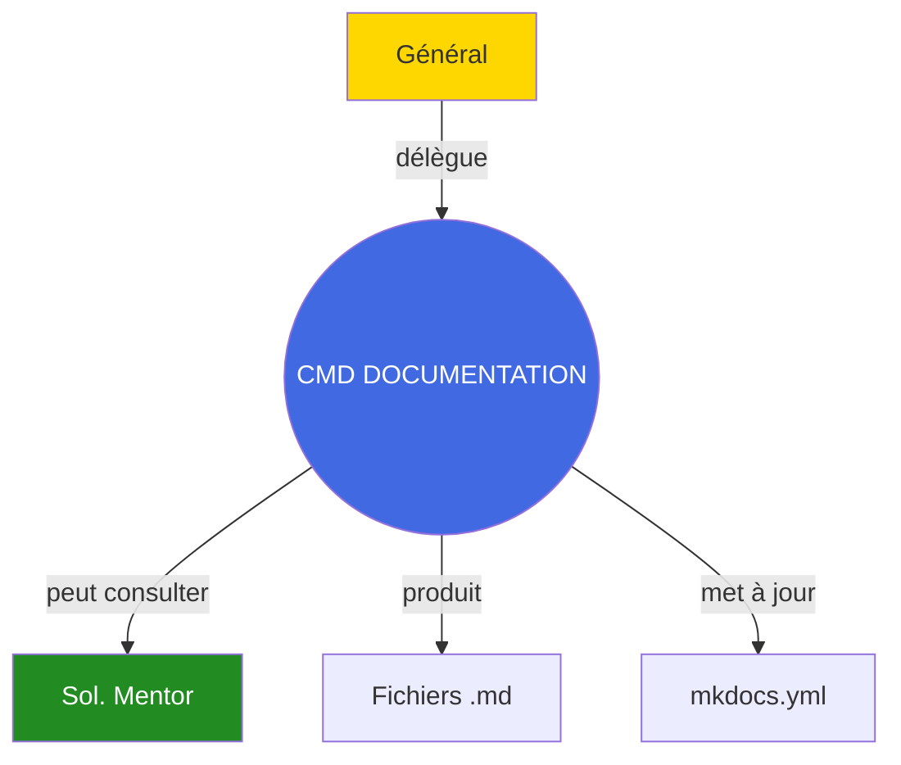

# Commandant Documentation

## Carte d'Identité

| Attribut | Valeur |
|----------|--------|
| **Rang** | Commandant |
| **Fichier** | `.claude/agents/commander_documentation.md` |
| **Invocation** | `@commander_documentation` |
| **Domaine** | Documentation technique |
| **Autonomie** | Haute |

---

## Mission

Le **Commandant Documentation** est l'expert en documentation technique. Sa mission est de :

1. **Créer** une documentation professionnelle avec MkDocs Material
2. **Maintenir** la cohérence et la qualité documentaire
3. **Illustrer** avec des diagrammes Mermaid et exemples concrets
4. **Guider** les bonnes pratiques de documentation

---

## Compétences Clés



---

## Types de Documentation

### 1. Documentation API

```markdown
Structure type:
├── Vue d'ensemble
├── Installation
├── Configuration
├── Référence des méthodes
│   ├── Méthode 1
│   │   ├── Signature
│   │   ├── Paramètres
│   │   ├── Retour
│   │   └── Exemple
│   └── Méthode N
├── Exemples complets
└── FAQ
```

### 2. Guides Utilisateur

```markdown
Structure type:
├── Prérequis
├── Objectifs
├── Étapes
│   ├── Étape 1 (avec screenshot/code)
│   ├── Étape 2
│   └── Étape N
├── Résultat attendu
├── Troubleshooting
└── Prochaines étapes
```

### 3. Documentation Architecture

```markdown
Structure type:
├── Contexte
├── Diagramme C4 (Context)
├── Diagramme C4 (Container)
├── Diagramme C4 (Component)
├── Flux de données
├── Décisions techniques (ADR)
└── Évolutions prévues
```

---

## Commandes Types

=== "Documentation API"

    ```bash
    @commander_documentation "Documente l'API du module ECS.

                              Classes: Entity, World, ComponentPool

                              Inclure:
                              - Constructeurs
                              - Méthodes publiques
                              - Exemples d'utilisation"
    ```

=== "Guide Utilisateur"

    ```bash
    @commander_documentation "Crée un guide 'Getting Started' pour le client.

                              Audience: Développeur débutant

                              Couvrir:
                              1. Installation
                              2. Configuration
                              3. Premier lancement
                              4. Connexion au serveur"
    ```

=== "Documentation Architecture"

    ```bash
    @commander_documentation "Documente l'architecture du serveur.

                              Inclure:
                              - Diagramme hexagonal
                              - Flux TCP/UDP
                              - Layers (Domain, Application, Infrastructure)
                              - Patterns utilisés"
    ```

---

## Standards de Documentation

### Format Markdown

| Élément | Convention |
|---------|------------|
| Titres | `#` H1, `##` H2, `###` H3 |
| Code inline | \`code\` |
| Blocs de code | \`\`\`cpp ... \`\`\` |
| Emphase | `**gras**`, `*italique*` |
| Listes | `-` ou `1.` |
| Liens | `[texte](url)` |

### Diagrammes Mermaid

Le Commandant maîtrise tous les types de diagrammes :



### Admonitions MkDocs

```markdown
!!! note "Titre"
    Contenu de la note

!!! warning "Attention"
    Message d'avertissement

!!! tip "Conseil"
    Conseil utile

!!! danger "Danger"
    Message critique
```

---

## Output Type

Le Commandant Documentation produit :

1. **Fichiers Markdown** structurés pour MkDocs
2. **Diagrammes Mermaid** intégrés
3. **Exemples de code** fonctionnels
4. **Navigation** mise à jour si nécessaire

---

## Interactions



---

## Checklist Qualité

Le Commandant vérifie que chaque documentation :

- [ ] A une structure claire et logique
- [ ] Contient des exemples fonctionnels
- [ ] Inclut des diagrammes quand pertinent
- [ ] Est rédigée en français (code en anglais)
- [ ] N'a pas de sections "TODO" ou vides
- [ ] Est accessible à l'audience cible
- [ ] Est liée correctement dans la navigation

---

## Voir Aussi

- [Général](general.md)
- [Soldat Mentor](soldier-learning-advisor.md)
- [Guide de contribution](/development/contributing.md)
