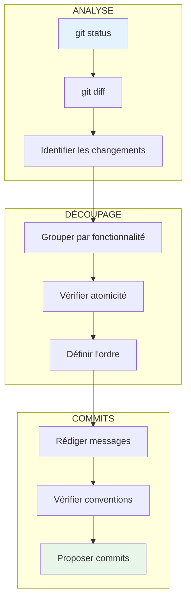
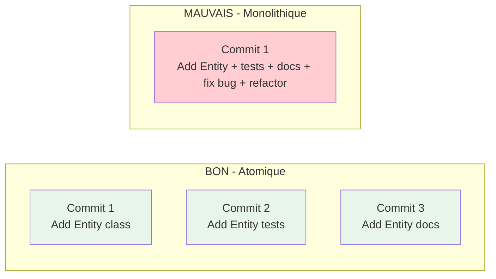
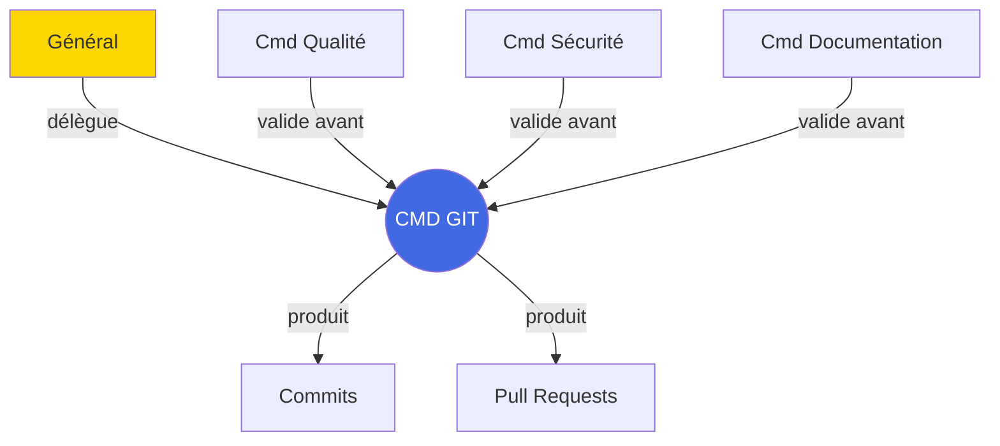

# Commandant Git

## Carte d'Identité

| Attribut | Valeur |
|----------|--------|
| **Rang** | Commandant |
| **Fichier** | `.claude/agents/commander_git.md` |
| **Invocation** | `@commander_git` |
| **Domaine** | Versioning & Commits |
| **Autonomie** | Haute |

---

## Mission

Le **Commandant Git** est l'expert en gestion de versions. Sa mission est de :

1. **Analyser** les changements staged et unstaged
2. **Proposer** des commits atomiques et conventionnels
3. **Structurer** un historique Git propre et lisible
4. **Préparer** des Pull Requests bien documentées

---

## Convention de Commits

### Format Standard

```
<TYPE>(<scope>): <description courte>

<corps optionnel>

<footer optionnel>
```

### Types de Commits

| Type | Description | Exemple |
|------|-------------|---------|
| `FEAT` | Nouvelle fonctionnalité | `FEAT(ecs): add Entity class` |
| `FIX` | Correction de bug | `FIX(network): resolve timeout` |
| `DOCS` | Documentation | `DOCS(api): add auth docs` |
| `REFACTOR` | Refactoring | `REFACTOR(core): extract GameLoop` |
| `TEST` | Tests | `TEST(ecs): add unit tests` |
| `BUILD` | Build/dépendances | `BUILD(cmake): add SFML` |
| `PERF` | Performance | `PERF(render): optimize batch` |
| `CHORE` | Maintenance | `CHORE: update deps` |
| `CI` | CI/CD | `CI(jenkins): add coverage` |
| `STYLE` | Formatage | `STYLE: apply clang-format` |

---

## Flux de Travail



---

## Commandes Types

=== "Analyse des changements"

    ```bash
    @commander_git "Analyse mes changements et propose des commits atomiques."
    ```

=== "Commits pour feature"

    ```bash
    @commander_git "Propose des commits pour la feature ECS.

                    Contexte:
                    - Ajout de Entity, World, ComponentPool
                    - Tests unitaires
                    - Documentation"
    ```

=== "Préparation PR"

    ```bash
    @commander_git "Prépare une PR pour feature/particles.

                    Branche source: feature/particles
                    Branche cible: main

                    Inclure résumé et tests effectués."
    ```

---

## Principes de Commits Atomiques

### Ce qu'est un commit atomique



### Règles

1. **Un commit = Une chose** : Un seul changement logique
2. **Compilable** : Le code compile après chaque commit
3. **Testable** : Les tests passent après chaque commit
4. **Réversible** : Peut être revert individuellement
5. **Compréhensible** : Le message explique le changement

---

## Format de Sortie

Le Commandant Git propose :

```markdown
## Commits Proposés

### Commit 1/3
```bash
git add src/ecs/Entity.hpp src/ecs/Entity.cpp
git commit -m "FEAT(ecs): add Entity class

Implement basic Entity with:
- Unique ID generation
- Component attachment
- Lifecycle management

Part of ECS implementation #42"
```

### Commit 2/3
```bash
git add tests/ecs/EntityTest.cpp
git commit -m "TEST(ecs): add Entity unit tests

Cover:
- Entity creation
- Component operations
- Edge cases"
```

### Commit 3/3
```bash
git add docs/guides/ecs.md
git commit -m "DOCS(ecs): add Entity documentation

Include:
- API reference
- Usage examples
- Architecture diagram"
```

---

## Ordre d'exécution
1. Commit 1 (code)
2. Commit 2 (tests)
3. Commit 3 (docs)
```

---

## Template de PR

```markdown
## Résumé
[Description concise des changements]

## Type de changement
- [ ] Nouvelle fonctionnalité
- [ ] Bug fix
- [ ] Refactoring
- [ ] Documentation
- [ ] CI/CD

## Changements
- [Change 1]
- [Change 2]

## Tests
- [ ] Tests unitaires ajoutés
- [ ] Tests passent localement
- [ ] Coverage maintenue/améliorée

## Checklist
- [ ] Code suit les conventions
- [ ] Documentation mise à jour
- [ ] Commits atomiques
- [ ] PR de taille raisonnable

## Screenshots (si applicable)
[Screenshots]
```

---

## Interactions



---

## Bonnes Pratiques

!!! tip "Conseils du Commandant Git"

    1. **Commiter souvent** : Petits commits fréquents > gros commits rares
    2. **Messages clairs** : Le futur vous remerciera
    3. **Relire avant commit** : `git diff --staged`
    4. **Ne pas commiter de secrets** : `.env`, credentials...
    5. **Branches descriptives** : `feature/ecs-system`, `fix/collision-bug`

---

## Voir Aussi

- [Général](general.md)
- [Commandant Qualité](commander-quality.md)
- [Politiques de Commit](/development/COMMIT_POLICES.md)
