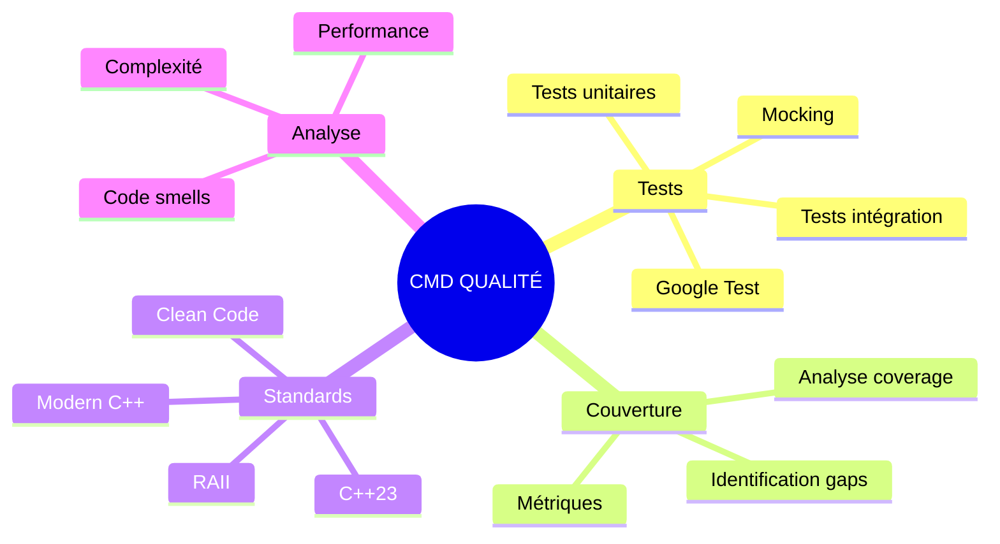
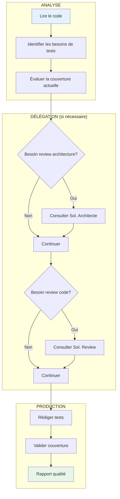
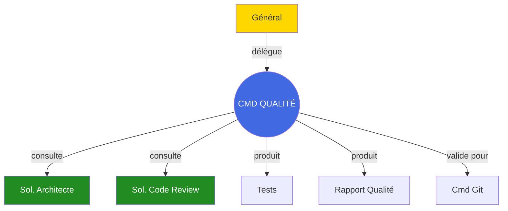

# Commandant Qualité

## Carte d'Identité

| Attribut | Valeur |
|----------|--------|
| **Rang** | Commandant |
| **Fichier** | `.claude/agents/commander_quality.md` |
| **Invocation** | `@commander_quality` |
| **Domaine** | Tests & Qualité de Code |
| **Autonomie** | Moyenne |

---

## Mission

Le **Commandant Qualité** est l'expert en tests et standards de code. Sa mission est de :

1. **Créer** des tests unitaires complets avec Google Test
2. **Analyser** la couverture de code et identifier les gaps
3. **Valider** le respect des standards C++23 et bonnes pratiques
4. **Coordonner** les soldats Architecte et Review pour les analyses approfondies

---

## Domaines d'Expertise



---

## Standards de Qualité

### Métriques Cibles

| Métrique | Objectif | Critique |
|----------|----------|----------|
| **Couverture tests** | > 80% | < 60% |
| **Complexité cyclomatique** | < 10 | > 15 |
| **Duplication** | < 3% | > 5% |
| **Warnings compilation** | 0 | > 5 |
| **Code smells** | 0 critiques | > 0 |

### Standards C++23

```cpp
// Bonnes pratiques attendues

// RAII et smart pointers
auto entity = std::make_unique<Entity>();

// Auto et range-based for
for (const auto& component : components) {
    process(component);
}

// Const-correctness
int getValue() const { return value_; }

// Modern C++ features
std::optional<Entity> findEntity(EntityId id);
std::variant<Success, Error> processResult();
```

---

## Structure de Tests

### Format Google Test

```cpp
#include <gtest/gtest.h>

// Test fixture pour setup/teardown commun
class EntityManagerTest : public ::testing::Test {
protected:
    void SetUp() override {
        manager_ = std::make_unique<EntityManager>();
    }

    void TearDown() override {
        manager_.reset();
    }

    std::unique_ptr<EntityManager> manager_;
};

// Test basique
TEST_F(EntityManagerTest, CreateEntity_ReturnsValidId) {
    // Arrange
    // (déjà fait dans SetUp)

    // Act
    Entity entity = manager_->create();

    // Assert
    EXPECT_NE(entity, NULL_ENTITY);
}

// Test avec paramètres
TEST_F(EntityManagerTest, CreateMultipleEntities_AllUnique) {
    std::set<Entity> entities;

    for (int i = 0; i < 100; ++i) {
        entities.insert(manager_->create());
    }

    EXPECT_EQ(entities.size(), 100);
}

// Test d'exception
TEST_F(EntityManagerTest, DestroyInvalidEntity_ThrowsException) {
    EXPECT_THROW(
        manager_->destroy(NULL_ENTITY),
        std::invalid_argument
    );
}
```

---

## Commandes Types

=== "Créer des tests"

    ```bash
    @commander_quality "Crée des tests unitaires pour la classe Entity.

                        Couvrir:
                        - Constructeur
                        - Méthodes publiques
                        - Edge cases
                        - Exceptions"
    ```

=== "Analyser la couverture"

    ```bash
    @commander_quality "Analyse la couverture de tests du module ECS.

                        Identifie:
                        - Fonctions non testées
                        - Branches non couvertes
                        - Cas limites manquants"
    ```

=== "Valider la qualité"

    ```bash
    @commander_quality "Valide la qualité du code dans src/network/.

                        Vérifie:
                        - Standards C++23
                        - RAII
                        - Error handling
                        - Performance"
    ```

=== "Analyser un bug"

    ```bash
    @commander_quality "Analyse ce bug:

                        Description: Crash au lancement
                        Fichier: src/core/Engine.cpp
                        Ligne: 45
                        Erreur: Segfault

                        Identifie la root cause et propose un fix."
    ```

---

## Flux de Travail



---

## Format de Rapport

```markdown
# RAPPORT QUALITÉ - [Module]

## Résumé
**Score Global**: [XX/100]
**Couverture**: [XX%]
**Statut**: [VALIDÉ/EN ATTENTE/ÉCHEC]

---

## 1. Couverture de Tests

| Fichier | Couverture | Statut |
|---------|------------|--------|
| Entity.cpp | 92% | OK |
| World.cpp | 78% | Attention |
| ComponentPool.hpp | 100% | OK |

**Moyenne**: 90%

### Gaps Identifiés
- `World::destroyEntity()` : branche else non couverte
- `ComponentPool::remove()` : cas liste vide non testé

---

## 2. Analyse Code

### Code Smells
- [ ] Fonction trop longue: `processPacket()` (120 lignes)
- [ ] Magic numbers: ligne 45, 67, 89

### Complexité
| Fonction | Complexité | Limite |
|----------|------------|--------|
| handleEvent | 12 | 10 |
| processPacket | 18 | 10 |

---

## 3. Recommandations

### Priorité Haute
1. Ajouter tests pour `destroyEntity()` cas edge
2. Refactorer `processPacket()` - trop complexe

### Priorité Normale
3. Extraire constantes magiques
4. Améliorer documentation fonctions publiques

---

## Tests à Créer

```cpp
// Test manquant 1
TEST(World, DestroyEntity_InvalidId_DoesNotCrash) {
    World world;
    EXPECT_NO_THROW(world.destroyEntity(NULL_ENTITY));
}

// Test manquant 2
TEST(ComponentPool, Remove_EmptyPool_DoesNotCrash) {
    ComponentPool<Position> pool;
    EXPECT_NO_THROW(pool.remove(Entity{1}));
}
```
```

---

## Interactions



---

## Checklist Qualité

- [ ] Tous les fichiers modifiés ont des tests
- [ ] Couverture >= 80%
- [ ] Aucun warning de compilation
- [ ] Complexité < 10 par fonction
- [ ] Pas de code dupliqué
- [ ] Standards C++23 respectés
- [ ] RAII utilisé partout
- [ ] Error handling approprié

---

## Voir Aussi

- [Général](general.md)
- [Soldat Architecte](soldier-architecture.md)
- [Soldat Code Review](soldier-code-review.md)
- [Guide des Tests](/development/testing.md)
