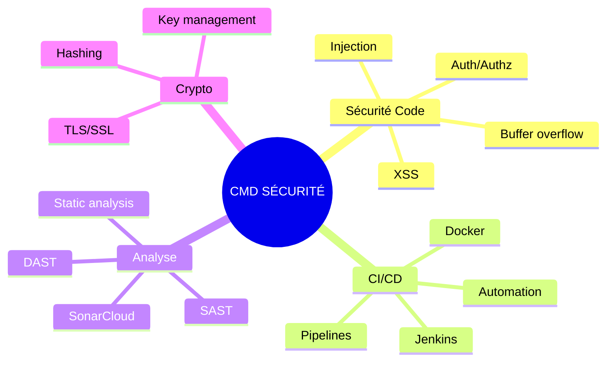
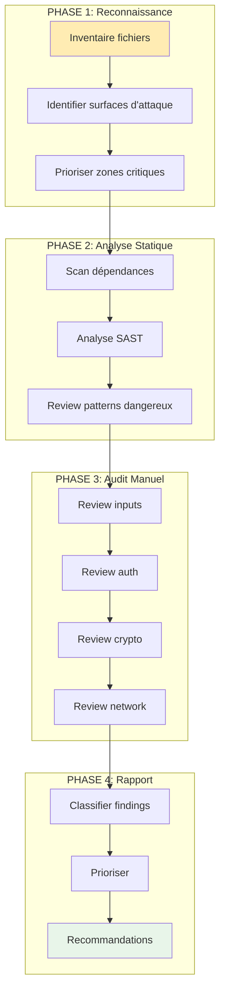
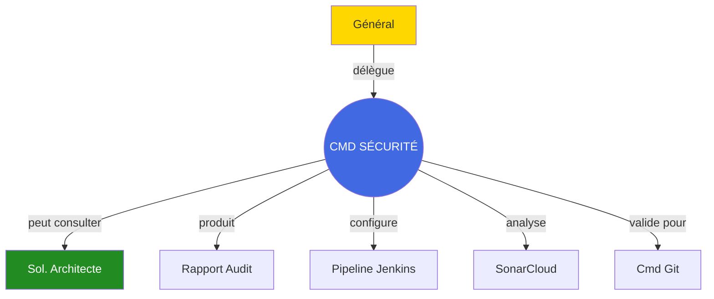

# Commandant Sécurité

## Carte d'Identité

| Attribut | Valeur |
|----------|--------|
| **Rang** | Commandant |
| **Fichier** | `.claude/agents/commander_security.md` |
| **Invocation** | `@commander_security` |
| **Domaine** | Sécurité & CI/CD |
| **Autonomie** | Moyenne |

---

## Mission

Le **Commandant Sécurité** est l'expert en sécurité et infrastructure CI/CD. Sa mission est de :

1. **Auditer** le code pour détecter les vulnérabilités
2. **Configurer** et optimiser les pipelines Jenkins
3. **Analyser** les métriques SonarCloud
4. **Recommander** les meilleures pratiques de sécurité

---

## Domaines d'Expertise



---

## Vulnérabilités Surveillées

### Classification OWASP

| Catégorie | Priorité | Exemples |
|-----------|----------|----------|
| **Injection** | Critique | SQL, Command, XSS |
| **Buffer Overflow** | Critique | Stack/Heap overflow |
| **Auth Broken** | Haute | Session hijacking |
| **Exposure Sensitive** | Haute | Secrets en clair |
| **Crypto Weak** | Moyenne | Algo obsolètes |
| **Config Insecure** | Moyenne | Defaults non changés |

### Spécifique C++

```cpp
// VULNÉRABILITÉS COURANTES C++

// Buffer Overflow
char buffer[256];
strcpy(buffer, userInput);  // DANGER

// Solution
std::string buffer = userInput;  // SAFE

// Use-after-free
delete ptr;
ptr->method();  // DANGER

// Solution
ptr = nullptr;  // ou smart pointers

// Integer overflow
size_t size = a * b;  // Peut overflow
char* buffer = new char[size];

// Solution
if (a > SIZE_MAX / b) throw std::overflow_error();
```

---

## Commandes Types

=== "Audit Complet"

    ```bash
    @commander_security "Audit de sécurité complet du module Network.

                         Focus:
                         - Injection (SQL, Command)
                         - Buffer overflow
                         - Auth/Authz
                         - Crypto
                         - Input validation"
    ```

=== "Audit Réseau"

    ```bash
    @commander_security "Audit du code réseau.

                         Vérifie:
                         - Validation paquets entrants
                         - Rate limiting
                         - Timeouts
                         - TLS/SSL configuration"
    ```

=== "CI/CD"

    ```bash
    @commander_security "Optimise le pipeline Jenkins.

                         Besoins:
                         - Build parallèle
                         - Cache dépendances
                         - Tests automatisés
                         - Analyse SonarCloud"
    ```

=== "Analyse SonarCloud"

    ```bash
    @commander_security "Analyse les résultats SonarCloud.

                         Fournir:
                         - Vulnérabilités critiques
                         - Code smells sécurité
                         - Recommandations"
    ```

---

## Flux d'Audit



---

## Format de Rapport Sécurité

```markdown
# RAPPORT DE SÉCURITÉ - [Module]

## Résumé Exécutif
**Score Sécurité**: [XX/100]
**Vulnérabilités Critiques**: [X]
**Vulnérabilités Hautes**: [X]
**Statut**: [BLOQUANT/À CORRIGER/OK]

---

## Vulnérabilités Détectées

### CRITIQUE - Buffer Overflow (CVE-like)

**Fichier**: `src/network/PacketHandler.cpp`
**Ligne**: 67
**CWE**: CWE-120

**Code vulnérable**:
```cpp
void handlePacket(const char* data, size_t size) {
    char buffer[256];
    strcpy(buffer, data);  // VULNÉRABLE
}
```

**Impact**:
- Crash serveur (DoS)
- Exécution de code arbitraire
- Compromission totale

**Correction recommandée**:
```cpp
void handlePacket(const std::string& data) {
    if (data.size() > MAX_PACKET_SIZE) {
        throw std::invalid_argument("Packet too large");
    }
    // Process safe string
}
```

**Priorité**: IMMÉDIATE

---

### HAUTE - Input non validé

**Fichier**: `src/auth/LoginHandler.cpp`
**Ligne**: 23

[Détails...]

---

## Recommandations

### Priorité Immédiate (< 24h)
1. Fix buffer overflow PacketHandler
2. Ajouter validation input LoginHandler

### Priorité Haute (< 1 semaine)
3. Implémenter rate limiting
4. Activer TLS sur toutes les connexions

### Priorité Normale (< 1 mois)
5. Audit dépendances tierces
6. Ajouter logging sécurité

---

## Métriques
| Métrique | Avant | Après Fix |
|----------|-------|-----------|
| Vulnérabilités critiques | 2 | 0 |
| Vulnérabilités hautes | 5 | 0 |
| Score sécurité | 45/100 | 85/100 |
```

---

## Pipeline Jenkins Type

```groovy
pipeline {
    agent any

    stages {
        stage('Checkout') {
            steps {
                checkout scm
            }
        }

        stage('Dependencies') {
            steps {
                sh './scripts/build.sh'
            }
        }

        stage('Build') {
            steps {
                sh './scripts/compile.sh'
            }
        }

        stage('Tests') {
            parallel {
                stage('Unit Tests') {
                    steps {
                        sh './artifacts/tests/server_tests'
                    }
                }
                stage('Security Scan') {
                    steps {
                        sh 'cppcheck --enable=all src/'
                    }
                }
            }
        }

        stage('SonarCloud') {
            steps {
                withSonarQubeEnv('SonarCloud') {
                    sh 'sonar-scanner'
                }
            }
        }
    }

    post {
        always {
            junit '**/test-results/*.xml'
        }
    }
}
```

---

## Interactions



---

## Checklist Sécurité

### Code
- [ ] Pas de buffer overflow
- [ ] Inputs validés et sanitizés
- [ ] Pas de secrets en dur
- [ ] Auth/Authz correcte
- [ ] Crypto à jour (pas MD5, SHA1)
- [ ] RAII pour ressources

### CI/CD
- [ ] Pipeline fonctionnel
- [ ] Tests automatisés
- [ ] Scan sécurité intégré
- [ ] SonarCloud configuré
- [ ] Secrets dans vault

---

## Voir Aussi

- [Général](general.md)
- [Soldat Architecte](soldier-architecture.md)
- [Guide CI/CD](/development/ci-cd.md)
- [Guide SonarCloud](/guides/sonarqube.md)
