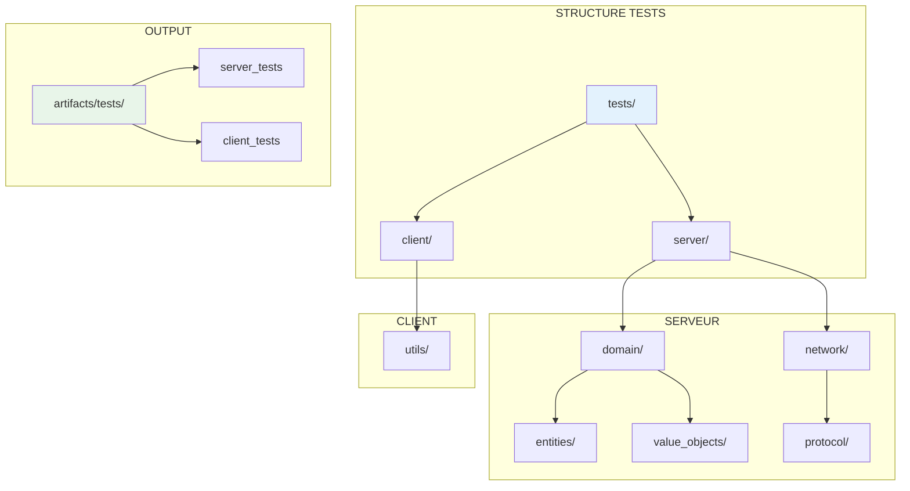
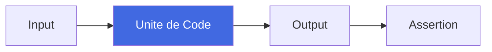
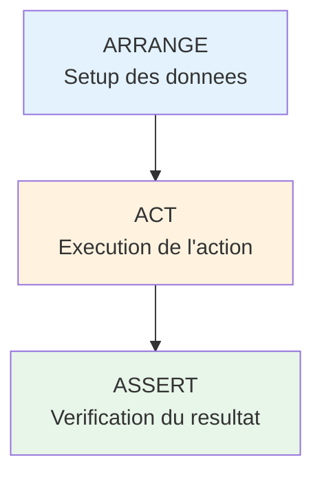
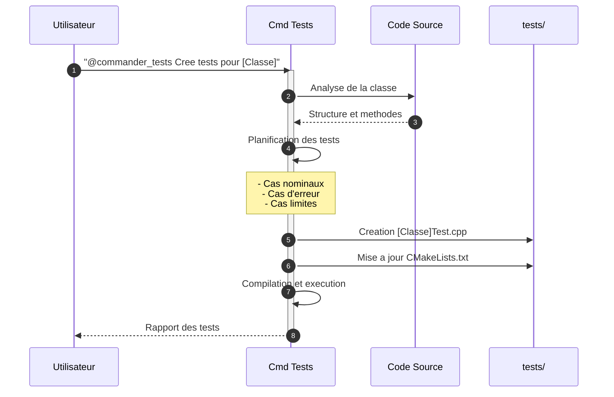
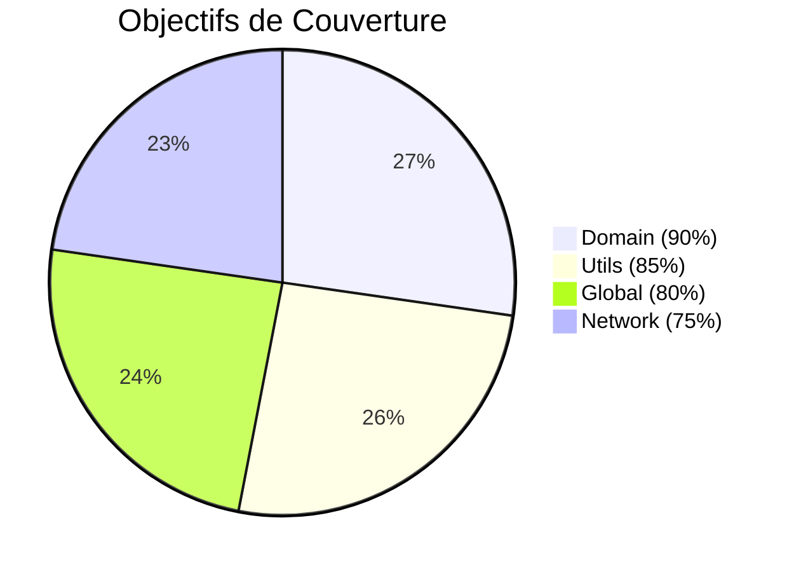
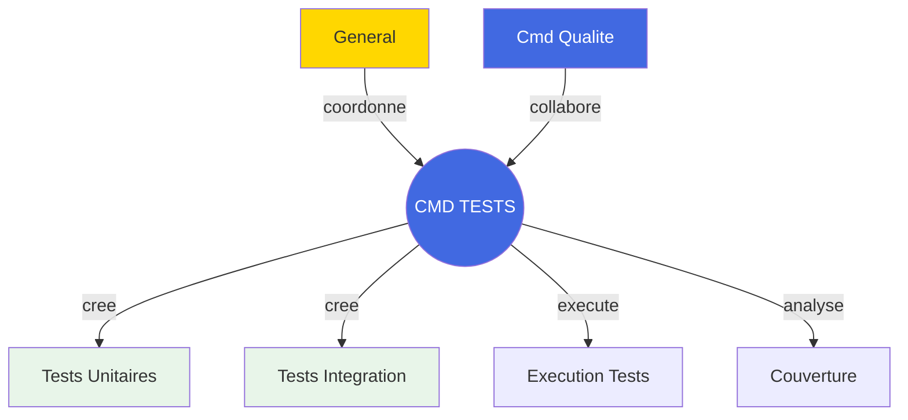

# Commandant Tests - Expert en Tests et Couverture

## Carte d'Identite

| Attribut | Valeur |
|----------|--------|
| **Rang** | Commandant |
| **Fichier** | `.claude/agents/commander_tests.md` |
| **Invocation** | `@commander_tests` |
| **Domaine** | Tests & Couverture |
| **Autonomie** | Haute |
| **Framework** | Google Test (GTest) |

---

## Mission

Le **Commandant Tests** est l'expert en testing. Sa mission est de :

1. **Creer** des tests unitaires et d'integration avec GTest
2. **Executer** les tests et analyser les resultats
3. **Ameliorer** la couverture de code
4. **Maintenir** la qualite des suites de tests

---

## Contexte Technique



### Technologies Utilisees

| Technologie | Usage |
|-------------|-------|
| **GTest** | Framework de tests |
| **CMake** | Build system |
| **CTest** | Test runner |
| **gcov/lcov** | Couverture de code |

---

## Types de Tests

### Tests Unitaires

Tests isolant une seule unite de code.



**Fichiers** : `[Classe]Test.cpp`

### Tests d'Integration

Tests verifiant l'interaction entre composants.


**Fichiers** : `[Module]IntegrationTest.cpp`

---

## Structure des Tests Existants

```
tests/
├── client/
│   ├── CMakeLists.txt
│   ├── main.cpp
│   └── utils/
│       ├── VecsTest.cpp
│       └── SignalTest.cpp
└── server/
    ├── CMakeLists.txt
    ├── main.cpp
    ├── domain/
    │   ├── entities/
    │   │   └── PlayerTest.cpp
    │   └── value_objects/
    │       ├── EmailTest.cpp
    │       ├── HealthTest.cpp
    │       ├── PositionTest.cpp
    │       └── UsernameTest.cpp
    └── network/
        ├── ProtobufTest.cpp
        ├── TCPIntegrationTest.cpp
        ├── UDPIntegrationTest.cpp
        └── protocol/
            └── CommandParserTest.cpp
```

---

## Commandes d'Execution

### Compiler les Tests

```bash
# Via CMake
cmake --build artifacts --target server_tests
cmake --build artifacts --target client_tests

# Via Ninja
ninja -C artifacts server_tests client_tests
```

### Executer les Tests

```bash
# Tous les tests
./artifacts/tests/server_tests
./artifacts/tests/client_tests

# Tests filtres
./artifacts/tests/server_tests --gtest_filter="PlayerTest.*"
./artifacts/tests/server_tests --gtest_filter="*Integration*"

# Output XML
./artifacts/tests/server_tests --gtest_output=xml:results.xml
```

### Via CTest

```bash
# Tous les tests
ctest --test-dir artifacts

# Verbose
ctest --test-dir artifacts --verbose

# Parallele
ctest --test-dir artifacts -j$(nproc)
```

---

## Pattern de Test : AAA



**Exemple** :

```cpp
TEST_F(PlayerTest, MoveChangesPosition) {
    // Arrange
    Player player(Health(3.0f), PlayerId(id), Position(100, 100, 100));

    // Act
    player.move(50.0f, 25.0f, 10.0f);

    // Assert
    EXPECT_FLOAT_EQ(player.getPosition().getX(), 150.0f);
}
```

---

## Commandes Types

=== "Creer des Tests"

    ```bash
    @commander_tests "Cree des tests unitaires pour la classe Player"
    @commander_tests "Ajoute des tests de cas limites pour Health"
    @commander_tests "Cree des tests d'integration pour le module Network"
    ```

=== "Executer et Analyser"

    ```bash
    @commander_tests "Execute les tests serveur et analyse les resultats"
    @commander_tests "Verifie la couverture de code du module domain"
    @commander_tests "Identifie les tests manquants pour les entities"
    ```

=== "Corriger des Tests"

    ```bash
    @commander_tests "Le test PlayerTest.MoveOutOfBounds echoue, analyse"
    @commander_tests "Ameliore la couverture du module network"
    ```

---

## Workflow de Creation



---

## Objectifs de Couverture

| Zone | Objectif |
|------|----------|
| **Global** | > 80% |
| **Domain** | > 90% |
| **Network** | > 75% |
| **Utils** | > 85% |



---

## Macros GTest Essentielles

### Assertions Fatales (ASSERT_*)

| Macro | Usage |
|-------|-------|
| `ASSERT_TRUE(cond)` | Condition vraie |
| `ASSERT_EQ(a, b)` | Egalite |
| `ASSERT_THROW(stmt, exc)` | Exception attendue |
| `ASSERT_NO_THROW(stmt)` | Pas d'exception |
| `ASSERT_FLOAT_EQ(a, b)` | Egalite float |

### Assertions Non-Fatales (EXPECT_*)

| Macro | Usage |
|-------|-------|
| `EXPECT_TRUE(cond)` | Condition vraie |
| `EXPECT_EQ(a, b)` | Egalite |
| `EXPECT_THROW(stmt, exc)` | Exception attendue |
| `EXPECT_NEAR(a, b, eps)` | Proximite |

---

## Interactions



---

## Checklist de Creation de Tests

- [ ] Fichier nomme `[Classe]Test.cpp`
- [ ] Fixture herite de `::testing::Test`
- [ ] Pattern AAA respecte
- [ ] Documentation `@test` ajoutee
- [ ] Cas nominaux couverts
- [ ] Cas d'erreur couverts
- [ ] Cas limites couverts
- [ ] Exceptions testees
- [ ] CMakeLists.txt mis a jour
- [ ] Tests compilent
- [ ] Tests passent

---

## Voir Aussi

- [Commandant Qualite](commander-quality.md)
- [Commandant Securite](commander-security.md)
- [Documentation Testing](../../development/testing.md)
- [Workflows](../workflows.md)
